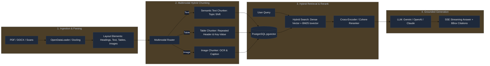

# 🚀 Multimodal Enterprise Document Ingestion & RAG Platform

> **Nền tảng RAG (Retrieval-Augmented Generation) Đa thể thức cấp Doanh nghiệp**, chuyên sâu cho các bài toán xử lý tài liệu phức tạp: **Mã hợp đồng, Báo cáo số liệu, Tài liệu kỹ thuật, Văn bản pháp luật**. Được xây dựng trên nền tảng **Python 3.13**, **FastAPI**, **PostgreSQL 16 (pgvector)**, **RabbitMQ**, và **Clean Architecture (CQRS, Unit of Work, RBAC)**.

---

## 🎯 Dự Án Này Làm Cái Gì? (Project Overview)

Dự án này là một **Hệ thống AI Hỏi-Đáp & Tra Cứu Tri Thức Doanh Nghiệp (Enterprise Knowledge Retrieval System)** giải quyết triệt để các hạn chế của mô hình RAG truyền thống (Naive RAG). Thay vì chỉ cắt văn bản ngây thơ và ném vào Vector DB, hệ thống cung cấp một luồng xử lý toàn trình từ **Khâu Đọc hiểu (Parsing) $\rightarrow$ Cắt lát bảo toàn cấu trúc (Multimodal Chunking) $\rightarrow$ Lưu trữ & Truy xuất lai (Hybrid Retrieval) $\rightarrow$ Tái xếp hạng (Reranking) $\rightarrow$ Trả lời với trích dẫn minh bạch (Grounded Generation)**.

### 🌟 4 Trọng Tâm Giải Quyết Bài Toán Doanh Nghiệp:

1. **📄 Hợp Đồng Kinh Tế & Pháp Lý**:
   - Tự động nhận diện cây phân cấp điều khoản (`Chương > Điều > Khoản > Điểm`) làm tiền tố ngữ cảnh (Section Prefix) cho từng chunk.
   - Xử lý các điều khoản dài hàng nghìn chữ trong bảng mà không làm tràn context window hay mất mã định danh hợp đồng.

2. **📊 Báo Cáo Tài Chính & Bảng Biểu Số Liệu**:
   - **Bảo toàn cấu trúc bảng 2 chiều (Structure-Preserving Table Chunking)**: Nhân bản tiêu đề cột tự động (Repeated Headers), phẳng hóa Key-Value phục vụ tìm kiếm chính xác từng ô/hàng dữ liệu, tránh tình trạng LLM đọc nhầm số liệu giữa các cột.

3. **🛠 Tài Liệu Kỹ Thuật & Cấu Hình**:
   - Bảo toàn khối mã lệnh (Code Blocks), công thức kỹ thuật và định dạng Markdown chuẩn.
   - Bóc tách hình ảnh, sơ đồ kiến trúc kèm OCR và mô tả phục vụ tìm kiếm đa phương thức.

4. **⚡ Vận Hành Bền Bỉ, Chống Tràn RAM (Zero-RAM-Bloat)**:
   - Xử lý mượt mà tài liệu lớn (hàng trăm trang) qua background worker (RabbitMQ) mà không gây sập worker (OOM Crash) nhờ cơ chế phân tầng bộ nhớ với MinIO S3.

---

## 💎 Các Tính Năng & Năng Lực Cốt Lõi (Core Capabilities)



### 1. Phân Tách Ngữ Nghĩa Văn Bản An Toàn Cho Tiếng Việt (Vietnamese-Safe Semantic Chunking)
- **Tách câu chống vỡ số liệu**: Nhận diện thông minh chữ viết tắt (`TP.`, `ThS.`, `NĐ-CP`, `v.v.`), số thập phân (`1.5%`), số tiền (`1.500.000 VNĐ`), ngày tháng để không bị ngắt câu sai lệch.
- **Phát hiện chuyển dịch chủ đề (Topic-Shift Detection)**: Sử dụng độ tương đồng ngữ nghĩa (Cosine Distance của embeddings hoặc Jaccard Lexical Distance) để tìm ranh giới chuyển ý tự nhiên thay vì cắt vụn theo độ dài cố định.
- **Section Hierarchy Inheritance**: Kế thừa đường dẫn tiêu đề (`### Chương I > Điều 2`) gắn vào đầu mỗi chunk giúp LLM luôn nắm rõ ngữ cảnh gốc.

### 2. Xử Lý Bảng Biểu Chuyên Sâu (Structure-Preserving Table Chunking)
- **Tách bảng độc lập 100% (`kind="table"`)**: Loại bỏ cơ chế nhúng lộn xộn vào text, giữ nguyên trật tự đọc và metadata tọa độ `bboxes`.
- **Nhân bản tiêu đề (Repeated Headers)**: Tự động lặp lại Header và Caption ở đầu mọi chunk con khi bảng dài bị chia cắt.
- **Băm dòng quá khổ (Oversized Row Splitting)**: Ô văn bản dài vượt kích thước chunk được cắt nhỏ thành các sub-table, bảo toàn các cột định danh (`Mã HĐ`, `Điều khoản`).
- **Biểu diễn kép (Dual Representation)**: `content` lưu bảng Markdown 2D trực quan cho LLM; `metadata["searchable_text"]` lưu chuỗi Key-Value phẳng hóa tối ưu hóa 100% cho Dense Vector & BM25 Sparse Search.

### 3. Truy Xuất Lai Đa Tầng (Hybrid Retrieval) & Reranking
- **Dense Vector Search**: Tìm kiếm tương đồng ngữ nghĩa qua `pgvector` (HNSW / IVFFlat index) với Gemini/Cohere/OpenAI embeddings.
- **Sparse Keyword Search**: Tìm kiếm từ khóa chính xác mã hợp đồng, số hiệu văn bản qua PostgreSQL Full-Text Search (`tsvector` / BM25).
- **Reciprocal Rank Fusion (RRF) & Cross-Encoder Reranker**: Hợp nhất và tái chấm điểm ngữ cảnh top-k trước khi gửi vào LLM, triệt tiêu tài liệu nhiễu.

### 4. Đa Khách Hàng (Multi-Tenancy) & Phân Quyền Doanh Nghiệp (RBAC)
- Cô lập dữ liệu tuyệt đối theo **Workspace ID** và **Document ID**.
- Mô hình phân quyền chi tiết (Admin, Editor, Viewer) dựa trên Principal & Claims.
- Hỗ trợ lưu trữ phiên hội thoại (Chat Sessions, Message History) và phản hồi luồng thời gian thực qua **Server-Sent Events (SSE)**.

---

## 🏗 System Architecture & Monorepo Layout

```
RAG/
├── core/                           # Shared Domain Kernels & Infrastructure
│   └── src/core/                   # Auth (Principal, RBAC), CQRS Bus, Config, Logging, UUID7
├── packages/
│   ├── rag-contracts/              # Schema Contracts (Chunks, Elements, DTOs)
│   ├── rag-document-pipeline/      # Parsing & Chunking (OpenDataLoader, Docling, Heading-aware)
│   └── rag-core/                   # Embeddings (Gemini, Cohere, OpenAI), Vector Indexing, Hybrid Retrieval
├── apps/
│   ├── chat-api/                   # FastAPI Web API (Auth, Sessions, Workspaces, Documents, Chat)
│   └── worker/                     # Async background processing worker
├── migrations/                     # Alembic database schema migrations
├── deploy/                         # Production & Development Docker Compose configurations
├── docs/                           # Architecture docs, specifications, openapi.json
└── scripts/                        # Development & testing automation scripts
```

---

## ⚡ Enterprise Toolchain & Developer Experience (DX)

Designed to provide the exact same rigor, speed, and safety as modern TypeScript/Enterprise stacks (e.g., ViShop):

| Mục tiêu | Công cụ tiêu chuẩn | Thay thế / Tương đương bên ViShop |
|---|---|---|
| **Linter & Formatter** | **Ruff** (`ruff check`, `ruff format`) | ESLint + Prettier + isort |
| **Static Type Checking** | **Pyright CLI** (`pyright`) | `tsc --noEmit` (TypeScript Compiler) |
| **Task Runner** | **PoeThePoet** (`poe`) | `package.json` scripts (`npm run ...`) |
| **Automated Testing** | **pytest** + **pytest-cov** | Jest / Vitest + Coverage |
| **API Client Codegen** | `poe openapi` $\rightarrow$ `docs/openapi.json` | `openapi-typescript` / `orval` |
| **Git Pre-commit Hooks**| `.pre-commit-config.yaml` | Husky + lint-staged |
| **CI/CD Automation** | **GitHub Actions** (`.github/workflows/ci.yml`) | GitHub Actions CI Pipeline |
| **Package Management** | **Astral UV** (`uv`) | pnpm / Bun |

---

## 🚀 Quickstart

### Prerequisites
- **Python 3.11+** (Recommended: Python 3.13)
- **Astral UV** package manager: `curl -LsSf https://astral.sh/uv/install.sh | sh` (or `winget install astral-sh.uv`)
- **Docker & Docker Compose** (for PostgreSQL + pgvector)

### 1. Clone & Install Dependencies
```bash
git clone <repo-url>
cd RAG

# Install all workspace packages and development dependencies in seconds
uv sync
```

### 2. Configure Environment Variables
```bash
cp .env.example .env
# Edit .env and supply GEMINI_API_KEY / OPENAI_API_KEY as needed
```

### 3. Start Database & Run Migrations
```bash
# Start PostgreSQL pgvector & RabbitMQ containers
docker compose -f deploy/docker-compose.yml up -d postgres rabbitmq

# Apply database migrations
uv run poe migrate
```

### 4. Start Development Server & Background Worker
```bash
# Start Web API:
uv run poe dev
# or: .\scripts\dev.ps1 -WithDb

# Start Document Ingestion Worker:
uv run poe worker
# or: .\scripts\dev.ps1 -Worker
```

- **API Base URL**: `http://127.0.0.1:8000`
- **Interactive Swagger UI**: `http://127.0.0.1:8000/docs`
- **Health Endpoint**: `http://127.0.0.1:8000/api/v1/health`
- **RabbitMQ Web UI**: `http://127.0.0.1:15672` (Username: `guest`, Password: `guest`)

---

## 🛠 Available Task Commands (`poe`)

Use `uv run poe <command>` (or activate `.venv` and run `poe <command>`):

| Command | Action |
|---|---|
| `poe check` | **Full Production Check**: Run lint $\rightarrow$ format check $\rightarrow$ typecheck $\rightarrow$ tests |
| `poe dev` | Start FastAPI server with live hot-reload |
| `poe test` | Run all unit & integration tests via `pytest` |
| `poe test:cov` | Run tests with detailed terminal code coverage report |
| `poe lint` | Run Ruff linter across the entire monorepo |
| `poe lint:fix` | Automatically fix auto-fixable lint issues and imports |
| `poe format` | Format all code using Ruff (replaces Prettier) |
| `poe format:check` | Verify code formatting compliance without modifying files |
| `poe typecheck` | Run Pyright static type checker across core and apps |
| `poe migrate` | Apply latest Alembic database migrations |
| `poe openapi` | Export OpenAPI specification to `docs/openapi.json` |
| `poe worker` | Start RabbitMQ background document ingestion worker |

---

## 💻 Convenience PowerShell Scripts

For Windows developers:

```powershell
# Start dev server with database
.\scripts\dev.ps1 -WithDb

# Run full production pipeline
.\scripts\test.ps1 -CheckAll

# Run tests with code coverage
.\scripts\test.ps1 -Coverage

# Run matching tests only
.\scripts\test.ps1 -Match "auth"
```

---

## 🔄 Frontend Integration & Client Codegen

The backend generates an OpenAPI 3.0 schema that frontends (such as ViShop or React/Next.js) can consume for end-to-end type safety:

```bash
# 1. Export schema from FastAPI app
uv run poe openapi
# -> Generates docs/openapi.json

# 2. In your frontend repo, generate TypeScript types & API clients:
npx openapi-typescript ../RAG/docs/openapi.json -o src/shared/api/schema.d.ts
# or using Orval / HeyAPI:
npx orval --input ../RAG/docs/openapi.json --output src/shared/api/client.ts
```

---

## 🐳 Production Deployment (Docker Compose)

### Deploying the Production Stack
```bash
# Run PostgreSQL + Migrations + Production Chat API
docker compose -f deploy/docker-compose.prod.yml up -d --build
```

### Production Features Included:
- **Multi-stage Dockerfile**: Minimal image footprint using Astral UV caching.
- **Non-root Execution**: Runs securely under unprivileged user `appuser:appgroup` (UID 10001).
- **Automated Migration Runner**: Applies migrations before starting the web server.
- **Health Checks**: Automated container health monitoring on `/api/v1/health`.
- **Resource Constraints**: CPU and memory limits pre-configured.

---

## 🛡 Code Quality & CI/CD Pipeline

Every pull request and commit to `main` triggers GitHub Actions (`.github/workflows/ci.yml`) to guarantee production quality:
1. **Linting Check** (`poe lint`)
2. **Format Verification** (`poe format:check`)
3. **Strict Type Safety** (`poe typecheck`)
4. **Test Suite & Coverage** (`poe test:cov`)
5. **Docker Build Verification** (`docker build`)

### Git Pre-Commit Hook Setup (Optional)
```bash
pip install pre-commit
pre-commit install
```
This automatically runs `ruff` and `pyright` before any commit is accepted.
