# Thiết kế kiến trúc hệ thống RAG

> **Dự án:** FastAPI RAG Backend with PostgreSQL pgvector
> **Phiên bản tài liệu:** 1.5
> **Ngày cập nhật:** 11/08/2026
> **Trạng thái:** Đồng bộ với mã nguồn và bộ kiểm thử hiện tại

## Tóm tắt

Hệ thống được tổ chức theo kiến trúc **modular monolith** phân lớp rõ ràng theo domain,
phù hợp cho MVP và môi trường thử nghiệm. FastAPI cung cấp REST API; PostgreSQL và
pgvector đảm nhiệm lưu trữ metadata, nội dung, embedding và truy hồi; các adapter
LangChain kết nối OpenAI, Gemini hoặc mock provider cho embedding và sinh câu trả lời.

Mã nguồn được tổ chức thành các module độc lập: `ingestion`, `retrieval`, `generation`,
`embeddings`, `storage`, `domain`, `agents`, `mcp` và `workers`. Schema được quản lý
bằng Alembic migration (head `20260729_0004`). Authentication và background worker thực
thụ vẫn là backlog trước khi triển khai production.

---

## 1. Mục tiêu và phạm vi

Hệ thống hỗ trợ:

- Nạp tài liệu PDF, DOCX, TXT, Markdown, JSON và CSV.
- Chia văn bản thành các đoạn chồng lấn bằng `RecursiveCharacterTextSplitter`.
- Tạo embedding 1.536 chiều bằng OpenAI, Gemini hoặc mock provider.
- Lưu nội dung và embedding trong PostgreSQL/pgvector.
- Truy hồi bằng vector search hoặc hybrid search.
- Tạo prompt có context và citation `[Source #n]`.
- Sinh phản hồi bằng OpenAI, Gemini hoặc mock LLM.
- Cung cấp REST API và triển khai cục bộ bằng Docker Compose.
- Cung cấp MCP server cho tích hợp với các AI agent bên ngoài.

### Ngoài phạm vi hiện tại

- Frontend.
- Quản lý người dùng và phân quyền theo tenant.
- OCR tài liệu scan.
- Antivirus scanning.
- Background worker thực thụ (stub đã có nhưng chưa chạy async).
- Đánh giá tự động chất lượng câu trả lời.
- Lưu trữ file gốc trong object storage.

---

## 2. Tổng quan luồng hoạt động

Hệ thống có **hai luồng chính**: nạp tài liệu (Ingestion) và truy vấn RAG (Query).
Cả hai đều đi qua lớp REST API và chia sẻ lớp `embeddings` + `storage`.

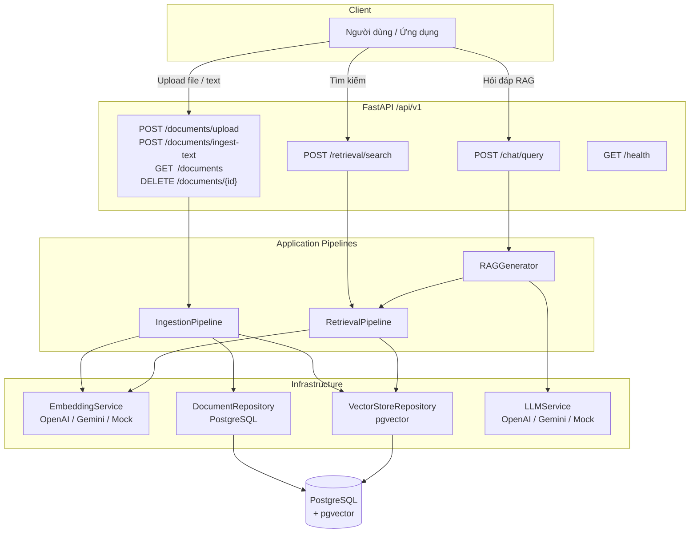

---

## 3. Luồng nạp tài liệu (Ingestion)

### 3.1 Sơ đồ sequence chi tiết

```mermaid
sequenceDiagram
    autonumber
    participant C as Client
    participant API as FastAPI Router
    participant ING as IngestionPipeline
    participant PAR as DocumentParser
    participant CHK as RecursiveChunker
    participant EMB as EmbeddingService
    participant DR as DocumentRepository
    participant VS as VectorStoreRepository
    participant DB as PostgreSQL

    C->>API: POST /api/v1/documents/upload<br/>(file, chunk_size, chunk_overlap)
    API->>API: Validate extension & file size

    API->>ING: ingest_file(db, filename, contents, ...)
    ING->>PAR: parse_file(contents, filename)
    PAR->>PAR: sanitize_text() — loại NUL/control chars
    PAR->>PAR: _validate_pdf_text_layer() nếu là PDF
    PAR-->>ING: raw_text

    ING->>CHK: split_text(raw_text, chunk_size, chunk_overlap)
    CHK-->>ING: chunks[] — [{chunk_index, content}]

    ING->>EMB: get_embeddings([content của mỗi chunk])
    Note over EMB: Bỏ qua chunk rỗng<br/>Giữ thứ tự, batch theo provider
    EMB-->>ING: vectors[]

    ING->>DR: add(db, Document)
    DR->>DB: INSERT INTO documents
    ING->>DB: flush()

    loop Mỗi batch chunk_records
        ING->>VS: add_chunks(db, chunk_records_batch)
        VS->>DB: INSERT INTO document_chunks (bulk)
        VS->>DB: flush()
    end

    ING->>DB: commit()
    ING->>DB: refresh(document)

    alt Thành công
        ING-->>API: Document
        API-->>C: 201 {"success": true, "data": DocumentResponse}
    else Lỗi (parse / embed / DB)
        ING->>DB: rollback()
        ING-->>API: raise Exception
        API-->>C: Error response
    end
```

### 3.2 Sơ đồ luồng dữ liệu

```mermaid
flowchart LR
    subgraph INPUT["Input"]
        FILE["File upload\n(PDF/DOCX/TXT/MD/JSON/CSV)"]
        TEXT["Raw text\n(ingest-text)"]
    end

    subgraph PARSE["Parse & Validate"]
        V1{"Extension\nhợp lệ?"}
        V2{"Kích thước\n≤ 20MB?"}
        PARSE_OP["DocumentParser\n.parse_file()"]
        SAN["sanitize_text()\nLoại NUL/control chars"]
        PDF_CHK{"PDF text layer\nhợp lệ?"}
    end

    subgraph CHUNK["Chunk"]
        V3{"chunk_overlap\n< chunk_size?"}
        SPLIT["RecursiveChunker\n.split_text()"]
        CHUNKS["chunks[]\n[{chunk_index, content}]"]
    end

    subgraph EMBED["Embed"]
        FILTER["Lọc chunk rỗng"]
        EMB_CALL["EmbeddingService\n.get_embeddings()"]
        RETRY{"Rate limit?\n429"}
        VECTORS["vectors[]"]
    end

    subgraph PERSIST["Persist (1 transaction)"]
        DOC_INSERT["INSERT Document"]
        CHUNK_INSERT["INSERT DocumentChunk[]\n(batch flush)"]
        COMMIT["COMMIT"]
        ROLLBACK["ROLLBACK"]
    end

    FILE --> V1
    TEXT --> V3
    V1 -->|"Không"| ERR1["415 Unsupported"]
    V1 -->|"Có"| V2
    V2 -->|"Không"| ERR2["413 Too Large"]
    V2 -->|"Có"| PARSE_OP
    PARSE_OP --> SAN
    SAN --> PDF_CHK
    PDF_CHK -->|"Lỗi"| ERR3["422 OCR required"]
    PDF_CHK -->|"OK"| V3
    V3 -->|"Không hợp lệ"| ERR4["422 Validation error"]
    V3 -->|"Hợp lệ"| SPLIT
    SPLIT --> CHUNKS
    CHUNKS --> FILTER
    FILTER --> EMB_CALL
    EMB_CALL --> RETRY
    RETRY -->|"Có — chờ & retry"| EMB_CALL
    RETRY -->|"Hết retry"| ERR5["429 AppError Retry-After"]
    RETRY -->|"Thành công"| VECTORS
    VECTORS --> DOC_INSERT
    DOC_INSERT --> CHUNK_INSERT
    CHUNK_INSERT --> COMMIT
    COMMIT --> SUCCESS["201 DocumentResponse"]

    DOC_INSERT -->|"Exception"| ROLLBACK
    CHUNK_INSERT -->|"Exception"| ROLLBACK
    ROLLBACK --> ERR6["500 Error response"]
```

---

## 4. Luồng truy vấn RAG (Query / Chat)

### 4.1 Sơ đồ sequence chi tiết

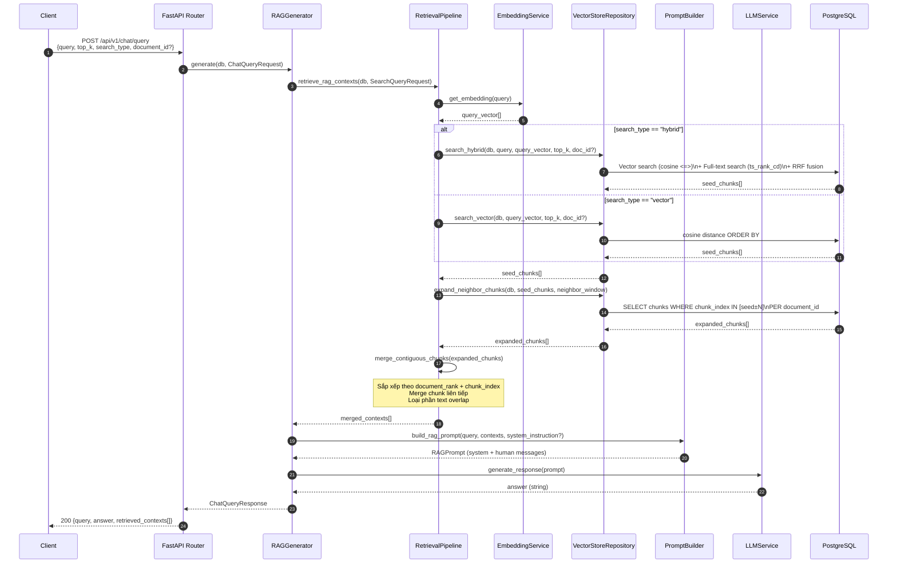

### 4.2 Sơ đồ luồng dữ liệu retrieval

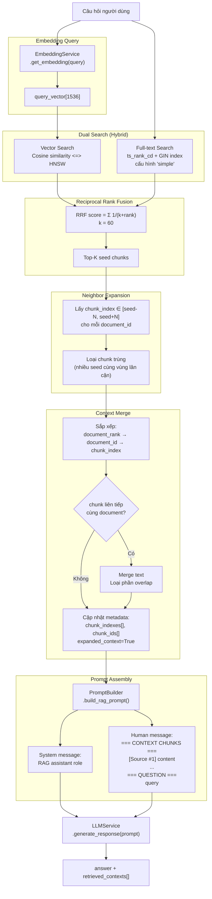

### 4.3 Sơ đồ luồng tìm kiếm đơn thuần (Search)

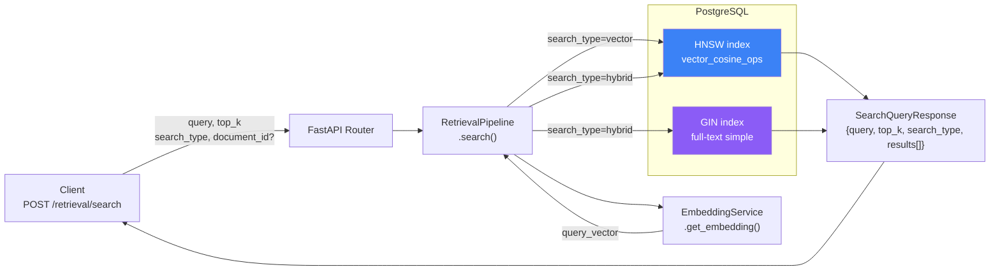

---

## 5. Luồng khởi động ứng dụng

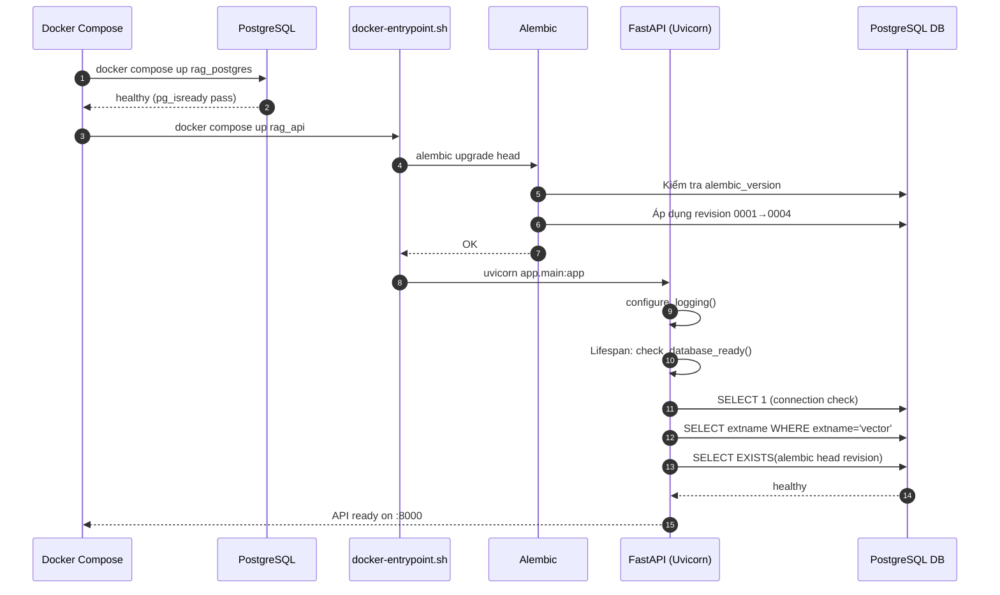

---

## 6. Kiến trúc module và phụ thuộc

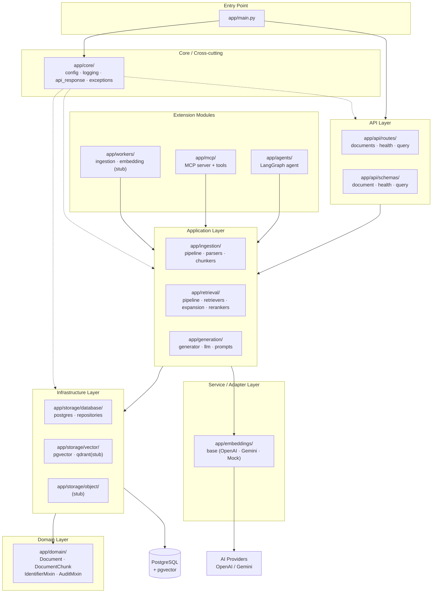

---

## 7. Thiết kế dữ liệu

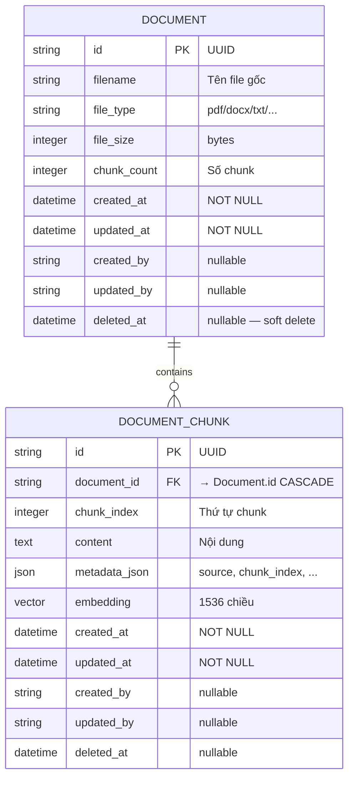

### Index

| Index | Loại | Mục đích |
|---|---|---|
| `ix_document_chunks_document_id` | B-tree | Lọc chunk theo tài liệu |
| `ix_document_chunks_embedding_hnsw` | HNSW cosine `m=16 ef=64` | Approximate nearest-neighbor |
| `ix_document_chunks_fts_simple` | GIN expression | Full-text `simple` config |

---

## 8. Luồng Hybrid Search chi tiết (SQL)

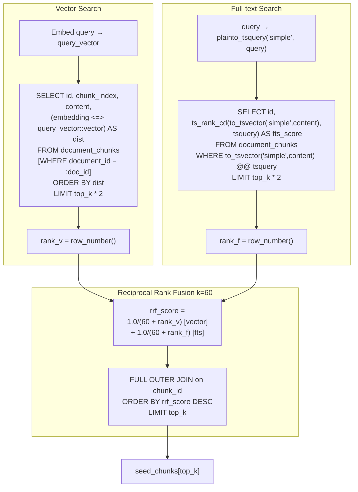

---

## 9. Luồng Neighbor Expansion & Context Merge

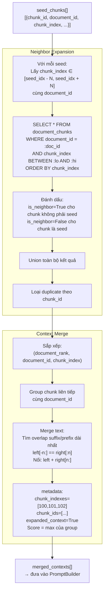

---

## 10. Cấu hình và triển khai

### Topology Docker Compose

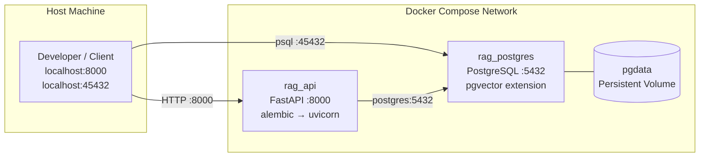

### Biến môi trường chính

| Biến | Mặc định | Mục đích |
|---|---|---|
| `DATABASE_URL` | `postgresql+psycopg://...@localhost:45432/rag_db` | Kết nối database |
| `EMBEDDING_PROVIDER` | `mock` | `openai`, `gemini` hoặc `mock` |
| `LLM_PROVIDER` | `mock` | `openai`, `gemini` hoặc `mock` |
| `OPENAI_API_KEY` | Rỗng | OpenAI auth |
| `GEMINI_API_KEY` | Rỗng | Gemini auth |
| `OPENAI_EMBEDDING_MODEL` | `text-embedding-3-small` | OpenAI embedding |
| `OPENAI_LLM_MODEL` | `gpt-4o-mini` | OpenAI chat |
| `GEMINI_EMBEDDING_MODEL` | `gemini-embedding-001` | Gemini embedding |
| `GEMINI_LLM_MODEL` | `gemini-2.5-flash` | Gemini chat |
| `EMBEDDING_DIMENSION` | `1536` | Số chiều vector |
| `EMBEDDING_MAX_RETRIES` | `1` | Retry khi provider 429 |
| `EMBEDDING_RETRY_BASE_SECONDS` | `1` | Chờ cơ sở khi retry |
| `DEFAULT_CHUNK_SIZE` | `500` | Kích thước chunk |
| `DEFAULT_CHUNK_OVERLAP` | `50` | Độ chồng lấn |
| `DEFAULT_TOP_K` | `5` | Số seed chunks |
| `RAG_NEIGHBOR_WINDOW` | `1` | Số chunk lân cận mỗi phía |
| `MAX_UPLOAD_SIZE_MB` | `20` | Giới hạn upload |
| `DB_INSERT_BATCH_SIZE` | `100` | Số chunk mỗi batch flush |
| `CORS_ORIGINS` | localhost:3000, :5173 | Origins cho phép |

---

## 11. Thiết kế API

| Method | Endpoint | Mục đích |
|---|---|---|
| `GET` | `/` | Thông tin ứng dụng |
| `GET` | `/api/v1/health` | Kiểm tra DB, pgvector, schema |
| `POST` | `/api/v1/documents/upload` | Upload và index tài liệu |
| `POST` | `/api/v1/documents/ingest-text` | Index raw text |
| `GET` | `/api/v1/documents` | Liệt kê tài liệu |
| `DELETE` | `/api/v1/documents/{doc_id}` | Xóa tài liệu và chunks |
| `POST` | `/api/v1/retrieval/search` | Vector hoặc hybrid search |
| `POST` | `/api/v1/chat/query` | Truy vấn RAG hoàn chỉnh |

OpenAPI documentation: `/docs` · `/redoc`

### Response wrapper

```json
{
  "success": true,
  "message": "...",
  "data": { ... }
}
```

### Response chat

```json
{
  "query": "Câu hỏi",
  "answer": "Câu trả lời từ LLM",
  "retrieved_contexts": [
    {
      "chunk_id": "uuid",
      "document_id": "uuid",
      "chunk_index": 0,
      "content": "Nội dung",
      "metadata": { "chunk_indexes": [99, 100, 101], "expanded_context": true },
      "score": 0.0327
    }
  ]
}
```

---

## 12. Các quyết định thiết kế (ADR)

### ADR-01: Modular monolith theo domain

**Quyết định:** Tổ chức thành các module `ingestion`, `retrieval`, `generation`, `embeddings`, `storage`, `domain`.

**Lý do:** Tách biệt rõ trách nhiệm, test độc lập, dễ tách microservice sau.

**Hệ quả:** Cần quản lý dependency; tránh circular import.

### ADR-02: PostgreSQL làm unified store

**Quyết định:** Dùng PostgreSQL cho metadata, content, vector và full-text.

**Lý do:** Giảm số hệ thống vận hành, giữ transaction nhất quán.

**Hệ quả:** Full-text không tương đương BM25 chuyên dụng. Stub Qdrant có sẵn để migrate.

### ADR-03: HNSW cosine distance

**Quyết định:** HNSW index `vector_cosine_ops`, `m=16`, `ef_construction=64`.

**Lý do:** Cải thiện latency ANN search.

**Hệ quả:** Tốn thêm bộ nhớ và thời gian build index.

### ADR-04: Reciprocal Rank Fusion (k=60)

**Quyết định:** RRF để kết hợp vector và full-text ranking.

**Lý do:** Không cần chuẩn hóa hai thang điểm.

**Hệ quả:** Cần điều chỉnh `top_k` và đánh giá offline.

### ADR-05: LangChain adapter cho AI provider

**Quyết định:** Embedding và LLM qua adapter LangChain; retrieval và transaction dùng implementation riêng.

**Lý do:** Đổi provider qua config, dùng chung message interface.

**Hệ quả:** Phải kiểm soát model, dimension và re-index khi đổi provider.

### ADR-06: Fail fast khi thiếu API key

**Quyết định:** Provider thật báo lỗi khi thiếu key, không fallback sang mock.

**Lý do:** Tránh kết quả sai kỳ vọng.

### ADR-07: Alembic là nguồn schema duy nhất

**Quyết định:** Application không gọi `create_all()`. Mọi thay đổi qua Alembic revision.

**Lý do:** Schema có lịch sử, có thể review và rollback.

**Hệ quả:** Phải `alembic upgrade head` trước khi khởi API.

### ADR-08: Neighbor expansion và context merge

**Quyết định:** Sau Top-K, lấy chunk lân cận, loại trùng và merge trước khi tạo prompt.

**Lý do:** Tránh cắt đứt đoạn văn, bảng biểu tại ranh giới chunk.

**Hệ quả:** Context gửi LLM lớn hơn Top-K gốc; cần giới hạn `RAG_NEIGHBOR_WINDOW`.

### ADR-09: AuditMixin cho tất cả entity

**Quyết định:** `Document` và `DocumentChunk` kế thừa `AuditMixin` với `created_at`, `updated_at`, `created_by`, `updated_by`, `deleted_at`.

**Lý do:** Chuẩn bị cho soft-delete, multi-tenant và audit trail.

**Hệ quả:** Cần lọc `deleted_at IS NULL` khi truy vấn.

---

## 13. Kiểm thử

```text
tests/
├── unit/
│   └── test_rag_pipeline.py   ← 31 test cases
├── integration/               ← (backlog — cần PostgreSQL thật)
└── evaluation/                ← (backlog — RAG quality metrics)
```

Bộ unit tests bao phủ: chunk splitting, embedding mock, retry 429, prompt builder,
LLM mock, request validation, transaction rollback, neighbor expansion, context merge,
text sanitizer, PDF text layer validation, health check.

```text
31 passed | Python compile OK | OpenAPI schema OK | Docker Compose OK
```

---

## 14. Backlog trước production

### P0 — Bắt buộc trước khi go-live
- Authentication và authorization theo document/tenant.
- Rate limiting.
- Backup database và diễn tập rollback migration.

### P1 — Quan trọng
- Background worker thực thụ (stub đã có ở `app/workers/`).
- Metrics, distributed tracing (OpenTelemetry).
- Integration tests với PostgreSQL thật.
- Soft-delete: lọc `deleted_at IS NULL` mọi truy vấn.

### P2 — Cải tiến chất lượng
- Reranker cross-encoder (stub: `app/retrieval/rerankers/`).
- Evaluation dataset + đo `recall@k`, groundedness.
- OCR, antivirus scan, object storage.
- Qdrant vector store (stub: `app/storage/vector/qdrant.py`).

---

## 15. Tiêu chí nghiệm thu

1. `alembic upgrade head` tạo extension, bảng và index thành công.
2. `docker compose up --build` đưa API và DB về trạng thái healthy.
3. Upload sai loại / quá kích thước / chunk window sai bị từ chối đúng HTTP code.
4. Lỗi embedding không để lại document hoặc chunk ghi dở (rollback).
5. Vector và hybrid search tôn trọng `document_id` filter.
6. Chat response trả về cả `answer` và `retrieved_contexts`.
7. Provider thiếu API key không fallback sang mock.
8. 31 unit tests + OpenAPI validation đạt trong CI.

---

## 16. Bản đồ mã nguồn

```text
ragflow-api/
├── app/
│   ├── main.py                          # Bootstrap, lifespan, CORS
│   ├── core/
│   │   ├── config.py                    # Settings (pydantic-settings)
│   │   ├── api_response.py              # ApiResponse wrapper + exception handlers
│   │   ├── exceptions.py                # AppError
│   │   └── logging.py                   # Structured logging
│   ├── domain/
│   │   ├── document.py                  # Document entity (SQLAlchemy)
│   │   ├── chunk.py                     # DocumentChunk + HNSW index
│   │   ├── mixins.py                    # IdentifierMixin + AuditMixin
│   │   ├── node.py                      # Node domain type
│   │   └── retrieval_result.py          # RetrievalResult type
│   ├── api/
│   │   ├── dependencies.py
│   │   ├── routes/
│   │   │   ├── documents.py             # /documents endpoints
│   │   │   ├── health.py                # /health endpoint
│   │   │   ├── health_service.py        # HealthService use case
│   │   │   └── query.py                 # /retrieval/search + /chat/query
│   │   └── schemas/
│   │       ├── document.py
│   │       ├── health.py
│   │       └── query.py
│   ├── ingestion/
│   │   ├── pipeline.py                  # IngestionPipeline
│   │   ├── parsers/                     # DocumentParser (PDF/DOCX/TXT/...)
│   │   ├── chunkers/
│   │   │   ├── recursive.py             # RecursiveChunker ← default
│   │   │   ├── semantic.py              # stub
│   │   │   ├── structure_aware.py       # stub
│   │   │   └── agentic.py               # stub
│   │   ├── loaders/
│   │   └── extractors/
│   ├── embeddings/
│   │   └── base.py                      # EmbeddingService (OpenAI/Gemini/Mock)
│   ├── retrieval/
│   │   ├── pipeline.py                  # RetrievalPipeline
│   │   ├── retrievers/
│   │   │   ├── vector.py
│   │   │   ├── hybrid.py
│   │   │   └── bm25.py                  # stub
│   │   ├── expansion/
│   │   │   ├── neighbor.py              # Neighbor expansion + merge
│   │   │   └── parent_child.py          # stub
│   │   └── rerankers/
│   │       ├── base.py
│   │       └── cross_encoder.py         # stub
│   ├── generation/
│   │   ├── generator.py                 # RAGGenerator
│   │   ├── citations.py
│   │   ├── llm/
│   │   │   ├── base.py                  # LLMService (OpenAI/Gemini/Mock)
│   │   │   ├── openai.py
│   │   │   └── gemini.py
│   │   └── prompts/
│   │       └── rag.py                   # PromptBuilder
│   ├── storage/
│   │   ├── database/
│   │   │   ├── postgres.py              # Base, engine, session, health check
│   │   │   └── repositories/
│   │   │       ├── document.py          # DocumentRepository
│   │   │       └── chunk.py             # ChunkRepository
│   │   ├── vector/
│   │   │   ├── pgvector.py              # VectorStoreRepository
│   │   │   └── qdrant.py                # stub
│   │   └── object/                      # stub
│   ├── agents/
│   │   ├── graph.py                     # LangGraph agent
│   │   ├── state.py
│   │   └── nodes/
│   ├── mcp/
│   │   ├── server.py                    # MCP server entry
│   │   └── tools/
│   │       ├── search_documents.py
│   │       └── get_document.py
│   └── workers/
│       ├── ingestion_worker.py          # stub
│       └── embedding_worker.py          # stub
├── tests/
│   ├── unit/
│   │   └── test_rag_pipeline.py         # 31 unit tests
│   ├── integration/                     # backlog
│   └── evaluation/                      # backlog
├── migrations/
│   └── versions/
│       ├── 20260728_0001_initial_rag_schema.py
│       ├── 20260728_0002_restore_fts_index.py
│       ├── 20260729_0003_add_audit_columns.py
│       └── 20260729_0004_require_created_at.py
├── alembic.ini
├── Dockerfile
├── docker-entrypoint.sh
├── docker-compose.yml
├── requirements.txt
└── .env.example
```
