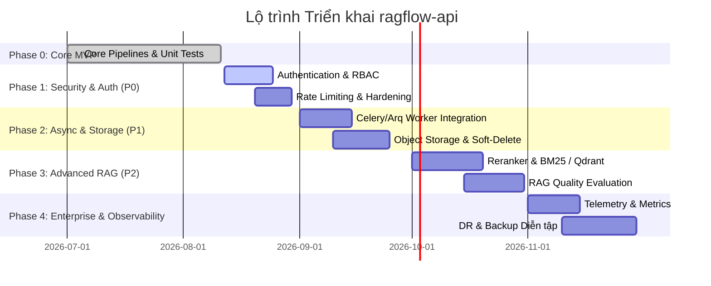
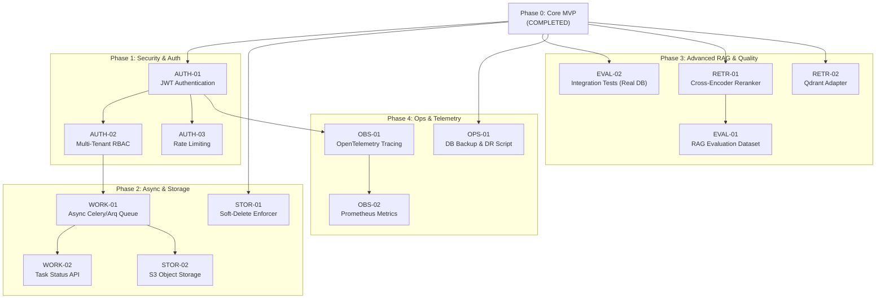

# Bảng Chia nhỏ Công việc & Lộ trình Triển khai (Task Breakdown & Implementation Roadmap)

> **Dự án:** FastAPI RAG Backend with PostgreSQL pgvector  
> **Phiên bản tài liệu:** 1.0  
> **Ngày cập nhật:** 11/08/2026  
> **Tài liệu tham chiếu:** [RAG_Architecture_Design.md](file:///c:/Users/Admin/Documents/Project/ragflow-api/docs/RAG_Architecture_Design.md) | [Requirements_Specification.md](file:///c:/Users/Admin/Documents/Project/ragflow-api/docs/Requirements_Specification.md)

---

## 1. Tổng quan Lộ trình Triển khai (Phased Roadmap)

Dự án được chia thành **5 giai đoạn chiến lược** nhằm đưa hệ thống từ trạng thái MVP hiện tại đến giải pháp RAG cấp doanh nghiệp sẵn sàng cho Production:



---

## 2. Bảng Chia nhỏ Công việc Chi tiết (Detailed Task Breakdown)

### 2.1 Phase 0: Core Modular Monolith Engine (Đã Hoàn thành - Baseline MVP)

| Task ID | Tên công việc | Phân hệ | Mô tả chi tiết | Tiêu chí hoàn thành (Acceptance Criteria) | Độ ưu tiên | Trạng thái |
| :--- | :--- | :--- | :--- | :--- | :---: | :---: |
| `MVP-01` | Ingestion Pipeline & Parsers | `ingestion` | Xây dựng pipeline nạp file PDF, DOCX, TXT, MD, JSON, CSV và text sanitization. | Parse đúng định dạng, lọc NUL char, validate text layer của PDF. | Done | **Completed** |
| `MVP-02` | Document Chunking & Embedding | `embeddings` | Triển khai `RecursiveCharacterTextSplitter` và adapter OpenAI/Gemini/Mock. | Đảm bảo dimension 1536, xử lý rate limit 429 backoff, lọc chunk rỗng. | Done | **Completed** |
| `MVP-03` | Postgres pgvector & Indexing | `storage` | Thiết kế schema `documents` & `document_chunks`, HNSW vector index và GIN FTS index. | Alembic migration 0001->0004 thành công, HNSW HNSW `vector_cosine_ops` chạy ổn định. | Done | **Completed** |
| `MVP-04` | Retrieval & Hybrid RRF | `retrieval` | Xây dựng Hybrid Search kết hợp Vector Search + Full-text Search qua RRF (k=60), Neighbor Expansion & Context Merge. | Lấy seed chunks, mở rộng $[seed \pm N]$, merge chunk liền kề, loại overlap text. | Done | **Completed** |
| `MVP-05` | Generation & MCP Server | `generation` / `mcp` | Ráp prompt kèm trích dẫn `[Source #n]`, sinh câu trả lời RAG và cung cấp MCP tools. | Trả về `answer` + `retrieved_contexts`, 31 unit tests pass 100%. | Done | **Completed** |

---

### 2.2 Phase 1: Security, Authentication & Authorization (Bắt buộc trước Production - P0)

| Task ID | Tên công việc | Phân hệ | Mô tả chi tiết | Tiêu chí hoàn thành (Acceptance Criteria) | Độ ưu tiên | Trạng thái | Phụ thuộc |
| :--- | :--- | :--- | :--- | :--- | :---: | :---: | :--- |
| `AUTH-01` | JWT Authentication Middleware | `core/auth` | Tích hợp FastAPI Security với OAuth2 Bearer JWT token verification middleware. | Trích xuất và xác thực `user_id` từ token JWT, trả lỗi 401 Unauthorized nếu token sai/hết hạn. | **P0** | **Pending** | `MVP-05` |
| `AUTH-02` | Multi-Tenant Authorization (RBAC) | `domain` / `api` | Thêm trường `tenant_id` và `owner_id` vào `Document` & `DocumentChunk`. Cập nhật repository chỉ cho phép xem/xóa tài liệu của mình. | Mọi truy vấn DB tự động gắn điều kiện `tenant_id = :current_tenant`. Ngăn chặn truy cập chéo giữa các tenant. | **P0** | **Pending** | `AUTH-01` |
| `AUTH-03` | Rate Limiting Middleware | `api` | Áp dụng Redis / Memory Rate Limiter (dùng `slowapi`) bảo vệ các API uploads và chat query. | Trả lỗi HTTP 429 Too Many Requests khi client vượt quá threshold cấu hình (vd: 10 requests/phút). | **P0** | **Pending** | `AUTH-01` |
| `AUTH-04` | API Key Management & Vault | `core` | Quản lý mã hóa API Key của người dùng khi truy cập MCP Server / External Agents. | Lưu trữ bảo mật chìa khóa API, không log lộ key ra file log. | **P1** | **Pending** | `AUTH-01` |

---

### 2.3 Phase 2: Asynchronous Workers & Production Storage (P1)

| Task ID | Tên công việc | Phân hệ | Mô tả chi tiết | Tiêu chí hoàn thành (Acceptance Criteria) | Độ ưu tiên | Trạng thái | Phụ thuộc |
| :--- | :--- | :--- | :--- | :--- | :---: | :---: | :--- |
| `WORK-01` | Async Ingestion Queue (Celery/Arq) | `workers` | Hoàn thiện stub tại `app/workers/ingestion_worker.py` sử dụng Arq / Celery + Redis làm Message Broker. | Chuyển luồng nạp file lớn (>5MB) thành background job, client nhận `job_id` lập tức. | **P1** | **Pending** | `AUTH-02` |
| `WORK-02` | Task Status Tracking API | `api` | Cung cấp endpoint `GET /api/v1/documents/tasks/{task_id}` để poll trạng thái nạp file. | Trả về trạng thái `PENDING`, `PROCESSING`, `SUCCESS`, `FAILED` kèm tiến độ %. | **P1** | **Pending** | `WORK-01` |
| `STOR-01` | Soft-Delete Enforcer Middleware | `storage` | Cập nhật tất cả SQLAlchemy Repositories và Vector Store để tự động lọc `deleted_at IS NULL`. | Khi xóa tài liệu, chỉ set timestamp `deleted_at`, truy vấn bình thường không trả lại data đã xóa. | **P1** | **Pending** | `MVP-03` |
| `STOR-02` | Object Storage Driver (S3/MinIO) | `storage/object` | Triển khai driver lưu trữ file gốc trên AWS S3 hoặc MinIO thay vì chỉ giữ text trong Postgres. | File upload được lưu an toàn trên S3 bucket, DB giữ đường dẫn tham chiếu. | **P2** | **Pending** | `WORK-01` |

---

### 2.4 Phase 3: Advanced Retrieval, Reranking & Quality Evaluation (P2)

| Task ID | Tên công việc | Phân hệ | Mô tả chi tiết | Tiêu chí hoàn thành (Acceptance Criteria) | Độ ưu tiên | Trạng thái | Phụ thuộc |
| :--- | :--- | :--- | :--- | :--- | :---: | :---: | :--- |
| `RETR-01` | Cross-Encoder Reranker | `retrieval/rerankers` | Hiện thực hóa stub `app/retrieval/rerankers/cross_encoder.py` sử dụng Cohere Rerank API hoặc HuggingFace local model. | Tái sắp xếp kết quả Top-K từ Hybrid Search trước khi Neighbor Expansion, nâng cao điểm Relevance score. | **P2** | **Pending** | `MVP-04` |
| `RETR-02` | Qdrant Vector Store Adapter | `storage/vector` | Hoàn thiện stub `app/storage/vector/qdrant.py` cho phép chuyển đổi Vector Store giữa pgvector và Qdrant qua `.env`. | Chạy được toàn bộ bộ test suite trên Qdrant instance mà không sửa đổi logic layer trên. | **P2** | **Pending** | `MVP-03` |
| `RETR-03` | Parent-Child Chunking Strategy | `ingestion/chunkers` | Bổ sung chiến thuật chunking Parent-Child: lưu Small Chunks để search vector và Parent Chunks lớn hơn để gửi ngữ cảnh LLM. | Tăng độ chính xác khi truy hồi câu trả lời mà không làm mất thông tin tổng quan của văn bản. | **P2** | **Pending** | `MVP-02` |
| `EVAL-01` | RAG Evaluation Benchmark Suite | `tests/evaluation` | Xây dựng bộ test dataset (Q&A ground truth) và tích hợp công cụ đo lường (Ragas / TruLens). | Đo đạc tự động các chỉ số: `Faithfulness`, `Answer Relevance`, `Context Precision`, `Context Recall`. | **P2** | **Pending** | `RETR-01` |
| `EVAL-02` | Integration Tests với Real PostgreSQL | `tests/integration` | Viết bộ kiểm thử tích hợp chạy với Docker PostgreSQL + pgvector thật trong CI/CD. | Bao phủ các trường hợp concurrency, transaction rollback, HNSW index behavior thực tế. | **P1** | **Pending** | `MVP-05` |

---

### 2.5 Phase 4: Enterprise Observability, Reliability & Operations (P2/P3)

| Task ID | Tên công việc | Phân hệ | Mô tả chi tiết | Tiêu chí hoàn thành (Acceptance Criteria) | Độ ưu tiên | Trạng thái | Phụ thuộc |
| :--- | :--- | :--- | :--- | :--- | :---: | :---: | :--- |
| `OBS-01` | OpenTelemetry Tracing | `core/logging` | Gắn OpenTelemetry instrumentation cho FastAPI, SQLAlchemy, HTTPX client và LLM calls. | Xuất được distributed trace diagram trên Jaeger / Tempo cho mỗi request RAG chat. | **P2** | **Pending** | `AUTH-01` |
| `OBS-02` | Prometheus Metrics Endpoint | `api` | Cung cấp endpoint `/metrics` xuất thông số Latency, Error Rate, Token usage, Active Workers. | Dashboard Grafana hiển thị trực quan các biểu đồ vận hành ứng dụng. | **P2** | **Pending** | `OBS-01` |
| `OPS-01` | Database Backup & DR Automation | `scripts` | Viết script tự động `pg_dump` định kỳ lưu bản sao lưu lên không gian độc lập và kịch bản phục hồi. | Diễn tập phục hồi thành công database từ bản backup trong thời gian RTO < 30 phút. | **P0** | **Pending** | `MVP-03` |
| `OPS-02` | Helm Chart / Kubernetes Manifests | `deploy` | Đóng gói ứng dụng thành Helm Chart deployment sẵn sàng cho môi trường Production Kubernetes (K8s). | Triển khai thành công trên cụm K8s với Auto-scaling (HPA) theo CPU/RAM. | **P3** | **Pending** | `WORK-01` |

---

## 3. Ma trận Phụ thuộc & Thứ tự Thực hiện (Task Dependency Matrix)

Dưới đây là sơ đồ luồng phụ thuộc kĩ thuật giữa các nhiệm vụ chính:



---

## 4. Hướng dẫn Quy trình Phát triển & Kiểm thử (Workflow Guidelines)

### 4.1 Quy trình Phát triển Feature / Task
1. **Tạo nhánh Git mới:** Tên nhánh theo định dạng `feature/<TASK-ID>-short-description` (Ví dụ: `feature/AUTH-01-jwt-middleware`).
2. **Cập nhật Database Schema (nếu có):**
   - Không sửa trực tiếp file migration cũ đã merge.
   - Tạo file migration mới: `alembic revision --autogenerate -m "add_tenant_id_to_documents"`.
   - Kiểm tra file revision sinh ra trước khi commit.
3. **Thực thi Unit Test cục bộ:**
   ```bash
   python -m pytest tests/unit/ -v
   ```
4. **Kiểm tra Docker Compose build:**
   ```bash
   docker compose down -v
   docker compose up --build
   ```
5. **Tạo Pull Request (PR):** Đảm bảo tất cả kiểm thử CI pass 100% trước khi review và merge vào nhánh `main`.
