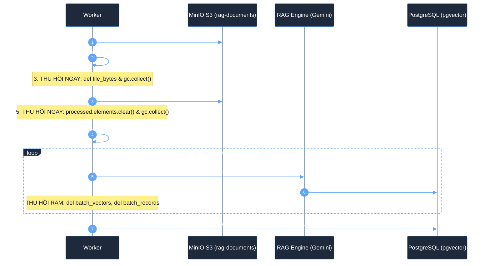
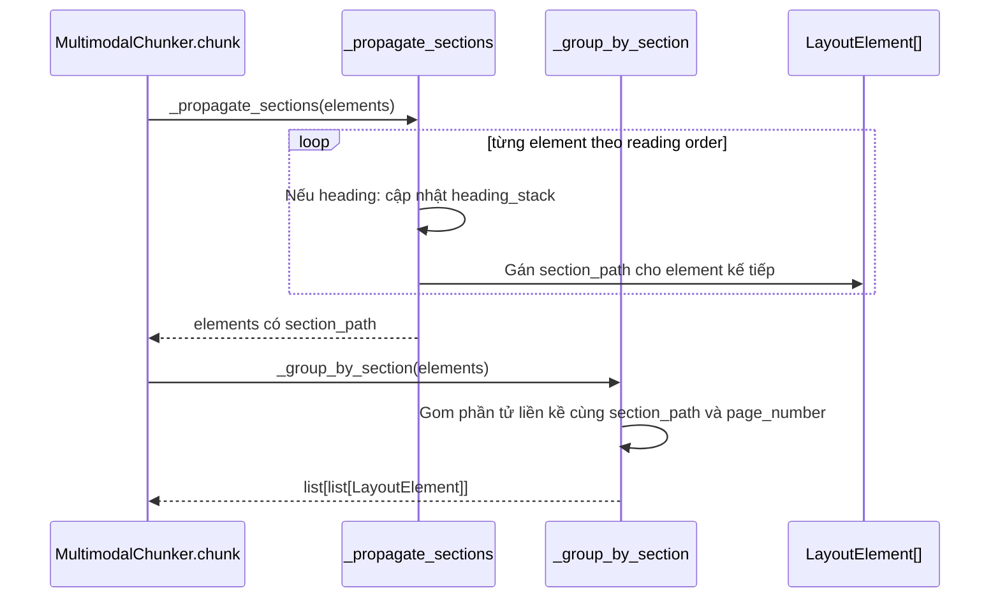
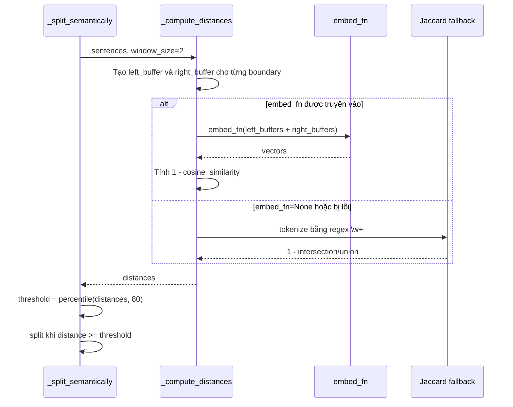
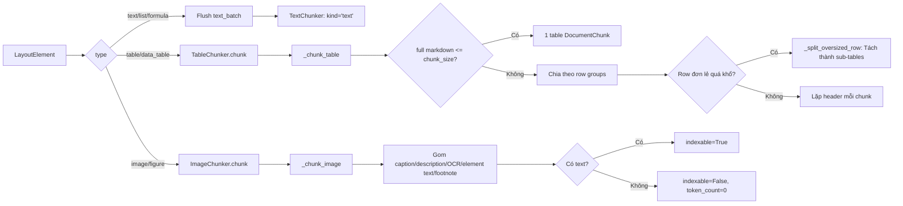
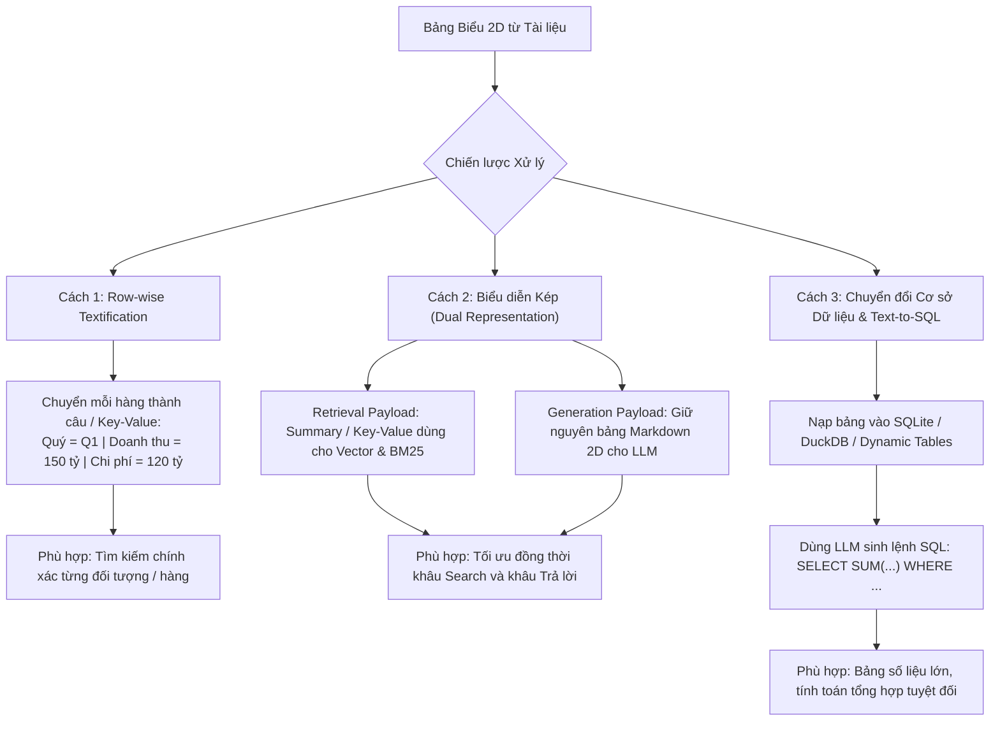
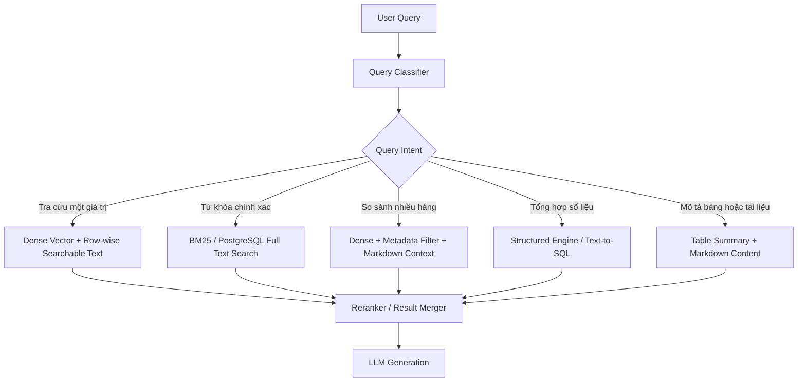
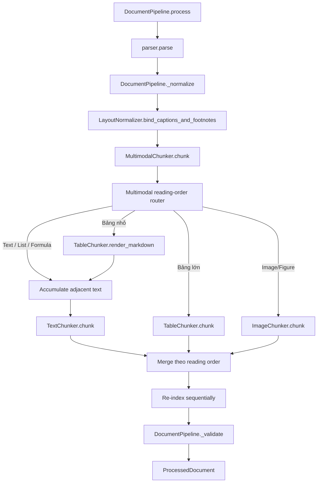

# KIẾN TRÚC CHUNKING LAI (HYBRID CHUNKING) VÀ LUỒNG THỰC THI TOÀN TRÌNH

Tài liệu này quy chuẩn toàn bộ giải pháp **Băm nhỏ dữ liệu (Document Chunking)** trong hệ thống RAG: kết hợp giữa **Mô hình Lai 2 tầng (Heading-Aware + Semantic)**, **Cơ chế chống Memory Leak (Zero-RAM-Bloat)** và **Sơ đồ luồng gọi hàm thực thi (Call Flow & Routing)** chi tiết trong package `packages/rag-document-pipeline`.

---

## 1. Bối cảnh & Thách thức trong Chunking Enterprise

Trong các hệ thống RAG thực tế, việc băm tài liệu gặp 3 bài toán nan giải:

1. **Mất ngữ cảnh khi băm nhỏ (Context Loss)**: Nếu băm theo số ký tự cứng (Fixed-size / Naive), một câu nằm ở trang 5 sẽ bị tách rời khỏi tiêu đề chương ở trang 1, khiến AI bị ảo giác (hallucination).
2. **Xé nát bảng biểu và hình ảnh (Broken Multimodal Structure)**: Bảng biểu tài chính nhiều cột hoặc hình ảnh biểu đồ nếu bị cắt vụn như văn bản thường sẽ mất toàn bộ ý nghĩa dữ liệu.
3. **Tràn bộ nhớ RAM & Memory Leak (RAM Bloat / OOM Crash)**: Khi xử lý tài liệu 100–500 trang, việc giữ đồng thời: File PDF gốc + Hàng nghìn phần tử Layout + Hàng nghìn Chunk + Vector Embedding trong RAM sẽ làm Worker ngốn từ 2GB–4GB RAM, kích hoạt cơ chế `OOM Killer` của hệ điều hành.

---

## 2. Chiến Lược Chống Memory Leak (Zero-RAM-Bloat Pipeline)

Hệ thống loại bỏ hoàn toàn mô hình "Dồn tất cả dữ liệu vào RAM rồi mới xử lý". Thay vào đó, kiến trúc áp dụng quy trình **Lưu trữ trung gian (Staging to MinIO) + Thu hồi RAM chủ động + Micro-batching**:



### Điểm cốt lõi:
- **Lưu `{document_id}_layout.json` lên MinIO S3**:
  - Dữ liệu bóc tách được lưu thành tài sản số vĩnh viễn trên S3.
  - Giải phóng toàn bộ mảng `elements` khỏi RAM tiến trình Worker.
  - **Re-chunking siêu tốc**: Khi muốn đổi `chunk_size` hoặc đổi thuật toán băm, chỉ cần kéo file `layout.json` về cắt lại, **tiết kiệm 95% thời gian và 0% CPU Java OpenDataLoader**.
- **Micro-batching (50 chunks/lần)**:
  - Bảng `chunks` được ghi nhận theo từng đợt 50 phần tử. Bộ nhớ của Worker cho bước sinh vector luôn **cố định và phẳng ($\le 50$ chunks, $\approx 10\text{MB}$ RAM)** bất kể tài liệu có 10 trang hay 1.000 trang.

---

## 3. Kiến Trúc Mô Hình Lai 2 Tầng (Two-Tier Hybrid Chunking)

Mô hình lai kết hợp: **Heading-Aware ở tầng vĩ mô (Macro)** để bảo toàn cấu trúc phân cấp và **Semantic Chunking ở tầng vi mô (Micro)** để nhận diện ranh giới đổi chủ đề tự nhiên.

### Cấu Trúc Gói Mã Nguồn (`rag_document_pipeline/chunking/`)

```text
packages/rag-document-pipeline/src/rag_document_pipeline/chunking/
├── __init__.py          # Public exports và compatibility aliases
├── base.py              # Protocol Chunker, estimate_tokens
├── section.py           # Quản lý cây tiêu đề (_propagate_sections, group_by_section)
├── multimodal.py        # Orchestrator MultimodalChunker điều phối luồng đọc tự nhiên
├── text.py              # TextChunker (tách câu tiếng Việt, sliding window, topic shifts)
├── table.py             # TableChunker (render Markdown, repeated headers)
└── image.py             # ImageChunker (caption, OCR, footnote, cờ indexable)
```

### Sơ Đồ Khái Niệm Phân Tầng:


---

### 3.1. Tầng 1: Vĩ mô (Heading-Aware Orchestrator & Reading-Order Router)
File mã nguồn: [`packages/rag-document-pipeline/src/rag_document_pipeline/chunking/multimodal.py`](file:///c:/Users/ndquynh/Documents/RAG/packages/rag-document-pipeline/src/rag_document_pipeline/chunking/multimodal.py)

`MultimodalChunker` đóng vai trò nhạc trưởng điều phối toàn bộ các phần tử layout theo đúng thứ tự đọc tự nhiên (*Natural Reading Order*):

#### Cây Ngữ Cảnh Tiêu Đề (`_propagate_sections`) & Nhóm Section (`_group_by_section`)
- Duyệt qua danh sách phần tử và duy trì một ngăn xếp tiêu đề (`heading_stack`).
- Khi gặp tiêu đề cấp mới ($H_1, H_2, H_3$), cập nhật ngăn xếp theo cấp độ phân cấp.
- Gán mảng `section_path` (ví dụ: `["CHƯƠNG I: QUY ĐỊNH CHUNG", "Điều 2. Đối tượng áp dụng"]`) cho toàn bộ các phần tử đoạn văn bản, bảng biểu, hình ảnh xuất hiện phía dưới.



#### Quy tắc cập nhật `heading_stack`:
```text
H1: Chương 1
    section_path = ["Chương 1"]

  H2: 1.1 Phạm vi
      section_path = ["Chương 1", "1.1 Phạm vi"]

  paragraph
      section_path = ["Chương 1", "1.1 Phạm vi"]

H1: Chương 2
    section_path = ["Chương 2"]
```

#### Bảng Định Tuyến Modality Duy Nhất (Single Reading-Order Router):
Hệ thống sử dụng một router multimodal duy nhất theo reading order, không dùng cờ chia tách tùy tiện:

| Modality | Cách Xử Lý Chi Tiết |
| :--- | :--- |
| **Text / List / Formula** | Gom các phần tử liền kề dưới cùng tiêu đề và đưa vào `TextChunker` phân đoạn ngữ nghĩa. |
| **Bảng nhỏ** | Chuyển thành Markdown inline và ghép trực tiếp vào đoạn văn bản xung quanh. |
| **Bảng lớn** | Cắt độc lập theo nhóm dòng, tự động lặp lại tiêu đề cột (`repeated_header = True`). |
| **Image / Figure** | Băm độc lập từ `caption`, `description`, `ocr_text`, `footnote`. |
| **Header / Footer** | Tự động loại bỏ (skip) để tránh làm nhiễu ngữ cảnh và loãng vector search. |

---

### 3.2. Tầng 2: Vi mô (Semantic Text Chunker)
File mã nguồn: [`packages/rag-document-pipeline/src/rag_document_pipeline/chunking/text.py`](file:///c:/Users/ndquynh/Documents/RAG/packages/rag-document-pipeline/src/rag_document_pipeline/chunking/text.py)

Bên dưới một tiêu đề có thể có nhiều đoạn văn dài. Khác với các phương pháp băm cứng theo số ký tự (Naive Fixed-size Chunking), `TextChunker` tìm điểm ngắt tự nhiên theo **sự chuyển dịch chủ đề (Topic Shifts)** qua quy trình 4 bước chặt chẽ:

```mermaid
flowchart TD
    A[TextChunker.chunk] --> B[_group_by_section]
    B --> C[Cho từng group]
    C --> D[_heading_prefix]
    C --> E[_group_text từng element]
    E -->|table có table_data| F[TableChunker.render_markdown]
    E -->|text/khác| G[el.text.strip]
    F --> H[Nối bằng blank line]
    G --> H
    H --> I[_split_semantically]

    I --> J[_split_sentences]
    J --> K[_collect_blocks tách bảng Markdown khỏi văn bản]
    K --> L{Block là bảng?}
    L -->|Có| M[Giữ nguyên atomic table block]
    L -->|Không| N[Mask decimal và viết tắt bằng U+E000]
    N --> O[Split theo . ? ! ; … và newline]
    O --> P[Unmask dấu chấm]
    M --> Q[list sentences]
    P --> Q

    Q --> R[_compute_distances window_size=2]
    R --> S{embed_fn?}
    S -->|Có| T[Batch embedding toàn bộ buffers]
    T --> U[Cosine distance]
    S -->|Không hoặc lỗi| V[Jaccard lexical distance]
    U --> W[list distances]
    V --> W

    W --> X[_calculate_threshold theo percentile 80%]
    X --> Y[Tách khi distance >= threshold]
    Y --> Z[_enforce_bounds]
    Z --> AA{segment < min_chunk_size 300?}
    AA -->|Có và có segment trước| AB[_merge_segments nối vào chunk trước]
    AA -->|Không| AC[Giữ segment]
    AB --> AD
    AC --> AD{segment > max_chunk_size 1500?}
    AD -->|Có| AE[_recursive_split theo \n\n, \n, . , ,]
    AD -->|Không| AF[Giữ segment]
    AE --> AG[list segments]
    AF --> AG

    AG --> AH[Gắn heading prefix ### H1 > H2]
    AH --> AI[DocumentChunk với kind=text]
    AI --> AJ[estimate_tokens]
```



#### Bước 1: Tách câu tiếng Việt chuẩn hóa (`_split_sentences`)
- **Bảo toàn bảng Markdown**: Nhận diện các dòng bắt đầu và kết thúc bằng `|`, cô lập thành các khối nguyên tử (atomic block), không bị băm vụn thành từng dòng câu đơn lẻ.
- **Mã hóa ký tự đặc biệt (Masking với `\uE000`)**:
  - Dấu chấm số thập phân và phân cách hàng nghìn (`1.5`, `1.500.000`).
  - Viết tắt chức danh, học vị: `ThS.`, `TS.`, `GS.`, `PGS.`, `BS.`, `DS.`, `KTS.`, `đ/c`...
  - Viết tắt hành chính, văn bản quy phạm pháp luật: `TP.`, `đ/v.`, `v.v.`, `NĐ-CP.`, `QĐ.`, `TT.`...
  - Viết tắt tiếng Anh thông dụng: `e.g.`, `i.e.`, `etc.`, `Mr.`, `Mrs.`, `Dr.`...
- **Tách câu**: Cắt ranh giới theo biểu thức chính quy `[.?!;…\n]`, sau đó khôi phục lại các dấu chấm đã mask.

#### Bước 2: Đo khoảng cách ngữ nghĩa qua Cửa sổ trượt (`Sliding Window Buffer`)
Thay vì so sánh trực tiếp hai câu đơn lẻ $S_i$ và $S_{i+1}$ (dễ bị nhiễu do các từ nối ngắn như *"Do đó:"*, *"Theo đó:"*), thuật toán xây dựng:
- **Left Buffer**: Gom $W$ câu kết thúc tại vị trí $i$ (mặc định $W = 2$).
- **Right Buffer**: Gom $W$ câu bắt đầu tại vị trí $i + 1$.



Hệ thống hỗ trợ 2 chế độ đo khoảng cách ngữ nghĩa:
1. **Vector Cosine Distance** (khi truyền `embed_fn`):
   $$\text{Dist}(L, R) = 1.0 - \frac{\vec{E}_L \cdot \vec{E}_R}{\|\vec{E}_L\| \|\vec{E}_R\|}$$
2. **Lexical Jaccard Overlap Fallback** (Zero-cost chạy offline):
   $$\text{Dist}(L, R) = 1.0 - \frac{|W_L \cap W_R|}{|W_L \cup W_R|}$$
   Hoạt động siêu tốc ($< 1\text{ms}$), chạy thuần CPU, không tiêu tốn quota hay chi phí API mạng.

#### Bước 3: Xác định ngưỡng cắt đổi chủ đề (`_calculate_threshold`)
- Ngưỡng khoảng cách được tính theo bách phân vị động: `threshold_percentile = 80.0%`.
- Bất cứ vị trí nào $\text{Dist}(L, R) \ge \text{threshold}$ $\rightarrow$ xác định là điểm đổi chủ đề $\rightarrow$ Cắt tạo chunk mới.

#### Bước 4: Kẹp cận kích thước (Size Clamping - Chống vụn và chống tràn)
- **Chống chunk vụn (< min_chunk_size = 300 ký tự)**: Lũy tiến ghép các cụm câu liền kề nếu chưa đạt độ dài tối thiểu, tránh sinh ra các vector rời rạc gây loãng kết quả tìm kiếm.
- **Chống chunk quá dài (> max_chunk_size = 1500 ký tự)**: Nếu một chủ đề kéo dài liên tục, áp dụng `RecursiveCharacterTextSplitter` đệ quy theo các mức dấu phân đoạn (`\n\n`, `\n`, `. `, `, `) để không vượt quá context window của LLM.

#### Gắn tiền tố ngữ cảnh (Context Prefix)
Đầu mỗi text chunk được `TextChunker._heading_prefix()` tự động chèn tiền tố phân cấp:
```markdown
### CHƯƠNG I: QUY ĐỊNH CHUNG > Điều 2. Đối tượng áp dụng

[Nội dung văn bản được gom theo ngữ nghĩa...]
```
*(Riêng `TableChunker` sử dụng `caption_prefix` và `ImageChunker` sử dụng tag `[IMAGE]`)*.

---

### 3.3. Xử lý Đa Thể Thức Chuyên Sâu (Table & Image Chunkers)



- **Bảng độc lập 100% ([`table.py`](file:///c:/Users/ndquynh/Documents/RAG/packages/rag-document-pipeline/src/rag_document_pipeline/chunking/strategies/table.py))**:
  - Mọi bảng biểu đều được tách thành các chunk độc lập (`kind="table"`), loại bỏ hoàn toàn cơ chế inline vào text.
  - **Repeated Headers**: Khi chia theo nhóm hàng (row groups), tiêu đề cột và caption tự động được lặp lại ở đầu mỗi chunk con kèm cờ `has_repeated_header = True` trong metadata.
  - **Băm dòng quá khổ (Oversized Row Splitting)**: Hàng đơn lẻ chứa ô văn bản vượt `chunk_size` được tự động băm nhỏ thành các sub-table chunks, bảo toàn các cột định danh ngữ cảnh (mã hợp đồng, điều khoản).
  - **Biểu diễn kép (Dual Representation)**: `content` lưu bảng Markdown 2D trực quan cho LLM; `metadata["searchable_text"]` lưu chuỗi Key-Value phẳng hóa tối ưu cho Dense Vector & BM25.
  - *(Xem tài liệu chuyên sâu tại [`table_chunking_architecture.md`](file:///c:/Users/ndquynh/Documents/RAG/docs/table_chunking_architecture.md))*.
- **Hình ảnh & Sơ đồ ([`image.py`](file:///c:/Users/ndquynh/Documents/RAG/packages/rag-document-pipeline/src/rag_document_pipeline/chunking/strategies/image.py))**:
  - Gom tổng hợp từ `caption`, `description`, `ocr_text`, `footnote`.
  - **Bảo vệ không gian Vector (`indexable`)**: Nếu có nội dung chữ $\rightarrow$ `indexable = True` và embedding; nếu không có chữ $\rightarrow$ giữ metadata với `indexable = False` để tránh nhúng vector rác.
  - *(Xem tài liệu chuyên sâu tại [`image_processing_architecture.md`](file:///c:/Users/ndquynh/Documents/RAG/docs/image_processing_architecture.md))*.

---

### 3.4. Phân Tích Chuyên Sâu: Bài Toán 2 Chiều Của Bảng Biểu & 3 Chiến Lược Xử Lý Cho RAG

Bảng biểu trong tài liệu không phải là văn bản tuyến tính 1 chiều (1D Sequential Text), mà là **dữ liệu quan hệ 2 chiều (2D Relational Data)**:
- **Chiều Hàng (Row-wise)**: Tập hợp các thuộc tính của một đối tượng cụ thể (Entity Record).
- **Chiều Cột (Column-wise)**: Sự so sánh, đối chiếu hoặc phân loại một thuộc tính qua nhiều đối tượng khác nhau (Metrics / Categories).
- **Giao điểm ô (Cell Intersection)**: Một giá trị chỉ có ý nghĩa khi kết hợp `(Tên Cột, Tên Hàng, Đơn vị tính)`.

Khi duỗi thẳng bảng thành chuỗi Markdown (`| Cột 1 | Cột 2 |...`), các mô hình Embedding (vốn chỉ đo khoảng cách token 1 chiều lân cận) sẽ **bị mù theo chiều dọc (Column Blindness)** và dễ làm mất ngữ cảnh giao điểm ô khi vector hóa.

#### 3.4.1. Ba Hướng Tiếp Cận Xử Lý Bảng Cho RAG Hiện Đại



1. **Cách 1: Tự nhiên hóa từng dòng (Row-wise Key-Value / Textification)**
   - **Cơ chế**: Chuyển đổi mỗi hàng của bảng thành một phát biểu tự nhiên hoặc chuỗi Key-Value độc lập:
     ```text
     [Bảng: Báo cáo tài chính theo quý - 2024]
     - Bản ghi 1: Quý = Q1 | Doanh thu = 150 tỷ VNĐ | Lợi nhuận = 25 tỷ VNĐ
     - Bản ghi 2: Quý = Q2 | Doanh thu = 180 tỷ VNĐ | Lợi nhuận = 32 tỷ VNĐ
     ```
   - **Tác động**: Từng hàng biến thành một đơn vị ngữ nghĩa độc lập, embedding model vector hóa cực kỳ chính xác cho các truy vấn tìm kiếm thực thể.

2. **Cách 2: Biểu diễn kép (Dual Representation - Search Text vs LLM Context)**
   - **Cơ chế**: Tách biệt hoàn toàn định dạng dùng để **Tìm kiếm (Retrieval)** và định dạng dùng để **Sinh câu trả lời (Generation)**:
     - **Retrieval Payload (`searchable_text` / Embedding)**: Sử dụng bản tóm tắt bảng (Table Summary sinh bởi LLM hoặc template) kết hợp chuỗi Key-Value để vector search và BM25 tìm đúng bảng.
     - **Generation Payload (`content`)**: Nạp nguyên vẹn cấu trúc bảng Markdown/HTML vào prompt để LLM đọc và suy luận 2 chiều trực quan.

3. **Cách 3: Chuyển đổi Cơ sở dữ liệu Cấu trúc & Text-to-SQL (Structural Engine / SQL Tooling)**
   - **Cơ chế**: Khi gặp bảng lớn có nhiều số liệu thống kê, hệ thống không chunk bảng vào Vector Database mà lưu vào SQLite/DuckDB hoặc PostgreSQL schema động.
   - **Tác động**: Khi người dùng hỏi dạng lọc/tính toán (*"Phòng ban nào có chi phí cao nhất?", "Tổng doanh thu 3 quý đầu năm?"*), hệ thống dùng LLM chuyển câu hỏi thành truy vấn SQL (`SELECT ... GROUP BY ... ORDER BY ... LIMIT 1`) để truy vấn số liệu chính xác 100%.

#### 3.4.2. Bảng So Sánh Ưu - Nhược Điểm Toàn Diện

| Tiêu chí so sánh | Cách 1: Row-wise Textification | Cách 2: Biểu diễn kép (Dual Representation) | Cách 3: Text-to-SQL / Database Engine |
| :--- | :--- | :--- | :--- |
| **Tìm kiếm theo hàng (Row Query)** | ⭐⭐⭐⭐⭐ Rất tốt (Mỗi hàng là 1 câu hoàn chỉnh) | ⭐⭐⭐⭐⭐ Rất tốt (Nhờ Summary + Key-Value) | ⭐⭐⭐ Tốt (Cần chuyển câu hỏi sang lệnh `WHERE`) |
| **Tìm kiếm / Tổng hợp cột (Column/Agg Query)** | ⚠️ Hạn chế (Khó tính toán tổng, trung bình) | 🟡 Khá (LLM nhận bảng Markdown đầy đủ để tính) | ⭐⭐⭐⭐⭐ Hoàn hảo (SQL thực hiện `SUM`, `AVG`, `MAX`) |
| **Độ chính xác tính toán số liệu** | ⚠️ Phụ thuộc vào khả năng đọc text của LLM | 🟡 Khá (LLM tính toán trên bảng Markdown) | ⭐⭐⭐⭐⭐ Tuyệt đối 100% (Tính toán bằng Database Engine) |
| **Định dạng context cho LLM** | 🟡 Khá dài dòng nếu bảng nhiều cột | ⭐⭐⭐⭐⭐ Tự nhiên, trực quan (Bảng Markdown 2D) | ⭐⭐⭐ Tốt (Dữ liệu trả về từ bảng kết quả SQL) |
| **Chi phí API / Thời gian lúc Ingest** | 🟢 **0đ - Siêu nhanh** (Rule-based string template) | 🟡 Thấp nếu dùng Rule; Cao nếu gọi LLM tóm tắt | 🔴 Cao (Cần tạo schema động, load bảng, validate) |
| **Độ phức tạp hạ tầng & Vận hành** | 🟢 **Rất đơn giản** (Tích hợp ngay trong Chunker) | 🟢 **Đơn giản** (Lưu thêm trường vào Metadata/DB) | 🔴 **Rất phức tạp** (SQL sandbox, dynamic table, schema drift) |
| **Khả năng chịu lỗi khi OCR méo mó** | 🟢 Cao (Dung thứ bảng thiếu ô, merge cell) | 🟢 Cao (Không đòi hỏi schema cố định) | 🔴 Rất kém (Bảng OCR sai lệch kiểu dữ liệu sẽ gãy lệnh SQL) |

#### 3.4.3. Đề Xuất Giải Pháp Cho Dự Án `ragflow-api` & Lập Luận Lựa Chọn

**Giải pháp tối ưu đề xuất:** **Kiến trúc Lai Biểu Diễn Kép Tinh Gọn (Lightweight Dual Representation kết hợp Rule-based Row Textification)**.

Cụ thể kiến trúc triển khai:
1. **100% Bảng được chunk độc lập (`kind="table"`)**: Mọi bảng biểu đều được chuyển sang `TableChunker` để đảm bảo tính phân tách modality rõ ràng, không làm loãng embedding của văn bản xung quanh.
2. **Cơ chế Biểu diễn kép không tốn phí API (Rule-based Dual Representation)**:
   - **Trường `content` (LLM Generation)**: Giữ nguyên cấu trúc bảng Markdown hoàn chỉnh kèm **Repeated Header** và Caption để LLM đọc và trích dẫn bounding box trên giao diện.
   - **Băm dòng quá khổ (Oversized Row Splitting)**: Dòng có ô văn bản dài vượt `chunk_size` được cắt thành các sub-tables, bảo toàn các cột định danh (mã hợp đồng, điều khoản).
   - **Trường `metadata["searchable_text"]` (Vector & BM25 Retrieval)**: Được bộ `TableChunker` tự động sinh bằng thuật toán chuyển đổi **Row-wise Key-Value template** (tự động ghép Header tương ứng với từng Cell trên từng hàng).
   - **Vector Embedding**: Sinh vector dựa trên `searchable_text` (hoặc kết hợp `Caption + Section Path + Key-Value Text`) thay vì vector hóa các ký tự phân cách pipe `| --- |`.
   - *(Chi tiết xem tại [`table_chunking_architecture.md`](file:///c:/Users/ndquynh/Documents/RAG/docs/table_chunking_architecture.md))*.

**Lập luận vì sao đây là giải pháp tối ưu nhất cho hệ thống này:**
1. **Tuân thủ triệt để nguyên lý "Zero-RAM-Bloat & Zero-Ingestion-Cost"**: Thuật toán chuyển đổi Row Key-Value hoàn toàn chạy trên CPU bằng Python string template, tốc độ $< 1\text{ms}$, không tiêu tốn quota Gemini API hay làm nghẽn hàng đợi Celery/RabbitMQ lúc ingest hàng trăm trang tài liệu.
2. **Giải quyết triệt để "Điểm mù Vector" mà vẫn giữ tính trực quan**: Embedding model và BM25 tìm kiếm trúng đích từng dòng dữ liệu nhờ Key-Value; trong khi LLM khi trả lời người dùng vẫn nhận được bảng Markdown 2D nguyên bản để hiển thị bảng kẻ ô đẹp mắt trên UI.
3. **Phù hợp với đặc thù tài liệu doanh nghiệp**: Tài liệu thực tế (Hợp đồng, Quyết định, Báo cáo scan OCR) thường chứa các bảng biểu có cấu trúc không đồng nhất, merge cell, hoặc thiếu số liệu. Cách tiếp cận này có độ chịu lỗi (fault tolerance) rất cao, không bị đổ vỡ như mô hình Text-to-SQL đòi hỏi chuẩn hóa quan hệ khắt khe.
4. **Tương thích 100% với hạ tầng PostgreSQL / pgvector hiện tại**: Không cần bổ sung thêm database SQLite hay DuckDB phụ trợ, chỉ cần tận dụng trường `metadata` trong bảng `chunks` đã có sẵn.

#### 3.4.4. Query Router Hybrid Khi Triển Khai Truy Vấn

Khi triển khai lớp query, hệ thống không nên dùng một retriever duy nhất cho mọi loại câu hỏi. **Query Router Hybrid** phân loại ý định truy vấn trước, sau đó định tuyến sang chiến lược tìm kiếm phù hợp. Kết quả cuối cùng được hợp nhất và rerank trước khi đưa vào LLM.



**Quy tắc định tuyến đề xuất:**

| Ý định | Dấu hiệu truy vấn | Retriever / Engine | Payload đưa vào LLM |
| :--- | :--- | :--- | :--- |
| `factual_lookup` | “là bao nhiêu”, “giá trị”, một thực thể cụ thể | Dense vector trên `metadata.searchable_text` | Row key-value + Markdown liên quan |
| `keyword_match` | Tìm tên, mã, thuật ngữ chính xác | BM25 / `tsvector` | Các chunk có exact match |
| `comparison` | “cao hơn”, “thấp hơn”, “so sánh” | Dense + lọc các entity cần đối chiếu | Markdown 2D giữ nguyên header |
| `aggregation` | “tổng”, “trung bình”, “lớn nhất”, “nhỏ nhất” | DuckDB/Text-to-SQL nếu bảng có schema tin cậy; fallback Dense | Kết quả tính toán + nguồn bảng |
| `summarization` | “bảng này nói về gì”, “tóm tắt” | Table summary + content | Markdown hoặc summary |

**Giai đoạn triển khai:**

1. **MVP — Rule-based classifier:** nhận diện từ khóa cho `factual_lookup`, `keyword_match`, `comparison`, `aggregation`, `summarization`; không gọi LLM trong bước phân loại.
2. **Retrieval:** dùng dense vector với `searchable_text`; triển khai BM25/`tsvector` trên cùng payload thay vì chỉ index Markdown pipe.
3. **Aggregation có kiểm soát:** chỉ chuyển sang SQL khi header, kiểu số và schema bảng được chuẩn hóa; bảng OCR lỗi hoặc merge cell phải fallback về retrieval thông thường.
4. **Result merger/reranker:** loại bỏ kết quả trùng, giữ `content` Markdown và metadata `page`, `bbox`, `row_start`, `row_end` để trích dẫn.
5. **LLM generation:** LLM chỉ nhận kết quả đã được định tuyến; không tự quyết định truy vấn SQL trực tiếp trên toàn bộ database.

**Ví dụ định tuyến:**

```text
“Tổng doanh thu Q1–Q3 là bao nhiêu?”
→ aggregation
→ SQL/DuckDB nếu bảng có schema hợp lệ
→ nếu không hợp lệ: lấy các row Q1, Q2, Q3 bằng searchable_text
→ trả kết quả kèm citation đến bảng gốc
```

Trong phạm vi hiện tại, `searchable_text` đã hỗ trợ nhánh dense retrieval. BM25/hybrid retriever và Text-to-SQL là các hạng mục mở rộng; không được coi là đã triển khai đầy đủ chỉ vì đã có `tsv_content` trong schema.

---

## 4. Chuẩn Hóa Bố Cục Trước Khi Băm (`LayoutNormalizer`)

File mã nguồn: [`packages/rag-document-pipeline/src/rag_document_pipeline/normalizers/layout.py`](file:///c:/Users/ndquynh/Documents/RAG/packages/rag-document-pipeline/src/rag_document_pipeline/normalizers/layout.py)

Để tránh việc các dòng chú thích hoặc ghi chú chân trang bị tách thành các chunk "mồ côi" (orphan chunks), `LayoutNormalizer` thực hiện gắn kết trước khi chuyển sang `MultimodalChunker`:
- **Caption Binding**: Nhận diện `caption` (bắt đầu bằng *Bảng, Table, Hình, Figure...*) ở dòng ngay trước hoặc ngay sau Bảng/Ảnh và tích hợp trực tiếp vào phần tử đó.
- **Footnote Binding**: Nhận diện `footnote` (bắt đầu bằng *Ghi chú, Note, (\*)...*) và đưa vào `metadata["footnote"]`.
- **Dọn dẹp phần tử mồ côi**: Loại bỏ các phần tử chú thích đã được hấp thụ khỏi luồng phân đoạn chính.

---

## 5. Luồng Gọi Hàm và Thứ Tự Thực Thi Chi Tiết (Call Hierarchy)

### 5.1. Luồng Toàn Thể Từ Nhận File Đến Xuất Chunk



### 5.2. Thứ Tự Cây Hàm Gọi (Call Hierarchy Tree)

```text
DocumentPipeline.process
├── parser.parse (OpenDataLoaderParser -> layout elements thô)
├── DocumentPipeline._normalize
│   ├── _clean_text (Unicode NFC & khoảng trắng từng element)
│   └── LayoutNormalizer.bind_captions_and_footnotes (hấp thụ chú thích & footnote)
├── MultimodalChunker.chunk
│   ├── _propagate_sections (duy trì heading_stack, gán section_path)
│   └── Multimodal reading-order router
│       ├── _group_by_section (gom phần tử cùng section & page)
│       ├── TableChunker.is_small_table (kiểm tra kích thước bảng)
│       ├── TableChunker.render_markdown (bảng nhỏ inline)
│       ├── TextChunker.chunk
│       │   ├── _heading_prefix (tạo tiền tố ### H1 > H2)
│       │   ├── _group_text (nối văn bản các element)
│       │   └── _split_semantically (băm phân đoạn theo chủ đề)
│       │       ├── _split_sentences (tách câu, bảo toàn bảng & mask viết tắt)
│       │       ├── _compute_distances (Sliding window W=2: Cosine / Jaccard)
│       │       ├── _calculate_threshold (tính ngưỡng percentile 80%)
│       │       ├── _join_sentences (ghép câu thành khối)
│       │       └── _enforce_bounds (kẹp cận 300 - 1500 ký tự)
│       ├── TableChunker.chunk (bảng lớn độc lập)
│       │   └── _chunk_table (chia hàng, lặp repeated header)
│       └── ImageChunker.chunk (hình ảnh độc lập)
│           └── _chunk_image (gom OCR/caption, gán indexable)
├── DocumentPipeline._validate (kiểm tra toàn vẹn token_count, bboxes)
└── ProcessedDocument (elements, chunks, page_count)
```

### 5.3. Các Hàm Tiện Ích Cốt Lõi

- `group_by_section()` — gom phần tử liền kề có cùng `section_path` và `page_number`.
- `estimate_tokens()` — ước lượng token xấp xỉ bằng `len(text) // 4`.
- `TableChunker.render_markdown()` — render bảng thành Markdown để inline hoặc xuất độc lập.
- `TableChunker.is_small_table()` — quyết định bảng có đủ nhỏ ($\le \frac{\text{chunk\_size}}{2}$ và $\le 8$ dòng) để inline hay không.

---

## 6. Cấu Trúc Dữ Liệu Lưu Trữ (PostgreSQL Schema)

Sau khi xử lý qua mô hình lai, dữ liệu được lưu vào bảng `chunks`:

```sql
CREATE TABLE IF NOT EXISTS chunks (
    id              TEXT PRIMARY KEY,
    document_id     TEXT NOT NULL REFERENCES documents(id) ON DELETE CASCADE,
    workspace_id    TEXT NOT NULL,
    content         TEXT NOT NULL,                       -- Chứa cả tiền tố ### Heading và nội dung
    embedding       vector(768),                         -- Vector đặc trưng từ Gemini
    kind            TEXT DEFAULT 'text',                 -- 'text', 'table', 'image'
    page_start      INTEGER DEFAULT 1,                   -- Trang bắt đầu
    page_end        INTEGER DEFAULT 1,                   -- Trang kết thúc
    bboxes          JSONB DEFAULT '[]'::jsonb,           -- Tọa độ tô vàng highlight trên UI
    section_path    JSONB DEFAULT '[]'::jsonb,           -- Cây thư mục tiêu đề ["Chương 1", "1.2"]
    token_count     INTEGER DEFAULT 0,                   -- Số lượng token
    indexable       BOOLEAN DEFAULT TRUE,
    metadata        JSONB DEFAULT '{"chunker": "semantic_hybrid"}'::jsonb
);
```

Đồng thời bảng `documents` lưu vị trí file cấu trúc bóc tách:
```json
{
  "layout_uri": "s3://rag-documents/workspaces/01a0db92.../01a0e655..._layout.json"
}
```

---

## 7. Hướng Dẫn Sử Dụng Trong Mã Nguồn

### 7.1. Khởi tạo trực tiếp Chunker Lai (Hybrid Semantic)
```python
from rag_document_pipeline.chunking.multimodal import MultimodalChunker

# Khởi tạo mô hình Lai: Heading-Aware + Semantic Text Chunker
chunker = MultimodalChunker.hybrid_semantic(
    min_chunk_size=300,        # Kích thước tối thiểu (tránh chunk 1 câu)
    max_chunk_size=1500,       # Kích thước tối đa (tránh chunk quá dài)
    threshold_percentile=80.0, # Độ nhạy phát hiện đổi chủ đề (80%)
)
```

### 7.2. Chạy với Pipeline Toàn Diện
```python
from rag_document_pipeline.pipeline import DocumentPipeline
from rag_document_pipeline.chunking.multimodal import MultimodalChunker

pipeline = DocumentPipeline(
    chunker=MultimodalChunker.hybrid_semantic(),
)

# Chạy bóc tách, chuẩn hóa, và băm nhỏ
processed = pipeline.process(
    content=pdf_bytes,
    filename="hop-dong.pdf",
    document_id="01a0e655-7dfe-7e80-...",
)

print(f"Tổng số chunk sinh ra: {len(processed.chunks)}")
for chunk in processed.chunks:
    print(f"[{chunk.kind}] {chunk.section_path} -> {chunk.content[:60]}...")
```

---

## 8. Bảng So Sánh Hiệu Quả Thực Tế

| Tiêu chí | Cắt Cố Định (Fixed-size) | Heading-Aware Thường | Mô Hình Lai (Hybrid Semantic) |
| :--- | :---: | :---: | :---: |
| **Độ toàn vẹn của Bảng biểu** | ❌ Bị xé nát | ✅ Giữ nguyên Markdown | ✅ Giữ nguyên Markdown (Inline / Repeated Header) |
| **Bảo toàn ngữ cảnh Tiêu đề** | ❌ Mất hoàn toàn | ✅ Cây `section_path` | ✅ Cây `section_path` + Context Prefix |
| **Độ thuần khiết chủ đề** | ❌ Trộn lẫn ý | 🟡 Tương đối | ⭐⭐⭐⭐⭐ Tách chuẩn theo Topic Shift |
| **Tiêu tốn bộ nhớ RAM** | ⚠️ Dễ OOM | ⚠️ Dễ OOM nếu file to | 🟢 **$O(1)$ Zero-RAM-Bloat (S3 Staging)** |
| **Chi phí API lúc băm** | 🟢 0đ | 🟢 0đ | 🟢 **0đ (Chế độ Lexical Jaccard)** |

---

## 9. Danh Mục Mã Nguồn Triển Khai

| Tệp mã nguồn | Vai trò triển khai |
| :--- | :--- |
| [`chunking/base.py`](file:///c:/Users/ndquynh/Documents/RAG/packages/rag-document-pipeline/src/rag_document_pipeline/chunking/base.py) | Định nghĩa `Chunker` Protocol, hàm tính `estimate_tokens`. |
| [`chunking/section.py`](file:///c:/Users/ndquynh/Documents/RAG/packages/rag-document-pipeline/src/rag_document_pipeline/chunking/section.py) | Quản lý cây tiêu đề (`_propagate_sections`), gom nhóm theo section (`_group_by_section`). |
| [`chunking/multimodal.py`](file:///c:/Users/ndquynh/Documents/RAG/packages/rag-document-pipeline/src/rag_document_pipeline/chunking/multimodal.py) | Router multimodal (`MultimodalChunker`), điều phối luồng đọc tự nhiên, re-index chunks. |
| [`chunking/text.py`](file:///c:/Users/ndquynh/Documents/RAG/packages/rag-document-pipeline/src/rag_document_pipeline/chunking/text.py) | Tách câu tiếng Việt (masking), Sliding Window Buffer ($W=2$), tính Topic Shift, kẹp cận kích thước. |
| [`chunking/table.py`](file:///c:/Users/ndquynh/Documents/RAG/packages/rag-document-pipeline/src/rag_document_pipeline/chunking/table.py) | Chuyển đổi Markdown bảng, cắt theo nhóm hàng, lặp lại tiêu đề cột (`repeated_header`) và sinh `metadata.searchable_text` dạng row-wise key-value. |
| [`chunking/image.py`](file:///c:/Users/ndquynh/Documents/RAG/packages/rag-document-pipeline/src/rag_document_pipeline/chunking/image.py) | Tạo chunk hình ảnh từ caption/OCR/description, kiểm soát cờ `indexable`. |
| [`normalizers/layout.py`](file:///c:/Users/ndquynh/Documents/RAG/packages/rag-document-pipeline/src/rag_document_pipeline/normalizers/layout.py) | Gắn kết Caption và Footnote vào Bảng/Ảnh trước khi phân luồng, xóa orphan elements. |
| [`pipeline.py`](file:///c:/Users/ndquynh/Documents/RAG/packages/rag-document-pipeline/src/rag_document_pipeline/pipeline.py) | Lớp điều phối tổng thể: Parse (OpenDataLoader) $\to$ Normalize $\to$ Chunk $\to$ Validate. |

---

## 10. Tài Liệu Tham Chiếu & Phân Tích Chuyên Sâu

- 📄 [Kiến Trúc & Hướng Dẫn Document Pipeline](file:///c:/Users/ndquynh/Documents/RAG/docs/document_pipeline.md): Hướng dẫn API Orchestrator `DocumentPipeline`.
- 🔍 [Phân tích Chuyên sâu: Hiện tượng Phân mảnh Ngữ cảnh trong Multimodal RAG](file:///c:/Users/ndquynh/Documents/RAG/docs/multimodal_context_fragmentation_analysis.md): So sánh chi tiết Anti-pattern tách rời phần tử với kiến trúc bảo toàn ngữ cảnh của hệ thống.
- 🏗️ [Tài Liệu Thiết Kế Kiến Trúc Toàn Diện (Master Architecture)](file:///c:/Users/ndquynh/Documents/RAG/docs/architecture.md): Bức tranh toàn cảnh về kiến trúc hệ thống Monorepo, apps/chat-api, worker, scheduler và database.
