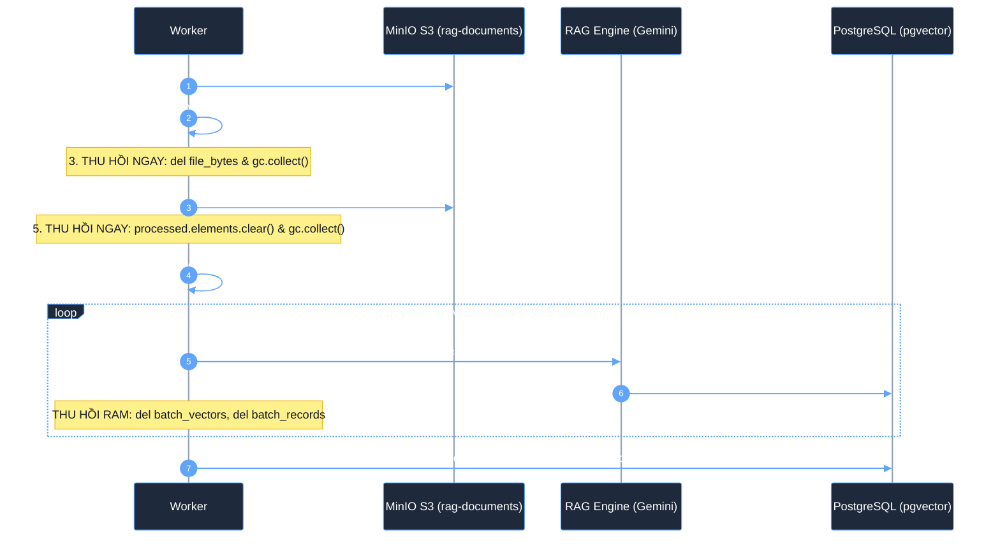
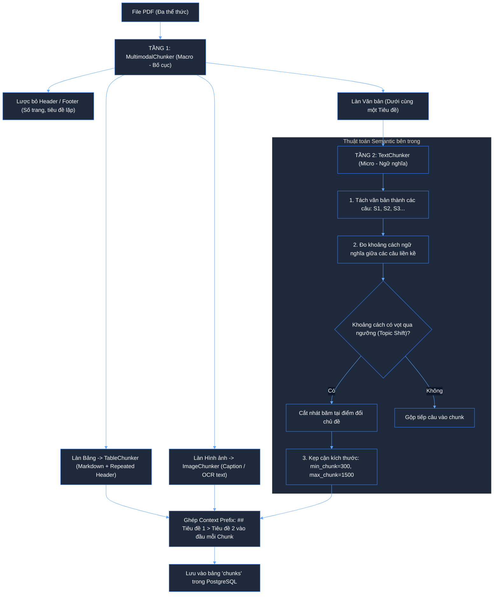

# KIẾN TRÚC CHUNKING LAI (HYBRID CHUNKING) VÀ TỐI ƯU HÓA BỘ NHỚ RAM

Tài liệu này quy chuẩn toàn bộ giải pháp **Băm nhỏ dữ liệu (Chunking)** trong hệ thống Monorepo RAG: kết hợp giữa **Mô hình Lai 2 tầng (Heading-Aware + Semantic)** và **Cơ chế chống Memory Leak (Zero-RAM-Bloat)** khi xử lý các tài liệu doanh nghiệp quy mô lớn.

---

## 1. Bối cảnh & Thách thức trong Chunking Enterprise

Trong các hệ thống RAG thực tế, việc băm tài liệu gặp 3 bài toán nan giải:

1. **Mất ngữ cảnh khi băm nhỏ (Context Loss)**: Nếu băm theo số ký tự cứng (Fixed-size / Naive), một câu nằm ở trang 5 sẽ bị tách rời khỏi tiêu đề chương ở trang 1, khiến AI bị ảo giác (hallucination).
2. **Xé nát bảng biểu và hình ảnh (Broken Multimodal Structure)**: Bảng biểu tài chính nhiều cột hoặc hình ảnh biểu đồ nếu bị cắt vụn như văn bản thường sẽ mất toàn bộ ý nghĩa dữ liệu.
3. **Tràn bộ nhớ RAM & Memory Leak (RAM Bloat / OOM Crash)**: Khi xử lý tài liệu 100–500 trang, việc giữ đồng thời: File PDF gốc + Hàng nghìn phần tử Layout + Hàng nghìn Chunk + Vector Embedding trong RAM sẽ làm Worker ngốn từ 2GB–4GB RAM, kích hoạt cơ chế `OOM Killer` của hệ điều hành.

---

## 2. Chiến Lược Chống Memory Leak (Zero-RAM-Bloat Pipeline)

Hệ thống loại bỏ hoàn toàn mô hình "Dồn tất cả dữ liệu vào RAM rồi mới xử lý". Thay vào đó, kiến trúc áp dụng quy trình **Lưu trữ trung gian (Staging to MinIO) + Thu hồi RAM chủ động + Micro-batching**:



### Điểm cốt lõi:
- **Lưu `{document_id}_layout.json` lên MinIO S3**:
  - Dữ liệu bóc tách được lưu thành tài sản số vĩnh viễn trên S3.
  - Giải phóng toàn bộ mảng `elements` khỏi RAM tiến trình Worker.
  - **Re-chunking siêu tốc**: Khi muốn đổi `chunk_size` hoặc đổi thuật toán băm, chỉ cần kéo file `layout.json` về cắt lại, **tiết kiệm 95% thời gian và 0% CPU Java OpenDataLoader**.
- **Micro-batching (50 chunks/lần)**:
  - Bảng `chunks` được ghi nhận theo từng đợt 50 phần tử. Bộ nhớ của Worker cho bước sinh vector luôn **cố định và phẳng ($\le 50$ chunks, $\approx 10\text{MB}$ RAM)** bất kể tài liệu có 10 trang hay 1.000 trang.

---

## 3. Kiến Trúc Mô Hình Lai 2 Tầng (Two-Tier Hybrid Chunking)

Mô hình lai kết hợp: **Heading-Aware ở tầng vĩ mô (Macro)** để bảo toàn cấu trúc phân cấp và **Semantic Chunking ở tầng vi mô (Micro)** để nhận diện ranh giới đổi chủ đề tự nhiên.



---

### 3.1. Tầng 1: Vĩ mô (Heading-Aware Orchestrator)
File mã nguồn: [`packages/rag-document-pipeline/src/rag_document_pipeline/chunking/multimodal.py`](file:///c:/Users/ndquynh/Documents/RAG/packages/rag-document-pipeline/src/rag_document_pipeline/chunking/multimodal.py)

- **Heading Stack Propagation (`_propagate_sections`)**:
  - Theo dõi cây tiêu đề cha con ($H_1 \rightarrow H_2 \rightarrow H_3$).
  - Tự động gán mảng `section_path` (ví dụ: `["Chương 1", "1.1 Phạm vi"]`) cho tất cả các đoạn văn, bảng biểu, hình ảnh bên dưới.
- **Phân làn chuyên biệt (Type Routing)**:
  - Không băm lẫn lộn: Bảng biểu giữ nguyên dạng bảng Markdown; Hình ảnh giữ nguyên chú thích caption.
- **Repeated Header cho Bảng biểu dài ([`table.py`](file:///c:/Users/ndquynh/Documents/RAG/packages/rag-document-pipeline/src/rag_document_pipeline/chunking/table.py))**:
  - Với các bảng dữ liệu vượt quá 1200 ký tự, khi cắt theo nhóm hàng, hệ thống **tự động lặp lại dòng tiêu đề cột** ở đầu mỗi chunk con để LLM không bị mất ý nghĩa cột.

---

### 3.2. Tầng 2: Vi mô (Semantic Text Chunker)
File mã nguồn: [`packages/rag-document-pipeline/src/rag_document_pipeline/chunking/semantic.py`](file:///c:/Users/ndquynh/Documents/RAG/packages/rag-document-pipeline/src/rag_document_pipeline/chunking/semantic.py)

Bên dưới một tiêu đề có thể có nhiều đoạn văn dài. Thay vì cắt cơ học theo độ dài ký tự cứng:

1. **Tách câu thông minh**:
   - Sử dụng regex nhận diện ranh giới câu tiếng Việt và tiếng Anh (`[.?!;…\n]`), bảo toàn các từ viết tắt (`Dr.`, `e.g.`, `v.v.`).
2. **Đo khoảng cách ngữ nghĩa (Semantic Distance)**:
   - **Chế độ 1 (Vector Cosine Distance)**: Nếu cấu hình `embed_fn`, thuật toán tính khoảng cách vector:
     $$\text{dist}(S_i, S_{i+1}) = 1.0 - \frac{E_i \cdot E_{i+1}}{\|E_i\| \|E_{i+1}\|}$$
   - **Chế độ 2 (Statistical Lexical Semantic - Mặc định Zero-Cost)**: Sử dụng khoảng cách biến động tập từ vựng Jaccard giữa các câu:
     $$\text{dist}(S_i, S_{i+1}) = 1.0 - \frac{|W_i \cap W_{i+1}|}{|W_i \cup W_{i+1}|}$$
     Chạy hoàn toàn trên CPU, siêu tốc ($< 1\text{ms}$) và **hoàn toàn không tốn tiền API**.
3. **Phát hiện điểm đổi chủ đề (Topic Shift Detection)**:
   - Tính ngưỡng nhạy cảm dựa trên bách phân vị (`threshold_percentile = 80.0%`).
   - Bất cứ vị trí nào khoảng cách ngữ nghĩa giữa 2 câu vượt ngưỡng $\rightarrow$ xác định là điểm đổi chủ đề $\rightarrow$ Cắt tạo chunk mới.
4. **Kẹp cận kích thước (Size Clamping - Chống vụn và chống tràn)**:
   - **Chống chunk vụn**: Nếu đoạn đổi chủ đề ngắn hơn `min_chunk_size = 300` ký tự, tự động gộp với câu phía trước.
   - **Chống chunk quá dài**: Nếu một chủ đề kéo dài liên miên, tự động ngắt theo `max_chunk_size = 1500` ký tự để không làm tràn cửa sổ ngữ cảnh của LLM.
5. **Gắn tiền tố ngữ cảnh (Context Prefix)**:
   - Đầu mỗi semantic chunk luôn có tiền tố:
     ```markdown
     ## CHƯƠNG 1: QUY ĐỊNH CHUNG > 1.2 Quyền hạn nhân sự

     [Nội dung văn bản được gom theo ngữ nghĩa...]
     ```

---

## 4. Cấu Trúc Dữ Liệu Lưu Trữ (PostgreSQL Schema)

Sau khi xử lý qua mô hình lai, dữ liệu được lưu vào bảng `chunks`:

```sql
CREATE TABLE IF NOT EXISTS chunks (
    id              TEXT PRIMARY KEY,
    document_id     TEXT NOT NULL REFERENCES documents(id) ON DELETE CASCADE,
    workspace_id    TEXT NOT NULL,
    content         TEXT NOT NULL,                       -- Chứa cả tiền tố ## Heading và nội dung
    embedding       vector(768),                         -- Vector đặc trưng từ Gemini
    kind            TEXT DEFAULT 'text',                 -- 'text', 'table', 'image'
    page_start      INTEGER DEFAULT 1,                   -- Trang bắt đầu
    page_end        INTEGER DEFAULT 1,                   -- Trang kết thúc
    bboxes          JSONB DEFAULT '[]'::jsonb,           -- Tọa độ tô vàng highlight trên UI
    section_path    JSONB DEFAULT '[]'::jsonb,           -- Cây thư mục tiêu đề ["Chương 1", "1.2"]
    token_count     INTEGER DEFAULT 0,                   -- Số lượng token
    indexable       BOOLEAN DEFAULT TRUE,
    metadata        JSONB DEFAULT '{"chunker": "semantic_hybrid"}'::jsonb
);
```

Đồng thời bảng `documents` lưu vị trí file cấu trúc bóc tách:
```json
{
  "layout_uri": "s3://rag-documents/workspaces/01a0db92.../01a0e655..._layout.json"
}
```

---

## 5. Hướng Dẫn Sử Dụng Trong Mã Nguồn

### 5.1. Khởi tạo trực tiếp Chunker Lai (Hybrid Semantic)
```python
from rag_document_pipeline.chunking.multimodal import MultimodalChunker

# Khởi tạo mô hình Lai: Heading-Aware + Semantic Text Chunker
chunker = MultimodalChunker.hybrid_semantic(
    min_chunk_size=300,        # Kích thước tối thiểu (tránh chunk 1 câu)
    max_chunk_size=1500,       # Kích thước tối đa (tránh chunk quá dài)
    threshold_percentile=80.0, # Độ nhạy phát hiện đổi chủ đề (80%)
)
```

### 5.2. Chạy với Pipeline toàn diện
```python
from rag_document_pipeline.pipeline import DocumentPipeline

pipeline = DocumentPipeline(
    chunker=MultimodalChunker.hybrid_semantic(),
)

# Chạy bóc tách, chuẩn hóa, và băm nhỏ
processed = pipeline.process(
    content=pdf_bytes,
    filename="hop-dong.pdf",
    document_id="01a0e655-7dfe-7e80-...",
)

print(f"Tổng số chunk sinh ra: {len(processed.chunks)}")
for chunk in processed.chunks:
    print(f"[{chunk.kind}] {chunk.section_path} -> {chunk.content[:60]}...")
```

---

## 6. Bảng So Sánh Hiệu Quả Thực Tế

| Tiêu chí | Cắt Cố Định (Fixed-size) | Heading-Aware Thường | Mô Hình Lai (Hybrid Semantic) |
| :--- | :---: | :---: | :---: |
| **Độ toàn vẹn của Bảng biểu** | ❌ Bị xé nát | ✅ Giữ nguyên Markdown | ✅ Giữ nguyên Markdown |
| **Bảo toàn ngữ cảnh Tiêu đề** | ❌ Mất hoàn toàn | ✅ Cây `section_path` | ✅ Cây `section_path` |
| **Độ thuần khiết chủ đề** | ❌ Trộn lẫn ý | 🟡 Tương đối | ⭐⭐⭐⭐⭐ Tuyệt đối |
| **Tiêu tốn bộ nhớ RAM** | ⚠️ Dễ OOM | ⚠️ Dễ OOM nếu file to | 🟢 **$O(1)$ Không lo Memory Leak** |
| **Chi phí API lúc băm** | 🟢 0đ | 🟢 0đ | 🟢 **0đ (Chế độ Lexical)** |

---

## 7. Tài Liệu Tham Chiếu & Phân Tích Chuyên Sâu

- [Phân tích Chuyên sâu: Hiện tượng Phân mảnh Ngữ cảnh trong Multimodal RAG](file:///c:/Users/ndquynh/Documents/RAG/docs/multimodal_context_fragmentation_analysis.md): So sánh chi tiết Anti-pattern tách rời phần tử (như trong `langchain_multimodal.ipynb`) với kiến trúc bảo toàn ngữ cảnh của hệ thống.
- [Chi tiết Luồng Chunking Pipeline](file:///c:/Users/ndquynh/Documents/RAG/docs/chunking_pipeline.md)

