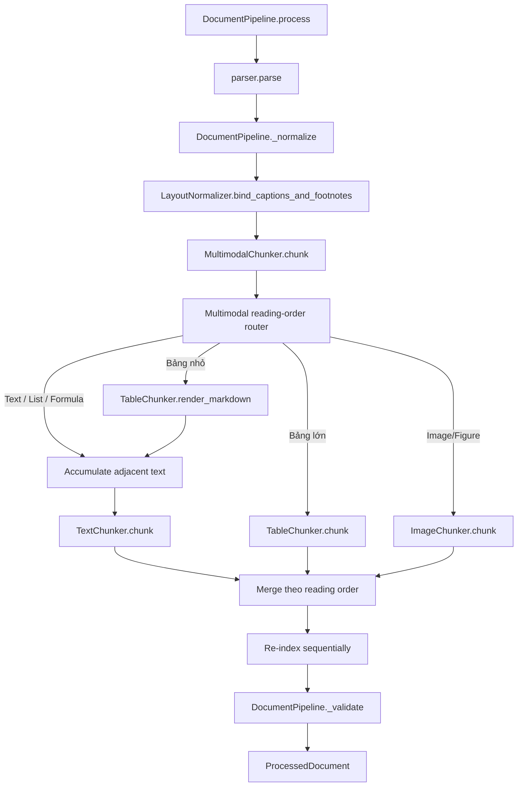
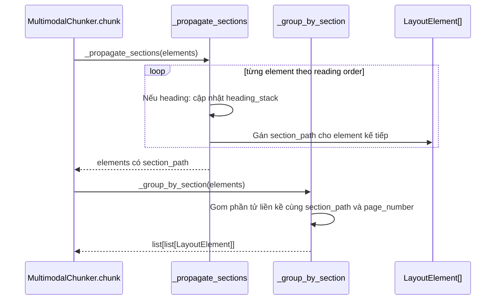
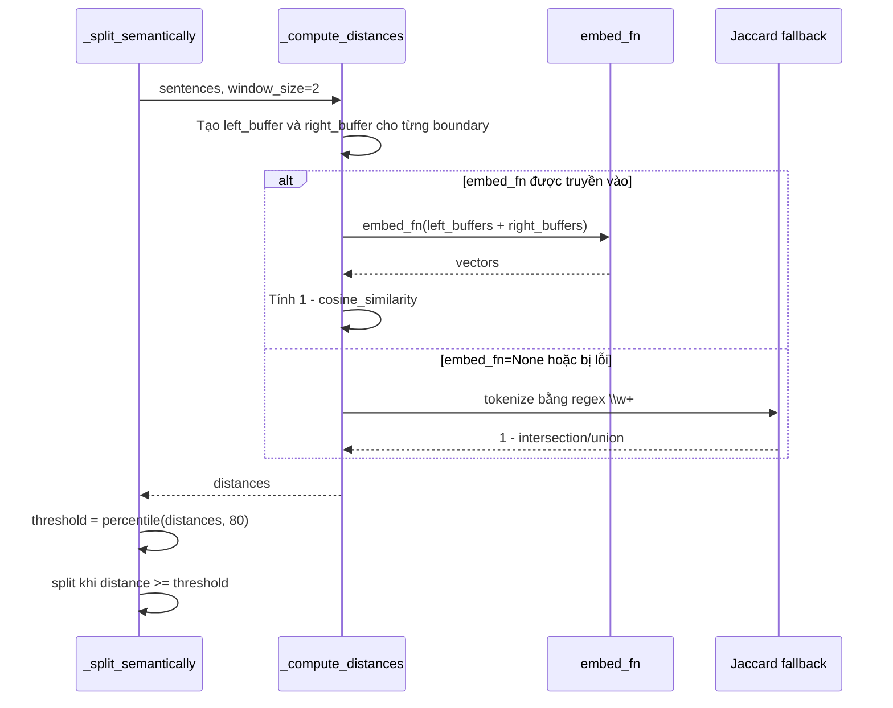
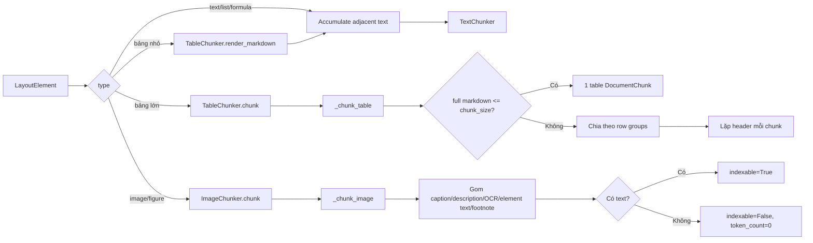

# Luồng Gọi Hàm Chunking

Sơ đồ này mô tả luồng gọi hàm thực tế của pipeline chunking trong `rag-document-pipeline`.

## Cấu trúc Package

```text
chunking/
├── __init__.py          # Public exports và compatibility aliases
├── base.py              # Protocol, estimate_tokens, group_by_section
├── section.py           # propagate_sections, group_by_section
├── multimodal.py        # MultimodalChunker router (MultimodalChunker alias)
├── text.py              # TextChunker (TextChunker alias)
├── table.py             # TableChunker
└── image.py             # ImageChunker
```

## 1. Luồng tổng thể



## 2. Luồng xử lý heading và nhóm section



### Quy tắc `heading_stack`

```text
H1: Chương 1
    section_path = [Chương 1]

H2: 1.1 Phạm vi
    section_path = [Chương 1, 1.1 Phạm vi]

paragraph
    section_path = [Chương 1, 1.1 Phạm vi]

H1: Chương 2
    section_path = [Chương 2]
```

## 3. Luồng semantic text chunking

```mermaid
flowchart TD
    A[TextChunker.chunk] --> B[_group_by_section]
    B --> C[Cho từng group]
    C --> D[_heading_prefix]
    C --> E[_group_text từng element]
    E -->|table có table_data| F[TableChunker.render_markdown]
    E -->|text/khác| G[el.text.strip]
    F --> H[Nối bằng blank line]
    G --> H
    H --> I[_split_semantically]

    I --> J[_split_sentences]
    J --> K[_collect_blocks tách bảng Markdown khỏi văn bản]
    K --> L{Block là bảng?}
    L -->|Có| M[Giữ nguyên atomic table block]
    L -->|Không| N[Mask decimal và viết tắt bằng U+E000]
    N --> O[Split theo . ? ! ; … và newline]
    O --> P[Unmask dấu chấm]
    M --> Q[list sentences]
    P --> Q

    Q --> R[_compute_distances window_size=2]
    R --> S{embed_fn?}
    S -->|Có| T[Batch embedding toàn bộ buffers]
    T --> U[Cosine distance]
    S -->|Không hoặc lỗi| V[Jaccard lexical distance]
    U --> W[list distances]
    V --> W

    W --> X[_calculate_threshold theo percentile]
    X --> Y[Tách khi distance >= threshold]
    Y --> Z[_enforce_bounds]
    Z --> AA{segment < min_chunk_size?}
    AA -->|Có và có segment trước| AB[_merge_segments nối vào chunk trước]
    AA -->|Không| AC[Giữ segment]
    AB --> AD
    AC --> AD{segment > max_chunk_size?}
    AD -->|Có| AE[_recursive_split theo \n\n, \n, . , ,]
    AD -->|Không| AF[Giữ segment]
    AE --> AG[list segments]
    AF --> AG

    AG --> AH[Gắn heading prefix]
    AH --> AI[DocumentChunk với modality=text]
    AI --> AJ[estimate_tokens]
```



## 4. Chi tiết semantic distance



## 5. Luồng bảng và hình ảnh



## 6. Thứ tự hàm chính

### Pipeline đầy đủ

```text
DocumentPipeline.process
├── parser.parse
├── DocumentPipeline._normalize
│   ├── _clean_text (từng element)
│   └── LayoutNormalizer.bind_captions_and_footnotes
├── MultimodalChunker.chunk
│   ├── _propagate_sections
│   └── Multimodal reading-order router
│       ├── _group_by_section
│       ├── TableChunker.is_small_table
│       ├── TableChunker.render_markdown (bảng nhỏ)
│       ├── TextChunker.chunk
│       │   ├── _heading_prefix
│       │   ├── _group_text
│       │   └── _split_semantically
│       │       ├── _split_sentences
│       │       ├── _compute_distances
│       │       ├── _calculate_threshold
│       │       ├── _join_sentences
│       │       └── _enforce_bounds
│       ├── TableChunker.chunk (bảng lớn)
│       │   └── _chunk_table
│       └── ImageChunker.chunk
│           └── _chunk_image
├── DocumentPipeline._validate
└── ProcessedDocument
```

## 7. Routing duy nhất

Hệ thống luôn dùng một router multimodal theo reading order:

| Modality | Cách xử lý |
|---|---|
| Text/list/formula | Gom các element liền kề và semantic chunking |
| Bảng nhỏ | Render Markdown và inline vào text batch liền kề |
| Bảng lớn | Chunk độc lập theo nhóm hàng, lặp header |
| Image/figure | Chunk độc lập từ caption/OCR/description/footnote |
| Header/footer | Bỏ qua |

Không còn tham số `multimodal_routing`: router multimodal là luồng duy nhất. Cấu hình chỉ gồm `chunk_size`, `min_chunk_size`, `max_chunk_size`, `threshold_percentile` và `embed_fn`.

## 8. Các hàm tiện ích

- `group_by_section()` — gom phần tử liền kề cùng `section_path` và `page_number`.
- `estimate_tokens()` — ước lượng token bằng `len(text) // 4`.
- `TableChunker.render_markdown()` — render bảng thành Markdown để inline hoặc xuất trực tiếp.
- `TableChunker.is_small_table()` — quyết định bảng có được inline hay không.
