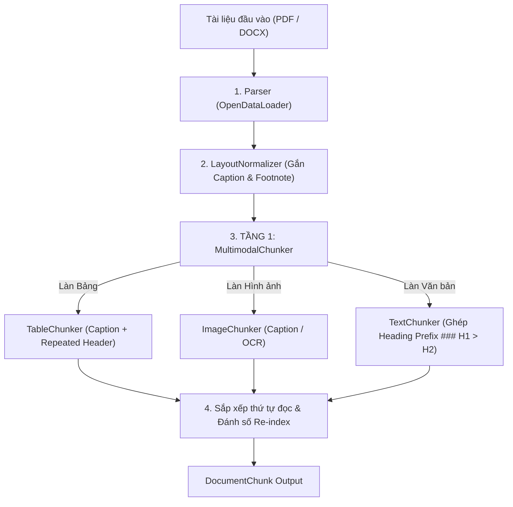

# KIẾN TRÚC VÀ TRIỂN KHAI CHUNKING TRONG HỆ THỐNG RAG

Tài liệu này tổng hợp chi tiết toàn bộ cơ chế, cấu trúc dữ liệu và logic triển khai của hệ thống **Băm nhỏ tài liệu (Document Chunking)** trong gói [`rag-document-pipeline`](../packages/rag-document-pipeline).

---

## 1. Tổng Quan Kiến Trúc Mô Hình Lai (Two-Tier Hybrid Chunking)

Hệ thống áp dụng kiến trúc **Mô hình Lai 2 tầng**:
- **Tầng 1 (Macro - Vĩ mô / Cấu trúc)**: Quản lý cấu trúc phân cấp tài liệu theo tiêu đề chương mục, điều phối các luồng dữ liệu đa thể thức.
- **Tầng 2 (Micro - Vi mô / Ngữ nghĩa)**: Áp dụng thuật toán chuyên sâu cho từng loại dữ liệu (Văn bản phân đoạn theo chủ đề, Bảng biểu bảo toàn hàng cột, Hình ảnh kèm mô tả trực quan).



---

## 2. Tầng 1: Điều Phối Vĩ Mô (`MultimodalChunker`)

`MultimodalChunker` đóng vai trò là nhạc trưởng (Orchestrator) phân loại và xử lý các phần tử tài liệu (`LayoutElement`):

### 2.1. Cây ngữ cảnh tiêu đề (`_propagate_sections`)
- Duyệt qua danh sách phần tử và duy trì một ngăn xếp tiêu đề (`heading_stack`).
- Khi gặp tiêu đề cấp mới ($H_1, H_2, H_3$), cập nhật ngăn xếp theo cấp độ phân cấp.
- Gán mảng `section_path` (ví dụ: `["CHƯƠNG I: QUY ĐỊNH CHUNG", "Điều 2. Đối tượng áp dụng"]`) cho toàn bộ các phần tử đoạn văn bản, bảng biểu, hình ảnh xuất hiện phía dưới.

### 2.2. Gom nhóm theo khu vực (`_group_by_section`)
- Gom các phần tử liền kề có cùng `section_path` và cùng số trang (`page_number`) vào chung một nhóm ngữ cảnh trước khi băm.

### 2.3. Phân luồng dữ liệu đa thể thức
- **Loại bỏ (Skip)**: Các phần tử `header`, `footer` (số trang, tiêu đề lặp lại đầu/chân trang) bị loại bỏ để không gây nhiễu ngữ cảnh.
- **Bảng nhỏ giữ Inline**: Bảng có kích thước nhỏ ($\le \frac{\text{chunk\_size}}{2}$ và $\le 8$ dòng) được chuyển thành Markdown và gộp inline cùng đoạn văn bản mô tả xung quanh trong `TextChunker`.
- **Bảng lớn & Hình ảnh**: Chuyển giao độc lập cho `TableChunker` và `ImageChunker`.

### 2.4. Tái lập chỉ mục & Sắp xếp thứ tự đọc
- Toàn bộ chunks từ 3 làn (Text, Table, Image) được merge và sắp xếp lại theo thứ tự đọc tự nhiên (`page_start`, `page_end`), sau đó đánh số lại thuộc tính `index`.

> [!NOTE]
> **Ghép tiền tố ngữ cảnh (Context Prefix)** không phải do `MultimodalChunker` thực hiện, mà do `TextChunker._heading_prefix()` tự động gắn vào đầu mỗi text chunk:
> ```markdown
> ### CHƯƠNG I: QUY ĐỊNH CHUNG > Điều 2. Đối tượng áp dụng
>
> [Nội dung chi tiết của chunk...]
> ```
> Riêng `TableChunker` sử dụng `caption_prefix` (lấy từ `table_data.caption`) và `ImageChunker` sử dụng tag `[IMAGE]` — không dùng heading prefix.

---

## 3. Tầng 2: Các Bộ Chunker Chuyên Biệt (Micro Chunkers)

### 3.1. Chunker Văn bản Ngữ Nghĩa (`TextChunker`)

Khác với các phương pháp băm cứng theo số ký tự (Naive Fixed-size Chunking), `TextChunker` tìm điểm ngắt tự nhiên theo **sự chuyển dịch chủ đề (Topic Shifts)**:

#### Bước 1: Tách câu tiếng Việt chuẩn hóa (`_split_sentences`)
- **Bảo toàn bảng Markdown**: Nhận diện các dòng bắt đầu và kết thúc bằng `|`, cô lập thành các khối nguyên tử (atomic block), không bị băm vụn thành từng dòng câu.
- **Mã hóa ký tự đặc biệt (Masking với `\uE000`)**:
  - Dấu chấm số thập phân và phân cách hàng nghìn (`1.5`, `1.500.000`).
  - Viết tắt chức danh, học vị: `ThS.`, `TS.`, `GS.`, `PGS.`, `BS.`, `DS.`, `KTS.`, `đ/c`...
  - Viết tắt hành chính, văn bản pháp luật: `TP.`, `đ/v.`, `v.v.`, `NĐ-CP.`, `QĐ.`, `TT.`...
  - Viết tắt tiếng Anh: `e.g.`, `i.e.`, `etc.`, `Mr.`, `Mrs.`, `Dr.`...
- **Tách câu**: Cắt ranh giới theo biểu thức chính quy `[.?!;…\n]`, sau đó khôi phục lại các dấu chấm đã mask.

#### Bước 2: Đo khoảng cách ngữ nghĩa qua Cửa sổ trượt (`Sliding Window Buffer`)
Thay vì so sánh trực tiếp hai câu đơn lẻ $S_i$ và $S_{i+1}$ (dễ bị nhiễu do các từ nối ngắn như *"Do đó:"*, *"Theo đó:"*), thuật toán xây dựng:
- **Left Buffer**: Gom $W$ câu kết thúc tại vị trí $i$ (mặc định $W = 2$).
- **Right Buffer**: Gom $W$ câu bắt đầu tại vị trí $i + 1$.

Hệ thống hỗ trợ 2 chế độ đo khoảng cách:
1. **Vector Cosine Distance** (khi truyền `embed_fn`):
   $$\text{Dist}(L, R) = 1.0 - \frac{\vec{E}_L \cdot \vec{E}_R}{\|\vec{E}_L\| \|\vec{E}_R\|}$$
2. **Lexical Jaccard Overlap Fallback** (Zero-cost chạy offline):
   $$\text{Dist}(L, R) = 1.0 - \frac{|W_L \cap W_R|}{|W_L \cup W_R|}$$
   Hoạt động cực nhanh ($< 1\text{ms}$), không tiêu tốn quota hay chi phí API.

#### Bước 3: Xác định ngưỡng cắt đổi chủ đề (`_calculate_threshold`)
- Ngưỡng khoảng cách được tính theo bách phân vị: `threshold_percentile = 80.0%`.
- Khi $\text{Dist} \ge \text{threshold}$, điểm ngắt được xác lập để chia ranh giới chunk mới.

#### Bước 4: Kẹp cận kích thước (`_enforce_bounds`)
- **Gộp phần nhỏ (< min_chunk_size = 300 ký tự)**: Lũy tiến ghép các cụm câu liền kề nếu chưa đạt độ dài tối thiểu, tránh sinh ra các vector rời rạc gây loãng kết quả tìm kiếm.
- **Cắt phần dài (> max_chunk_size = 1500 ký tự)**: Nếu một chủ đề kéo dài liên tục, áp dụng `RecursiveCharacterTextSplitter` đệ quy theo các mức dấu phân đoạn (`\n\n`, `\n`, `. `, `, `) để không vượt quá context window của LLM.

---

### 3.2. Chunker Bảng Biểu (`TableChunker`)

Bảng biểu trong tài liệu kỹ thuật/tài chính chứa nhiều thông tin có cấu trúc. `TableChunker` đảm bảo không làm mất thông tin cột:
- **Định dạng Markdown**: Chuyển đổi dữ liệu bảng sang Markdown dạng:
  ```markdown
  ### Bảng 1: Kết quả kinh doanh năm 2025

  | Chỉ tiêu | Quý 1 | Quý 2 | Quý 3 | Quý 4 |
  | --- | --- | --- | --- | --- |
  | Doanh thu | 100 | 120 | 150 | 180 |

  _Ghi chú: Đơn vị tính tỷ VNĐ_
  ```
- **Bảng nhỏ ($\le 1200$ ký tự)**: Giữ nguyên trong 1 chunk hoàn chỉnh.
- **Bảng lớn (> 1200 ký tự)**:
  - Cắt nhỏ theo nhóm dòng (row groups).
  - **Lặp lại dòng Header (Repeated Headers)**: Tự động chèn lại các dòng tiêu đề cột vào đầu mỗi chunk con, kèm cờ `has_repeated_header = True` trong metadata, giúp LLM hiểu chính xác ý nghĩa dữ liệu của từng hàng khi truy xuất đơn lẻ.

---

### 3.3. Chunker Hình Ảnh & Sơ Đồ (`ImageChunker`)

- Tổng hợp thông tin từ `caption`, `description`, `ocr_text`, `footnote`.
- Nội dung chunk:
  ```text
  [IMAGE]
  Sơ đồ kiến trúc luồng xử lý RAG
  Hệ thống xử lý qua 3 bước: Ingestion, Retrieval, Generation
  Note: Dữ liệu đo đạc tại phòng thử nghiệm tháng 01/2026
  ```
- **Bảo vệ không gian Vector (`indexable`)**:
  - Nếu hình ảnh có chú thích / OCR / mô tả: Đánh dấu `indexable = True` và tiến hành embedding.
  - Nếu hình ảnh không có văn bản: Giữ lại bản ghi metadata với `indexable = False` để tránh nhúng chuỗi rỗng gây nhiễu vector search.

---

## 4. Chuẩn Hóa Bố Cục Trước Khi Băm (`LayoutNormalizer`)

Để tránh việc các dòng chú thích hoặc ghi chú chân trang bị tách thành các chunk "mồ côi" (orphan chunks), `LayoutNormalizer` thực hiện gắn kết trước khi băm:
- Nhận diện `caption` (bắt đầu bằng *Bảng, Table, Hình, Figure...*) ở dòng ngay trước hoặc ngay sau Bảng/Ảnh và tích hợp vào thuộc tính `caption`.
- Nhận diện `footnote` (bắt đầu bằng *Ghi chú, Note, (\*)...*) và đưa vào `metadata["footnote"]`.
- Loại bỏ các phần tử mồ côi đã được hấp thụ khỏi danh sách layout chính.

---

## 5. Chiến Lược Tối Ưu Bộ Nhớ (Zero-RAM-Bloat)

Theo tiêu chuẩn kiến trúc tại [`docs/chunking_architecture.md`](./chunking_architecture.md):
1. **Lưu trữ trung gian Layout (Staging to MinIO/S3)**:
   - File kết quả bóc tách `{document_id}_layout.json` được lưu lên S3.
   - Thu hồi ngay bộ nhớ: `elements.clear()` & `gc.collect()`.
   - **Re-chunking siêu tốc**: Khi cần điều chỉnh `chunk_size` hoặc thuật toán băm, chỉ cần tải lại `layout.json` từ S3 để cắt lại, không cần chạy lại bộ parser Java nặng nề.
2. **Micro-batching Embedding (50 chunks/lần)**:
   - Gửi theo lô nhỏ sang mô hình Embedding và `UPSERT` vào bảng `chunks` trong PostgreSQL.
   - Bộ nhớ RAM cho worker luôn giữ mức cố định phẳng ($\le 50\text{ chunks} \approx 10\text{MB}$ RAM), chống tràn bộ nhớ (OOM) với tài liệu hàng trăm trang.

---

## 6. Danh Mục Tệp Mã Nguồn Liên Quan

| Tệp mã nguồn | Vai trò chính |
| :--- | :--- |
| `packages/rag-document-pipeline/src/rag_document_pipeline/chunking/base.py` | Định nghĩa `Chunker` Protocol, hàm tính `estimate_tokens`, `group_by_section`. |
| `packages/rag-document-pipeline/src/rag_document_pipeline/chunking/section.py` | Truyền ngữ cảnh heading, gom nhóm theo section. |
| `packages/rag-document-pipeline/src/rag_document_pipeline/chunking/multimodal.py` | Router multimodal (`MultimodalChunker`), định tuyến theo modality. |
| `packages/rag-document-pipeline/src/rag_document_pipeline/chunking/text.py` | Tách câu tiếng Việt, Sliding Window Buffer, tính Topic Shift, kẹp cận kích thước. |
| `packages/rag-document-pipeline/src/rag_document_pipeline/chunking/table.py` | Chuyển đổi Markdown bảng, cắt theo nhóm dòng và lặp lại tiêu đề cột. |
| `packages/rag-document-pipeline/src/rag_document_pipeline/chunking/image.py` | Tạo chunk hình ảnh từ caption/OCR/description, kiểm soát cờ `indexable`. |
| `packages/rag-document-pipeline/src/rag_document_pipeline/normalizers/layout.py` | Gắn kết Caption và Footnote vào Bảng/Ảnh trước khi phân luồng. |
| `packages/rag-document-pipeline/src/rag_document_pipeline/pipeline.py` | Lớp tích hợp hoàn chỉnh: Parse $\to$ Normalize $\to$ Chunk $\to$ Validate. |
