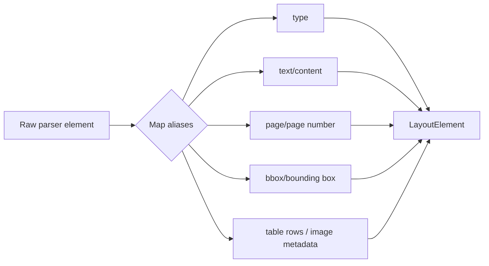
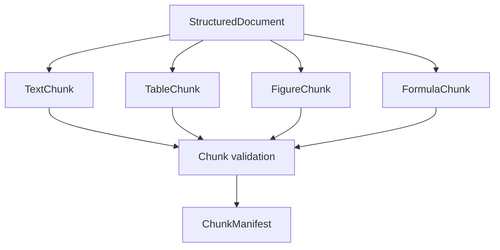

# Chunking Pipeline: Luồng xử lý và cấu trúc kết quả

Tài liệu này mô tả riêng luồng **parse → normalize → structure → chunk → validate → index** cho tài liệu PDF có text, bảng, hình ảnh và layout không đồng nhất.

> Phạm vi: `packages/rag-document-pipeline`. Pipeline không phụ thuộc FastAPI, PostgreSQL, pgvector hay nghiệp vụ phiên chat.

---

## 1. Sơ đồ tổng thể

```mermaid
flowchart TD
    A[PDF bytes<br/>filename + document_id] --> B[Validate input]
    B -->|valid| C[OpenDataLoader parser]
    B -->|invalid| X[Rejected<br/>InputValidationError]
    C --> D[Raw JSON<br/>elements + page + bbox]
    D --> E[Normalize schema]
    E --> F[LayoutElement[]]
    F --> G[Reading order]
    G --> H[Section tree<br/>section_path]
    H --> I{Element type}
    I -->|heading| J[Propagate heading context]
    I -->|paragraph/list| K[Text chunker]
    I -->|table| L[Table chunker<br/>preserve header]
    I -->|figure/image| M[Figure chunker<br/>caption/description]
    I -->|formula| N[Formula chunker<br/>LaTeX + context]
    J --> O[DocumentChunk[]]
    K --> O
    L --> O
    M --> O
    N --> O
    O --> P[Validate chunks]
    P -->|errors| Q[Failed<br/>not ready]
    P -->|passed| R[ChunkManifest]
    R --> S[RAG Core]
    S --> T[Embedding + vector/sparse index]
```

### Sơ đồ chuẩn hóa element



### Sơ đồ phân loại chunk



## 2. Nguyên tắc đầu ra

Mỗi bước tạo ra một cấu trúc riêng, không ghi đè dữ liệu của bước trước:

```text
InputFile
  → ParsedRawDocument
  → LayoutElement[]
  → StructuredDocument
  → DocumentChunk[]
  → ChunkManifest
```

Các trường nguồn phải được giữ xuyên suốt:

- `document_id`
- `element_id` / `element_ids`
- `page_number` hoặc `page_start/page_end`
- `bbox` / `bboxes`
- `section_path`
- `order`
- `parser_version`
- `chunker_version`

---

## 3. Bước 0 — Input và validate

### Input

```python
InputFile(
    content: bytes,
    filename: str,
    document_id: str,
    content_hash: str,
)
```

### Kiểm tra

- File không rỗng.
- Extension được hỗ trợ (`.pdf`).
- Kích thước không vượt giới hạn.
- `document_id` hợp lệ.
- Tính `content_hash` để chống xử lý trùng.

### Kết quả

```json
{
  "document_id": "doc_123",
  "filename": "hop-dong.pdf",
  "mime_type": "application/pdf",
  "content_hash": "sha256:abc...",
  "size_bytes": 2456789,
  "status": "validated"
}
```

Nếu validate lỗi, pipeline dừng tại đây và tạo lỗi `InputValidationError`.

---

## 4. Bước 1 — Parse bằng OpenDataLoader

OpenDataLoader nhận file PDF và xuất JSON. Parser adapter không trả trực tiếp ORM/database model mà chuyển kết quả về contract của document pipeline.

```text
PDF bytes
  → temporary PDF file
  → OpenDataLoader local converter
  → JSON elements
```

### Raw output minh họa

Schema thực tế có thể khác theo phiên bản OpenDataLoader; adapter cần map các alias như `content/text`, `bbox/bounding box`, `page/page number`.

```json
{
  "metadata": {
    "filename": "hop-dong.pdf",
    "page_count": 5,
    "parser": "opendataloader",
    "parser_version": "2.x"
  },
  "elements": [
    {
      "id": "el-001",
      "type": "heading",
      "content": "1. Phạm vi áp dụng",
      "page number": 1,
      "bounding box": [72.0, 730.0, 510.0, 755.0]
    },
    {
      "id": "el-002",
      "type": "paragraph",
      "content": "Nội dung điều khoản...",
      "page number": 1,
      "bounding box": [72.0, 680.0, 510.0, 720.0]
    },
    {
      "id": "el-003",
      "type": "table",
      "content": "...",
      "page number": 2,
      "bounding box": [72.0, 300.0, 520.0, 600.0],
      "rows": [["Tên", "Giá trị"], ["A", "100"]]
    }
  ]
}
```

### Kết quả chuẩn hóa cấp parser

```python
ParsedRawDocument(
    document_id="doc_123",
    filename="hop-dong.pdf",
    page_count=5,
    raw_elements=[RawElement(...)],
    metadata={
        "parser": "opendataloader",
        "parser_version": "2.x",
    },
)
```

---

## 5. Bước 2 — Normalize element

Mục tiêu là biến nhiều schema parser khác nhau thành một schema nội bộ duy nhất.

### Kết quả: `LayoutElement`

```json
{
  "id": "el-003",
  "type": "table",
  "text": "",
  "page_number": 2,
  "bbox": [72.0, 300.0, 520.0, 600.0],
  "order": 8,
  "heading_level": null,
  "section_path": ["2. Điều khoản thanh toán"],
  "table": {
    "headers": ["Tên", "Giá trị"],
    "rows": [["A", "100"]]
  },
  "image": null,
  "metadata": {
    "source": "opendataloader",
    "coordinate_system": "pdf_bottom_left",
    "raw_type": "table"
  }
}
```

### Các loại element chuẩn

```text
heading   — tiêu đề và cấp heading
paragraph — đoạn văn
list      — danh sách, giữ item/order
 table    — bảng và dữ liệu hàng/cột
figure    — hình ảnh, biểu đồ
caption   — chú thích hình/bảng
formula   — công thức
header    — đầu trang, thường loại khỏi chunk chính
footer    — chân trang, thường loại khỏi chunk chính
```

### Quy tắc normalize

- Chuẩn hóa Unicode NFC.
- Giữ nguyên tiếng Việt có dấu.
- Loại control character không cần thiết.
- Chuẩn hóa khoảng trắng nhưng không phá cấu trúc bảng.
- Gắn `page_number` và `bbox` cho mọi element có thể truy nguyên.
- Không gộp hai element nếu khác trang hoặc khác vùng layout một cách bất hợp lý.

---

## 6. Bước 3 — Reading order và section tree

Element từ parser cần được sắp xếp theo thứ tự đọc, không chỉ theo thứ tự xuất hiện trong JSON.

### Input

```text
LayoutElement[] chưa có section context
```

### Xử lý

1. Gom theo `page_number`.
2. Sắp xếp theo reading order của parser.
3. Fallback theo `(page_number, bbox.top, bbox.left)`.
4. Nhận diện heading level.
5. Duy trì stack heading để tạo `section_path`.
6. Loại hoặc đánh dấu header/footer lặp lại.

### Kết quả: `StructuredDocument`

```json
{
  "document_id": "doc_123",
  "filename": "hop-dong.pdf",
  "page_count": 5,
  "elements": [
    {
      "id": "el-001",
      "type": "heading",
      "text": "1. Phạm vi áp dụng",
      "page_number": 1,
      "bbox": [72, 730, 510, 755],
      "order": 0,
      "heading_level": 1,
      "section_path": ["1. Phạm vi áp dụng"]
    },
    {
      "id": "el-002",
      "type": "paragraph",
      "text": "Nội dung điều khoản...",
      "page_number": 1,
      "bbox": [72, 680, 510, 720],
      "order": 1,
      "section_path": ["1. Phạm vi áp dụng"]
    }
  ],
  "metadata": {
    "reading_order": "opendataloader_xy_cut_or_fallback",
    "parser_version": "2.x"
  }
}
```

---

## 7. Bước 4 — Context propagation

Heading không nhất thiết trở thành chunk độc lập. Heading được đưa vào metadata và thường thêm vào đầu nội dung chunk để chunk giữ ngữ cảnh khi được truy hồi riêng lẻ.

### Trước

```text
Heading: 2. Điều khoản thanh toán
Paragraph: Bên A phải thanh toán trong vòng 30 ngày.
```

### Sau

```json
{
  "content": "## 2. Điều khoản thanh toán\nBên A phải thanh toán trong vòng 30 ngày.",
  "section_path": ["2. Điều khoản thanh toán"],
  "element_ids": ["el-010", "el-011"]
}
```

Không đưa header/footer lặp lại vào nội dung chunk trừ khi chúng có giá trị nghiệp vụ.

---

## 8. Bước 5 — Chunking theo loại element

Không dùng một chiến lược cắt cho mọi loại nội dung.

### 8.1 Text chunker

Áp dụng cho `paragraph`, `list` và nhóm element text liền kề trong cùng section.

```text
Paragraphs cùng section
  → gom theo token/character limit
  → cắt tại separator tự nhiên
  → overlap có kiểm soát
```

Kết quả:

```json
{
  "id": "chunk-001",
  "kind": "text",
  "content": "## 1. Phạm vi áp dụng\nNội dung điều khoản...",
  "index": 0,
  "page_start": 1,
  "page_end": 1,
  "element_ids": ["el-001", "el-002"],
  "bboxes": [[72, 730, 510, 755], [72, 680, 510, 720]],
  "section_path": ["1. Phạm vi áp dụng"],
  "token_count": 18
}
```

### 8.2 Table chunker

Bảng nhỏ được giữ nguyên. Bảng lớn chia theo nhóm hàng nhưng lặp lại header trong mỗi chunk.

```text
Table
  ├── caption/title
  ├── header
  ├── rows 1..N
  └── footer/source
```

Kết quả:

```json
{
  "id": "chunk-002",
  "kind": "table",
  "content": "### Bảng giá\n| Tên | Giá trị |\n| --- | --- |\n| A | 100 |",
  "table": {
    "headers": ["Tên", "Giá trị"],
    "rows": [["A", "100"]],
    "row_start": 0,
    "row_end": 1,
    "has_repeated_header": true
  },
  "page_start": 2,
  "page_end": 2,
  "element_ids": ["el-003"],
  "bboxes": [[72, 300, 520, 600]]
}
```

Không cắt giữa nội dung một cell. Nếu bảng không map được thành rows/columns, giữ nguyên raw table text và đánh dấu:

```json
{"table_parse_status": "fallback_text"}
```

### 8.3 Figure/image chunker

Ảnh không có text vẫn phải tạo chunk nếu có `caption`, `alt_text` hoặc `image_description`.

```json
{
  "id": "chunk-003",
  "kind": "figure",
  "content": "### Hình 1. Quy trình xử lý hồ sơ\nMô tả: Sơ đồ gồm bốn bước...",
  "caption": "Hình 1. Quy trình xử lý hồ sơ",
  "image_description": "Sơ đồ gồm bốn bước...",
  "page_start": 3,
  "page_end": 3,
  "element_ids": ["el-021", "el-022"],
  "bboxes": [[72, 250, 520, 650]],
  "metadata": {
    "image_available": true,
    "image_uri": "objects/doc_123/page-3/image-1.png"
  }
}
```

Nếu ảnh không có mô tả, tạo metadata element để hiển thị nhưng không embedding nội dung rỗng:

```json
{
  "kind": "figure",
  "indexable": false,
  "index_reason": "no_caption_or_description"
}
```

### 8.4 Formula chunker

Công thức giữ cả biểu diễn LaTeX và text xung quanh:

```json
{
  "kind": "formula",
  "content": "Công thức tính tổng: \\sum_{i=1}^{n} x_i",
  "latex": "\\sum_{i=1}^{n} x_i",
  "element_ids": ["el-030"]
}
```

---

## 9. Bước 6 — DocumentChunk contract

Tất cả loại chunk cùng tuân theo một contract:

```python
class DocumentChunk:
    id: str
    document_id: str
    content: str
    kind: str
    index: int
    page_start: int
    page_end: int
    element_ids: list[str]
    bboxes: list[tuple[float, float, float, float]]
    section_path: list[str]
    token_count: int
    indexable: bool
    metadata: dict
```

### Ví dụ hoàn chỉnh

```json
{
  "id": "chunk-002",
  "document_id": "doc_123",
  "content": "### Bảng giá\n| Tên | Giá trị |\n| --- | --- |\n| A | 100 |",
  "kind": "table",
  "index": 1,
  "page_start": 2,
  "page_end": 2,
  "element_ids": ["el-003"],
  "bboxes": [[72.0, 300.0, 520.0, 600.0]],
  "section_path": ["2. Điều khoản thanh toán"],
  "token_count": 22,
  "indexable": true,
  "metadata": {
    "parser": "opendataloader",
    "parser_version": "2.x",
    "chunker": "structure_aware",
    "chunker_version": "0.1.0",
    "coordinate_system": "pdf_bottom_left",
    "table_parse_status": "structured"
  }
}
```

---

## 10. Bước 7 — Validate chunk

Trước khi chuyển sang RAG Core, kiểm tra:

- `content` không rỗng nếu `indexable=true`.
- `document_id` không đổi.
- `id` duy nhất trong một lần xử lý.
- `index` liên tục và ổn định.
- `page_start <= page_end`.
- `page_number` nằm trong `page_count`.
- `element_ids` tồn tại trong `StructuredDocument`.
- Bbox có 4 số và nằm trong page bounds nếu parser cung cấp kích thước trang.
- Chunk table không mất header khi chia bảng.
- Không có duplicate header/footer hàng loạt.
- Không vượt `max_tokens` sau khi thêm section context.

### Kết quả

```json
{
  "validation": {
    "status": "passed",
    "chunk_count": 42,
    "indexable_count": 39,
    "non_indexable_count": 3,
    "warnings": [
      "chunk-003 has image metadata but no description"
    ],
    "errors": []
  }
}
```

Nếu có lỗi nghiêm trọng, pipeline không đánh dấu tài liệu là `ready`.

---

## 11. Bước 8 — ChunkManifest bàn giao cho RAG Core

Document pipeline chỉ bàn giao chunk và metadata; RAG Core mới thực hiện embedding và vector indexing.

```json
{
  "document_id": "doc_123",
  "status": "chunked",
  "page_count": 5,
  "parser": {
    "name": "opendataloader",
    "version": "2.x"
  },
  "chunker": {
    "name": "structure_aware",
    "version": "0.1.0",
    "chunk_size": 800,
    "chunk_overlap": 100
  },
  "chunks": [
    {
      "id": "chunk-001",
      "kind": "text",
      "content": "...",
      "page_start": 1,
      "page_end": 1,
      "element_ids": ["el-001", "el-002"],
      "bboxes": [[72, 730, 510, 755], [72, 680, 510, 720]],
      "indexable": true
    }
  ]
}
```

RAG Core nhận manifest và thực hiện:

```text
indexable chunks
  → embedding
  → vector store / sparse index
  → indexed
```

---

## 12. Xử lý PDF có nhiều loại layout

| Trường hợp | Cách xử lý | Kết quả |
|---|---|---|
| Text một cột | Gom theo section và giới hạn token | `kind=text` |
| Text hai cột | Dùng reading order parser, fallback theo bbox | Text đúng thứ tự đọc |
| Bảng có đường viền | Map rows/columns | `kind=table`, structured |
| Bảng không đường viền | Hybrid/parser AI hoặc fallback text | `table_parse_status` |
| Hình có caption | Ghép caption + description | `kind=figure`, indexable |
| Hình không caption | Giữ element/bbox, không embed rỗng | `indexable=false` |
| PDF scan | OCR/hybrid trước normalize | Text có page/bbox |
| Header/footer lặp | Nhận diện tần suất/vị trí | Loại khỏi chunk chính |
| Section đổi giữa các trang | Dựa vào heading stack | `section_path` chính xác |
| Bảng lớn nhiều trang | Chia theo rows, lặp header | Nhiều `kind=table` liên tục |

---

## 13. Idempotency và versioning

Một lần chunking phải tái lập được với cùng input và cấu hình:

```text
chunking_key = hash(
    content_hash,
    parser_name,
    parser_version,
    chunker_name,
    chunker_version,
    chunk_options,
)
```

Lưu version trong từng manifest:

```json
{
  "content_hash": "sha256:abc...",
  "parser_version": "2.x",
  "chunker_version": "0.1.0",
  "chunk_options": {
    "max_tokens": 800,
    "overlap_tokens": 100
  }
}
```

Khi thay parser hoặc chunker, tạo manifest/index version mới thay vì sửa âm thầm index cũ.

---

## 14. Ranh giới trách nhiệm

```text
rag-document-pipeline
  Input validation
  Parse / OCR / layout
  Normalize
  Reading order
  Structure tree
  Chunking
  Citation metadata
  Chunk validation

rag-core
  Embedding
  Dense/sparse/hybrid retrieval
  Reranking
  Prompt context
  LLM generation
  Citation ranking

chat-api
  User/session/message
  Permission
  Upload metadata
  Document lifecycle
```

Kết quả cuối của chunking là `ChunkManifest`, không phải câu trả lời LLM và không phải bản ghi database nghiệp vụ.
