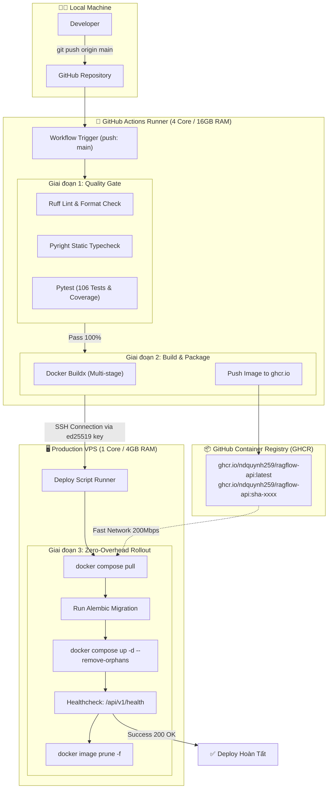

# Tài Liệu Kiến Trúc Triển Khai CI/CD & Production Deployment

> **Hệ Thống**: RAG Chat API & Background Worker Monorepo  
> **Môi Trường Target**: Production VPS (AMD EPYC 7763 1 vCPU, 4GB RAM, 30GB NVMe)  
> **Nền Tảng CI/CD**: GitHub Actions & GitHub Container Registry (GHCR)  
> **Phiên Bản**: 1.0.0

---

## 1. Tổng Quan & Triết Lý Thiết Kế

### 1.1. Mục Tiêu
1. **Tự động hóa 100%**: Từ lúc lập trình viên gõ `git push origin main` đến khi code chạy thành công trên VPS production mà không cần SSH thủ công.
2. **Quality Gate nghiêm ngặt**: Chỉ triển khai code khi đã vượt qua toàn bộ 106 tests, kiểm tra kiểu dữ liệu (Pyright) và chuẩn mã nguồn (Ruff).
3. **Bảo vệ tài nguyên VPS 1 Core**:
   - Thư viện AI và trích xuất PDF (`docling`, `opendataloader-pdf`, `torch`) rất nặng khi build image.
   - **Giải pháp**: Tận dụng toàn bộ hạ tầng GitHub Actions Runners (4 vCPU, 16GB RAM, hoàn toàn **MIỄN PHÍ**) để compile và build Docker Image, sau đó đẩy lên **GitHub Container Registry (`ghcr.io`)**.
   - **VPS Production**: Chỉ thực hiện `docker compose pull` (kéo image đã build sẵn) và `docker compose up -d` trong **chưa đầy 15 giây**, CPU không bao giờ bị nghẽn 100%.

---

## 2. Sơ Đồ Kiến Trúc CI/CD (Pipeline Architecture)



---

## 3. Chi Tiết Các Giai Đoạn Trong Pipeline

### Giai Đoạn 1: Quality Gate (Kiểm Định Chất Lượng Mã Nguồn)
Chạy trên môi trường cô lập Ubuntu Runner:
1. **`uv sync --all-packages`**: Cài đặt dependencies siêu tốc với cache từ lockfile `uv.lock`.
2. **`uv run ruff check` & `uv run ruff format --check`**: Đảm bảo không có lỗi cú pháp, import thừa, format chuẩn PEP 8.
3. **`uv run pyright`**: Kiểm tra static typing nghiêm ngặt.
4. **`uv run pytest`**: Chạy toàn bộ 106 tests (unit tests CQRS bus, route guards, rabbitmq consumer, domain entities).

---

### Giai Đoạn 2: Build Image & Push lên Container Registry
1. **GitHub Buildx**: Kích hoạt Docker Buildx với cache layer GitHub Actions (`type=gha`).
2. **Multi-tagging**:
   - `ghcr.io/<owner>/ragflow-api:latest`: Dùng để kéo về chạy mặc định.
   - `ghcr.io/<owner>/ragflow-api:<git-sha>`: Lưu trữ theo từng commit để hỗ trợ Rollback tức thời khi cần.
3. **Không build trên VPS**: Tránh làm nóng CPU và tràn RAM của VPS đơn nhân.

---

### Giai Đoạn 3: Production Rollout (Triển Khai Lên VPS)
Thực hiện thông qua kết nối SSH bảo mật bằng khóa Ed25519:
1. **Pull Image**: Kéo image mới nhất từ GHCR về VPS.
2. **Database Migration**: Chạy container phụ thực hiện `alembic upgrade head` để cập nhật schema DB trước khi khởi động app.
3. **Graceful Restart**: Khởi động lại `chat-api` và `worker` với image mới. `postgres` và `rabbitmq` giữ nguyên trạng thái không bị khởi động lại.
4. **Smoke Test / Healthcheck**: Gọi thử endpoint `GET http://localhost:8000/api/v1/health` để kiểm tra kết nối DB & RabbitMQ.
5. **Dọn dẹp ổ đĩa (Disk Hygiene)**: Chạy `docker image prune -f` xóa các image cũ không dùng, bảo vệ dung lượng ổ đĩa 30GB NVMe.

---

## 4. Quản Lý Secret & Biến Môi Trường (Security Matrix)

| Vị trí lưu trữ | Tên Secret / Biến | Mục đích |
| :--- | :--- | :--- |
| **GitHub Secrets** | `VPS_HOST` | Địa chỉ IP Public của VPS |
| **GitHub Secrets** | `VPS_USER` | Username SSH (mặc định: `root`) |
| **GitHub Secrets** | `VPS_SSH_KEY` | Private Key Ed25519 để SSH không cần mật khẩu |
| **GitHub Secrets** | `VPS_SSH_PORT` | Cổng SSH (mặc định: `22`) |
| **VPS Server (`/root/rag/.env`)** | `GEMINI_API_KEY` | API Key gọi Gemini LLM & Embedding |
| **VPS Server (`/root/rag/.env`)** | `POSTGRES_PASSWORD` | Mật khẩu database PostgreSQL |
| **VPS Server (`/root/rag/.env`)** | `SECRET_KEY` | Secret Key mã hóa JWT / Auth Token |
| **VPS Server (`/root/rag/.env`)** | `RABBITMQ_PASSWORD` | Mật khẩu Message Broker RabbitMQ |

> [!IMPORTANT]
> **Nguyên tắc Zero Secret in Git**: File `.env` chứa các API Key và mật khẩu **chỉ được lưu trực tiếp trên VPS tại thư mục `/root/rag/.env`**, tuyệt đối không commit lên Git repository.

---

## 5. Cấu Trúc File Trên VPS Production

Thư mục làm việc chuẩn trên VPS sẽ đặt tại `/root/rag`:

```text
/root/rag/
├── .env                             # File biến môi trường bảo mật (tạo thủ công 1 lần)
├── deploy/
│   └── docker-compose.prod.yml      # Cấu hình 4 container production
├── output/
│   └── storage/                     # Thư mục volume lưu trữ tài liệu PDF tải lên
└── ...
```

---

## 6. Chiến Lược Rollback Khi Có Sự Cố (Disaster Recovery)

Nếu một bản deploy mới gặp lỗi logic khi chạy thực tế:
1. **Rollback Image tức thì**:
   - Thay đổi tag trong `docker-compose.prod.yml` từ `latest` về tag commit SHA cũ:
     ```bash
     sed -i 's/ragflow-api:latest/ragflow-api:<previous-sha>/g' deploy/docker-compose.prod.yml
     docker compose -f deploy/docker-compose.prod.yml up -d
     ```
2. **Rollback Database**:
   - Nếu migration gặp lỗi, chạy container migration rollback:
     ```bash
     docker compose -f deploy/docker-compose.prod.yml run --rm migration alembic downgrade -1
     ```

---

## 7. Các Bước Triển Khai Thực Tế Tiếp Theo

1. **Bước 1**: Tạo SSH Key trên VPS và lưu Private Key vào GitHub Secrets (`Settings -> Secrets and variables -> Actions`).
2. **Bước 2**: Cập nhật file `.github/workflows/ci.yml` bổ sung các jobs `build-and-push` và `deploy`.
3. **Bước 3**: Tạo file `.env` trên VPS tại `/root/rag/.env` với các thông số cấu hình production.
4. **Bước 4**: Kiểm thử kích hoạt pipeline bằng cách push commit mới lên nhánh `main`.
