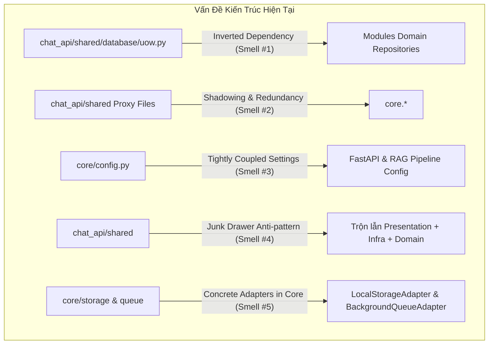
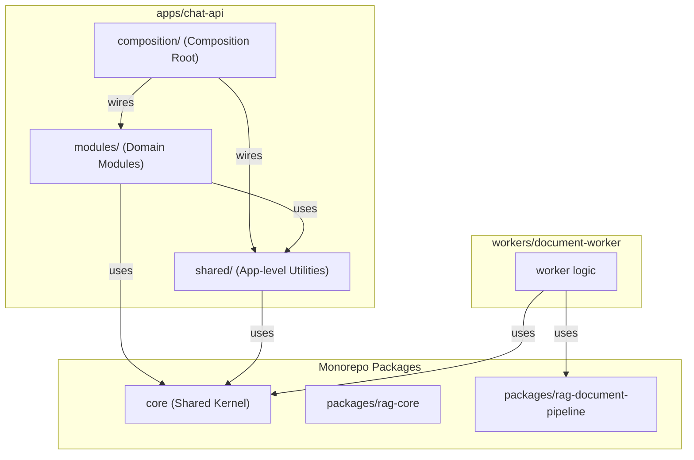

# Đánh Giá Kiến Trúc: Tổ Chức `core` và `chat_api/shared`

> **Tài liệu đánh giá kiến trúc hệ thống RAG**  
> **Phạm vi khảo sát**: `core/src/core` vs `apps/chat-api/src/chat_api/shared`  
> **Mục tiêu**: Đảm bảo tuân thủ Domain-Driven Design (DDD), Clean Architecture, và chuẩn tổ chức Monorepo.

---

## 1. Tóm Tắt Điều Hành (Executive Summary)

Việc chia tách thành hai cấp độ dùng chung:
- **`core/`**: Thư viện nền tảng độc lập ở cấp độ toàn monorepo (phục vụ `apps/chat-api`, `workers/document-worker`, `packages/*`).
- **`chat_api/shared/`**: Thư viện dùng chung nội bộ giữa các module nghiệp vụ của ứng dụng `chat-api`.

**Kết luận**: **Tư duy phân cấp này là đúng đắn và chuẩn mực trong mô hình Monorepo.** 
Tuy nhiên, **cách triển khai hiện tại đang gặp 5 vấn đề kiến trúc (arch smells)** khiến ranh giới trách nhiệm bị mờ nhạt, vi phạm nguyên tắc đảo ngược phụ thuộc (DIP) và làm giảm tính độc lập của `core`.

---

## 2. Bảng So Sánh Trách Nhiệm Hiện Tại

| Tiêu chí | `core/` (`core/src/core`) | `chat_api/shared/` (`apps/chat-api/.../shared`) |
|---|---|---|
| **Bản chất đóng gói** | Python Package độc lập (workspace member trong `pyproject.toml`) | Thư mục mã nguồn nội bộ của ứng dụng `chat-api` |
| **Đối tượng sử dụng** | Toàn bộ Monorepo (`chat-api`, `workers`, `packages`) | Chỉ các module bên trong `chat-api` |
| **DDD Primitives** | `Entity`, `AggregateRoot`, `ValueObject` (chuẩn) | `base_entity.py` (chỉ re-export từ `core.domain`) |
| **Exceptions** | Domain & Base Exceptions đầy đủ | `exceptions.py` (chỉ re-export từ `core.exceptions`) |
| **Cấu hình (Config)** | `Settings` (chứa cả config của Web, DB, RAG) | `config.py` (chỉ re-export từ `core.config`) |
| **Database** | SQLAlchemy `Base`, `SessionLocal`, Mixins | `uow.py` (Unit of Work), `models.py` (Alembic aggregation) |
| **Hạ tầng (Infra)** | Storage Ports + Local Adapter, Queue Ports + Memory Adapter | `bus.py` (CQRS Buses), `rag/` (RAG Engine adapter) |
| **Web / HTTP** | Không có (đúng chuẩn) | `dtos/`, `middleware.py`, `openapi.py`, `auth/guards.py` |

---

## 3. Phân Tích 5 Vấn Đề Kiến Trúc Cần Khắc Phục



### 🔴 Vấn đề 1: Inverted Dependency tại `shared/database/uow.py`
* **Hiện trạng**: File `chat_api/shared/database/uow.py` import trực tiếp các repository interfaces từ **tất cả** các module:
  ```python
  from chat_api.modules.auth.domain.repository import UserSessionRepository
  from chat_api.modules.documents.domain.repository import DocumentRepository
  from chat_api.modules.messages.domain.repository import MessageRepository
  from chat_api.modules.chat_sessions.domain.repository import ChatSessionRepository
  from chat_api.modules.users.domain.repository import UserRepository
  from chat_api.modules.workspaces.domain.repository import WorkspaceRepository
  ```
* **Vi phạm**: Tầng `shared` là tầng nền tảng cơ sở, **không bao giờ được phép phụ thuộc ngược lên các module nghiệp vụ cấp cao**.
* **Hậu quả**: Khi thêm bất kỳ module mới nào (ví dụ: `billing`, `analytics`), dev bắt buộc phải sửa file `shared/database/uow.py`, phá vỡ tính tự đóng gói của các Bounded Contexts.
* **Giải pháp chuẩn đã triển khai (Generic Unit of Work)**: 
  - `UnitOfWork` chỉ cung cấp API generic: `uow.get_repo(RepoType) -> RepoType` với typing tĩnh `TypeVar[T]`.
  - Toàn bộ việc đăng ký mapping giữa abstract repository và concrete implementation được thực hiện tại **Composition Root** (`chat_api/composition/dependencies.py`).
  - Hỗ trợ dynamic alias (`uow.documents`, `uow.sessions`, `uow.workspaces`...) qua `__getattr__` để tương thích ngược hoàn toàn.
  - Kết quả: `shared/database/uow.py` đạt **0 imports** từ `chat_api.modules.*`.

---

### 🟡 Vấn đề 2: "Shadowing / Proxy Re-export" gây bối rối và duplicate
* **Hiện trạng**: Trong `chat_api/shared`, có hàng loạt file 8 dòng chỉ làm nhiệm vụ import rồi re-export lại từ `core`:
  - `shared/base_entity.py` $\rightarrow$ re-export `core.domain.*`
  - `shared/exceptions.py` $\rightarrow$ re-export `core.exceptions.*`
  - `shared/config.py` $\rightarrow$ re-export `core.config.*`
  - `shared/logging.py` $\rightarrow$ re-export `core.logging.*`
  - `shared/uuid7.py` $\rightarrow$ re-export `core.uuid7.*`
* **Hậu quả**:
  - Không nhất quán trong toàn dự án: Một số module dùng `from core.domain import Entity`, một số khác lại dùng `from chat_api.shared.base_entity import Entity`.
  - Tên file bị lệch: Trong `core` là `domain.py`, trong `shared` lại là `base_entity.py`.
* **Giải pháp**:
  - Vì `chat-api` đã phụ thuộc trực tiếp vào `core` thông qua `pyproject.toml` (`dependencies = ["core"]`), nên **xóa bỏ toàn bộ các file proxy re-export này**.
  - Toàn bộ codebase import trực tiếp từ `core.*` (`from core.domain import Entity`, `from core.exceptions import ...`).

---

### 🔴 Vấn đề 3: `core/config.py` làm mất tính độc lập của `core`
* **Hiện trạng**: `core/config.py` chứa toàn bộ config chi tiết của Web API và RAG Pipeline:
  - Web: `APP_NAME`, `API_V1_PREFIX`, `CORS_ORIGINS`, `SESSION_COOKIE_SECURE`
  - RAG: `COHERE_API_KEY`, `GEMINI_API_KEY`, `DEFAULT_CHUNK_SIZE`, `DEFAULT_TOP_K`
* **Hậu quả**: 
  - Khi khởi tạo `settings = Settings()` tại dòng 78 của `core/config.py`, bất kỳ ứng dụng nào import `core` (kể cả worker hay script test đơn giản) cũng bắt buộc phải cung cấp đầy đủ biến môi trường của Web API, nếu không Pydantic sẽ ném ra `ValidationError`.
* **Giải pháp**:
  - Tách kế thừa cấu hình:
    ```
    core.config.BaseSettings (chỉ chứa DATABASE_URL, LOG_LEVEL, ENVIRONMENT)
       └── chat_api.config.ChatApiSettings (kế thừa BaseSettings + thêm CORS, PREFIX, RAG, etc.)
       └── worker.config.WorkerSettings (kế thừa BaseSettings + thêm QUEUE, WORKER_CONCURRENCY)
    ```

---

### 🟡 Vấn đề 4: `chat_api/shared` là "Junk Drawer" (Thùng rác tiện ích)
* **Hiện trạng**: Thư mục `chat_api/shared` chứa lộn xộn các thành phần thuộc nhiều tầng kiến trúc khác nhau:
  - **Tầng Presentation**: `dtos/` (Pydantic models), `middleware.py`, `openapi.py`, `response.py`, `auth/guards.py`.
  - **Tầng Application**: `bus.py` (In-memory CQRS buses).
  - **Tầng Infrastructure**: `rag/adapter.py`, `database/`.
* **Giải pháp**: Cấu trúc rõ ràng theo vai trò kỹ thuật:
  - `shared/presentation/`: DTOs phân trang, responses, FastAPI middlewares, OpenAPI.
  - `shared/auth/`: FastAPI dependency guards, permission catalogs.
  - `shared/bus/` hoặc `shared/infrastructure/`: CQRS bus, event dispatchers.

---

### 🟡 Vấn đề 5: Concrete Adapters nằm lẫn trong `core`
* **Hiện trạng**: `core` chứa cả Port (abstract class) lẫn Implementation (concrete class):
  - `core/storage/port.py` đi kèm `core/storage/local.py` (`LocalStorageAdapter`).
  - `core/queue/port.py` đi kèm `core/queue/memory.py` (`BackgroundQueueAdapter`).
* **Đánh giá**:
  - Ở giai đoạn hiện tại (dev local), việc để adapter mặc định (`local`, `memory`) trong `core` là **chấp nhận được** để giảm bớt số lượng package.
  - Tuy nhiên, khi chuyển sang production với các adapter nặng (AWS S3 qua `boto3`, Redis queue qua `redis-py` hay `celery`), **không được đưa các dependencies này vào `core`**, mà nên tách ra thành `packages/infra-storage` và `packages/infra-queue`.

---

## 4. Mô Hình Khuyến Nghị (Target Architecture)



### Cấu trúc thư mục chuẩn đề xuất:

```
RAG/
├── core/                                 # [MONOREPO PACKAGE] Siêu nhẹ, thuần túy, không phụ thuộc Web
│   └── src/core/
│       ├── domain.py                     # Entity, AggregateRoot, ValueObject (Pure Python)
│       ├── exceptions.py                 # Base domain exceptions (DomainException, etc.)
│       ├── uuid7.py                      # UUIDv7 Generator (k-sortable B-Tree)
│       ├── logging.py                    # Root logging configuration
│       ├── config.py                     # BaseConfig (chỉ DB connection, environment, log level)
│       ├── auth/                         # Password hashing, token hashing, CurrentPrincipal
│       ├── database/                     # SQLAlchemy Base, Mixins, SessionLocal, engine
│       ├── storage/                      # ObjectStoragePort (kèm LocalStorageAdapter tối thiểu)
│       └── queue/                        # IngestionQueuePort (kèm BackgroundQueueAdapter tối thiểu)
│
└── apps/chat-api/src/chat_api/
    ├── config.py                         # ChatApiSettings (kế thừa BaseConfig + CORS, RAG, Web)
    ├── composition/                      # COMPOSITION ROOT (Nơi duy nhất kết nối mọi thứ)
    │   ├── dependencies.py               # DI Providers (get_storage, get_queue, get_rag_engine)
    │   └── uow.py                        # Concrete UnitOfWork tập hợp các Repositories của modules
    │
    ├── modules/                          # Các Bounded Contexts độc lập (Auth, Documents, Sessions...)
    │   ├── documents/
    │   ├── chat_sessions/
    │   ├── messages/
    │   └── workspaces/
    │
    └── shared/                           # CHỈ CHỨA UTILITIES DÙNG CHUNG NỘI BỘ CHAT-API
        ├── presentation/                 # Web helpers: ApiResponse, Pagination, OpenAPI
        ├── auth/                         # FastAPI Guards: RequireAuth, RequirePermission
        └── bus.py                        # In-memory Command/Query/Event Bus
```

---

## 5. Lộ Trình Triển Khai (Actionable Roadmap)

> [!TIP]
> Có thể tiến hành theo 3 bước tuần tự mà không làm gián đoạn hệ thống:

1. **Giai đoạn 1 (Làm sạch dependencies - Đơn giản & Hiệu quả ngay)**:
   - Xóa các file proxy re-export trong `chat_api/shared/`: `base_entity.py`, `exceptions.py`, `logging.py`, `uuid7.py`.
   - Cập nhật các câu lệnh `import` trong các module để trỏ trực tiếp về `core.domain`, `core.exceptions`, `core.uuid7`.
2. **Giai đoạn 2 (Sửa lỗi Inverted Dependency của UoW)**:
   - Chuyển định nghĩa concrete `SqlAlchemyUnitOfWork` từ `chat_api/shared/database/uow.py` sang `chat_api/composition/uow.py`.
   - Tại `chat_api/shared/database/`, chỉ giữ lại interface `UnitOfWork` trừu tượng không bị dính chặt vào danh sách repositories cụ thể.
3. **Giai đoạn 3 (Tách cấu hình Config)**:
   - Rút gọn `core/config.py` thành `BaseCoreSettings` không bắt buộc các biến của Web/RAG.
   - Tạo `ChatApiSettings` tại `apps/chat-api/src/chat_api/config.py` để quản lý các biến môi trường của riêng chat-api.
