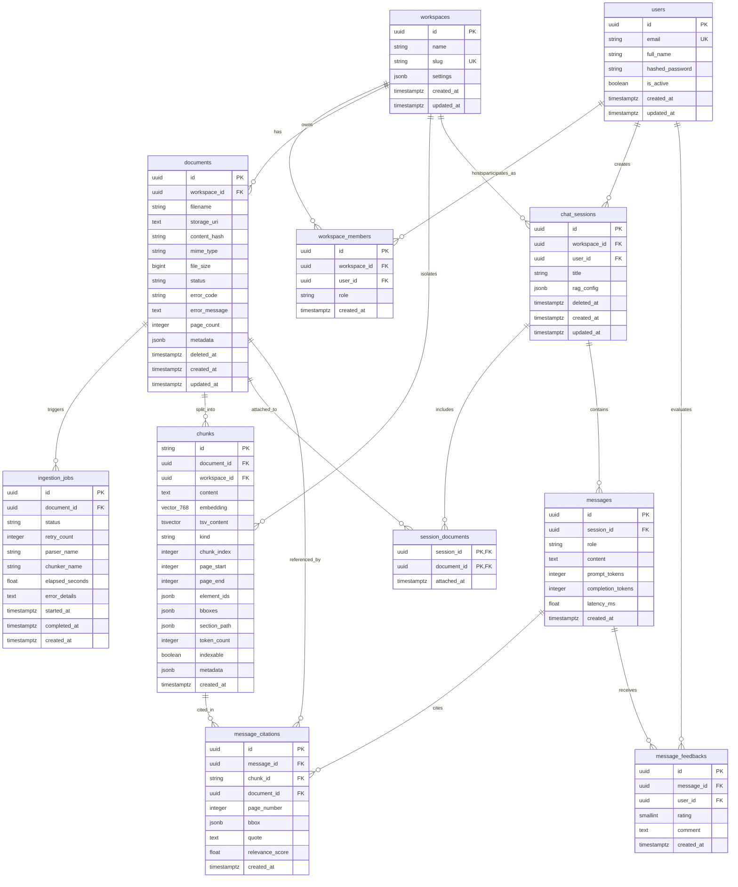
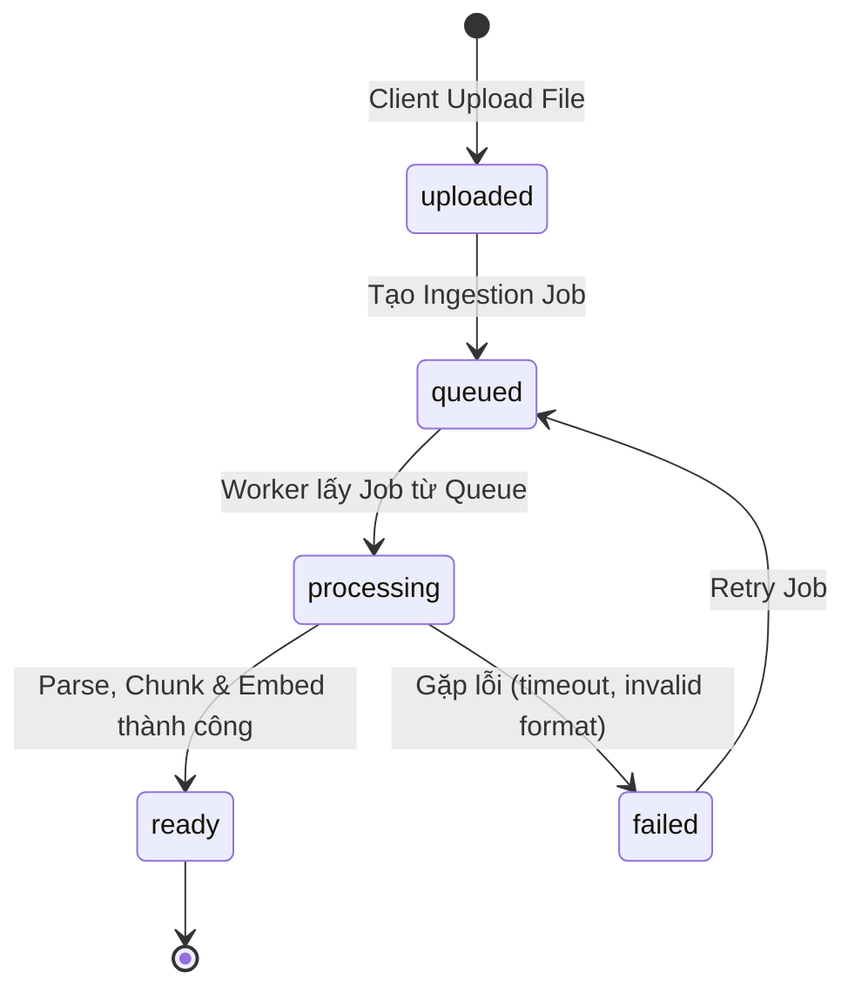

# TÀI LIỆU THIẾT KẾ CƠ SỞ DỮ LIỆU TOÀN DIỆN (DATABASE DESIGN SPECIFICATION)

Tài liệu này cung cấp thiết kế cơ sở dữ liệu chi tiết cho hệ thống RAG Đa phương tiện (Multimodal RAG Platform). Hệ thống kết hợp cơ sở dữ liệu quan hệ (**PostgreSQL 16**), tìm kiếm vector ngữ nghĩa (**pgvector - HNSW**), tìm kiếm toàn văn chuẩn xác (**Full-Text Search - TSVector & GIN**), và lưu trữ đối tượng nhị phân (**Object Storage**).

---

## 1. Bức tranh Tổng thể Kiến trúc Lưu trữ (Storage Landscape)

Hệ thống RAG lưu trữ dữ liệu theo 3 phân tầng chuyên biệt nhằm tối ưu hóa hiệu năng I/O, kích thước cơ sở dữ liệu và tốc độ truy vấn:

```text
┌─────────────────────────────────────────────────────────────────────────────────────────┐
│                                 APPLICATION LAYER                                       │
│                (apps/chat-api, workers/document-worker, packages/rag-core)              │
└──────────────┬─────────────────────────────┬─────────────────────────────┬──────────────┘
               │                             │                             │
        (File nhị phân)               (Dữ liệu quan hệ,             (Cache, Rate-limit,
        PDF gốc & Images               Chunks, Chữ ký,               Job Queue)
               │                       Vectors, Citations)                 │
               ▼                             ▼                             ▼
┌─────────────────────────────┐ ┌─────────────────────────────┐ ┌─────────────────────────┐
│     OBJECT STORAGE          │ │    POSTGRESQL 16 + PGVECTOR │ │         REDIS           │
│   (MinIO / S3 / Local)      │ │                             │ │                         │
│ - File tài liệu gốc (.pdf)  │ │ - 11 Bảng chuẩn hóa         │ │ - Celery / Task Queue   │
│ - Hình ảnh cắt tách (crop)  │ │ - HNSW Index (Dense Vector) │ │ - Session Token cache   │
│ - Diagram renderings        │ │ - GIN Index (Sparse FTS)    │ │ - Semantic Cache        │
│                             │ │ - B-Tree (Multi-tenant ID)  │ │                         │
└─────────────────────────────┘ └─────────────────────────────┘ └─────────────────────────┘
```

### Nguyên tắc thiết kế cốt lõi:
1. **Không lưu trữ nhị phân trực tiếp trong RDBMS**: File PDF gốc và ảnh bóc tách chỉ lưu `storage_uri` trong database; dữ liệu file được chuyển đến Object Storage.
2. **Hybrid Search đồng nhất**: Cả Dense Embedding Vector (`vector(768)`) và Sparse Full-Text Vector (`tsvector`) nằm cùng trong bảng `chunks`, cho phép thực thi truy vấn lai (Hybrid Retrieval) chỉ với một round-trip đến database.
3. **Phân lập Multi-tenant tuyệt đối**: Mọi thực thể dữ liệu nghiệp vụ (`documents`, `chunks`, `chat_sessions`) đều gắn trực tiếp với `workspace_id` và được bảo vệ bởi Composite Index và Foreign Key ràng buộc `CASCADE`.

---

## 2. Sơ đồ Thực thể Quan hệ (ERD - Entity Relationship Diagram)



---

## 3. Từ điển Dữ liệu Chi tiết (Data Dictionary)

Hệ thống bao gồm **11 bảng** chuẩn hóa được chia thành 4 nhóm nghiệp vụ chính:

### Nhóm 1: Quản trị Không gian làm việc & Người dùng (Multi-Tenancy & Auth)

#### 3.1. Bảng `workspaces`
Đại diện cho một không gian làm việc độc lập của tổ chức, phòng ban hoặc dự án. Mọi dữ liệu tài liệu, phiên chat và vector đều được phân lập theo `workspace_id`.

| Tên Cột | Kiểu Dữ Liệu | Ràng Buộc | Giá Trị Mặc Định | Mô Tả Nghiệp Vụ |
| :--- | :--- | :--- | :--- | :--- |
| `id` | `UUID` | `PRIMARY KEY` | `uuid_generate_v4()` | Định danh duy nhất của workspace |
| `name` | `VARCHAR(255)` | `NOT NULL` | - | Tên hiển thị của không gian làm việc |
| `slug` | `VARCHAR(100)` | `NOT NULL, UNIQUE` | - | Mã định danh URL (URL-friendly string) |
| `settings` | `JSONB` | `NOT NULL` | `'{}'::jsonb` | Cấu hình riêng: giới hạn upload, prompt template, model whitelist |
| `created_at` | `TIMESTAMPTZ` | `NOT NULL` | `CURRENT_TIMESTAMP` | Thời điểm tạo workspace |
| `updated_at` | `TIMESTAMPTZ` | `NOT NULL` | `CURRENT_TIMESTAMP` | Thời điểm cập nhật lần cuối |

- **Indexes**:
  - `ix_workspaces_slug` ON `workspaces (slug)` (B-Tree, Phục vụ resolve tenant từ subdomain/path).

---

#### 3.2. Bảng `users`
Lưu trữ thông tin người dùng trong hệ thống xác thực.

| Tên Cột | Kiểu Dữ Liệu | Ràng Buộc | Giá Trị Mặc Định | Mô Tả Nghiệp Vụ |
| :--- | :--- | :--- | :--- | :--- |
| `id` | `UUID` | `PRIMARY KEY` | `uuid_generate_v4()` | Định danh duy nhất của người dùng |
| `email` | `VARCHAR(255)` | `NOT NULL, UNIQUE` | - | Email đăng nhập của người dùng |
| `full_name` | `VARCHAR(255)` | `NULL` | `NULL` | Họ và tên hiển thị |
| `hashed_password` | `VARCHAR(255)` | `NOT NULL` | - | Mật khẩu băm (bcrypt / argon2) |
| `is_active` | `BOOLEAN` | `NOT NULL` | `TRUE` | Trạng thái tài khoản (khóa / kích hoạt) |
| `created_at` | `TIMESTAMPTZ` | `NOT NULL` | `CURRENT_TIMESTAMP` | Thời điểm đăng ký tài khoản |
| `updated_at` | `TIMESTAMPTZ` | `NOT NULL` | `CURRENT_TIMESTAMP` | Thời điểm cập nhật tài khoản |

- **Indexes**:
  - `ix_users_email` ON `users (email)` (B-Tree).

---

#### 3.3. Bảng `workspace_members`
Bảng liên kết quản lý thành viên và phân quyền vai trò (Role-Based Access Control) trong từng workspace.

| Tên Cột | Kiểu Dữ Liệu | Ràng Buộc | Giá Trị Mặc Định | Mô Tả Nghiệp Vụ |
| :--- | :--- | :--- | :--- | :--- |
| `id` | `UUID` | `PRIMARY KEY` | `uuid_generate_v4()` | Định danh bản ghi quan hệ thành viên |
| `workspace_id` | `UUID` | `NOT NULL, FK` | - | Tham chiếu `workspaces.id` (`ON DELETE CASCADE`) |
| `user_id` | `UUID` | `NOT NULL, FK` | - | Tham chiếu `users.id` (`ON DELETE CASCADE`) |
| `role` | `VARCHAR(50)` | `NOT NULL, CHECK` | `'member'` | Vai trò: `'owner'`, `'admin'`, `'member'` |
| `created_at` | `TIMESTAMPTZ` | `NOT NULL` | `CURRENT_TIMESTAMP` | Thời điểm gia nhập workspace |

- **Constraints**:
  - `uq_workspace_user`: `UNIQUE(workspace_id, user_id)` (Một user chỉ có 1 vai trò trong 1 workspace).
  - `ck_workspace_member_role`: `CHECK (role IN ('owner', 'admin', 'member'))`.
- **Indexes**:
  - `ix_workspace_members_workspace_id` ON `workspace_members (workspace_id)`.
  - `ix_workspace_members_user_id` ON `workspace_members (user_id)`.

---

### Nhóm 2: Quản lý Tài liệu & Tiến trình Ingestion (Documents & Pipeline)

#### 3.4. Bảng `documents`
Quản lý metadata của file tài liệu tải lên hệ thống.

| Tên Cột | Kiểu Dữ Liệu | Ràng Buộc | Giá Trị Mặc Định | Mô Tả Nghiệp Vụ |
| :--- | :--- | :--- | :--- | :--- |
| `id` | `UUID` | `PRIMARY KEY` | `uuid_generate_v4()` | Định danh tài liệu |
| `workspace_id` | `UUID` | `NOT NULL, FK` | - | Tham chiếu `workspaces.id` (`ON DELETE CASCADE`) |
| `filename` | `VARCHAR(500)` | `NOT NULL` | - | Tên file gốc người dùng tải lên |
| `storage_uri` | `TEXT` | `NOT NULL` | - | Đường dẫn Object Storage (ví dụ: `s3://bucket/docs/...`) |
| `content_hash` | `VARCHAR(64)` | `NOT NULL` | - | Mã băm SHA-256 nội dung file phục vụ chống trùng lặp |
| `mime_type` | `VARCHAR(100)` | `NOT NULL` | `'application/pdf'` | Định dạng MIME của file |
| `file_size` | `BIGINT` | `NOT NULL` | `0` | Kích thước file theo bytes |
| `status` | `VARCHAR(30)` | `NOT NULL, CHECK` | `'queued'` | Vòng đời: `uploaded`, `queued`, `processing`, `ready`, `failed` |
| `error_code` | `VARCHAR(50)` | `NULL` | `NULL` | Mã lỗi kỹ thuật khi ingestion thất bại |
| `error_message` | `TEXT` | `NULL` | `NULL` | Chi tiết thông báo lỗi |
| `page_count` | `INTEGER` | `NOT NULL` | `0` | Tổng số trang tài liệu |
| `metadata` | `JSONB` | `NOT NULL` | `'{}'::jsonb` | Metadata mở rộng (author, title, ocr_engine, doc_type) |
| `deleted_at` | `TIMESTAMPTZ` | `NULL` | `NULL` | Thời điểm xóa mềm (Soft Delete) |
| `created_at` | `TIMESTAMPTZ` | `NOT NULL` | `CURRENT_TIMESTAMP` | Thời điểm tải lên |
| `updated_at` | `TIMESTAMPTZ` | `NOT NULL` | `CURRENT_TIMESTAMP` | Thời điểm cập nhật trạng thái gần nhất |

- **Constraints**:
  - `ck_document_status`: `CHECK (status IN ('uploaded', 'queued', 'processing', 'ready', 'failed'))`.
- **Indexes**:
  - `idx_documents_workspace_status` ON `documents (workspace_id, status)` (Lọc nhanh các tài liệu sẵn sàng tra cứu).
  - `idx_documents_content_hash` ON `documents (workspace_id, content_hash)` (Kiểm tra trùng lặp tệp tức thì).
  - Khuyến nghị Partial Index: `CREATE INDEX idx_documents_active ON documents (workspace_id) WHERE deleted_at IS NULL;`.

---

#### 3.5. Bảng `ingestion_jobs`
Ghi lại nhật ký các lần chạy background worker xử lý tài liệu (parse, OCR, chunk, embed). Cho phép retry và audit độ trễ.

| Tên Cột | Kiểu Dữ Liệu | Ràng Buộc | Giá Trị Mặc Định | Mô Tả Nghiệp Vụ |
| :--- | :--- | :--- | :--- | :--- |
| `id` | `UUID` | `PRIMARY KEY` | `uuid_generate_v4()` | Định danh tác vụ ingestion |
| `document_id` | `UUID` | `NOT NULL, FK` | - | Tham chiếu `documents.id` (`ON DELETE CASCADE`) |
| `status` | `VARCHAR(30)` | `NOT NULL, CHECK` | `'queued'` | Trạng thái: `queued`, `running`, `completed`, `failed` |
| `retry_count` | `INTEGER` | `NOT NULL` | `0` | Số lần đã thử lại khi gặp sự cố mạng/LLM |
| `parser_name` | `VARCHAR(50)` | `NOT NULL` | `'opendataloader'` | Tên bộ bóc tách (`docling`, `opendataloader`, `pypdf`) |
| `chunker_name` | `VARCHAR(50)` | `NOT NULL` | `'heading_aware'` | Tên thuật toán phân mảnh (`heading_aware`, `semantic`) |
| `elapsed_seconds` | `FLOAT` | `NULL` | `NULL` | Tổng thời gian hoàn thành (giây) |
| `error_details` | `TEXT` | `NULL` | `NULL` | Stack trace khi gặp exception |
| `started_at` | `TIMESTAMPTZ` | `NULL` | `NULL` | Thời điểm bắt đầu thực thi trên worker |
| `completed_at` | `TIMESTAMPTZ` | `NULL` | `NULL` | Thời điểm kết thúc tác vụ |
| `created_at` | `TIMESTAMPTZ` | `NOT NULL` | `CURRENT_TIMESTAMP` | Thời điểm tạo job |

- **Constraints**:
  - `ck_ingestion_job_status`: `CHECK (status IN ('queued', 'running', 'completed', 'failed'))`.
- **Indexes**:
  - `idx_ingestion_jobs_document` ON `ingestion_jobs (document_id)`.

---

### Nhóm 3: Dữ liệu Phân mảnh RAG, Vector & Tọa độ (Chunks & Retrieval)

#### 3.6. Bảng `chunks`
Trái tim của hệ thống RAG. Lưu trữ từng phân mảnh nội dung, vector đặc trưng 768 chiều, TSVector tìm kiếm từ khóa, và siêu dữ liệu định vị (trang, tọa độ hộp bao bbox).

| Tên Cột | Kiểu Dữ Liệu | Ràng Buộc | Giá Trị Mặc Định | Mô Tả Nghiệp Vụ |
| :--- | :--- | :--- | :--- | :--- |
| `id` | `VARCHAR(255)` | `PRIMARY KEY` | - | Định danh chunk dạng deterministic (ví dụ: `doc_{uuid}_chunk_{index}`) |
| `document_id` | `UUID` | `NOT NULL, FK` | - | Tham chiếu `documents.id` (`ON DELETE CASCADE`) |
| `workspace_id` | `UUID` | `NOT NULL, FK` | - | Tham chiếu `workspaces.id` (`ON DELETE CASCADE`) |
| `content` | `TEXT` | `NOT NULL` | - | Nội dung văn bản thuần túy của chunk (kể cả bảng markdown hoặc mô tả diagram) |
| `embedding` | `vector(768)` | `NULL` | `NULL` | Dense vector embedding từ model Gemini / text-embedding-004 |
| `tsv_content` | `TSVECTOR` | `GENERATED STORED` | `to_tsvector('simple', content)` | Vector từ vựng phục vụ Full-Text Search (Sparse Search) |
| `kind` | `VARCHAR(50)` | `NOT NULL` | `'text'` | Loại nội dung: `'text'`, `'table'`, `'figure'`, `'diagram'` |
| `chunk_index` | `INTEGER` | `NOT NULL` | `0` | Thứ tự xuất hiện tuần tự trong tài liệu gốc |
| `page_start` | `INTEGER` | `NOT NULL` | `1` | Trang bắt đầu của chunk trong tài liệu PDF |
| `page_end` | `INTEGER` | `NOT NULL` | `1` | Trang kết thúc của chunk |
| `element_ids` | `JSONB` | `NOT NULL` | `'[]'::jsonb` | Mảng chứa danh sách ID các element cấu thành từ parser |
| `bboxes` | `JSONB` | `NOT NULL` | `'[]'::jsonb` | Danh sách tọa độ `[[x0, y0, x1, y1], ...]` tương ứng trên trang |
| `section_path` | `JSONB` | `NOT NULL` | `'[]'::jsonb` | Cây tiêu đề cấp bậc `["1. Tổng quan", "1.1 Mục đích"]` |
| `token_count` | `INTEGER` | `NOT NULL` | `0` | Số lượng token (theo tiktoken / Gemini tokenizer) |
| `indexable` | `BOOLEAN` | `NOT NULL` | `TRUE` | `TRUE` nếu cho phép đưa vào hybrid search |
| `metadata` | `JSONB` | `NOT NULL` | `'{}'::jsonb` | Metadata chi tiết cho diagram/figure (nodes, edges, OCR text) |
| `created_at` | `TIMESTAMPTZ` | `NOT NULL` | `CURRENT_TIMESTAMP` | Thời điểm tạo bản ghi chunk |

- **Indexes**:
  - `idx_chunks_doc_workspace` ON `chunks (document_id, workspace_id)` (B-Tree).
  - `idx_chunks_kind` ON `chunks (kind)` (B-Tree, phục vụ lọc chuyên biệt table/diagram).
  - `idx_chunks_embedding_hnsw` ON `chunks USING hnsw (embedding vector_cosine_ops) WITH (m = 16, ef_construction = 64)`.
  - `idx_chunks_tsv` ON `chunks USING gin(tsv_content)` (GIN index cho full-text search).

---

### Nhóm 4: Quản lý Phiên hội thoại & Trích dẫn (Chat Sessions & Citations)

#### 3.7. Bảng `chat_sessions`
Quản lý các phiên trò chuyện của người dùng trong một workspace cụ thể.

| Tên Cột | Kiểu Dữ Liệu | Ràng Buộc | Giá Trị Mặc Định | Mô Tả Nghiệp Vụ |
| :--- | :--- | :--- | :--- | :--- |
| `id` | `UUID` | `PRIMARY KEY` | `uuid_generate_v4()` | Định danh phiên chat |
| `workspace_id` | `UUID` | `NOT NULL, FK` | - | Tham chiếu `workspaces.id` (`ON DELETE CASCADE`) |
| `user_id` | `UUID` | `NULL, FK` | `NULL` | Tham chiếu `users.id` (`ON DELETE SET NULL`) |
| `title` | `VARCHAR(255)` | `NOT NULL` | `'New Chat'` | Tiêu đề cuộc hội thoại |
| `rag_config` | `JSONB` | `NOT NULL` | `'{"top_k": 5, "rerank": true}'::jsonb` | Cấu hình RAG riêng (top_k, rerank, temperature) |
| `deleted_at` | `TIMESTAMPTZ` | `NULL` | `NULL` | Thời điểm xóa mềm phiên chat |
| `created_at` | `TIMESTAMPTZ` | `NOT NULL` | `CURRENT_TIMESTAMP` | Thời điểm khởi tạo phiên |
| `updated_at` | `TIMESTAMPTZ` | `NOT NULL` | `CURRENT_TIMESTAMP` | Thời điểm tin nhắn mới nhất xuất hiện |

- **Indexes**:
  - `idx_chat_sessions_workspace_user` ON `chat_sessions (workspace_id, user_id)`.

---

#### 3.8. Bảng `session_documents`
Bảng liên kết Nhiều - Nhiều (N-N) xác định danh sách tài liệu được đính kèm vào phiên chat để giới hạn ngữ cảnh tra cứu (Scoped Retrieval).

| Tên Cột | Kiểu Dữ Liệu | Ràng Buộc | Giá Trị Mặc Định | Mô Tả Nghiệp Vụ |
| :--- | :--- | :--- | :--- | :--- |
| `session_id` | `UUID` | `PRIMARY KEY, FK` | - | Tham chiếu `chat_sessions.id` (`ON DELETE CASCADE`) |
| `document_id` | `UUID` | `PRIMARY KEY, FK` | - | Tham chiếu `documents.id` (`ON DELETE CASCADE`) |
| `attached_at` | `TIMESTAMPTZ` | `NOT NULL` | `CURRENT_TIMESTAMP` | Thời điểm tài liệu được gán vào session |

---

#### 3.9. Bảng `messages`
Lưu trữ toàn bộ lịch sử tin nhắn trong phiên trò chuyện.

| Tên Cột | Kiểu Dữ Liệu | Ràng Buộc | Giá Trị Mặc Định | Mô Tả Nghiệp Vụ |
| :--- | :--- | :--- | :--- | :--- |
| `id` | `UUID` | `PRIMARY KEY` | `uuid_generate_v4()` | Định danh tin nhắn |
| `session_id` | `UUID` | `NOT NULL, FK` | - | Tham chiếu `chat_sessions.id` (`ON DELETE CASCADE`) |
| `role` | `VARCHAR(20)` | `NOT NULL, CHECK` | - | Vai trò người gửi: `'user'`, `'assistant'`, `'system'` |
| `content` | `TEXT` | `NOT NULL` | - | Nội dung văn bản câu hỏi hoặc câu trả lời |
| `prompt_tokens` | `INTEGER` | `NOT NULL` | `0` | Số token prompt đầu vào |
| `completion_tokens`| `INTEGER` | `NOT NULL` | `0` | Số token phản hồi sinh ra |
| `latency_ms` | `FLOAT` | `NULL` | `NULL` | Độ trễ xử lý RAG & LLM (mili-giây) |
| `created_at` | `TIMESTAMPTZ` | `NOT NULL` | `CURRENT_TIMESTAMP` | Thời điểm gửi tin nhắn |

- **Constraints**:
  - `ck_message_role`: `CHECK (role IN ('user', 'assistant', 'system'))`.
- **Indexes**:
  - `idx_messages_session` ON `messages (session_id, created_at)` (Tối ưu hóa tải lịch sử chat theo thứ tự thời gian).

---

#### 3.10. Bảng `message_citations`
Liên kết câu trả lời của trợ lý ảo AI với đúng nguồn phân mảnh tài liệu gốc, hỗ trợ bôi sáng trích dẫn trên trang tài liệu.

| Tên Cột | Kiểu Dữ Liệu | Ràng Buộc | Giá Trị Mặc Định | Mô Tả Nghiệp Vụ |
| :--- | :--- | :--- | :--- | :--- |
| `id` | `UUID` | `PRIMARY KEY` | `uuid_generate_v4()` | Định danh trích dẫn |
| `message_id` | `UUID` | `NOT NULL, FK` | - | Tham chiếu `messages.id` (`ON DELETE CASCADE`) |
| `chunk_id` | `VARCHAR(255)` | `NOT NULL, FK` | - | Tham chiếu `chunks.id` (`ON DELETE CASCADE`) |
| `document_id` | `UUID` | `NOT NULL, FK` | - | Tham chiếu `documents.id` (`ON DELETE CASCADE`) |
| `page_number` | `INTEGER` | `NOT NULL` | - | Số trang chứa nội dung được trích |
| `bbox` | `JSONB` | `NOT NULL` | `'[]'::jsonb` | Tọa độ `[x0, y0, x1, y1]` để UI vẽ khung bôi sáng (highlight box) |
| `quote` | `TEXT` | `NULL` | `NULL` | Đoạn văn bản chính xác được AI trích dẫn làm bằng chứng |
| `relevance_score`| `FLOAT` | `NULL` | `NULL` | Điểm độ tương đồng / rerank score |
| `created_at` | `TIMESTAMPTZ` | `NOT NULL` | `CURRENT_TIMESTAMP` | Thời điểm tạo trích dẫn |

- **Indexes**:
  - `idx_message_citations_msg` ON `message_citations (message_id)`.

---

#### 3.11. Bảng `message_feedbacks`
Thu thập đánh giá chất lượng câu trả lời từ người dùng (RLHF & RAG Evaluation).

| Tên Cột | Kiểu Dữ Liệu | Ràng Buộc | Giá Trị Mặc Định | Mô Tả Nghiệp Vụ |
| :--- | :--- | :--- | :--- | :--- |
| `id` | `UUID` | `PRIMARY KEY` | `uuid_generate_v4()` | Định danh bản ghi đánh giá |
| `message_id` | `UUID` | `NOT NULL, FK` | - | Tham chiếu `messages.id` (`ON DELETE CASCADE`) |
| `user_id` | `UUID` | `NULL, FK` | `NULL` | Tham chiếu `users.id` (`ON DELETE SET NULL`) |
| `rating` | `SMALLINT` | `NOT NULL, CHECK` | - | Giá trị đánh giá: `1` (Like / Tốt), `-1` (Dislike / Kém) |
| `comment` | `TEXT` | `NULL` | `NULL` | Lý do người dùng phản hồi (ảo giác, thiếu thông tin...) |
| `created_at` | `TIMESTAMPTZ` | `NOT NULL` | `CURRENT_TIMESTAMP` | Thời điểm gửi đánh giá |

- **Constraints**:
  - `ck_feedback_rating`: `CHECK (rating IN (-1, 1))`.
  - `uq_user_message_feedback`: `UNIQUE(message_id, user_id)` (Mỗi user chỉ đánh giá 1 lần cho 1 tin nhắn).

---

## 4. Chiến lược Indexing Chuyên biệt cho RAG (Hybrid Search)

### 4.1. Dense Vector Search: HNSW Index
Hệ thống sử dụng thuật toán **HNSW (Hierarchical Navigable Small World)** thay vì IVFFlat:
- **Vì sao chọn HNSW?**: HNSW mang lại Recall cao (>98%) ngay cả khi dữ liệu cập nhật liên tục mà không cần lệnh `REINDEX` hoặc xây dựng lại cluster list như IVFFlat.
- **Tham số cấu hình**:
  ```sql
  CREATE INDEX idx_chunks_embedding_hnsw ON chunks 
  USING hnsw (embedding vector_cosine_ops) 
  WITH (m = 16, ef_construction = 64);
  ```
  - `vector_cosine_ops`: Tính toán khoảng cách Cosine Distance (`<=>`), phù hợp với các mô hình embedding chuẩn hóa đơn vị.
  - `m = 16`: Số lượng kết nối tối đa cho mỗi node trong đồ thị HNSW (cân bằng hoàn hảo giữa tốc độ tìm kiếm và dung lượng RAM).
  - `ef_construction = 64`: Kích thước danh sách ứng viên động trong quá trình xây dựng đồ thị index.
- **Runtime Query Tuning**: Khi thực hiện tìm kiếm, ta có thể điều chỉnh độ chính xác trong session:
  ```sql
  SET hnsw.ef_search = 40; -- Tăng lên 100 nếu cần độ chính xác tối đa
  ```

### 4.2. Sparse Full-Text Search: GIN Index với 'simple' configuration
Đối với tiếng Việt và tài liệu chuyên ngành (chứa thuật ngữ viết tắt, mã hiệu kỹ thuật):
- Cấu hình từ điển `'simple'` được áp dụng:
  ```sql
  ALTER TABLE chunks ADD COLUMN tsv_content TSVECTOR 
  GENERATED ALWAYS AS (to_tsvector('simple', content)) STORED;
  
  CREATE INDEX idx_chunks_tsv ON chunks USING gin(tsv_content);
  ```
- **Lý do**: Bộ phân tích từ tiếng Anh (`english`) sẽ cắt bỏ từ vựng (stemming) sai lệch với tiếng Việt có dấu. Bộ từ điển `'simple'` giữ nguyên dạng từ, phân tách theo khoảng trắng và ký tự phân cách, giúp tìm kiếm từ khóa kỹ thuật (ví dụ: `SOP`, `ISO-9001`, `Quy trình 08`) đạt độ chính xác 100%.

### 4.3. Chiến lược Hybrid Retrieval (Reciprocal Rank Fusion - RRF)
Truy vấn RAG thực thi truy vấn kết hợp cả Dense Vector và Sparse FTS thông qua thuật toán **RRF** với hằng số $k = 60$:

$$\text{RRF Score}(d) = \frac{1}{60 + \text{Rank}_{\text{dense}}(d)} + \frac{1}{60 + \text{Rank}_{\text{sparse}}(d)}$$

Thao tác này giúp tận dụng thế mạnh của cả 2 phương pháp: Dense Vector hiểu sâu ngữ nghĩa trừu tượng, trong khi Full-Text Search bắt chính xác các từ khóa hiếm, mã số, tên riêng.

---

## 5. Phân lập Dữ liệu & Tính toàn vẹn (Multi-Tenancy & Integrity)

### 5.1. Mô hình Phân lập Logic (Logical Multi-Tenancy)
1. Mọi truy vấn tra cứu tài liệu và chunk luôn bắt buộc có điều kiện `WHERE workspace_id = :current_workspace_id`.
2. Hỗ trợ kích hoạt **PostgreSQL Row-Level Security (RLS)** khi cần bảo mật cấp độ cơ sở dữ liệu:
   ```sql
   ALTER TABLE documents ENABLE ROW LEVEL SECURITY;
   CREATE POLICY workspace_isolation_policy ON documents
   USING (workspace_id = current_setting('app.current_workspace_id')::uuid);
   ```

### 5.2. Chính sách Cascade Deletion
- Khi một `workspace` bị xóa: Toàn bộ `workspace_members`, `documents`, `chunks`, `chat_sessions` đều bị xóa sạch (`ON DELETE CASCADE`), ngăn ngừa hoàn toàn tình trạng dữ liệu mồ côi (orphaned chunks/vectors).
- Khi một `user` bị xóa: Tài liệu và phiên chat vẫn được bảo tồn để tổ chức không bị mất dữ liệu tri thức, trường `user_id` trong `chat_sessions` và `message_feedbacks` tự động chuyển về `NULL` (`ON DELETE SET NULL`).

### 5.3. Máy trạng thái Vòng đời Tài liệu (Document Ingestion State Machine)



---

## 6. Mô hình Lưu trữ Đa phương tiện, Bảng biểu & Sơ đồ Flowchart

Để đáp ứng yêu cầu xử lý tài liệu phức tạp (như file SOP có flowchart, infographic, bảng biểu lồng nhau), cấu hình `chunks` lưu trữ thông tin có cấu trúc:

### 6.1. Cột `kind` phân loại nội dung
- `text`: Đoạn văn bản thông thường.
- `table`: Bảng biểu dạng Markdown hoặc cấu trúc HTML/JSON.
- `figure`: Hình ảnh minh họa kèm chú thích (caption, OCR text).
- `diagram`: Sơ đồ quy trình, flowchart dạng node & edge.

### 6.2. Cấu trúc trường `metadata` (JSONB) cho Flowchart / Sơ đồ quy trình
Khi `kind = 'diagram'`, trường `metadata` lưu trữ toàn bộ cấu trúc đồ thị của quy trình:
```json
{
  "diagram_type": "flowchart",
  "confidence": 0.95,
  "caption": "Quy trình thực hiện SOP 8 bước",
  "nodes": [
    {"id": "step_1", "label": "Viết dự thảo", "type": "process", "page": 2, "bbox": [50.0, 100.0, 200.0, 150.0]},
    {"id": "step_2", "label": "Thẩm định", "type": "decision", "page": 2, "bbox": [50.0, 180.0, 200.0, 230.0]}
  ],
  "edges": [
    {"from": "step_1", "to": "step_2", "label": "Hoàn tất dự thảo"}
  ],
  "ocr_text": ["Viết dự thảo", "Thẩm định", "Phê duyệt"]
}
```

---

## 7. Dự toán Dung lượng & Chiến lược Mở rộng (Capacity & Partitioning)

### 7.1. Ước tính Kích thước 1 Bản ghi `chunks`
- `content` (trung bình 1,000 ký tự UTF-8): ~1.2 KB
- `embedding vector(768)` (768 * 4 bytes float32): ~3.07 KB
- `tsv_content` (lexemes + positions): ~0.5 KB
- `metadata`, `bboxes`, `element_ids`: ~0.8 KB
- **Tổng dung lượng bảng thuần cho 1 chunk**: **~5.5 KB**
- **Dung lượng Index HNSW (m=16)**: ~3.5 KB / vector
- **Tổng cộng (Data + Indexes)**: **~10 KB / chunk**

| Số Lượng Chunks | Tương đương Số Trang PDF | Dung lượng Database | RAM Đề xuất cho Index |
| :--- | :--- | :--- | :--- |
| 100,000 | ~25,000 trang | ~1.0 GB | 2 GB RAM |
| 1,000,000 | ~250,000 trang | ~10 GB | 8 GB - 16 GB RAM |
| 10,000,000 | ~2,500,000 trang | ~100 GB | 32 GB - 64 GB RAM |

> [!TIP]
> Toàn bộ HNSW index cần nằm trọn trong RAM để đạt tốc độ phản hồi sub-10ms. Khi quy mô đạt trên 5 triệu chunks, cần cấu hình PostgreSQL `shared_buffers` tối thiểu 16GB.

### 7.2. Chiến lược Phân vùng Bảng (Table Partitioning)
Khi dữ liệu vượt quá 10 triệu bản ghi, áp dụng Declarative Partitioning của PostgreSQL:
1. **Phân vùng bảng `chunks` theo Hash `workspace_id`**: Chia thành 16 hoặc 32 partition con để phân tán I/O và song song hóa quá trình quét index.
2. **Phân vùng bảng `messages` theo Range `created_at`**: Chia theo tháng (Monthly Partition) giúp dễ dàng lưu trữ lạnh (Cold Storage Archive) các tin nhắn cũ hơn 1 năm.

---

## 8. Cấu hình Tham số Database Tối ưu (PostgreSQL Tuning)

Để đạt hiệu năng RAG cao nhất trong file `postgresql.conf` (cho máy chủ 16GB RAM, 4 vCPU):

```ini
# Memory Configuration
shared_buffers = 4GB                  # 25% tổng RAM
effective_cache_size = 12GB           # 75% tổng RAM
work_mem = 64MB                       # Bộ nhớ phục vụ sắp xếp & hybrid search
maintenance_work_mem = 1GB            # Đẩy nhanh tốc độ tạo HNSW index

# Vector HNSW Optimization
max_parallel_workers_per_gather = 2
max_parallel_maintenance_workers = 2

# Checkpoint & WAL
checkpoint_completion_target = 0.9
wal_buffers = 16MB
default_statistics_target = 100
```
