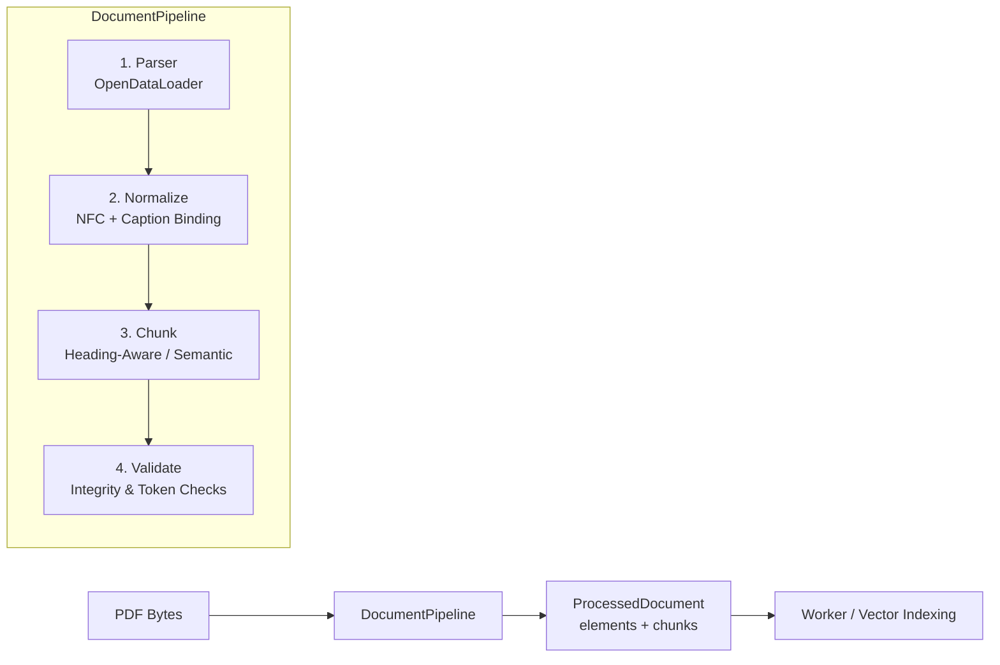

# Document Pipeline: Kiến trúc và Hướng dẫn Xử lý Tài liệu

Tài liệu này mô tả chi tiết kiến trúc, API và luồng hoạt động của **`DocumentPipeline`** trong package `packages/rag-document-pipeline`.

---

## 1. Tổng quan & Vị trí trong Hệ thống

`DocumentPipeline` là bộ điều phối (**Orchestrator**) trung tâm chịu trách nhiệm biến đổi tài liệu thô (PDF bytes) thành tập hợp các **Chunk có nhận thức cấu trúc layout và ngữ nghĩa** (`ProcessedDocument`), sẵn sàng cho việc embedding và lập chỉ mục (indexing) vào Vector Database.



### Đặc điểm thiết kế cốt lõi:
1. **Độc lập hạ tầng (Decoupled)**: Pipeline không phụ thuộc vào FastAPI, PostgreSQL, RabbitMQ hay giao diện người dùng. Có thể chạy độc lập trong CLI, worker process hoặc test suite.
2. **Kiến trúc cắm rút (Dependency Injection)**: Parser và Chunker tuân thủ Protocol (`typing.Protocol`), cho phép thay thế linh hoạt (OpenDataLoader, Docling, MinerU...) mà không sửa đổi pipeline core.
3. **Chống phân mảnh đa phương thức (Multimodal Context Preservation)**: Triển khai 2 chiến lược cốt lõi:
   - **Chiến lược 1 (Semantic Grouping)**: Gom nhóm theo thứ tự đọc tự nhiên (*Reading Order*), giữ bảng nhỏ và chú thích nằm cùng đoạn văn liên quan.
   - **Chiến lược 2 (Caption & Footnote Binding)**: Khóa chặt chú thích và footnote vào bảng biểu hoặc hình ảnh tương ứng.

---

## 2. Luồng Xử lý Toàn trình (End-to-End Flow)

```mermaid
sequenceDiagram
    autonumber
    actor Caller as Worker / Ingestion
    participant Pipe as DocumentPipeline
    participant Parser as Parser (OpenDataLoader)
    participant Norm as LayoutNormalizer
    participant Chunker as HeadingAwareChunker
    
    Caller->>Pipe: process(content, filename, document_id, image_dir)
    Pipe->>Parser: parse(content, filename, image_dir)
    Parser-->>Pipe: list[LayoutElement] (raw visual elements)
    
    Pipe->>Norm: Unicode NFC & Whitespace Clean
    Pipe->>Norm: bind_captions_and_footnotes(elements)
    Norm-->>Pipe: list[LayoutElement] (bound & cleaned)
    
    Pipe->>Chunker: chunk(elements, document_id)
    Chunker->>Chunker: Multimodal reading-order routing
    Chunker->>Chunker: Text → semantic; small table → inline; large table/image → standalone
    Chunker-->>Pipe: list[DocumentChunk]
    
    Pipe->>Pipe: _validate(chunks)
    Pipe-->>Caller: ProcessedDocument (elements, chunks, metadata)
```

### Bước 1: Parse (`Parser`)
- Sử dụng adapter tuân theo interface [`Parser`](file:///c:/Users/ndquynh/Documents/RAG/packages/rag-document-pipeline/src/rag_document_pipeline/parsers/base.py#L13).
- Mặc định là [`OpenDataLoaderParser`](file:///c:/Users/ndquynh/Documents/RAG/packages/rag-document-pipeline/src/rag_document_pipeline/parsers/opendataloader.py): Chạy engine bóc tách PDF cục bộ (yêu cầu Java 11+), bóc tách text layer, bounding box, bảng có cấu trúc và kết xuất hình ảnh ra `image_dir`.
- Đầu ra: `list[LayoutElement]`.

### Bước 2: Normalize (`LayoutNormalizer`)
- **Unicode NFC & Mojibake repair**: Khôi phục các lỗi mã hóa ký tự tiếng Việt thường gặp từ bộ trích xuất PDF.
- **Whitespace normalization**: Dọn dẹp khoảng trắng dư thừa, ký tự điều khiển nhưng bảo toàn định dạng bảng.
- **Caption & Footnote Binding**: Quét tuần tự theo thứ tự đọc:
  - Nếu gặp phần tử `caption` đứng ngay trước/sau bảng hoặc ảnh $\rightarrow$ gộp nội dung caption trực tiếp vào `element.caption` và `table_data.caption` / `image_data.caption`.
  - Nếu gặp phần tử `footnote` (bắt đầu bằng `*`, `(*)`, `Note:`) ngay dưới bảng hoặc ảnh $\rightarrow$ gộp vào `element.metadata["footnote"]`.
  - Loại bỏ các phần tử caption/footnote độc lập để tránh chúng bị trôi dạt thành các đoạn văn rác ở chunk khác.

### Bước 3: Chunk (`HeadingAwareChunker`)
- **Lan truyền ngữ cảnh Section (`_propagate_sections`)**: Cập nhật cây tiêu đề `section_path` (ví dụ: `["1. Giới thiệu", "1.2 Mục tiêu"]`) cho tất cả các phần tử nằm trong phạm vi mục đó.
- **Multimodal routing**: Duyệt theo luồng đọc liên tục. Bảng nhỏ được render Markdown inline cùng văn bản xung quanh. Bảng lớn và hình ảnh được chunk độc lập với metadata đầy đủ.

### Bước 4: Validate (`_validate`)
- Đảm bảo không có chunk rỗng.
- Kiểm tra các trường metadata bắt buộc: `document_id`, `chunk_id`, `page_start`, `page_end`, `section_path`, `element_ids`.
- Đóng gói kết quả thành [`ProcessedDocument`](file:///c:/Users/ndquynh/Documents/RAG/packages/rag-document-pipeline/src/rag_document_pipeline/models.py#L16).

---

## 3. Cấu trúc Hợp đồng Dữ liệu (Data Contracts)

### 3.1. Đối tượng Đầu ra của Parser: `LayoutElement`
Mỗi phần tử đại diện cho một khối layout trực quan trên trang:

```python
class LayoutElement(BaseModel):
    id: str                                         # UUID hoặc ID định danh phần tử
    type: str                                       # "heading", "paragraph", "table", "image",...
    text: str = ""                                  # Nội dung chữ thô
    page_number: int = 1                            # Trang chứa phần tử (bắt đầu từ 1)
    bbox: tuple[float, float, float, float] | None  # Tọa độ (x1, y1, x2, y2) trên trang PDF
    source: str | None = None                       # Tên file hoặc nguồn trích xuất
    caption: str | None = None                      # Chú thích đi kèm
    order: int = 0                                  # Thứ tự theo luồng đọc tự nhiên
    heading_level: int | None = None                # Cấp độ heading (H1=1, H2=2,...)
    section_path: list[str] = []                    # Phân cấp mục: ["Chương 1", "Mục 1.1"]
    table_data: TableData | None = None             # Dữ liệu bảng có cấu trúc
    image_data: ImageData | None = None             # Dữ liệu hình ảnh và VLM OCR
    metadata: dict[str, Any] = {}                   # Thông tin bổ sung mở rộng
```

### 3.2. Cấu trúc Bảng & Hình ảnh chuyên biệt
- **`TableData`**: Lưu cấu trúc bảng 2 chiều:
  - `headers: list[str]`: Danh sách tiêu đề cột.
  - `rows: list[list[str]]`: Ma trận các hàng dữ liệu.
  - `caption: str | None`: Chú thích bảng.
- **`ImageData`**: Lưu thông tin hình ảnh/biểu đồ:
  - `uri: str | None`: Đường dẫn file ảnh đã trích xuất trên đĩa.
  - `caption: str | None`: Chú thích ảnh.
  - `ocr_text: str | None`: Text trích xuất từ OCR/VLM.

### 3.3. Đối tượng Chunk hoàn chỉnh: `DocumentChunk`
```python
class DocumentChunk(BaseModel):
    id: str                                         # ID duy nhất của chunk (UUID hoặc hash)
    document_id: str                                # Mã tài liệu sở hữu
    chunk_index: int                                # Thứ tự chunk trong tài liệu
    content: str                                    # Nội dung text/markdown đưa vào embedding
    chunk_type: str                                 # "text", "table", "image", "hybrid"
    page_start: int                                 # Trang bắt đầu
    page_end: int                                   # Trang kết thúc
    element_ids: list[str]                          # Danh sách LayoutElement tạo nên chunk này
    section_path: list[str]                         # Cây tiêu đề ngữ cảnh
    bboxes: list[tuple[float, float, float, float]] # Danh sách bounding box để highlight
    metadata: dict[str, Any]                        # Metadata: has_table, footnote, headers...
```

---

## 4. Hướng dẫn Lập trình & Sử dụng API

### 4.1. Khởi tạo và Xử lý Cơ bản
```python
from pathlib import Path
from rag_document_pipeline import DocumentPipeline

# Khởi tạo pipeline mặc định
pipeline = DocumentPipeline(
    chunk_size=1200,
    chunk_overlap=200,
)

pdf_bytes = Path("tai-lieu.pdf").read_bytes()

# Chạy toàn trình
result = pipeline.process(
    pdf_bytes,
    filename="tai-lieu.pdf",
    document_id="doc_0192384",
    image_dir="artifacts/extracted_images",
)

print(f"Tổng số trang: {result.page_count}")
print(f"Số lượng LayoutElement trích xuất: {len(result.elements)}")
print(f"Số lượng Chunk tạo ra: {len(result.chunks)}")

# Xem thử 1 chunk
for chunk in result.chunks[:2]:
    print(f"--- Chunk {chunk.chunk_index} ({chunk.chunk_type}) ---")
    print(f"Section: {' > '.join(chunk.section_path)}")
    print(f"Content preview:\n{chunk.content[:200]}...")
```

### 4.2. Khởi tạo Mô hình Lai (Hybrid Semantic + Layout)
Khi cần phát hiện ranh giới chuyển chủ đề bằng vector khoảng cách ngữ nghĩa (cosine distance giữa các câu/đoạn) thay vì chỉ đếm ký tự:

```python
from rag_document_pipeline.chunking.multimodal import HeadingAwareChunker
from rag_document_pipeline import DocumentPipeline

# Tạo chunker lai với mô hình embedding tùy chọn
chunker = HeadingAwareChunker.hybrid_semantic(
    embed_fn=my_custom_embedding_function,  # Hàm nhận list[str] -> list[list[float]]
    min_chunk_size=300,
    max_chunk_size=1500,
    threshold_percentile=80.0,
)

pipeline = DocumentPipeline(chunker=chunker)
result = pipeline.process(pdf_bytes, filename="paper.pdf", document_id="doc_999")
```

### 4.3. Kiểm tra các phần tử sau khi bóc tách (Elements Inspection)
Đối tượng `ProcessedDocument` trả về từ `pipeline.process()` đã bao gồm toàn bộ danh sách `elements` sau khi chuẩn hóa và các `chunks`:

```python
result = pipeline.process(
    pdf_bytes,
    filename="bao-cao.pdf",
    document_id="doc_123",
)

# Thống kê trực tiếp từ danh sách elements
print(f"Tổng số trang: {result.page_count}")
print(f"Tổng số phần tử layout: {len(result.elements)}")
print(f"Tổng số chunk RAG: {len(result.chunks)}")
```

---

## 5. Tùy biến & Mở rộng (Custom Parser / Chunker)

Nhờ cơ chế **`typing.Protocol`**, bạn có thể tạo parser mới mà không cần kế thừa class cơ sở:

```python
from pathlib import Path
from rag_document_pipeline.models import LayoutElement
from rag_document_pipeline import DocumentPipeline

class MyDoclingParser:
    """Tự do triển khai mà không cần kế thừa Parser class."""
    def parse(
        self,
        content: bytes,
        *,
        filename: str,
        image_dir: str | Path | None = None,
    ) -> list[LayoutElement]:
        # Gọi Docling / MinerU SDK
        elements: list[LayoutElement] = []
        # ... logic chuyển đổi sang LayoutElement ...
        return elements

# Truyền trực tiếp vào DocumentPipeline
custom_pipeline = DocumentPipeline(parser=MyDoclingParser())
```

---

## 6. Xử lý Lỗi & Vận hành (Troubleshooting)

| Lỗi thường gặp | Nguyên nhân | Cách khắc phục |
| :--- | :--- | :--- |
| `ParserError: Java 11+ is required` | Thiếu Java Runtime trong môi trường chạy của `opendataloader-pdf`. | Cài đặt OpenJDK 11+ (`apt-get install default-jre` hoặc cài đặt JDK trên máy chủ). |
| `ValueError: Invalid chunk window` | Tham số `chunk_size <= 0` hoặc `chunk_overlap >= chunk_size`. | Đảm bảo `chunk_size > chunk_overlap >= 0` (ví dụ: size=1200, overlap=200). |
| `AttributeError: 'NoneType' has no attribute 'caption'` | Truy xuất `table_data` hoặc `image_data` mà không kiểm tra `None`. | Trường này là Optional. Luôn kiểm tra `if element.table_data is not None:` trước khi truy cập. |
| Mất mát ngữ cảnh bảng nhỏ | Bảng nhỏ bị tách khỏi đoạn văn liên quan. | Router multimodal mặc định tự động inline bảng đủ nhỏ vào text liền kề. |
