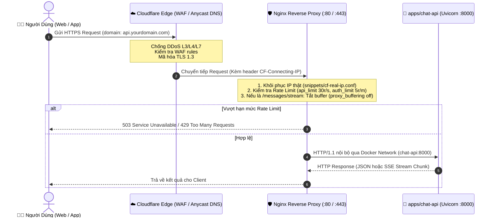
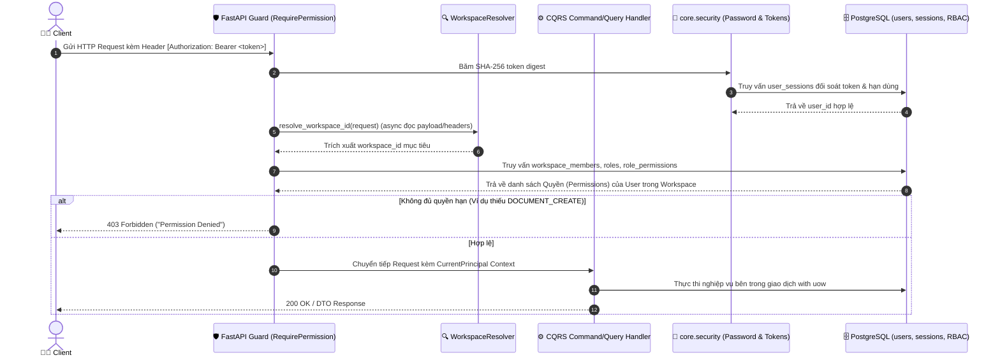
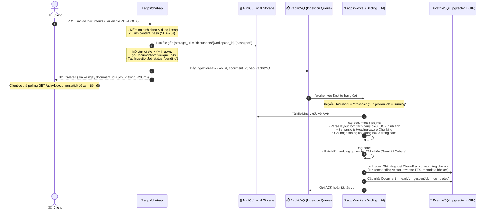
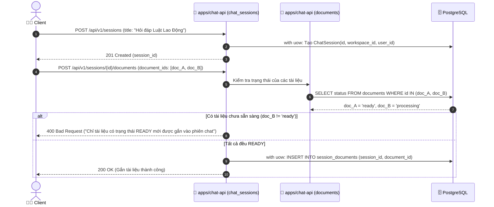
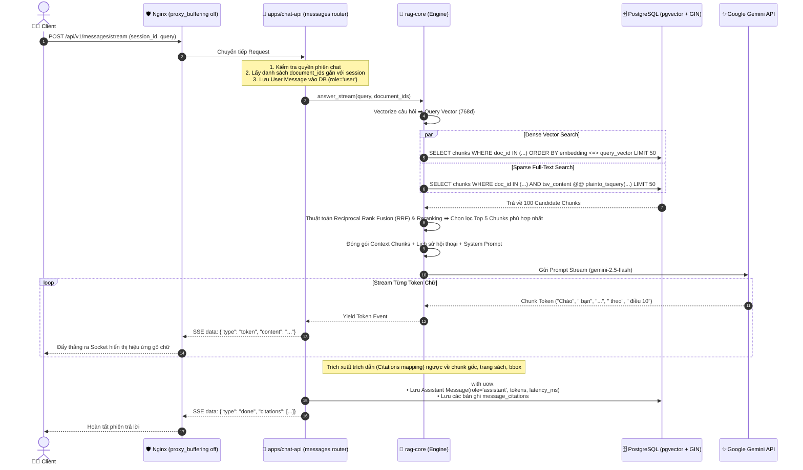
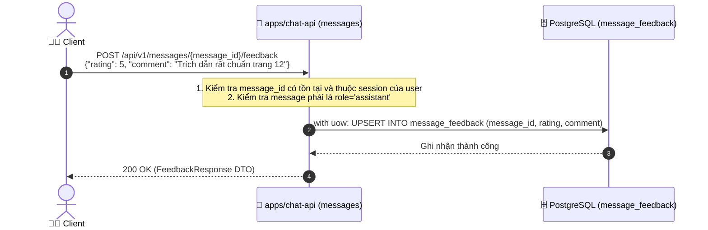
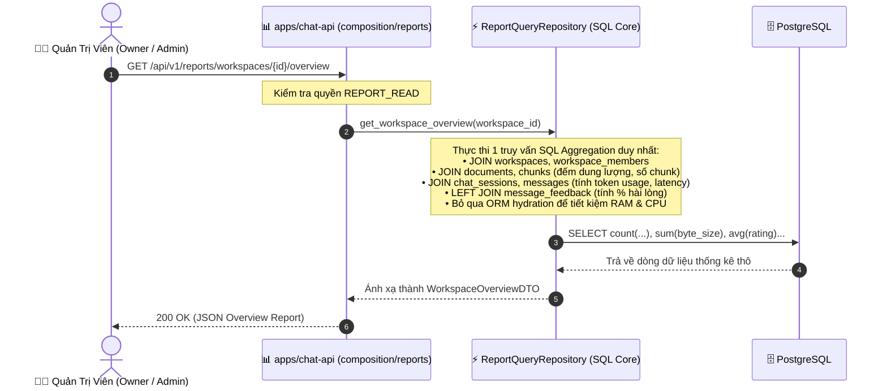
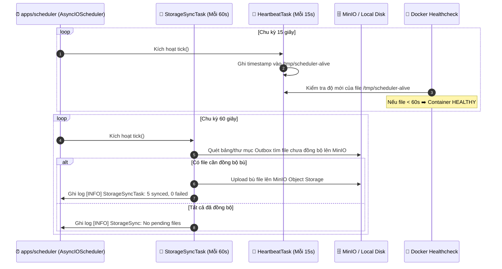

# TỔNG HỢP TOÀN BỘ CÁC LUỒNG HOẠT ĐỘNG HỆ THỐNG RAG (MASTER END-TO-END WORKFLOWS)

> **Hệ Thống**: RAG Platform Monorepo (Production Enterprise Grade)  
> **Kiến Trúc**: Modular Monolith + Vertical Slice DDD + CQRS + Asynchronous Workers  
> **Phiên Bản**: 1.0.0  
> **Mục Đích**: Tài liệu hóa chi tiết, trực quan toàn bộ **8 luồng nghiệp vụ end-to-end** từ biên mạng (Edge) đến cơ sở dữ liệu và các tác vụ nền.

---

## Danh Mục 8 Luồng Nghiệp Vụ Cốt Lõi

1. 🌐 [Luồng 1: Mạng Ngoại Vi, Reverse Proxy & Bảo Vệ Biên (Edge to API)](#1-luồng-1-mạng-ngoại-vi-reverse-proxy--bảo-vệ-biên)
2. 🔐 [Luồng 2: Xác Thực Danh Tính & Phân Quyền Đa Cấp (Authentication & Multi-Tenant RBAC)](#2-luồng-2-xác-thực-danh-tính--phân-quyền-đa-cấp)
3. 📥 [Luồng 3: Tải Lên & Bóc Tách Tài Liệu Bất Đồng Bộ (Async Document Ingestion)](#3-luồng-3-tải-lên--bóc-tách-tài-liệu-bất-đồng-bộ)
4. 💬 [Luồng 4: Quản Lý Phiên Chat & Gắn Tài Liệu (Chat Session & Document Binding)](#4-luồng-4-quản-lý-phiên-chat--gắn-tài-liệu)
5. ⚡ [Luồng 5: Truy Vấn RAG & Streaming Realtime (Hybrid Search & SSE Stream)](#5-luồng-5-truy-vấn-rag--streaming-realtime)
6. ⭐ [Luồng 6: Đánh Giá Tin Nhắn & Chất Lượng Phản Hồi (Message Feedback)](#6-luồng-6-đánh-giá-tin-nhắn--chất-lượng-phản-hồi)
7. 📊 [Luồng 7: Báo Cáo Thống Kê Tổng Hợp Đa Module (API Composition & Reporting)](#7-luồng-7-báo-cáo-thống-kê-tổng-hợp-đa-module)
8. ⏰ [Luồng 8: Tác Vụ Lập Lịch Chạy Ngầm (Background Scheduler Engine)](#8-luồng-8-tác-vụ-lập-lịch-chạy-ngầm)

---

## 1. Luồng 1: Mạng Ngoại Vi, Reverse Proxy & Bảo Vệ Biên

Luồng đón nhận kết nối từ người dùng Internet, kiểm soát lưu lượng, giải mã SSL và chuyển tiếp an toàn vào ứng dụng.

### Các quy tắc cốt lõi:
- **Tối giản Process**: Nginx chỉ chạy 1-2 worker processes xử lý non-blocking I/O (`epoll`).
- **Cô lập bảo vệ**: Máy chủ đóng toàn bộ cổng direct, chỉ Nginx lắng nghe port 80/443.
- **Chi tiết cấu hình**: Xem tại [docs/nginx_cloudflare_architecture.md](nginx_cloudflare_architecture.md).

---

## 2. Luồng 2: Xác Thực Danh Tính & Phân Quyền Đa Cấp

Quản lý đăng ký, đăng nhập, cấp phát Token an toàn và phân giải quyền hạn truy cập theo từng Không gian làm việc (Workspace).

### Các quy tắc cốt lõi:
- **Session Token bảo mật**: Token lưu trong CSDL là chuỗi băm **SHA-256 digest** (không lưu raw token).
- **Mã hóa mật khẩu**: Thuật toán `bcrypt` độc lập tại [core/security/password.py](../core/src/core/security/password.py).
- **Không phụ thuộc tầng Web**: Domain & Handlers chỉ nhận `CurrentPrincipal`, không phụ thuộc vào FastAPI request.

---

## 3. Luồng 3: Tải Lên & Bóc Tách Tài Liệu Bất Đồng Bộ

Đảm bảo tác vụ OCR và băm vector nặng hàng trăm trang PDF **không bao giờ làm nghẽn API** của người dùng.

### Các quy tắc cốt lõi:
- **Tính Idempotency (Chống trùng lặp)**: Nếu cùng 1 workspace upload file trùng `content_hash`, hệ thống tái sử dụng bản ghi cũ, không băm embedding lại.
- **Dead-Letter Queue (DLQ)**: Nếu worker gặp lỗi định dạng file hoặc crash quá 3 lần, job được ném vào `document.dlq` để đội ngũ vận hành đối soát.

---

## 4. Luồng 4: Quản Lý Phiên Chat & Gắn Tài Liệu

Thiết lập không gian hội thoại và định nghĩa phạm vi ngữ cảnh tri thức (Knowledge Context Boundary).

---

## 5. Luồng 5: Truy Vấn RAG & Streaming Realtime

Trái tim của hệ thống: Tìm kiếm kết hợp (Hybrid Search), Reranking, sinh câu trả lời LLM và stream từng token về giao diện.

### Các quy tắc cốt lõi:
- **Tắt Buffering hoàn toàn**: Nginx cấu hình `proxy_buffering off;` giúp gói tin truyền đi ngay lập tức.
- **Hybrid Search**: Kết hợp Cosine Similarity (Dense) + GIN tsvector (Sparse) giúp tìm đúng cả từ khóa viết tắt lẫn ngữ nghĩa trừu tượng.
- **Trích dẫn chuẩn xác**: Mọi câu trả lời đều có trích dẫn liên kết đến `page_number` và `bboxes` để người dùng kiểm chứng tài liệu gốc.

---

## 6. Luồng 6: Đánh Giá Tin Nhắn & Chất Lượng Phản Hồi

Thu thập phản hồi của người dùng để cải thiện độ chính xác và đánh giá chất lượng prompt.

---

## 7. Luồng 7: Báo Cáo Thống Kê Tổng Hợp Đa Module

Tầng **API Composition Layer** thực hiện tổng hợp dữ liệu phân tích liên module với tốc độ cao mà không làm phá vỡ ranh giới Clean Architecture.

---

## 8. Luồng 8: Tác Vụ Lập Lịch Chạy Ngầm (Scheduler Engine)

Tiến trình độc lập `apps/scheduler` vận hành các chu kỳ kiểm tra tự động mà không can thiệp vào tiến trình Web API.

---

## Ma Trận Tổng Hợp Trách Nhiệm Các Thành Phần

| Thành Phần | Trách Nhiệm Chính | Giao Thức / Cơ Chế | Công Nghệ Cốt Lõi |
| :--- | :--- | :--- | :--- |
| **Nginx** | Reverse Proxy, Rate Limiting, SSL, SSE passthrough | TCP Socket (:80, :443) | C, epoll, non-blocking |
| **`apps/chat-api`** | Quản lý nghiệp vụ, phân quyền, phiên chat, điều phối RAG | HTTP / SSE ASGI | FastAPI, SQLAlchemy 2.0, AnyIO |
| **`apps/worker`** | Xử lý file nặng, OCR, Chunking, Embedding | Message Consumer (AMQP) | Docling, PyMuPDF, Gemini API, RabbitMQ |
| **`apps/scheduler`** | Lập lịch retry đồng bộ MinIO, kiểm tra sức khỏe | Timers / Cron | APScheduler 3.x (AsyncIOScheduler) |
| **`core`** | Khung nền tảng (DB, UoW, CQRS, Storage, Queue, Security, Logs) | Shared Python Library | Pydantic, SQLAlchemy, bcrypt, aio-pika |
| **`packages/rag-core`** | Thuật toán RAG lõi: Hybrid Search, Reranking, Prompting | Pure Python Engine | pgvector, TSVector, Gemini SDK |
| **`packages/rag-document-pipeline`** | Bóc tách cấu trúc, băm ngữ nghĩa, trích xuất tọa độ bbox | Pure Data Pipeline | Docling, Pydantic |

---

## Liên Kết Tài Liệu Kỹ Thuật Chuyên Sâu
- [Tài liệu Thiết kế Kiến trúc Master (docs/architecture.md)](architecture.md)
- [Kiến trúc Mạng Ngoại Vi Nginx & Cloudflare (docs/nginx_cloudflare_architecture.md)](nginx_cloudflare_architecture.md)
- [Kiến trúc Triển khai CI/CD Production (docs/cicd_deployment_architecture.md)](cicd_deployment_architecture.md)
- [Thiết kế Cơ sở dữ liệu 15 bảng & pgvector (docs/database_design.md)](database_design.md)
- [Kiến trúc Hàng đợi Ingestion RabbitMQ (docs/rabbitmq_architecture.md)](rabbitmq_architecture.md)
- [Kiến trúc Lưu trữ Phân tầng Storage (docs/storage_architecture.md)](storage_architecture.md)
- [Kiến trúc Động cơ Scheduler (docs/scheduler_architecture.md)](scheduler_architecture.md)
