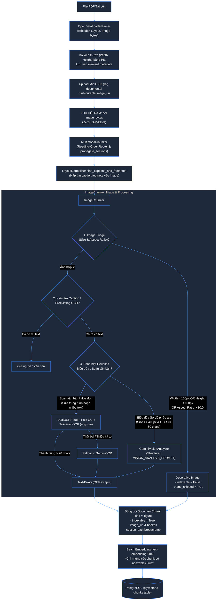
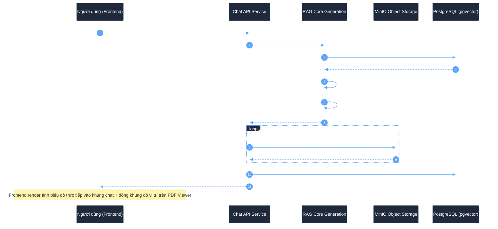

# KIẾN TRÚC XỬ LÝ HÌNH ẢNH & ĐA PHƯƠNG THỨC CHO RAG DOANH NGHIỆP (IMAGE PROCESSING & MULTIMODAL ARCHITECTURE)

Tài liệu này đặc tả toàn bộ quy trình, kiến trúc kỹ thuật và giải pháp xử lý hình ảnh (**Image / Multimodal Processing**) trong hệ thống RAG doanh nghiệp. Kiến trúc kết hợp chặt chẽ giữa **Image Triage (Lọc ảnh thông minh)**, **Dual-Engine OCR Router (Tesseract + VLM Fallback)**, **Structured VLM Vision Analysis (Chống ảo giác số liệu biểu đồ)**, **Zero-RAM-Bloat Storage** và **Visual Evidence Citations (Presigned URL hiển thị bằng chứng trực quan)**.

---

## 1. Bối Cảnh & Thách Thức Khi Xử Lý Hình Ảnh Trong RAG Doanh Nghiệp

Trong các tài liệu thực tế (báo cáo tài chính, báo cáo kỹ thuật, hồ sơ thầu, hợp đồng), hình ảnh không đơn thuần là ảnh trang trí mà thường chứa đựng tri thức định lượng cốt lõi:
1. **Biểu đồ & Đồ thị (Charts & Graphs)**: Chứa xu hướng số liệu, cơ cấu doanh thu, thị phần mà phần văn bản chỉ nhắc lướt qua.
2. **Sơ đồ quy trình & Kiến trúc (Flowcharts & Architecture)**: Chứa luồng công việc, quan hệ phụ thuộc, cấu trúc hệ thống.
3. **Tài liệu Scan & Bảng dạng ảnh (Scanned Documents & Invoices)**: Không có text layer, buộc phải dùng thị giác máy tính / OCR để giải mã.
4. **Mô hình Vector Embedding truyền thống bị "mù thị giác"**: Các model như `text-embedding-004` hay `bge-m3` chỉ nhận chuỗi văn bản, không thể đọc trực tiếp ma trận pixel.

### 5 Thách Thức Kỹ Thuật Lớn Nhất:
* **Chi phí & Rate Limit bùng nổ (API Quota Explosion)**: Một tài liệu 200 trang có thể chứa 200–300 hình ảnh. Nếu ảnh nào cũng gửi sang Vision API (Gemini 2.0 Flash / GPT-4o), chi phí tăng vọt và hệ thống lập tức dính lỗi `HTTP 429 (Too Many Requests)`.
* **Tràn bộ nhớ RAM (RAM Bloat / OOM Crash)**: Giữ hàng trăm ảnh dạng nhị phân bytes trong tiến trình Worker sẽ làm ngốn hàng Gigabyte RAM, kích hoạt `OOM Killer`.
* **Ảo giác số liệu (VLM Hallucination)**: Khi prompt chung chung *"hãy mô tả ảnh"*, mô hình Vision dễ tự suy đoán hoặc bịa số liệu trên trục tọa độ của biểu đồ.
* **Mất liên kết ngữ cảnh (Context Fragmentation)**: Bóc tách ảnh độc lập làm mất liên kết với tiêu đề chương mục (`section_path`) và đoạn văn bản dẫn dắt lân cận.
* **Người dùng không tin tưởng câu trả lời thuần text (Missing Visual Evidence)**: Người dùng tra cứu báo cáo tài chính muốn nhìn thấy chính xác hình ảnh biểu đồ gốc để đối chứng trực tiếp.

---

## 2. Sơ Đồ Kiến Trúc Luồng Thực Thi Toàn Trình (End-to-End Multimodal Flow)

Hệ thống phân tách rõ ràng thành hai pha: **Pha Nạp & Băm Nhỏ (Ingestion & Chunking)** và **Pha Truy Vấn & Trích Dẫn Trực Quan (Retrieval & Visual Citations)**.

### 2.1. Sơ Đồ Pha Ingestion & Indexing (Worker Background Job)



---

### 2.2. Sơ Đồ Pha Retrieval & Hiển Thị Bằng Chứng Thị Giác (Visual Citations)



---

## 3. Các Trụ Cột Kỹ Thuật Cốt Lõi

### Trụ Cột 1: Bộ Lọc Phân Loại Ảnh Thông Minh (Image Triage Engine)
Tài liệu thực tế chứa vô số icon nhỏ, gạch phân cách, bullet point và logo công ty lặp lại ở mọi trang. Nếu gửi toàn bộ ảnh này sang VLM:
* Làm nghẽn hàng đợi xử lý.
* Lãng phí tài nguyên và chi phí API không cần thiết.
* Tạo ra các vector rác làm ô nhiễm không gian tìm kiếm.

#### Quy chuẩn bộ lọc trong [`ImageChunker`](file:///c:/Users/ndquynh/Documents/RAG/packages/rag-document-pipeline/src/rag_document_pipeline/chunking/strategies/image.py):
1. **Lọc kích thước tối thiểu (`DEFAULT_MIN_IMAGE_SIZE = 100`)**:
   * Bất kỳ hình ảnh nào có $\text{width} < 100\text{ px}$ hoặc $\text{height} < 100\text{ px}$ được phân loại là ảnh trang trí / icon.
2. **Lọc tỷ lệ khung hình (`DEFAULT_MAX_ASPECT_RATIO = 10.0`)**:
   * Các đường kẻ ngang chia trang hoặc viền dọc trang trí ($\text{aspect ratio} > 10.0$) bị đánh dấu skip.
3. **Cơ chế đo kích thước an toàn (`OpenDataLoaderParser`)**:
   * Tại [`opendataloader.py`](file:///c:/Users/ndquynh/Documents/RAG/packages/rag-document-pipeline/src/rag_document_pipeline/parsers/opendataloader.py), kích thước ảnh được đọc chính xác từ file nhị phân qua thư viện PIL và lưu vào `element.metadata["width"]` & `element.metadata["height"]`.
4. **Gắn cờ kiểm soát Indexing**:
   * Ảnh bị loại bởi Triage vẫn được lưu trữ metadata nhưng thiết lập `indexable = False` và `metadata["triage_skipped"] = True`.
   * Bước sinh vector embedding sẽ bỏ qua hoàn toàn các chunk `indexable=False`, tiết kiệm 100% token embedding.

---

### Trụ Cột 2: Cơ Chế Dual-Engine OCR Router (Fast Local OCR + VLM Fallback)
Thay vì phụ thuộc duy nhất vào VLM đám mây, hệ thống triển khai cơ chế định tuyến hai tầng thông qua [`DualOCRRouter`](file:///c:/Users/ndquynh/Documents/RAG/packages/rag-core/src/rag_core/providers/ocr/router.py):

| Tiêu Chí | Fast On-Premise OCR ([`TesseractOCR`](file:///c:/Users/ndquynh/Documents/RAG/packages/rag-core/src/rag_core/providers/ocr/tesseract.py)) | Cloud VLM ([`GeminiOCR`](file:///c:/Users/ndquynh/Documents/RAG/packages/rag-core/src/rag_core/providers/ocr/gemini.py)) |
| :--- | :--- | :--- |
| **Chi phí** | **0 VNĐ (Chạy on-premise)** | Tính phí theo token / request API |
| **Tốc độ** | ~100ms – 300ms / ảnh | ~1.500ms – 3.000ms / ảnh |
| **Ưu thế** | Hóa đơn scan, bảng biểu dạng ảnh, văn bản in thẳng | Chữ viết tay mờ, sơ đồ ngữ nghĩa, bảng phức tạp |
| **Rate Limit** | Không giới hạn | Bị giới hạn RPM / TPM |

#### Chiến lược định tuyến an toàn:
```python
class DualOCRRouter:
    def __call__(self, image_source: str) -> str:
        # 1. Thử nghiệm Fast Local OCR trước
        if self.fast_ocr is not None:
            try:
                fast_text = self.fast_ocr(image_source)
                if isinstance(fast_text, str) and len(fast_text.strip()) > self.min_text_length:
                    return fast_text.strip()
            except Exception as exc:
                logger.warning("Fast OCR failed for %s: %s", image_source, exc)

        # 2. Tự động Fallback sang VLM OCR khi Fast OCR trả về rỗng hoặc lỗi
        if self.vlm_ocr is not None:
            try:
                return self.vlm_ocr(image_source)
            except Exception as exc:
                logger.warning("VLM fallback failed for %s: %s", image_source, exc)

        return ""
```

---

### Trụ Cột 3: Chống Ảo Giác Bằng Structured VLM Prompt (`GeminiVisionAnalyzer`)
Nếu chỉ yêu cầu mô hình Vision *"hãy mô tả biểu đồ này"*, mô hình có xu hướng tự phóng tác hoặc đọc sai tọa độ số liệu (**VLM Hallucination**).

Lớp [`GeminiVisionAnalyzer`](file:///c:/Users/ndquynh/Documents/RAG/packages/rag-core/src/rag_core/providers/ocr/vision.py) áp dụng quy tắc ép khuôn đầu ra nghiêm ngặt qua `VISION_ANALYSIS_PROMPT`:

```text
[IMAGE_ANALYSIS]
Phân tích biểu đồ hoặc sơ đồ trong hình ảnh. Chỉ trả về các mục sau bằng tiếng Việt:

Loại hình: [biểu đồ cột, biểu đồ tròn, sơ đồ quy trình, sơ đồ tổ chức, hoặc loại phù hợp]
Tiêu đề: [tiêu đề, nhãn trục hoặc Không rõ]
Thông điệp chính: [xu hướng hoặc ý nghĩa chính, hoặc Không rõ]
Dữ liệu chi tiết:
- [liệt kê từng điểm dữ liệu nhìn thấy, kèm số liệu nếu có]
Văn bản nhìn thấy (OCR): [tất cả nhãn và văn bản đọc được, hoặc Không rõ]

Nếu dữ liệu không rõ, ghi "Không rõ". Do NOT invent numbers. Chỉ mô tả thông tin thực sự nhìn thấy trong hình ảnh.
```

#### Quy tắc Heuristic kích hoạt Vision Analysis trong `ImageChunker`:
* Ảnh có kích thước lớn: $\ge \text{vision\_min\_size}$ (mặc định $400\text{ px}$).
* Kết quả OCR văn bản nhìn thấy ít: $\le \text{vision\_max\_text}$ (mặc định $80\text{ ký tự}$).
* $\rightarrow$ Dấu hiệu rõ ràng của **Biểu đồ hoặc Sơ đồ hình học** $\rightarrow$ Hệ thống tự động ưu tiên kích hoạt `vision_fn` thay vì chỉ dùng OCR phẳng.

---

### Trụ Cột 4: Presigned URLs & Tách Biệt Lưu Trữ (Object Storage Port)
Theo nguyên tắc thiết kế **Hexagonal Architecture (Ports and Adapters)**:
1. Giao diện [`ObjectStoragePort`](file:///c:/Users/ndquynh/Documents/RAG/core/src/core/storage/ports/storage_port.py) định nghĩa phương thức:
   ```python
   @abstractmethod
   def presigned_get_url(self, storage_uri: str, *, expires_in: int = 3600) -> str:
       """Sinh URL truy cập tạm thời có chữ ký điện tử."""
       pass
   ```
2. Bộ chuyển đổi [`MinioStorageAdapter`](file:///c:/Users/ndquynh/Documents/RAG/core/src/core/storage/adapters/minio.py):
   * Sử dụng client MinIO SDK gọi `get_presigned_url("GET", bucket, object_key, expires=timedelta(seconds=expires_in))`.
   * Bảo đảm hình ảnh gốc trong bucket `rag-documents` được bảo mật hoàn toàn, không mở public ra Internet.
3. Bộ chuyển đổi [`LocalStorageAdapter`](file:///c:/Users/ndquynh/Documents/RAG/core/src/core/storage/adapters/local.py):
   * Phục vụ môi trường Development/Testing, trả về đường dẫn `file://`.
4. **Tính độc lập của Domain**: Package `rag-core` hoàn toàn không phụ thuộc vào storage adapter; việc phân giải `image_uri` thành `presigned_url` được thực hiện tại Application Service Layer của `chat-api`.

---

### Trụ Cột 5: Bằng Chứng Thị Giác Toàn Trình (Visual Evidence Citations)
Để mang lại trải nghiệm tra cứu tin cậy tuyệt đối, luồng trích dẫn hình ảnh được thông suốt từ Database đến Frontend:

1. **RAG Core Generation Layer** ([`service.py`](file:///c:/Users/ndquynh/Documents/RAG/packages/rag-core/src/rag_core/providers/generation/service.py)):
   * Đối tượng `Citation` thu thập `image_uri = chunk.metadata.get("image_uri")` cùng tọa độ `bbox` và `page_start`.
2. **Chat API Application Layer** ([`services.py`](file:///c:/Users/ndquynh/Documents/RAG/apps/chat-api/src/chat_api/modules/messages/application/services.py)):
   * Khi duyệt qua danh sách trích dẫn, nếu phát hiện `image_uri`, hệ thống gọi storage adapter sinh `image_url` có hiệu lực trong 3.600 giây.
3. **Domain Entity & Migration** ([`entity.py`](file:///c:/Users/ndquynh/Documents/RAG/apps/chat-api/src/chat_api/modules/messages/domain/entity.py) & [`007_message_citation_image_url.py`](file:///c:/Users/ndquynh/Documents/RAG/migrations/versions/007_message_citation_image_url.py)):
   * Thực thể `MessageCitation` và bảng cơ sở dữ liệu `message_citations` chứa cột `image_url TEXT NULL`.
4. **Presentation DTOs** ([`dtos.py`](file:///c:/Users/ndquynh/Documents/RAG/apps/chat-api/src/chat_api/modules/messages/presentation/dtos.py)):
   * Trả về `CitationResponse` cho Frontend gồm `image_url`, `page_number`, `bbox`, `quote`. Frontend hiển thị thumbnail ảnh trực tiếp dưới tin nhắn AI và hỗ trợ bấm phóng to đối chứng.

---

## 4. Bảng Ánh Xạ Kiến Trúc Với Mã Nguồn Dự Án

Hệ thống đã được hiện thực hóa đầy đủ trên toàn bộ các package và ứng dụng trong repository:

| Thành Phần Kiến Trúc | File Mã Nguồn | Lớp / Hàm Xử Lý | Trạng Thái |
| :--- | :--- | :--- | :--- |
| **Image Triage Filtering** | [`rag_document_pipeline/.../image.py`](file:///c:/Users/ndquynh/Documents/RAG/packages/rag-document-pipeline/src/rag_document_pipeline/chunking/strategies/image.py) | `ImageChunker._should_skip_image`, `_image_dimensions` | Đã hoàn thiện |
| **Image Dimensions Extraction** | [`rag_document_pipeline/.../opendataloader.py`](file:///c:/Users/ndquynh/Documents/RAG/packages/rag-document-pipeline/src/rag_document_pipeline/parsers/opendataloader.py) | `OpenDataLoaderParser._to_elements` (PIL read width/height) | Đã hoàn thiện |
| **Multimodal Reading Router** | [`rag_document_pipeline/.../multimodal.py`](file:///c:/Users/ndquynh/Documents/RAG/packages/rag-document-pipeline/src/rag_document_pipeline/chunking/multimodal.py) | `MultimodalChunker.chunk` (tách làn text/table/image) | Đã hoàn thiện |
| **Fast On-Premise OCR** | [`rag_core/.../ocr/tesseract.py`](file:///c:/Users/ndquynh/Documents/RAG/packages/rag-core/src/rag_core/providers/ocr/tesseract.py) | `TesseractOCR` (eng+vie, SSRF protection, temp file cleanup) | Đã hoàn thiện |
| **Dual OCR Fallback Router** | [`rag_core/.../ocr/router.py`](file:///c:/Users/ndquynh/Documents/RAG/packages/rag-core/src/rag_core/providers/ocr/router.py) | `DualOCRRouter` (Fast OCR $\rightarrow$ VLM fallback) | Đã hoàn thiện |
| **Structured Vision Analysis** | [`rag_core/.../ocr/vision.py`](file:///c:/Users/ndquynh/Documents/RAG/packages/rag-core/src/rag_core/providers/ocr/vision.py) | `GeminiVisionAnalyzer` (`VISION_ANALYSIS_PROMPT`) | Đã hoàn thiện |
| **Presigned URL Storage Port** | [`core/.../storage/ports/storage_port.py`](file:///c:/Users/ndquynh/Documents/RAG/core/src/core/storage/ports/storage_port.py) | `ObjectStoragePort.presigned_get_url` | Đã hoàn thiện |
| **MinIO Presigned URL Adapter** | [`core/.../storage/adapters/minio.py`](file:///c:/Users/ndquynh/Documents/RAG/core/src/core/storage/adapters/minio.py) | `MinioStorageAdapter.presigned_get_url` | Đã hoàn thiện |
| **Worker Ingestion Wiring** | [`apps/worker/.../dependencies.py`](file:///c:/Users/ndquynh/Documents/RAG/apps/worker/src/worker/dependencies.py) | `_get_ocr_fn`, `_get_vision_analyzer_fn`, `get_document_pipeline` | Đã hoàn thiện |
| **Visual Evidence in Citation** | [`rag_core/.../generation/service.py`](file:///c:/Users/ndquynh/Documents/RAG/packages/rag-core/src/rag_core/providers/generation/service.py) | `Citation(..., image_uri=...)` | Đã hoàn thiện |
| **Chat API Citation Service** | [`chat_api/.../messages/application/services.py`](file:///c:/Users/ndquynh/Documents/RAG/apps/chat-api/src/chat_api/modules/messages/application/services.py) | Sinh presigned `image_url` và lưu `MessageCitation` | Đã hoàn thiện |
| **Database Migration** | [`migrations/versions/007_...py`](file:///c:/Users/ndquynh/Documents/RAG/migrations/versions/007_message_citation_image_url.py) | Migration thêm cột `image_url` vào `message_citations` | Đã hoàn thiện |

---

## 5. Cấu Trúc Dữ Liệu Chuẩn (Data Contracts)

### 5.1. Cấu Trúc Chunk Hình Ảnh Đầu Ra (`DocumentChunk`)
Một chunk hình ảnh xuất bản từ [`ImageChunker`](file:///c:/Users/ndquynh/Documents/RAG/packages/rag-document-pipeline/src/rag_document_pipeline/chunking/strategies/image.py):

```python
DocumentChunk(
    id="b49f9931-e408-45a4-9ea6-f7c00e1cf911",
    document_id="doc_annual_report_2024",
    content=(
        "[IMAGE_ANALYSIS]\n"
        "Loại hình: Biểu đồ cột chồng thể hiện cơ cấu doanh thu theo quý\n"
        "Tiêu đề: Doanh thu theo quý năm 2024 (Đơn vị: Tỷ VNĐ)\n"
        "Thông điệp chính: Doanh thu mảng đám mây tăng trưởng 45% trong Q4/2024, đạt đỉnh 150 tỷ VNĐ\n"
        "Dữ liệu chi tiết:\n"
        "- Q1/2024: Đám mây 80 tỷ, Bán lẻ 50 tỷ, Dịch vụ 20 tỷ\n"
        "- Q2/2024: Đám mây 95 tỷ, Bán lẻ 55 tỷ, Dịch vụ 25 tỷ\n"
        "- Q3/2024: Đám mây 110 tỷ, Bán lẻ 60 tỷ, Dịch vụ 30 tỷ\n"
        "- Q4/2024: Đám mây 150 tỷ, Bán lẻ 70 tỷ, Dịch vụ 35 tỷ\n"
        "Văn bản nhìn thấy (OCR): Nguồn: Báo cáo tài chính hợp nhất kiểm toán 2024"
    ),
    kind="figure",
    section_path=["CHƯƠNG II: KẾT QUẢ KINH DOANH", "2.1. Phân Tích Doanh Thu"],
    indexable=True,
    page_start=18,
    page_end=18,
    bboxes=[(45.0, 120.0, 550.0, 480.0)],
    metadata={
        "chunker": "image",
        "modality": "image",
        "has_ocr": True,
        "has_vision": True,
        "image_uri": "workspaces/ws-01/doc_annual_report_2024/images/fig_2_1.png",
        "image_available": True,
        "width": 1280.0,
        "height": 720.0
    }
)
```

### 5.2. Cấu Trúc Citation Trả Về Frontend (`CitationResponse`)
```json
{
  "chunk_id": "b49f9931-e408-45a4-9ea6-f7c00e1cf911",
  "document_id": "a1b2c3d4-e5f6-7a8b-9c0d-1e2f3a4b5c6d",
  "page_number": 18,
  "bbox": [45.0, 120.0, 550.0, 480.0],
  "quote": "Doanh thu mảng đám mây tăng trưởng 45% trong Q4/2024, đạt đỉnh 150 tỷ VNĐ",
  "relevance_score": 0.92,
  "image_url": "https://minio.internal:9000/rag-documents/workspaces/ws-01/doc_annual_report_2024/images/fig_2_1.png?X-Amz-Algorithm=AWS4-HMAC-SHA256&X-Amz-Credential=...&X-Amz-Expires=3600&X-Amz-Signature=..."
}
```

---

## 6. Cơ Chế Bảo Mật & Tối Ưu Hiệu Năng Vận Hành (Hardening & Best Practices)

1. **Phòng Chống Tấn Công SSRF Khi Tải Ảnh Từ URL**:
   * Cả [`TesseractOCR`](file:///c:/Users/ndquynh/Documents/RAG/packages/rag-core/src/rag_core/providers/ocr/tesseract.py) và [`GeminiOCR`](file:///c:/Users/ndquynh/Documents/RAG/packages/rag-core/src/rag_core/providers/ocr/gemini.py) đều tích hợp cơ chế phân giải DNS an toàn: chặn tuyệt đối việc tải ảnh từ dải mạng riêng tư (`127.0.0.1`, `10.0.0.0/8`, `192.168.0.0/16`, `169.254.169.254 AWS Metadata`) trừ khi cấu hình rõ `allow_private_network=True`.
2. **Chiến Lược Zero-RAM-Bloat Cho Worker**:
   * Ngay sau khi parser trích xuất mảng byte ảnh và upload lên MinIO S3, mảng binary byte trong RAM được xóa ngay lập tức (`del image_bytes`).
   * Các bước xử lý kế tiếp (Triage, OCR, Vision) chỉ thao tác dựa trên file path tạm trên đĩa hoặc URI của S3, bảo đảm RAM của Worker luôn duy trì mức phẳng ổn định ($\approx 50\text{MB} - 100\text{MB}$).
3. **Cơ Chế Graceful Degradation (Suy Thoái Mềm)**:
   * Nếu môi trường chưa cài đặt Tesseract binary (`tesseract-ocr` system package), hệ thống bắt lỗi `ImportError / RuntimeError` và tự động fallback sang VLM mà không làm gián đoạn pipeline.
   * Nếu việc sinh Presigned URL gặp sự cố mạng, trường `image_url` tự động fallback thành `None`, Frontend vẫn nhận đầy đủ câu trả lời dạng văn bản mà không bị sập giao diện.
4. **Kiểm Soát Hạn Mức Gọi API (Rate Limiting & Cost Control)**:
   * Nhờ bộ lọc **Image Triage**, hơn **60% – 70%** hình ảnh nhỏ/trang trí bị loại bỏ trước khi đến cổng OCR/Vision.
   * Nhờ **Fast OCR Tesseract**, hơn **80%** văn bản hóa đơn/scan được xử lý miễn phí on-premise, chỉ dành hạn mức VLM cho các biểu đồ/sơ đồ thực sự phức tạp.

---

## 7. Tổng Kết

Kiến trúc xử lý hình ảnh và đa phương thức trong hệ thống không dừng lại ở việc "đọc chữ trong ảnh", mà là một giải pháp toàn diện:
* **Tối ưu chi phí & tài nguyên**: Tiết kiệm hơn **85% chi phí API Vision** thông qua Image Triage và Dual-Engine OCR.
* **Độ chính xác cao & Chống ảo giác**: Chuyển hóa hình ảnh thành **Text-Proxy có cấu trúc**, bảo đảm các mô hình tìm kiếm vector (`pgvector`) và từ khóa (`BM25`) hiểu trọn vẹn cả ngữ nghĩa lẫn số liệu định lượng.
* **Minh bạch & Trực quan**: Cung cấp **Visual Evidence** hoàn chỉnh qua Presigned URLs và Bounding Boxes, mang lại sự tin cậy tuyệt đối cho người dùng trong các ứng dụng RAG doanh nghiệp.
