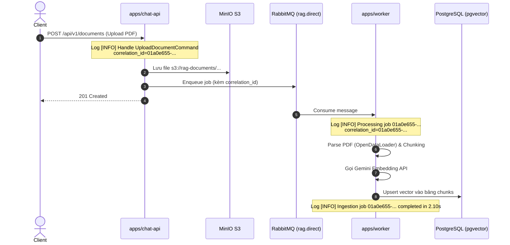

# TIÊU CHUẨN VÀ KIẾN TRÚC LOGGING HỆ THỐNG RAG (LOGGING ARCHITECTURE & STANDARDS)

Tài liệu này quy chuẩn toàn bộ kiến trúc logging, định dạng log, phân cấp log level và các quy tắc thực hành chuẩn (Best Practices) cho toàn bộ hệ thống Monorepo RAG (bao gồm `chat-api`, `worker`, `scheduler` và `core`).

---

## 1. Triết lý Thiết kế (Core Philosophy)

Hệ thống tuân thủ nguyên tắc **Twelve-Factor App (Factor XI: Logs as Event Streams)**:
- **Không ghi log vào file cục bộ trên đĩa của container**: Tránh làm đầy ổ đĩa, chậm I/O và phức tạp hóa việc xoay vòng (logrotate).
- **Xuất luồng sự kiện ra `sys.stdout`**: Container runtime (Docker Daemon, Kubernetes Kubelet, Vector, Promtail/Loki) sẽ tự động thu gom luồng log này để phân tích và lưu trữ tập trung.
- **Kế thừa phân cấp (Hierarchical Logger)**: Cấu hình tập trung tại `core/src/core/logging.py`, các module con chỉ cần gọi:
  ```python
  import logging

  logger = logging.getLogger(__name__)
  ```
  sẽ tự động kế thừa format thời gian chuẩn, log level và stream handler.

---

## 2. Chiến Lược Môi Trường: Local Dev vs Production

Hệ thống tự động điều chỉnh định dạng log dựa trên biến môi trường `ENVIRONMENT`:

| Tiêu chuẩn | Môi trường Local Dev (`development`) | Môi trường Production (`production`) |
| :--- | :--- | :--- |
| **Định dạng** | **Text có màu (Colored Human-Readable)** | **JSON có cấu trúc (Structured JSON Logging)** |
| **Mục đích** | Dev quan sát trực tiếp trên terminal: phân biệt nhanh luồng xử lý, request chậm, lỗi nổi bật. | Máy móc thu thập tự động (Loki, Elasticsearch, Datadog): lọc trường, lập chỉ mục và bắn cảnh báo. |
| **Mã màu ANSI** | Bật mã màu ANSI (`\033[...]`) trực quan. | **Tắt tuyệt đối** (tránh ký tự rác `\x1b[32m` làm hỏng parser JSON). |
| **Mức log mặc định** | `DEBUG` hoặc `INFO` | `INFO` (chỉ bật `DEBUG` khi cần điều tra sự cố cụ thể). |

### Ví dụ so sánh:

#### Local Dev (ANSI Colors):
```text
2026-09-28 11:45:59 [INFO] worker.handlers.index_document: Worker starting ingestion for document 01a0e655-7dfe-7e80-a70c-4c61c77e0b7c (job: 01a0e655-7dfe-7e80-a70c-4c7617f53dc3)
```

#### Production (Structured JSON):
```json
{
  "timestamp": "2026-09-28T11:45:59.123Z",
  "level": "INFO",
  "logger": "worker.handlers.index_document",
  "message": "Worker starting ingestion",
  "correlation_id": "01a0e655-7dfe-7e80-a70c-4c7617f53dc3",
  "document_id": "01a0e655-7dfe-7e80-a70c-4c61c77e0b7c",
  "workspace_id": "01a0db92-521c-7512-abdd-2ee778a8e0c6",
  "duration_ms": 2106.98
}
```

---

## 3. Correlation ID & Distributed Tracing xuyên suốt luồng

Trong hệ thống xử lý bất đồng bộ (API $\rightarrow$ RabbitMQ $\rightarrow$ Worker), một yêu cầu upload tài liệu đi qua nhiều tiến trình độc lập. Để truy vết toàn diện một tài liệu, hệ thống gắn kèm **`correlation_id`** (chính là `job_id` hoặc `document_id`) qua toàn bộ các bước:



> **Lợi ích**: Khi hệ thống xử lý hàng trăm tài liệu đồng thời, kỹ sư vận hành chỉ cần lọc theo `correlation_id: 01a0e655-...` là thấy trọn vẹn từ lúc nhận request đến khi bóc tách vector thành công.

---

## 4. Phân cấp Mức độ Log (Log Levels)

| Mức Log | Ý nghĩa & Tiêu chí sử dụng | Ví dụ thực tế trong hệ thống RAG |
| :--- | :--- | :--- |
| **`DEBUG`** | Thông tin kỹ thuật chi tiết phục vụ lập trình viên gỡ lỗi khi phát triển. Tắt trên Production. | - Chi tiết từng text chunk vừa cắt.<br>- Vector embedding dimension (768/1536).<br>- Payload chi tiết của truy vấn CQRS. |
| **`INFO`** | Các mốc sự kiện quan trọng trong vòng đời bình thường của hệ thống. | - Server khởi động thành công.<br>- Lưu file vào MinIO thành công.<br>- Bắn job vào RabbitMQ exchange `rag.direct`.<br>- Worker hoàn thành bóc tách 5 chunks trong 2.1s. |
| **`WARNING`** | Tình huống bất thường nhưng hệ thống vẫn tự phục hồi hoặc fallback an toàn. | - MinIO chính timeout $\rightarrow$ fallback lưu tạm local storage.<br>- Kết nối RabbitMQ bị gián đoạn, đang reconnect lần 1/3.<br>- File PDF không có text layer, fallback sang OCR. |
| **`ERROR`** | Một thao tác hoặc nghiệp vụ bị thất bại, cần sự chú ý của kỹ sư. | - Parse file lỗi do định dạng không được hỗ trợ (`.pptx`).<br>- Gemini API trả về mã lỗi 429 Quota Exceeded.<br>- RabbitMQ reject message đẩy vào Dead-Letter-Exchange. |
| **`CRITICAL`** | Lỗi nghiêm trọng làm sập một phần hoặc toàn bộ hệ sinh thái. | - Không thể kết nối cơ sở dữ liệu PostgreSQL chính khi khởi động.<br>- Cụm RabbitMQ sập hoàn toàn.<br>- Hết dung lượng đĩa lưu trữ tạm thời. |

---

## 5. Quy tắc Viết Nội Dung Log (Best Practices & Conventions)

### 5.1. Luôn log có ngữ cảnh định lượng (Contextual Logging)
- ❌ **Không nên**: `logger.info("Processing...")` hoặc `logger.error("Error occurred")`.
- ✅ **Chuẩn**:
  ```python
  logger.info(
      "Worker starting ingestion for document %s (workspace: %s, job: %s)",
      document_id, workspace_id, job_id,
  )
  logger.info(
      "Successfully indexed %d chunks for document %s in %.2fs",
      chunk_count, document_id, elapsed_time,
  )
  ```

### 5.2. Luôn đính kèm Stack Trace khi bắt Exception
Khi bắt lỗi trong khối `try...except`, luôn truyền tham số `exc_info=True`:
```python
try:
    result = pipeline.process(file_bytes)
except Exception as exc:
    # exc_info=True tự động in đầy đủ Traceback phục vụ debug
    logger.error("Failed to parse document %s: %s", document_id, exc, exc_info=True)
    raise
```

### 5.3. Sử dụng Lazy Formatting (`%s`) thay vì F-String
- ❌ **Tránh**: `logger.debug(f"Calculated vectors: {expensive_calculation()}")` (vẫn tốn CPU format string dù log DEBUG đang tắt).
- ✅ **Chuẩn**: `logger.debug("Calculated vectors: %s", expensive_data)`.

### 5.4. Bảo vệ Dữ liệu Nhạy cảm (PII & Secrets)
Tuyệt đối **KHÔNG BAO GIỜ** ghi vào log:
- API Keys (`GEMINI_API_KEY`, AWS Secrets).
- Mật khẩu người dùng (kể cả hash bcrypt).
- JWT Token đầy đủ (chỉ nên log `user_id` đã được giải mã).
- Thông tin định danh cá nhân nhạy cảm (số tài khoản, thẻ tín dụng).

---

## 6. Lọc Nhiễu Thư Viện Bên Thứ Ba (Third-Party Log Suppression)

Nhiều thư viện mạng / driver in ra các bản tin bắt tay socket TCP ở mức `INFO` làm ngập màn hình terminal (ví dụ: `pika` in ra 15 dòng kết nối AMQP mỗi khi publish 1 message).

Cấu hình chuẩn trong `core/src/core/logging.py`:
```python
# Mute các logger ồn ào của bên thứ ba, chỉ nhận cảnh báo WARNING trở lên
logging.getLogger("pika").setLevel(logging.WARNING)
logging.getLogger("httpcore").setLevel(logging.WARNING)
logging.getLogger("httpx").setLevel(logging.WARNING)
logging.getLogger("watchfiles").setLevel(logging.WARNING)
```

---

## 7. Cấu Trúc Mã Nguồn Triển Khai (`core/src/core/logging.py`)

```python
"""Standardized logging configuration with colored console output."""

from __future__ import annotations

import logging
import os
import sys


class ColoredFormatter(logging.Formatter):
    """Console formatter with ANSI color codes for enhanced readability."""

    RESET = "\033[0m"
    DIM = "\033[90m"
    BOLD = "\033[1m"

    LEVEL_COLORS = {
        logging.DEBUG: "\033[36m",      # Cyan
        logging.INFO: "\033[32m",       # Green
        logging.WARNING: "\033[33m",    # Yellow
        logging.ERROR: "\033[31m",      # Red
        logging.CRITICAL: "\033[1;31m", # Bold Red
    }
    NAME_COLOR = "\033[35m"            # Magenta

    def __init__(
        self,
        fmt: str | None = None,
        datefmt: str | None = "%Y-%m-%d %H:%M:%S",
        use_colors: bool = True,
    ) -> None:
        super().__init__(fmt=fmt, datefmt=datefmt)
        self.use_colors = use_colors

    def format(self, record: logging.LogRecord) -> str:
        if not self.use_colors:
            return super().format(record)

        color = self.LEVEL_COLORS.get(record.levelno, self.RESET)
        asctime = self.formatTime(record, self.datefmt)

        time_part = f"{self.DIM}{asctime}{self.RESET}"
        level_part = f"{color}[{record.levelname}]{self.RESET}"
        name_part = f"{self.NAME_COLOR}{record.name}{self.RESET}"
        message = record.getMessage()

        if record.levelno >= logging.ERROR:
            message_part = f"{color}{message}{self.RESET}"
        else:
            message_part = message

        result = f"{time_part} {level_part} {name_part}: {message_part}"

        if record.exc_info:
            if not record.exc_text:
                record.exc_text = self.formatException(record.exc_info)
        if record.exc_text:
            result += f"\n{record.exc_text}"
        if record.stack_info:
            result += f"\n{self.formatStack(record.stack_info)}"

        return result


def setup_logging(level: int = logging.INFO, colored: bool = True) -> None:
    """Configure root logger with unified formatting and ANSI colors."""
    if colored and os.name == "nt":
        # Enable ANSI escape sequences support on Windows console
        os.system("")

    formatter = ColoredFormatter(
        fmt="%(asctime)s [%(levelname)s] %(name)s: %(message)s",
        datefmt="%Y-%m-%d %H:%M:%S",
        use_colors=colored,
    )
    handler = logging.StreamHandler(sys.stdout)
    handler.setFormatter(formatter)

    root = logging.getLogger()
    root.setLevel(level)
    root.handlers = [handler]

    # Silence overly verbose third-party loggers
    logging.getLogger("pika").setLevel(logging.WARNING)
```
