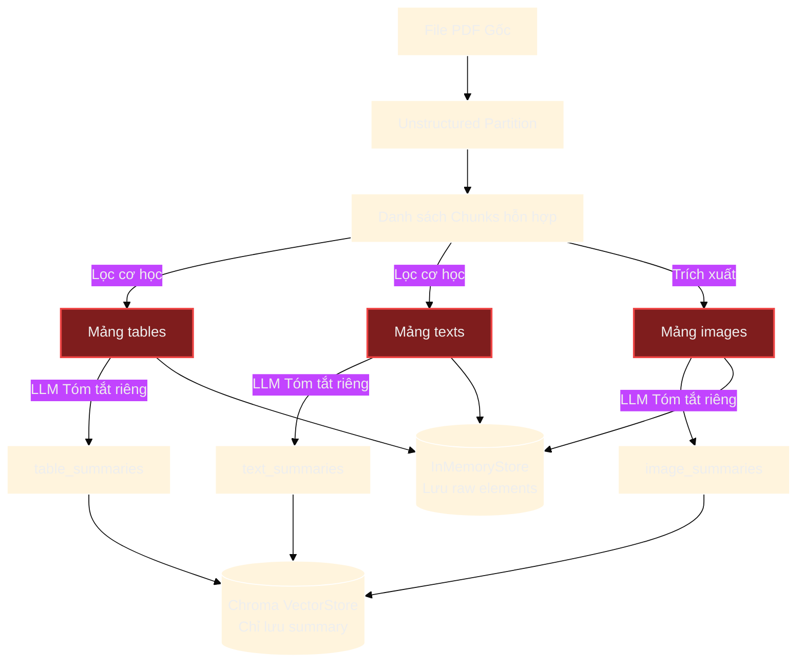
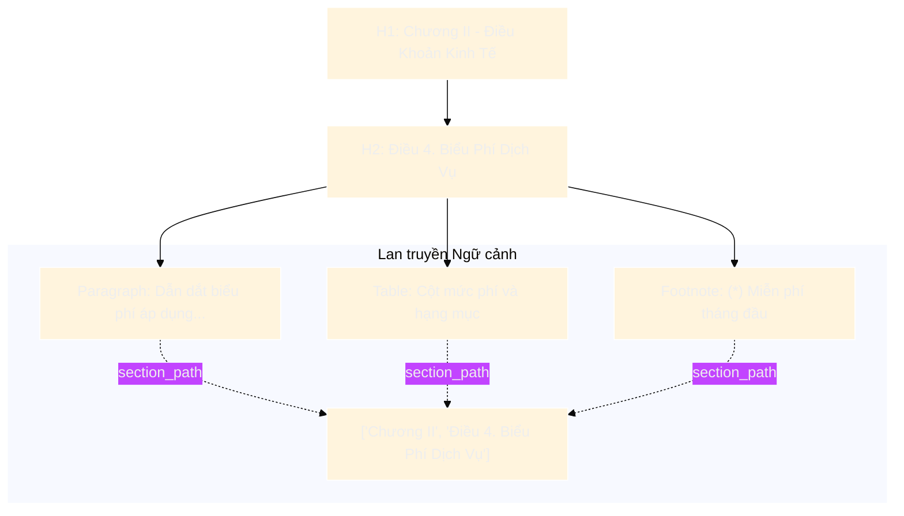
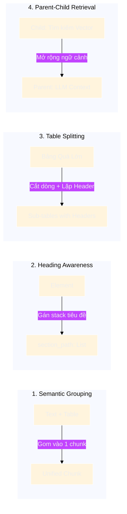

# PHÂN TÍCH CHUYÊN SÂU: HIỆN TƯỢNG PHÂN MẢNH NGỮ CẢNH (CONTEXT FRAGMENTATION) TRONG MULTIMODAL RAG VÀ GIẢI PHÁP THIẾT KẾ

Tài liệu này phân tích chi tiết về bài toán **Context Fragmentation (Phân mảnh ngữ cảnh)** hay **Semantic Decoupling (Mất liên kết ngữ nghĩa)** khi xử lý các phần tử liền kề (Adjacent Elements: Text, Table, Image) trong hệ thống Multimodal RAG. Đồng thời, tài liệu đối chiếu giữa cách tiếp cận **Tutorial / PoC (sử dụng trong `langchain_multimodal.ipynb`)** và **Kiến trúc Production RAG thực tế** đang được triển khai trong repository này.

---

## 1. Đặt Vấn Đề: Bài Toán 2 Phần Tử Liền Kề Mang Cùng Một Ngữ Nghĩa

Trong các văn bản phức tạp (hợp đồng pháp lý, báo cáo tài chính, tài liệu kỹ thuật, đề xuất dự án), thông tin hiếm khi tồn tại độc lập ở một định dạng đơn lẻ. Thông thường, một cấu trúc nội dung sẽ bao gồm chuỗi phần tử bổ trợ lẫn nhau:

```text
[Heading: 3. Lộ trình giải ngân]
         ↓
[Paragraph (Dẫn dắt): Chi tiết các đợt thanh toán cho giai đoạn năm 2024 được xác định như sau:]
         ↓
[Table: Bảng gồm 2 cột: Đợt thanh toán | Tỷ lệ (%) | Điều kiện nghiệm thu]
         ↓
[Footnote / Caption: (*) Không áp dụng phạt chậm trả nếu do lỗi của bên thứ ba quy định tại Điều 12.]
```

### Thách thức cốt lõi:
Nếu bộ chia cắt (Chunker) tách cơ học các phần tử này ra các nhóm độc lập (ví dụ: Text riêng, Table riêng, Footnote riêng), hệ thống sẽ gặp phải hiện tượng **Context Fragmentation**:
1. **Table bị "câm ngữ cảnh"**: Bảng số liệu chỉ có số và tỷ lệ, không có chữ *"năm 2024"* hay *"Lộ trình giải ngân"*.
2. **Text bị "cụt nội dung"**: Đoạn text dẫn dắt *"được xác định như sau:"* trở thành một câu cụt ngủn, vô nghĩa vì dữ liệu chi tiết đã bị bóc sang chunk khác.
3. **Mất điều kiện ràng buộc**: Footnote ghi chú loại trừ bị tách rời, khiến LLM bỏ sót ngoại lệ quan trọng khi sinh câu trả lời.

---

## 2. Case Study: Phân Tích Cách Tiếp Cận Trong `langchain_multimodal.ipynb`

### 2.1. Cơ chế thực hiện trong Notebook
Trong notebook tham khảo [`langchain_multimodal.ipynb`](file:///c:/Users/ndquynh/Documents/RAG/langchain_multimodal.ipynb), luồng xử lý tài liệu PDF diễn ra như sau:

```python
# 1. Trích xuất PDF qua Unstructured
chunks = partition_pdf(..., chunking_strategy="by_title")

# 2. TÁCH RỜI CƠ HỌC THEO KIỂU DỮ LIỆU (Naive Separation)
tables = []
texts = []
for chunk in chunks:
    if "Table" in str(type(chunk)):
        tables.append(chunk)
    if "CompositeElement" in str(type(chunk)):
        texts.append(chunk)

# 3. Tách Image từ CompositeElement
images = get_images_base64(chunks)

# 4. Tóm tắt độc lập từng mảng qua LLM
text_summaries = summarize_texts(texts)
table_summaries = summarize_tables(tables)
image_summaries = summarize_images(images)

# 5. Lưu tóm tắt vào Vector Store, Raw Data vào DocStore
retriever.vectorstore.add_documents(summary_tables)
retriever.docstore.mset(list(zip(table_ids, tables)))
```



### 2.2. Điểm yếu và Rủi ro chí mạng khi áp dụng vào thực tế

| Điểm hạn chế | Cơ chế gây lỗi trong Notebook | Hậu quả thực tế (Production Impact) |
| :--- | :--- | :--- |
| **Mất liên kết ngữ nghĩa (Semantic Decoupling)** | `tables`, `texts`, `images` bị chia vào 3 mảng hoàn toàn độc lập, xóa bỏ vị trí tương đối giữa chúng trên trang. | Bảng mất tiêu đề dẫn dắt; Text tham chiếu (*"như hình 3.1"*) mất liên kết tới hình ảnh. |
| **Lệch pha truy vấn (Retrieval Mismatch)** | Vector Store chỉ tìm kiếm trên bản tóm tắt của từng đối tượng độc lập. | Người dùng hỏi: *"Mức phạt chậm trả năm 2024 là bao nhiêu?"* -> Vector Search tìm theo từ khóa `"năm 2024"` sẽ match trúng Text dẫn dắt, bỏ sót Chunk Bảng chứa số liệu thực tế! |
| **Bản tóm tắt thiếu sót (Impaired Summarization)** | LLM khi tóm tắt bảng chỉ đọc nội dung thuần trong bảng, không có ngữ cảnh văn bản xung quanh. | LLM tóm tắt bảng một cách chung chung (*"Bảng thể hiện tiến độ thanh toán"*), không biết bảng này thuộc hợp đồng nào, giai đoạn nào. |
| **Chi phí và độ trễ bùng nổ (Cost & Latency Explosion)** | Bắt buộc phải gọi LLM (OpenAI/Groq) để tóm tắt từng phần tử văn bản, bảng biểu, hình ảnh. | Với tài liệu 200–500 trang (hàng trăm bảng và hình), quá trình nạp (Ingestion) mất hàng giờ và tiêu tốn lượng token API khổng lồ. |
| **Không hỗ trợ lưu trữ phân cấp** | Metadata lưu vào Vector Store chỉ vỏn vẹn `{"doc_id": "..."}`, không có breadcrumb hay cấu trúc chương mục. | Không thể lọc theo metadata (metadata filtering), không hiển thị được trích dẫn phân cấp cho người dùng. |

> [!WARNING]
> Cách tiếp cận trong `langchain_multimodal.ipynb` là mô hình **Tutorial / PoC (Proof-of-Concept)**. Nó được thiết kế để minh họa tính năng `MultiVectorRetriever` một cách trực quan, tối giản code, nhưng **chưa sẵn sàng cho môi trường Production thực tế**.

---

## 3. Vai Trò Của `section_path` Trong Hệ Thống Production RAG

Để khắc phục hiện tượng trên, hệ thống hiện tại trong repository áp dụng thuộc tính **`section_path`** xuyên suốt từ lớp Pipeline đến lớp Cơ sở dữ liệu:

```python
# packages/rag-document-pipeline/src/rag_document_pipeline/chunkers/table.py
return DocumentChunk(
    id=str(uuid.uuid4()),
    document_id=document_id,
    content=content,
    index=0,
    page_start=element.page_number,
    page_end=element.page_number,
    element_ids=[element.id],
    bboxes=[element.bbox] if element.bbox else [],
    kind="table",
    section_path=element.section_path,  # <--- BẢO TOÀN CÂY PHÂN CẤP TIÊU ĐỀ
    token_count=estimate_tokens(content),
    metadata=metadata,
)
```



### Các tác dụng cụ thể:

1. **Kế thừa ngữ cảnh (Context Inheritance)**:  
   Dù Bảng và Đoạn văn dẫn dắt có bị chia tách thành các chunk khác nhau, cả hai đều mang chung `section_path: ["Chương II", "Điều 4"]`. Khi embedding hoặc đưa vào LLM, chuỗi đường dẫn này hoạt động như một mỏ neo ngữ cảnh (Context Anchor).
2. **Ghép ngữ cảnh trực tiếp vào Embedding**:  
   Trước khi tính vector, pipeline có thể gán `## Chương II > Điều 4` vào đầu nội dung bảng (`semantic.py` L247), giúp Vector Embedding mang đầy đủ ý nghĩa mà **không cần gọi LLM tóm tắt**.
3. **Truy vấn và Lọc chính xác (Metadata Filtering trên PostgreSQL)**:  
   Lưu dưới dạng cột `JSONB` trong bảng `chunks` ([`001_initial_schema.py`](file:///c:/Users/ndquynh/Documents/RAG/migrations/versions/001_initial_schema.py#L140)), cho phép câu lệnh SQL lọc dữ liệu chính xác:
   ```sql
   SELECT * FROM chunks 
   WHERE section_path @> '["Chương II - Điều Khoản Kinh Tế"]'::jsonb;
   ```
4. **Hiển thị Breadcrumb trích dẫn (Citations)**:  
   Cung cấp nguồn gốc rõ ràng cho người dùng ở Chat UI thay vì chỉ hiển thị số trang đơn điệu.

---

## 4. Kiến Trúc Khắc Phục Toàn Diện Trong Production RAG

Hệ thống kết hợp 4 chiến lược đồng bộ để xử lý trọn vẹn bài toán các phần tử liền kề mang cùng một ngữ nghĩa:



### Chiến lược 1: Gom nhóm phần tử theo ngữ nghĩa (Semantic Grouping)
- Không phân loại cứng ngắc theo kiểu dữ liệu rồi tống vào các mảng khác nhau như trong notebook.
- Giữ nguyên luồng đọc tự nhiên (Reading Order) của văn bản. Các phần tử văn bản ngắn, bảng biểu nhỏ, hoặc chú thích nằm trong cùng một Section được gom chung vào một Chunk cho đến khi chạm ngưỡng Token Limit (`semantic.py` và `recursive.py`).

### Chiến lược 2: Buộc ngữ cảnh Caption & Chú thích (Caption & Footnote Binding)
- Bộ trích xuất Layout nhận diện các khối `Caption` hoặc `Footnote` đi liền với `Table` hoặc `Image` và gộp chúng vào cùng một `LayoutElement` hoặc cùng một `DocumentChunk`.
- Tuyệt đối không để Caption của Bảng bị phân loại thành một đoạn văn thường trôi dạt sang chunk khác.

### Chiến lược 3: Chia nhỏ bảng lớn nhưng lặp lại Header (`table.py`)
- Đối với các bảng biểu lớn vượt quá kích thước một chunk:
  - Chia nhỏ theo từng nhóm hàng (Row range: ví dụ hàng 1–20, hàng 21–40).
  - Tự động nhân bản hàng tiêu đề (Repeated Header) cho mọi chunk con (`table.py` L89-L138, cờ `has_repeated_header = True`).
  - Gán nguyên vẹn `section_path` của bảng gốc cho toàn bộ các chunk con.

### Chiến lược 4: Mở rộng cửa sổ ngữ cảnh (Parent-Child Context Expansion)
- **Tầng Index / Retrieval (Child Chunk)**: Băm ở kích thước vừa phải để Vector Similarity bắt trúng phần cần tìm.
- **Tầng Generation (Parent Context)**: Khi gửi vào cho LLM trả lời, hệ thống có thể nạp thêm các chunk lân cận (Previous Chunk, Next Chunk) hoặc toàn bộ Parent Section để LLM nhìn thấy bức tranh tổng thể gồm cả Text dẫn dắt, Bảng số liệu và Chú thích.

---

## 5. Bảng Đối Chiếu: Tutorial PoC vs. Kiến Trúc Production RAG

| Tiêu chí | Naive Multimodal (Notebook `langchain_multimodal.ipynb`) | Production Multimodal Architecture (Repository này) |
| :--- | :--- | :--- |
| **Chiến lược phân tách** | Tách cơ học theo loại (`tables`, `texts`, `images`) | Giữ luồng đọc tự nhiên, gom nhóm theo ngữ nghĩa (Semantic Grouping) |
| **Bảo toàn ngữ cảnh** | ❌ Mất hoàn toàn liên kết giữa Text - Table - Image lân cận | ✅ Kế thừa cây tiêu đề qua `section_path` và Heading Stack |
| **Xử lý Bảng biểu** | Gửi cả bảng cho LLM tóm tắt thành đoạn văn ngắn | Chuyển đổi Markdown/HTML, lặp lại Table Header khi chia nhỏ dòng |
| **Chi phí Ingestion** | Rất cao (gọi LLM tóm tắt từng phần tử, chậm và tốn token) | Tối ưu (Tokenize và embed trực tiếp kèm metadata prefix) |
| **Hạ tầng lưu trữ** | `InMemoryStore` + Chroma (RAM cục bộ) | PostgreSQL (`pgvector`) + MinIO S3 (Zero-RAM-Bloat staging) |
| **Lọc dữ liệu** | Không hỗ trợ | Hỗ trợ lọc theo `section_path JSONB` và metadata có cấu trúc |
| **Độ tin cậy trích dẫn** | Chỉ có số trang chung chung (`page_number`) | Bounding boxes (`bboxes`), số trang (`page_start`/`end`), và cây thư mục |

---

## 6. Kết Luận

Việc tách rời các phần tử liền kề mang cùng một khối ngữ nghĩa (như cách làm của notebook demo) là một **Anti-pattern trong hệ sinh thái RAG chuyên nghiệp**.

Kiến trúc hiện tại của dự án đã khắc phục triệt để vấn đề này thông qua:
1. Cơ chế **`section_path`** giúp duy trì mỏ neo ngữ cảnh xuyên suốt.
2. Quy trình **Chunking ngữ nghĩa có nhận thức cấu trúc (Heading-Aware & Semantic Chunking)**.
3. Kỹ thuật **Table Splitting bảo toàn Header** giúp bảng số liệu dù bị cắt nhỏ vẫn giữ nguyên ý nghĩa độc lập.
