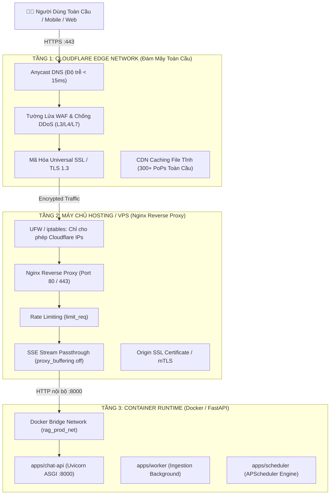

# KIẾN TRÚC MẠNG NGOẠI VI: WEB SERVER NGINX & CLOUDFLARE EDGE
## (Edge Network, Reverse Proxy & Origin Protection Architecture)

> **Hệ Thống**: RAG Chat API & Background Services  
> **Thành Phần**: Cloudflare Edge Network, Nginx Reverse Proxy, FastAPI (Uvicorn ASGI)  
> **Phiên Bản**: 1.0.0  
> **Mục Đích**: Chuẩn hóa tầng mạng ngoại vi, bảo vệ máy chủ gốc (Origin Protection), tối ưu hóa luồng Server-Sent Events (SSE) Streaming và định tuyến tải an toàn.

---

## 1. Tổng Quan Kiến Trúc Ba Tầng (Three-Tier Edge Architecture)

Trong hệ sinh thái Web hiện đại, đặc biệt với các ứng dụng AI/RAG có tính năng streaming thời gian thực, kiến trúc mạng ngoại vi được phân tách thành **3 tầng độc lập**:



---

## 2. Ba Triết Lý Vàng Của Kiến Trúc Web Server & Bất Đồng Bộ Hiện Đại

Để một hệ thống web có thể phục vụ hàng vạn kết nối đồng thời trên cấu hình phần cứng khiêm tốn (như VPS 1-2 vCPU), toàn bộ kiến trúc từ **Nginx** đến **FastAPI / Uvicorn** đều được xây dựng dựa trên 3 trụ cột cốt tử:

```text
┌──────────────────────────────────────────────────────────────────────────────────────────────────┐
│              BA TRIẾT LÝ VÀNG CỦA KIẾN TRÚC WEB SERVER & ASYNC HIỆN ĐẠI                          │
├──────────────────────────────┬──────────────────────────────┬────────────────────────────────────┤
│ 1. TỐI GIẢN PROCESS          │ 2. NON-BLOCKING I/O          │ 3. CÔ LẬP BLOCKING                 │
│ "Đừng tạo ra thứ không cần.  │ "Đừng chờ đợi, tận dụng      │ "Khi bắt buộc phải chờ, đẩy nó     │
│ Vài Worker gánh vác toàn bộ  │ thời gian rảnh để phục vụ    │ ra khỏi đường đi chính             │
│ Server."                     │ hàng nghìn kết nối khác."    │ (Thread Pool)."                    │
└──────────────────────────────┴──────────────────────────────┴────────────────────────────────────┘
```

### 2.1. Trụ Cột 1: TỐI GIẢN PROCESS
> *"Đừng tạo ra thứ không cần. Vài Worker gánh vác toàn bộ Server."*

- **Cách làm cũ (Sai lầm kinh điển - Apache mpm_prefork / CGI)**:
  - Cứ mỗi người dùng kết nối tới, hệ điều hành lại tạo ra một Process hoặc Thread mới.
  - Khi có 1.000 người kết nối đồng thời, hệ điều hành phải gánh 1.000 Process riêng biệt.
  - **Hậu quả**: Tràn bộ nhớ RAM (Out Of Memory - OOM), và CPU mất tới 70-80% năng lực chỉ để làm việc vô ích là "chuyển đổi ngữ cảnh" (Context Switching) giữa các tiến trình thay vì xử lý dữ liệu thực tế.
- **Triết lý hiện đại (Nginx & Uvicorn)**:
  - **Nginx**: Chỉ tạo số lượng Worker Process bằng đúng số nhân CPU (`worker_processes auto;`). Máy 2 Core thì chạy đúng 2 Worker, máy 4 Core chạy 4 Worker.
  - **FastAPI trong Docker**: Container `rag_chat_api_prod` chỉ chạy duy nhất 1 tiến trình Uvicorn phục vụ ứng dụng.
  - **Hiệu quả**: Loại bỏ hoàn toàn chi phí tạo process vô tội vạ, RAM tiêu tốn chỉ vài chục MB nhưng một Worker có thể giữ hàng vạn kết nối socket mở liên tục.

### 2.2. Trụ Cột 2: NON-BLOCKING I/O
> *"Đừng chờ đợi, tận dụng thời gian rảnh để phục vụ hàng nghìn kết nối khác."*

- **Bản chất**: 90% thời gian hoạt động của một Web Server là **ngồi chờ đợi**:
  - Chờ mạng truyền tải gói tin từ điện thoại người dùng (mạng 3G/4G/WiFi chập chờn).
  - Chờ cơ sở dữ liệu PostgreSQL thực thi câu lệnh SQL.
  - Chờ mô hình AI/LLM (Gemini Flash) suy nghĩ và sinh câu trả lời.
- **Cơ chế hoạt động**:
  - **Nếu dùng Blocking (Đồng bộ truyền thống)**: Một luồng ngồi "đóng băng" chờ dữ liệu đến thì không thể làm việc khác, gây lãng phí tài nguyên nghiêm trọng.
  - **Dùng Non-blocking (Event Loop + `epoll` trên Linux / `kqueue` trên BSD)**: Khi kết nối đang chờ dữ liệu, Nginx hoặc Uvicorn đăng ký sự kiện vào nhân Linux rồi **lập tức quay sang xử lý request của người khác**. Khi nào có dữ liệu về, hệ điều hành sẽ "gõ cửa" báo để quay lại xử lý tiếp.
  - **Hiệu quả**: Một luồng duy nhất có thể luân phiên phục vụ hàng ngàn kết nối cùng lúc mà không một kết nối nào phải xếp hàng chờ đợi vô ích.

### 2.3. Trụ Cột 3: CÔ LẬP BLOCKING
> *"Khi bắt buộc phải chờ, đẩy nó ra khỏi đường đi chính (Thread Pool)."*

- **Tử huyệt của Non-blocking I/O**:
  - Vì cả server chỉ vận hành dựa trên 1 Event Loop chính (Single Thread), nếu bạn lỡ viết một đoạn code "chạy nặng" hoặc "bắt buộc phải chờ" (ví dụ: băm mật khẩu `bcrypt`, đọc ghi file nặng trên đĩa, truy vấn database đồng bộ), **toàn bộ Event Loop sẽ bị đóng băng (Freeze)**! Lúc này, hàng ngàn người dùng khác đang kết nối vào server đều bị đứng hình theo.
- **Giải pháp "Cô lập"**:
  - Bất kỳ tác vụ nào mang tính chất Blocking hoặc CPU-bound nặng **bắt buộc phải bị đẩy ra khỏi làn đường chính**, đưa vào một **Worker Thread Pool riêng** chạy ngầm ở làn phụ.
- **Ứng dụng cụ thể trong dự án RAG của chúng ta**:
  1. **Tầng API (FastAPI)**: Khi bạn viết các hàm Repositories và CQRS Handlers bằng `def` đồng bộ (thao tác SQLAlchemy với PostgreSQL), FastAPI **tự động đẩy chúng sang Thread Pool riêng** (`anyio.to_thread.run_sync`), giữ cho Event Loop chính luôn thông thoáng để stream SSE token realtime cho người dùng.
  2. **Tầng Ingestion Worker**: Toàn bộ việc bóc tách tài liệu nặng (Docling PDF, OCR, Vectorize) được **cô lập hoàn toàn sang một tiến trình riêng (`apps/worker`)**, không bao giờ để nó chạm vào luồng xử lý Web API.

---

## 3. Nginx - Reverse Proxy Cốt Lõi Tại Máy Chủ

### 3.1. Bản Chất Kỹ Thuật Của Nginx
- **Kiến trúc hướng sự kiện (Event-driven Non-blocking)**: Nginx được viết bằng ngôn ngữ C thuần túy. Khác với kiến trúc cũ (mỗi request tạo một process/thread), Nginx sử dụng `epoll` (Linux) hoặc `kqueue` (BSD) trên một số ít worker process tương ứng với số lõi CPU.
- **Tiêu tốn tài nguyên cực thấp**: Một tiến trình Nginx chỉ tốn **15MB – 30MB RAM** nhưng có thể duy trì **50.000 – 100.000 kết nối đồng thời** mà không làm tăng tải CPU.
- **Tách biệt ranh giới**: Nginx chịu trách nhiệm bảo vệ ứng dụng, quản lý SSL, nén gzip/brotli, ghi access log, rate limit, giúp mã nguồn Python (FastAPI) chỉ thuần túy tập trung vào nghiệp vụ.

### 3.2. Xử Lý Sống Còn Cho Ứng Dụng RAG: Server-Sent Events (SSE) Streaming
Trong hệ thống RAG, khi người dùng gửi câu hỏi, mô hình LLM (Gemini Flash) sẽ sinh câu trả lời và stream từng token chữ về giao diện qua Server-Sent Events (SSE). 

> [!CAUTION]
> **Hiểm họa Buffering mặc định**: Nginx mặc định có cơ chế `proxy_buffering on;` – nghĩa là Nginx sẽ cố gắng gom đủ một lượng byte dữ liệu vào bộ nhớ đệm (buffer) trước khi gửi về client. Nếu không tắt cấu hình này, hiệu ứng gõ chữ (typewriter streaming) sẽ bị vô hiệu hóa hoàn toàn, người dùng phải chờ toàn bộ câu trả lời sinh xong mới thấy xuất hiện một lần!

**Quy tắc cấu hình bắt buộc cho endpoint SSE**:
```nginx
proxy_buffering off;
proxy_cache off;
proxy_set_header Connection '';
proxy_http_version 1.1;
chunked_transfer_encoding on;
```

### 3.3. File Cấu Hình Nginx Hoàn Chỉnh Chuẩn Production (`rag-api.conf`)

Dưới đây là cấu hình hoàn chỉnh đặt tại `/etc/nginx/sites-available/rag-api.conf`:

```nginx
# ------------------------------------------------------------------------------
# 1. Định nghĩa Vùng Giới Hạn Tần Suất (Rate Limiting Zones)
# ------------------------------------------------------------------------------
# Giới hạn chung cho toàn bộ API: tối đa 20 request/giây trên mỗi IP
limit_req_zone $binary_remote_addr zone=api_general_limit:10m rate=20r/s;

# Giới hạn nghiêm ngặt cho route Đăng nhập / Xác thực: tối đa 5 request/phút
limit_req_zone $binary_remote_addr zone=auth_limit:10m rate=5r/m;

# ------------------------------------------------------------------------------
# 2. Upstream Backend (Trỏ vào container Docker của chat-api)
# ------------------------------------------------------------------------------
upstream fastapi_backend {
    server 127.0.0.1:8000;
    keepalive 32;
}

# ------------------------------------------------------------------------------
# 3. Server Block: Chặn đứng truy cập trực tiếp bằng IP số
# ------------------------------------------------------------------------------
server {
    listen 80 default_server;
    listen 443 default_server ssl;
    server_name _;

    ssl_certificate /etc/nginx/ssl/dummy.crt;
    ssl_certificate_key /etc/nginx/ssl/dummy.key;

    # Mã 444 là mã độc quyền của Nginx: Đóng kết nối ngay lập tức mà không gửi byte nào
    return 444;
}

# ------------------------------------------------------------------------------
# 4. Server Block Chính: api.yourdomain.com
# ------------------------------------------------------------------------------
server {
    listen 80;
    server_name api.yourdomain.com;
    
    # Chuyển hướng tự động toàn bộ HTTP sang HTTPS
    return 301 https://$host$request_uri;
}

server {
    listen 443 ssl http2;
    server_name api.yourdomain.com;

    # Cấu hình SSL / TLS hiện đại
    ssl_certificate /etc/ssl/certs/rag_origin_cert.pem;
    ssl_certificate_key /etc/ssl/private/rag_origin_key.pem;
    ssl_protocols TLSv1.2 TLSv1.3;
    ssl_ciphers HIGH:!aNULL:!MD5;
    ssl_prefer_server_ciphers on;

    # Nhúng danh sách IP của Cloudflare (Origin Protection)
    include /etc/nginx/snippets/cloudflare_ips.conf;
    
    # Chỉ cho phép Cloudflare IPs, chặn 100% IP lạ từ Internet
    include /etc/nginx/snippets/cloudflare_allow.conf;
    deny all;

    # Log định dạng chuẩn
    access_log /var/log/nginx/rag_api_access.log;
    error_log /var/log/nginx/rag_api_error.log warn;

    # Giới hạn kích thước file upload tài liệu PDF (Ví dụ: 100MB)
    client_max_body_size 100M;

    # --------------------------------------------------------------------------
    # Route 1: SSE Streaming (Hỏi đáp Chat RAG realtime)
    # --------------------------------------------------------------------------
    location ~* ^/api/v1/messages/(stream|query) {
        limit_req zone=api_general_limit burst=10 nodelay;

        proxy_pass http://fastapi_backend;
        proxy_http_version 1.1;

        # CẤU HÌNH SỐNG CÒN CHO SSE: Tắt triệt để đệm
        proxy_buffering off;
        proxy_cache off;
        proxy_set_header Connection '';
        chunked_transfer_encoding on;

        # Timeouts cho câu trả lời LLM dài
        proxy_read_timeout 300s;
        proxy_send_timeout 300s;

        # Forward đúng IP thật của Client
        proxy_set_header Host $host;
        proxy_set_header X-Real-IP $remote_addr;
        proxy_set_header X-Forwarded-For $proxy_add_x_forwarded_for;
        proxy_set_header X-Forwarded-Proto $scheme;
    }

    # --------------------------------------------------------------------------
    # Route 2: Xác thực danh tính (Auth - Chống Brute Force)
    # --------------------------------------------------------------------------
    location /api/v1/auth/ {
        limit_req zone=auth_limit burst=3 nodelay;

        proxy_pass http://fastapi_backend;
        proxy_set_header Host $host;
        proxy_set_header X-Real-IP $remote_addr;
        proxy_set_header X-Forwarded-For $proxy_add_x_forwarded_for;
        proxy_set_header X-Forwarded-Proto $scheme;
    }

    # --------------------------------------------------------------------------
    # Route 3: Toàn bộ API còn lại (REST Endpoints)
    # --------------------------------------------------------------------------
    location / {
        limit_req zone=api_general_limit burst=20 nodelay;

        proxy_pass http://fastapi_backend;
        proxy_set_header Host $host;
        proxy_set_header X-Real-IP $remote_addr;
        proxy_set_header X-Forwarded-For $proxy_add_x_forwarded_for;
        proxy_set_header X-Forwarded-Proto $scheme;

        proxy_connect_timeout 60s;
        proxy_read_timeout 60s;
    }
}
```

---

## 4. Cloudflare - Lớp Giáp Đám Mây Toàn Cầu

Cloudflare đóng vai trò là **Edge Network** đứng chắn trước Nginx.

```text
[ Người Dùng ] ──► [ Cloudflare Edge (300+ PoPs) ] ──► [ Nginx (Máy chủ của bạn) ]
```

### 3.1. Các Lợi Ích Cốt Lõi
1. **Giấu IP Máy Chủ Gốc (Origin IP Masking)**:
   - Khi bật biểu tượng **Đám mây cam ☁️ (Proxied)**, DNS phân giải tên miền thành dải IP của Cloudflare.
   - Hacker chỉ thấy IP của Cloudflare, không biết địa chỉ IP thật của VPS để tấn công trực tiếp.
2. **Chống Tấn Công DDoS Khổng Lồ (L3/L4/L7)**:
   - Cloudflare sở hữu hạ tầng mạng Anycast với tổng băng thông vượt **280 Tbps**, tự động cô lập và nuốt trọn các đợt tấn công từ chối dịch vụ (SYN Flood, UDP Reflection, HTTP Request Flood).
3. **Mã Hóa Universal SSL Miễn Phí Toàn Cầu**:
   - Cung cấp chứng chỉ TLS 1.3 tới trình duyệt tức thì, hỗ trợ HTTP/2 và HTTP/3 (QUIC) tối ưu hóa tốc độ tải trang.
4. **WAF (Web Application Firewall) & Bot Management**:
   - Tự động nhận diện và chặn các crawler độc hại, SQL Injection, XSS trước khi gói tin chạm đến máy chủ.

### 3.2. Ba Đặc Thù Kỹ Thuật Cần Lưu Ý Khi Dùng Cloudflare Với RAG Platform

| Đặc Thù | Thách Thức Kỹ Thuật | Giải Pháp Đã Hiện Thực Trong Dự Án |
| :--- | :--- | :--- |
| **Timeout 100 Giây (HTTP 524 Error)** | Cloudflare Free sẽ tự ngắt kết nối nếu máy chủ gốc không trả dữ liệu trong 100s. | • **Upload**: Xử lý bất đồng bộ (`POST /documents` trả về `201` kèm `job_id` trong ~200ms, đẩy job cho `apps/worker`).<br>• **Chat RAG**: Dùng **SSE Streaming** bắn từng token liên tục mỗi vài chục ms, kết nối luôn có byte truyền qua nên Cloudflare **không bao giờ ngắt timeout**. |
| **Giới Hạn File Upload (Max 100MB)** | Cloudflare gói Free giới hạn kích thước request body tối đa là 100MB. | • Với file PDF > 100MB: Tạo subdomain riêng (ví dụ `upload.domain.com`) và tắt proxy đám mây (**DNS-Only ☁️ xám**) để traffic đi thẳng vào Nginx.<br>• Hoặc dùng mô hình Presigned URL upload trực tiếp vào MinIO/S3. |
| **Khôi Phục IP Thật Của Client** | Nếu không cấu hình, `request.client.host` trong FastAPI sẽ hiển thị IP của Cloudflare thay vì IP người dùng. | Nginx sử dụng module `ngx_http_realip_module` với `real_ip_header CF-Connecting-IP;` để lấy đúng IP thật ghi log vào [core.logging](../core/src/core/logging.py). |

---

## 5. Bốn Giải Pháp Khóa Chặt Bảo Mật: "Chỉ Cloudflare Mới Được Kết Nối Server"

Nếu bạn dùng Cloudflare nhưng để hở IP máy chủ, kẻ xấu có thể bỏ qua Cloudflare và tấn công thẳng vào Nginx. Dưới đây là 4 phương án từ cơ bản đến cao cấp nhất:

### Giải Pháp 1: Giới Hạn Dải IP Cloudflare Trong Nginx (`allow`/`deny`)

Tạo file `/etc/nginx/snippets/cloudflare_ips.conf`:
```nginx
# Khôi phục IP thật của Client từ Header của Cloudflare
set_real_ip_from 173.245.48.0/20;
set_real_ip_from 103.21.244.0/22;
set_real_ip_from 103.22.200.0/22;
set_real_ip_from 103.31.4.0/22;
set_real_ip_from 141.101.64.0/18;
set_real_ip_from 108.162.192.0/18;
set_real_ip_from 190.93.240.0/20;
set_real_ip_from 188.114.96.0/20;
set_real_ip_from 197.234.240.0/22;
set_real_ip_from 198.41.128.0/17;
set_real_ip_from 162.158.0.0/15;
set_real_ip_from 104.16.0.0/13;
set_real_ip_from 104.24.0.0/14;
set_real_ip_from 172.64.0.0/13;
set_real_ip_from 131.0.72.0/22;

real_ip_header CF-Connecting-IP;
```

Tạo file `/etc/nginx/snippets/cloudflare_allow.conf`:
```nginx
# Danh sách IP được phép kết nối vào Nginx
allow 173.245.48.0/20;
allow 103.21.244.0/22;
allow 103.22.200.0/22;
allow 103.31.4.0/22;
allow 141.101.64.0/18;
allow 108.162.192.0/18;
allow 190.93.240.0/20;
allow 188.114.96.0/20;
allow 197.234.240.0/22;
allow 198.41.128.0/17;
allow 162.158.0.0/15;
allow 104.16.0.0/13;
allow 104.24.0.0/14;
allow 172.64.0.0/13;
allow 131.0.72.0/22;
```

---

### Giải Pháp 2: Chặn Ở Tầng Tường Lửa Hệ Điều Hành (UFW / iptables)

Chặn ở Nginx thì gói tin TCP vẫn chạm vào Nginx và tiêu tốn một phần nhỏ tài nguyên CPU. Nếu chặn bằng **UFW (Uncomplicated Firewall)** trên Linux, nhân kernel sẽ hủy (DROP) gói tin ngay tại card mạng:

```bash
# 1. Cho phép SSH từ máy bạn (tránh tự khóa chính mình)
sudo ufw allow 22/tcp

# 2. Cho phép toàn bộ IP của Cloudflare truy cập cổng 80 & 443
for ip in $(curl -s https://www.cloudflare.com/ips-v4); do
    sudo ufw allow proto tcp from $ip to any port 80,443
done

for ip in $(curl -s https://www.cloudflare.com/ips-v6); do
    sudo ufw allow proto tcp from $ip to any port 80,443
done

# 3. Kích hoạt UFW (Tự động chặn tất cả các IP lạ còn lại)
sudo ufw default deny incoming
sudo ufw enable
```

---

### Giải Pháp 3: Cloudflare Authenticated Origin Pulls (mTLS)

Cloudflare cung cấp cơ chế bắt tay chứng thực hai chiều (Mutual TLS). Nginx yêu cầu: Chỉ request nào đính kèm **Client Certificate** do chính Cloudflare ký thì Nginx mới tiếp nhận:

Trong `rag-api.conf`:
```nginx
# Tải cert gốc của Cloudflare: authenticated_origin_pull_ca.pem
ssl_client_certificate /etc/nginx/certs/cloudflare_origin_pull_ca.pem;
ssl_verify_client on;
```
👉 Ngay cả khi kẻ tấn công biết IP máy chủ của bạn và gửi request HTTPS tới, kết nối sẽ bị Nginx từ chối lập tức ở bước bắt tay TLS vì kẻ tấn công không có Private Key của Cloudflare.

---

### Giải Pháp 4: Cloudflare Tunnel (`cloudflared`) - Đỉnh Cao Bảo Mật

Đây là giải pháp hiện đại nhất hiện nay: **ĐÓNG 100% TẤT CẢ CÁC CỔNG INBOUND TRÊN FIREWALL!**

```text
[ Client ] ──► [ Cloudflare Edge ]
                      │
     (Đường hầm Outbound mã hóa an toàn)
                      │
                      ▼
     [ VPS của bạn (ĐÓNG CỔNG 80, 443) ]
                      │
             [ daemon cloudflared ]
                      │
                      ▼
          [ Nginx / localhost:8000 ]
```

1. Bạn cài đặt `cloudflared` trên máy chủ.
2. `cloudflared` tự động tạo một kết nối đường hầm mã hóa (Outbound) tới mạng Cloudflare.
3. VPS của bạn **không cần mở bất kỳ cổng nào (Port 80/443 đóng hoàn toàn)**, không cần IP tĩnh (Static Public IP).
4. Mọi công cụ quét cổng (Nmap, Shodan) đều thấy VPS đóng băng hoàn toàn, loại bỏ 100% nguy cơ tấn công dò cổng và khai thác lỗ hổng mạng.

---

## 6. Ma Trận So Sánh & Hướng Dẫn Chọn Lựa Theo Kịch Bản Thực Tế

| Kịch Bản Ứng Dụng | Kiến Trúc Khuyến Nghị | Lý Do & Điểm Mạnh |
| :--- | :--- | :--- |
| **1. Dự án Nội bộ / Ngân hàng / On-Premise** | **CHỈ DÙNG NGINX** | • Dữ liệu tuyệt đối bảo mật, không đi qua bên thứ ba.<br>• Tốc độ nội mạng cực nhanh (< 5ms).<br>• Không bị vướng giới hạn timeout hay upload size. |
| **2. Sản phẩm SaaS / Web Public Toàn Cầu** | **CLOUDFLARE + NGINX** (Có Origin Protection) | • Chống DDoS quy mô lớn, giấu IP VPS.<br>• Tăng tốc mạng qua CDN 300+ điểm toàn cầu.<br>• Nginx tối ưu hóa buffer cho SSE streaming. |
| **3. Server Homelab / Chạy tại máy tính cá nhân** | **CLOUDFLARE TUNNEL + NGINX** | • Đưa server ra ngoài Internet mà không cần mua IP tĩnh, không cần mở port modem (CGNAT bypass). |

---

## 7. Liên Kết Tài Liệu Liên Quan
- [Tài liệu Kiến trúc Tổng thể Master (docs/architecture.md)](architecture.md)
- [Kiến trúc Triển khai CI/CD Production (docs/cicd_deployment_architecture.md)](cicd_deployment_architecture.md)
- [Cơ chế Logging Chuẩn hóa Twelve-Factor (core/logging.py)](../core/src/core/logging.py)
