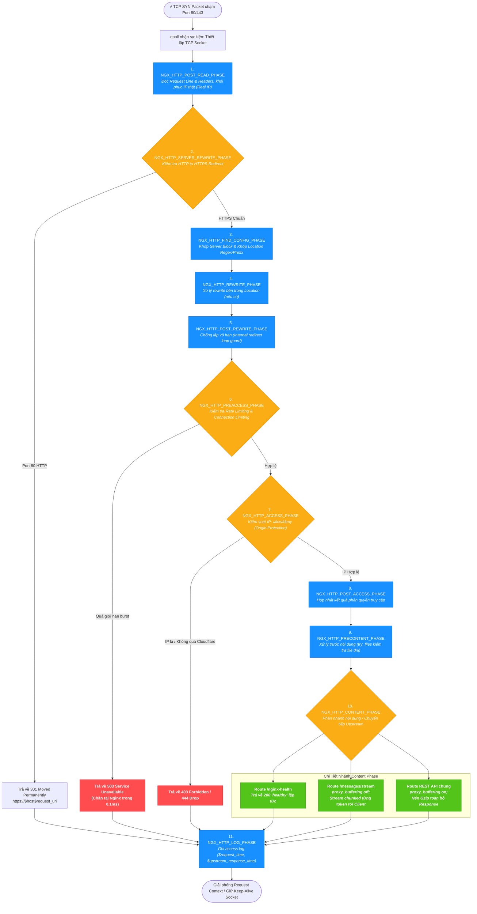
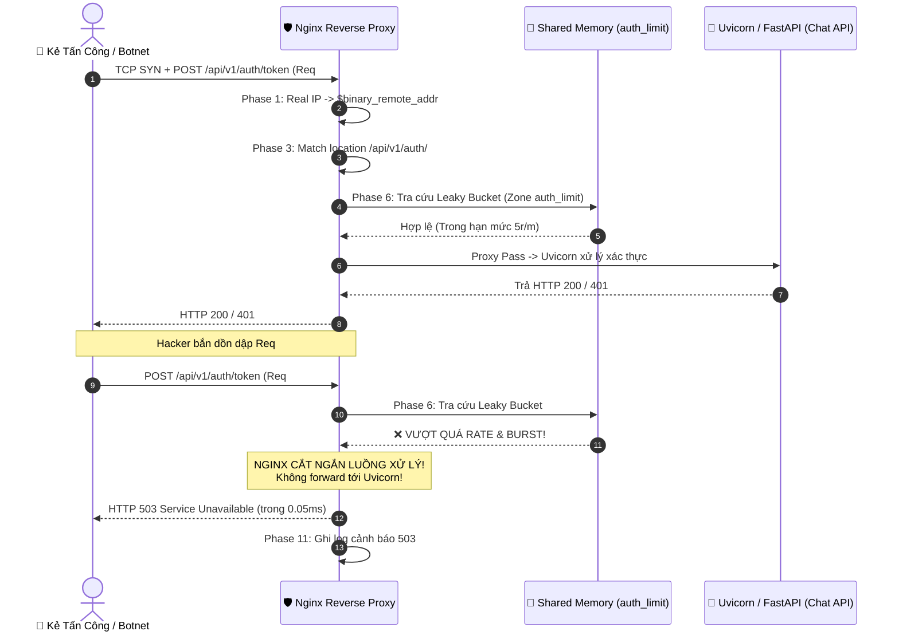
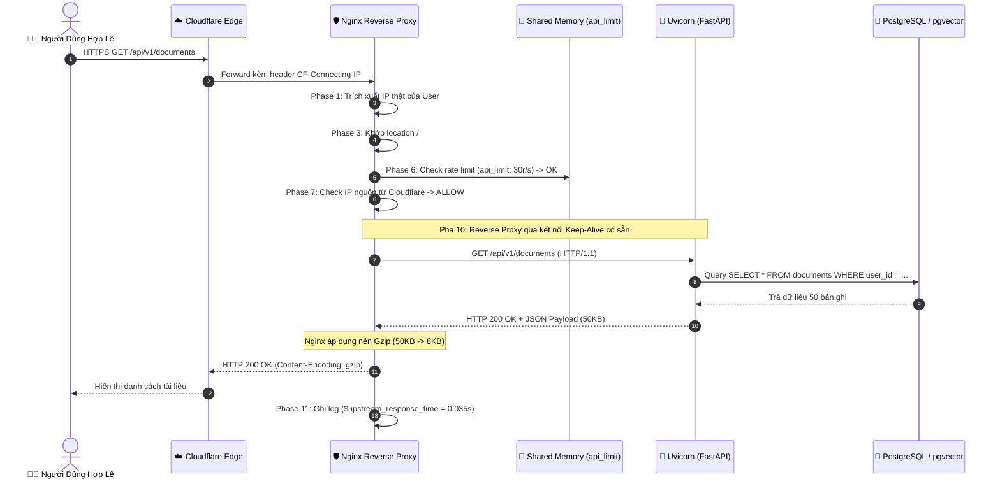

# VÒNG ĐỜI VÀ LUỒNG XỬ LÝ REQUEST NỘI TẠI CỦA NGINX
## (Nginx Internal Request Processing Lifecycle & Event-Driven Architecture)

> **Hệ Thống**: RAG Chat API & Background Services  
> **Thành Phần**: Nginx Reverse Proxy, Event Loop (`epoll`), Shared Memory Zones, Uvicorn ASGI  
> **Phiên Bản**: 1.0.0  
> **Mục Đích**: Bóc tách chi tiết toàn bộ chu trình sống của một gói tin HTTP từ khi chạm vào Socket mạng của Nginx, đi qua 11 pha xử lý (Phases), kiểm tra bộ nhớ dùng chung (Shared Memory), thực thi Rate Limiting, đến khi phân nhánh xử lý SSE Streaming hoặc Response Buffering.

---

## 1. Tổng Quan Kiến Trúc Tiến Trình & Bộ Nhớ Của Nginx

Trước khi đi sâu vào từng bước của một request, ta cần hiểu mô hình xử lý đa tiến trình bất đồng bộ (Multi-process Event-driven) của Nginx:

```text
┌────────────────────────────────────────────────────────────────────────────────────────┐
│                               KIẾN TRÚC TIẾN TRÌNH NGINX                               │
│                                                                                        │
│   ┌────────────────────────────────────────────────────────────────────────────────┐   │
│   │                         MASTER PROCESS (Chạy quyền root)                       │   │
│   │  • Đọc & Validate cấu hình (nginx.conf, conf.d/*.conf)                         │   │
│   │  • Mở & Bind các Socket cổng mạng (Port 80, 443)                               │   │
│   │  • Quản lý vòng đời Worker (Khởi tạo, reload mượt HUP, thu hồi tiến trình)     │   │
│   └───────────────┬────────────────────────────────┬───────────────────────────────┘   │
│                   │ Quản lý tín hiệu               │ Quản lý tín hiệu                  │
│                   ▼                                ▼                                   │
│   ┌──────────────────────────────┐ ┌──────────────────────────────┐                   │
│   │ WORKER PROCESS 1 (nginx-user)│ │ WORKER PROCESS 2 (nginx-user)│                   │
│   │ • Event Loop Non-blocking    │ │ • Event Loop Non-blocking    │                   │
│   │ • Cơ chế epoll (Linux)       │ │ • Cơ chế epoll (Linux)       │                   │
│   │ • 2048 Socket Connections    │ │ • 2048 Socket Connections    │                   │
│   └──────────────┬───────────────┘ └──────────────┬───────────────┘                   │
│                  │                                │                                   │
│                  └────────────────┬───────────────┘                                   │
│                                   ▼                                                   │
│   ┌────────────────────────────────────────────────────────────────────────────────┐   │
│   │                    VÙNG BỘ NHỚ DÙNG CHUNG (SHARED MEMORY - SHM)                │   │
│   │  • zone=api_limit:10m    (Lưu Leaky Bucket rate limit cho API chung: 30r/s)    │   │
│   │  • zone=auth_limit:10m   (Lưu Leaky Bucket chống brute-force Auth: 5r/m)       │   │
│   │  • zone=addr_limit:10m   (Đếm số lượng TCP connection đồng thời của mỗi IP)    │   │
│   │  • SSL Session Cache     (Tái sử dụng phiên TLS, giảm tải CPU bắt tay)         │   │
│   └────────────────────────────────────────────────────────────────────────────────┘   │
└────────────────────────────────────────────────────────────────────────────────────────┘
```

### 1.1. Master Process
- Không trực tiếp xử lý các kết nối mạng của người dùng.
- Chịu trách nhiệm khởi tạo, đọc nạp file cấu hình, mở các file log, liên kết (bind) với cổng 80/443.
- Quản lý các Worker process: Khi thực hiện `nginx -s reload`, Master sẽ spawn ra các Worker mới với cấu hình mới, sau đó gửi tín hiệu kết thúc nhẹ nhàng (`graceful shutdown`) cho các Worker cũ sau khi chúng phục vụ xong các kết nối dở dang.

### 1.2. Worker Processes
- Chạy dưới quyền hạn tối thiểu (`nginx` user không có quyền root) để cô lập rủi ro bảo mật.
- Số lượng Worker bằng đúng số nhân CPU (`worker_processes auto;`) nhằm loại bỏ hoàn toàn chi phí chuyển đổi ngữ cảnh (Context Switching).
- Sử dụng mô hình I/O Multiplexing thông qua syscall `epoll` của nhân Linux. Một Worker process có thể đồng thời duy trì và giám sát hàng chục nghìn file descriptors (sockets) mà không bị block.

### 1.3. Shared Memory Zones (SHM)
- Các Worker process là các tiến trình độc lập, có không gian bộ nhớ ảo tách biệt.
- Để quản lý Rate Limiting (`limit_req_zone`) và Connection Limiting (`limit_conn_zone`) trên toàn hệ thống một cách chính xác, Nginx tạo ra các vùng nhớ dùng chung **Shared Memory Zone**.
- Mọi thao tác tăng/giảm counter truy cập của từng địa chỉ IP đều được thực hiện thông qua cơ chế khóa nguyên tử cực nhẹ (Atomic spinlock) trong RAM, độ trễ chỉ tính bằng **nanosecond**.

---

## 2. Bản Đồ 11 Pha Xử Lý Request Trong Nginx Core Engine

Mỗi khi một request HTTP được gửi tới, Nginx không xử lý tùy tiện mà đưa request qua **11 pha (HTTP Phases)** được định nghĩa tuần tự trong nhân C (`ngx_http_core_module`):



---

### Chi Tiết Từng Pha Xử Lý Trong Hệ Thống RAG

#### Pha 1: `NGX_HTTP_POST_READ_PHASE` (Đọc Header & Khôi Phục IP Thật)
- **Hành động**: Ngay sau khi đọc xong dòng tiêu đề HTTP và toàn bộ Headers đầu tiên từ socket client.
- **Module can thiệp**: `ngx_http_realip_module` (được cấu hình trong [cf-real-ip.conf](../deploy/nginx/snippets/cf-real-ip.conf)).
- **Cơ chế thực thi**:
  1. Nginx kiểm tra xem gói tin TCP gửi đến có xuất phát từ một trong các dải IP được tin cậy (`set_real_ip_from`) hay không (dải IP của Cloudflare hoặc Docker Bridge Gateway `172.16.0.0/12`).
  2. Nếu đúng, Nginx trích xuất giá trị trong header `CF-Connecting-IP` (hoặc `X-Forwarded-For`) và gán đè vào biến hệ thống `$remote_addr`.
  3. Giá trị IP thực này được băm nhỏ thành dạng nhị phân 4-byte (cho IPv4) hoặc 16-byte (cho IPv6) gán vào biến `$binary_remote_addr`.
- **Ý nghĩa**: Giúp toàn bộ các bước Rate Limit và Access Log phía sau nhận diện đúng danh tính của người dùng thực tế, thay vì nhìn nhầm thành IP của Cloudflare Proxy.

#### Pha 2: `NGX_HTTP_SERVER_REWRITE_PHASE` (Chuyển Hướng Giao Thức)
- **Hành động**: Chạy các chỉ thị rewrite ở cấp độ block `server`.
- **Thực thi trong cấu hình dự án**:
  ```nginx
  server {
      listen 80;
      server_name api.yourdomain.com;
      return 301 https://$host$request_uri;
  }
  ```
  Nếu người dùng truy cập bằng cổng 80 HTTP, Nginx phát hiện ở pha này và sinh ngay mã phản hồi `301 Moved Permanently`, lập tức nhảy cóc sang Pha 11 (Log Phase) để đóng kết nối mà không cần kiểm tra quyền hay forward tới backend.

#### Pha 3: `NGX_HTTP_FIND_CONFIG_PHASE` (Khớp Server Block & Location Routing)
- **Hành động**: Nginx tìm kiếm `server_name` tương ứng và sau đó dò tìm khối `location` khớp với URL đường dẫn của request.
- **Thứ tự ưu tiên khớp Location của Nginx**:
  1. **Khớp tuyệt đối (`=`)**: Ví dụ `location = /nginx-health` (Ưu tiên số 1, dừng dò tìm ngay).
  2. **Khớp tiền tố ưu tiên (`^~`)**: Bỏ qua biểu thức chính quy nếu khớp.
  3. **Khớp biểu thức chính quy (Regex `~` hoặc `~*`)**: Được duyệt theo thứ tự xuất hiện từ trên xuống dưới trong file cấu hình.
     - `location ~* ^/api/v1/messages/(stream|query)`: Khớp toàn bộ request chat streaming AI.
  4. **Khớp tiền tố dài nhất (Prefix match)**:
     - `location /api/v1/auth/`: Khớp các request đăng nhập, làm mới token.
     - `location /`: Khớp dự phòng toàn bộ các route còn lại.

#### Pha 4 & 5: `NGX_HTTP_REWRITE_PHASE` & `POST_REWRITE_PHASE`
- Thực thi các luật biến đổi URL bên trong khối `location` đã chọn (nếu có). Nginx đồng thời đếm số lần redirect nội bộ (`internal_redirect`), nếu vượt quá 10 lần sẽ ngắt với lỗi `500 Internal Server Error` để tránh treo CPU.

#### Pha 6: `NGX_HTTP_PREACCESS_PHASE` (Bộ Lọc Rate Limiting & Connection Limiting)
- **Hành động**: Thực thi thuật toán **Leaky Bucket** dựa trên Shared Memory Zone.
- **Module can thiệp**: `ngx_http_limit_req_module` & `ngx_http_limit_conn_module`.
- **Cơ chế Leaky Bucket chi tiết**:
  ```text
  Yêu cầu đến từ Client ($binary_remote_addr)
                    │
                    ▼
     [ Kiểm tra Zone trong RAM (SHM) ]
                    │
          ┌─────────┴─────────┐
          │                   │
    Vượt giới hạn       Trong hạn mức
    cả rate + burst     (hoặc trong burst + nodelay)
          │                   │
          ▼                   ▼
     [ NGINX CHẶN ]     [ CHO PHÉP QUA ]
     Trả HTTP 503       Đi tiếp sang Pha 7
     (Độ trễ < 0.1ms)   (Chạm tài nguyên)
  ```
- **Ý nghĩa sống còn**: Nếu hacker mở đợt tấn công Flood 100.000 req/s, toàn bộ 100.000 req này bị Nginx từ chối và trả về `503` ngay tại Pha 6 trong vài microsecond. **Tiến trình Python / Uvicorn hoàn toàn không bị ảnh hưởng, tải CPU của backend giữ nguyên 0%!**

#### Pha 7: `NGX_HTTP_ACCESS_PHASE` (Kiểm Soát Quyền Truy Cập & Origin Protection)
- **Hành động**: Kiểm tra quyền truy cập mạng qua `allow` và `deny`.
- **Thực thi trong cấu hình dự án**:
  - Nhúng file dải IP hợp lệ của Cloudflare ([cf-real-ip.conf](../deploy/nginx/snippets/cf-real-ip.conf)).
  - Khai báo `deny all;` ở cuối khi kích hoạt Origin Protection.
  - Nếu bất kỳ kẻ tấn công nào dò ra địa chỉ IP trực tiếp của máy chủ VPS và gửi request thẳng vào Nginx mà không đi qua Cloudflare, Nginx phát hiện IP này không thuộc danh sách `allow` và lập tức trả về mã `403 Forbidden` hoặc ngắt kết nối với mã nội bộ `444`.

#### Pha 8 & 9: `NGX_HTTP_POST_ACCESS_PHASE` & `PRECONTENT_PHASE`
- Hợp nhất các kết quả xác thực.
- Thực hiện các tiền xử lý trước khi xuất nội dung (ví dụ chỉ thị `try_files` kiểm tra sự tồn tại của file tĩnh trên ổ cứng máy chủ trước khi quyết định pass vào backend).

#### Pha 10: `NGX_HTTP_CONTENT_PHASE` (Trọng Tâm Sinh Nội Dung & Điều Phối Upstream)
Đây là pha quan trọng nhất, nơi Nginx thực sự xử lý nội dung để trả lời client:
- **Trường hợp 1 (Nội bộ Nginx)**: Nếu khớp `location /nginx-health`, chỉ thị `return 200 "healthy\n";` sinh ra dữ liệu trực tiếp từ Nginx mà không chạm vào Docker network.
- **Trường hợp 2 (Reverse Proxy sang FastAPI)**: Nginx chuyển tiếp request sang upstream backend `chat_api_backend` (`chat-api:8000`).
  Tại đây, Nginx phân chia 2 hành vi xử lý hoàn toàn trái ngược dựa trên cấu hình:

| Tiêu Chí Kỹ Thuật | Nhánh 1: SSE Streaming (`/messages/stream`) | Nhánh 2: REST API Thông Thường (`/`, `/documents`) |
| :--- | :--- | :--- |
| **Cấu hình Buffer** | `proxy_buffering off;` | `proxy_buffering on;` |
| **Cấu hình Cache** | `proxy_cache off;` | `proxy_cache on;` (hoặc bypass) |
| **Giao vận truyền tải** | `chunked_transfer_encoding on;` | `Content-Length` xác định |
| **Cách truyền dữ liệu** | **Không lưu đệm**. Mỗi chunk dữ liệu LLM (Gemini) vừa trả về Uvicorn được Nginx đẩy ngay ra socket client trong vài miligiây. | Nginx nhận trọn vẹn toàn bộ Body JSON từ Uvicorn vào buffer RAM trước khi bắt đầu gửi về client. |
| **Nén Gzip** | Không nén hoặc tắt nén đệm để tránh gián đoạn luồng stream. | Nén Gzip tối đa (`gzip_types application/json`) giúp giảm 70% dung lượng truyền trên dây cáp. |
| **Trải nghiệm người dùng** | Hiệu ứng gõ chữ thời gian thực (Realtime typewriter effect). | Nhận toàn bộ kết quả một lần sau khi xử lý xong. |

#### Pha 11: `NGX_HTTP_LOG_PHASE` (Ghi Access Log & Thu Hồi Tài Nguyên)
- **Hành động**: Được gọi sau khi byte dữ liệu cuối cùng của response đã được đẩy ra socket mạng (hoặc khi kết nối bị ngắt).
- **Module can thiệp**: `ngx_http_log_module`.
- **Thu thập các chỉ số vàng (Gold Metrics)**:
  - `$request_time`: Tổng thời gian từ khi Nginx đọc byte đầu tiên của request từ client đến khi gửi xong byte cuối cùng về client.
  - `$upstream_response_time`: Thời gian Uvicorn (FastAPI) tiếp nhận, tính toán và trả lời Nginx.
  - `$status`: Mã HTTP phản hồi (`200`, `301`, `403`, `503`).
  - `$bytes_sent`: Số lượng byte thực tế được gửi đi.
- **Dọn dẹp**: Gọi danh sách các hàm dọn dẹp bộ nhớ `ngx_http_cleanup_t`, hoàn trả socket descriptor về danh sách chờ sự kiện của `epoll` nếu có kích hoạt HTTP Keep-Alive.

---

## 3. Sơ Đồ Trực Quan Ba Luồng Request Thực Tế Trong Dự Án

### 3.1. Luồng 1: Kẻ Xấu Tấn Công Flood Request / Brute Force (Bị Chặn Tại Nginx)

Trong kịch bản này, hacker gửi liên tục 100 request/giây vào endpoint đăng nhập `/api/v1/auth/token`:



> **Kết quả**: Uvicorn và Database PostgreSQL hoàn toàn không phải tốn 1 chu kỳ CPU nào để băm chuỗi mật khẩu `bcrypt` cho các request quá ngưỡng. Hệ thống đứng vững an toàn.

---

### 3.2. Luồng 2: Request REST API Chuẩn (Ví dụ: `GET /api/v1/documents`)

Người dùng hợp lệ gửi yêu cầu lấy danh sách tài liệu:



---

### 3.3. Luồng 3: Request SSE Streaming Trực Tiếp (Ví dụ: `POST /api/v1/messages/stream`)

Đây là luồng nghiệp vụ phức tạp nhất và có yêu cầu khắt khe nhất đối với Nginx:

```mermaid
sequenceDiagram
    autonumber
    actor User as 👨‍💻 Người Dùng (Giao diện Web/App)
    participant Nginx as 🛡️ Nginx (proxy_buffering off)
    participant Uvicorn as 🐍 Uvicorn (FastAPI SSE Generator)
    participant LLM as 🧠 Google Gemini 1.5 Flash

    User->>Nginx: POST /api/v1/messages/stream (Body: {"query": "Giải thích RAG"})
    Nginx->>Nginx: Phase 3: Khớp Regex ~* ^/api/v1/messages/(stream|query)
    Note over Nginx: Kích hoạt: proxy_buffering off;<br>chunked_transfer_encoding on;<br>proxy_read_timeout 300s;
    
    Nginx->>Uvicorn: Forward POST /api/v1/messages/stream
    Uvicorn->>LLM: Gọi API sinh token trực tiếp
    
    Note over Uvicorn,LLM: LLM sinh từng cụm từ (Token Streaming)
    LLM-->>Uvicorn: Chunk 1: "RAG là..."
    Uvicorn-->>Nginx: HTTP Chunk 1 (data: {"token": "RAG là..."}\n\n)
    Note over Nginx: KHÔNG CHỜ BUFFER!<br>Đẩy ngay ra socket client!
    Nginx-->>User: data: {"token": "RAG là..."}\n\n (Hiện ngay trên UI)

    LLM-->>Uvicorn: Chunk 2: "viết tắt của..."
    Uvicorn-->>Nginx: HTTP Chunk 2 (data: {"token": "viết tắt của..."}\n\n)
    Nginx-->>User: data: {"token": "viết tắt của..."}\n\n (Hiện ngay trên UI)

    LLM-->>Uvicorn: Chunk N: "[DONE]"
    Uvicorn-->>Nginx: HTTP Chunk Cuối (data: [DONE]\n\n)
    Nginx-->>User: data: [DONE]\n\n
    
    Note over Nginx,User: Kết thúc luồng stream
    Uvicorn->>Uvicorn: Đóng generator
    Nginx->>Nginx: Phase 11: Ghi log ($request_time = 4.250s)
```

---

## 4. Bảng So Sánh Kỹ Thuật: Buffering ON vs Buffering OFF Trong Nginx

| Tiêu Chí So Sánh | `proxy_buffering on;` (Mặc định - Dành cho REST) | `proxy_buffering off;` (Bắt buộc cho SSE Streaming) |
| :--- | :--- | :--- |
| **Cơ chế lưu trữ** | Nginx cấp phát các khối bộ nhớ đệm (`proxy_buffers 8 16k;`). Dữ liệu từ Uvicorn được dồn vào đây cho tới khi đầy hoặc kết thúc request. | Nginx không cấp phát bộ nhớ đệm tạm. Dữ liệu từ socket backend được chuyển tiếp sang socket client ngay ở chu kỳ lặp `epoll` tiếp theo. |
| **Tác động đến Client** | Client phải chờ toàn bộ response hoàn thành mới nhận được dữ liệu (Độ trễ = Toàn bộ thời gian xử lý của backend). | Client nhận dữ liệu tức thì ngay khi backend sinh ra byte đầu tiên (Time To First Token - TTFT < 200ms). |
| **Tiết kiệm tài nguyên** | Giúp giải phóng tiến trình backend nhanh hơn (Backend đẩy nhanh vào buffer Nginx rồi rảnh tay phục vụ việc khác). | Tiến trình backend và Nginx cùng phải giữ kết nối mở xuyên suốt thời gian stream dữ liệu. |
| **Nén Gzip** | Nén rất hiệu quả vì có toàn bộ nội dung để tính toán bảng mã từ điển. | Không thể nén theo khối lớn (hoặc phải tắt nén) vì dữ liệu đi theo từng mảnh vụn (Chunks). |
| **Xử lý khi Client ngắt kết nối** | Nginx vẫn tiếp tục nhận nốt dữ liệu từ backend và lưu vào cache (nếu có cấu hình). | Nginx phát hiện socket phía client đóng (`client closed connection`), lập tức gửi tín hiệu hủy kết nối sang Uvicorn để ngắt gọi LLM, **tiết kiệm chi phí token AI**. |

---

## 5. Tóm Tắt Các Chỉ Thị Cấu Hình Nginx Cần Nhớ

Để hiện thực hóa toàn bộ luồng xử lý tối ưu trên, file cấu hình [deploy/nginx/conf.d/rag-api.conf](../deploy/nginx/conf.d/rag-api.conf) đã tích hợp các chỉ thị then chốt:

```nginx
# 1. Tối ưu hóa Upstream Connection Pooling
upstream chat_api_backend {
    server chat-api:8000;
    keepalive 32;       # Giữ sẵn 32 kết nối TCP ấm tới Uvicorn, loại bỏ trễ bắt tay 3 bước
}

# 2. Định nghĩa Leaky Bucket trong Shared Memory
limit_req_zone $binary_remote_addr zone=api_limit:10m rate=30r/s;
limit_req_zone $binary_remote_addr zone=auth_limit:10m rate=5r/m;
limit_conn_zone $binary_remote_addr zone=addr_limit:10m;

# 3. Location phục vụ SSE Streaming chuyên biệt
location ~* ^/api/v1/messages/(stream|query) {
    proxy_pass http://chat_api_backend;
    proxy_http_version 1.1;
    
    # 4 chỉ thị vàng cho SSE Stream
    proxy_buffering off;
    proxy_cache off;
    proxy_set_header Connection '';
    chunked_transfer_encoding on;

    # Timeout chịu tải cho LLM trả lời dài
    proxy_read_timeout 300s;
}
```

---

## 6. Liên Kết Tài Liệu Liên Quan
- [Kiến Trúc Mạng Ngoại Vi & Cloudflare Edge (docs/nginx_cloudflare_architecture.md)](nginx_cloudflare_architecture.md)
- [Kiến Trúc Hệ Thống Tổng Thể Master (docs/architecture.md)](architecture.md)
- [Cấu Hình Nginx Production (deploy/nginx/nginx.conf)](../deploy/nginx/nginx.conf)
- [Cấu Hình Site Nginx RAG API (deploy/nginx/conf.d/rag-api.conf)](../deploy/nginx/conf.d/rag-api.conf)
