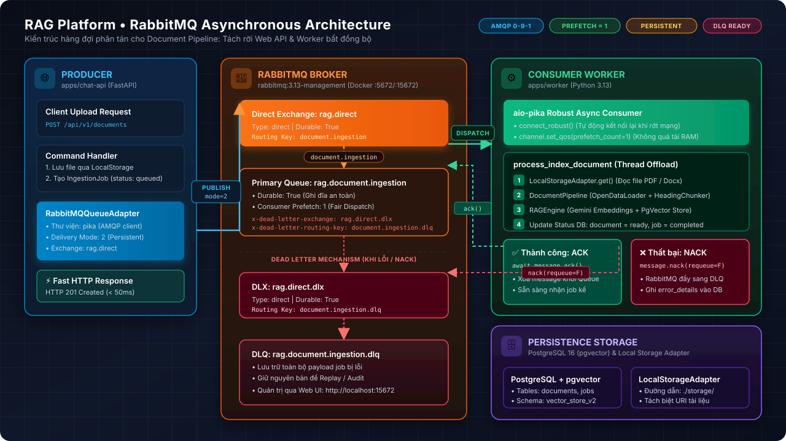
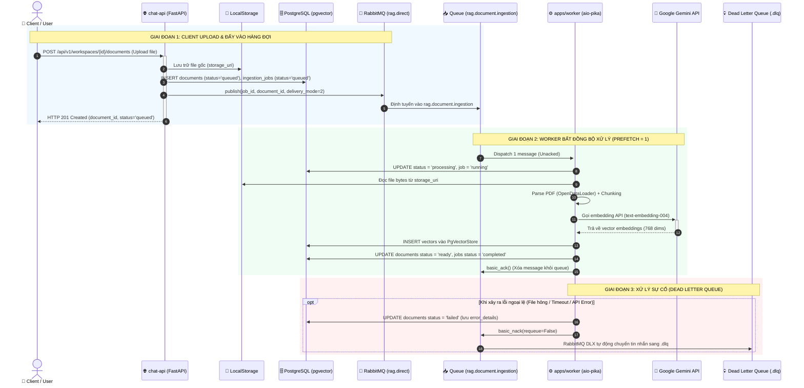

# Kiến Trúc & Hướng Dẫn Sử Dụng RabbitMQ trong RAG Platform

Tài liệu này mô tả chi tiết kiến trúc hàng đợi thông điệp (**Message Broker Topology**), cấu trúc tin nhắn, luồng xử lý bất đồng bộ, và hướng dẫn vận hành **RabbitMQ** trong dự án RAG Platform.

---

## 1. Vai Trò & Mục Tiêu Kiến Trúc

Trong hệ thống RAG Platform, việc tải lên và xử lý tài liệu (PDF, Word, OCR, Chunking, Embedding) là tác vụ **rất nặng về CPU, bộ nhớ (RAM) và I/O mạng**:
- Thời gian xử lý 1 tài liệu có thể từ **3 giây đến vài phút**.
- Nếu xử lý đồng bộ trực tiếp trong Web API (`chat-api`), server sẽ bị nghẽn (HTTP Timeout, cạn kiệt tài nguyên) và người dùng phải chờ đợi lâu.

### Giải pháp với RabbitMQ:
1. **Decoupling (Tách rời dịch vụ)**: `chat-api` chỉ lưu file, tạo bản ghi trạng thái `queued` và đẩy một thông điệp nhẹ (~200 bytes) vào RabbitMQ rồi trả về ngay HTTP 201 cho người dùng.
2. **Reliability (Độ tin cậy cao)**: Sử dụng **Durable Exchanges**, **Durable Queues** và **Persistent Messages** (ghi xuống đĩa) — nếu server restart hoặc worker crash thì message không bao giờ bị mất.
3. **Fair Dispatch (`prefetch_count=1`)**: Mỗi worker chỉ nhận đúng 1 tài liệu tại một thời điểm. Worker rảnh sẽ tự động nhận việc tiếp theo, triệt tiêu nguy cơ worker bị quá tải bộ nhớ.
4. **Dead Letter Queue (DLQ)**: Các tài liệu bị hỏng (corrupted PDF), sai định dạng hoặc lỗi embedding sẽ tự động được cách ly sang hàng đợi chết để đội ngũ phát triển điều tra.

---

## 2. Sơ Đồ Kiến Trúc & Luồng Dữ Liệu (Architecture Diagrams)

### 2.1. Sơ Đồ Kiến Trúc Vector (High-Definition Architecture Diagram)
> *Sơ đồ đồ họa chất lượng cao mô tả đầy đủ luồng tương tác giữa Web API, RabbitMQ Broker, Document Worker và CSDL.*



---

### 2.2. Sơ Đồ Trình Tự Thực Thi Từng Bước (Sequence Diagram)
> *Mô tả chi tiết 3 giai đoạn xử lý: Upload nhanh $\rightarrow$ Worker xử lý ngầm $\rightarrow$ Cơ chế cách ly lỗi DLQ:*



---

### 2.3. Sơ Đồ Topology Chi Tiết (Component Flowchart)
> *Bố cục ngang phân tách 4 layer chuyên biệt với mã màu và liên kết định tuyến rõ ràng:*

```mermaid
%%{init: {'theme': 'base', 'themeVariables': { 'fontFamily': 'Inter, system-ui, sans-serif' }}}%%
flowchart LR
    classDef client fill:#38bdf8,stroke:#0288d1,stroke-width:2px,color:#0f172a,font-weight:bold;
    classDef api fill:#0284c7,stroke:#0369a1,stroke-width:2px,color:#ffffff,font-weight:bold;
    classDef broker fill:#f97316,stroke:#c2410c,stroke-width:2px,color:#ffffff,font-weight:bold;
    classDef queue fill:#ea580c,stroke:#9a3412,stroke-width:2px,color:#ffffff,font-weight:bold;
    classDef worker fill:#10b981,stroke:#047857,stroke-width:2px,color:#ffffff,font-weight:bold;
    classDef db fill:#8b5cf6,stroke:#6d28d9,stroke-width:2px,color:#ffffff,font-weight:bold;
    classDef dlq fill:#f43f5e,stroke:#be123c,stroke-width:2px,color:#ffffff,font-weight:bold;

    Client(["👤 Client / UI"]):::client
    
    subgraph PRODUCER ["🌐 1. PRODUCER LAYER (chat-api)"]
        direction TB
        API["FastAPI App\nPOST /documents"]:::api
        Storage[("📂 LocalStorage\n(Raw Files)")]:::db
        JobInit["Bản ghi DB\nstatus = 'queued'"]:::api
        Pika["RabbitMQQueueAdapter\n(pika client)"]:::api

        API -->|"1. Lưu file"| Storage
        API -->|"2. Tạo job"| JobInit
        JobInit -->|"3. Gửi job"| Pika
    end

    subgraph BROKER ["🐰 2. RABBITMQ MESSAGE BROKER"]
        direction TB
        Exchange{{"Exchange: rag.direct\n(Type: direct, Durable)"}}:::broker
        Queue[["Queue: rag.document.ingestion\n(Durable, prefetch=1)"]]:::queue
        DLX{{"DLX: rag.direct.dlx\n(Dead Letter Exchange)"}}:::dlq
        DLQ[["DLQ: rag.document.ingestion.dlq\n(Lưu trữ job hỏng)"]]:::dlq

        Exchange -->|"route: document.ingestion"| Queue
        Queue -.->|"Khi NACK / Requeue=False"| DLX
        DLX -->|"route: document.ingestion.dlq"| DLQ
    end

    subgraph CONSUMER ["⚙️ 3. CONSUMER LAYER (apps/worker)"]
        direction TB
        AioPika["aio-pika Consumer\n(connect_robust)"]:::worker
        Pipeline[["DocumentPipeline\n(OpenDataLoader + Chunking)"]]:::worker
        RAGEngine[["RAGEngine\n(Gemini Embedder)"]]:::worker
        
        AioPika -->|"Offload Thread"| Pipeline
        Pipeline -->|"Chunks"| RAGEngine
    end

    subgraph STORAGE ["🗄️ 4. PERSISTENCE STORAGE"]
        PgVector[("PostgreSQL 16\n(pgvector)")]:::db
    end

    Client ==>|"HTTP POST (PDF)"| API
    API -.->|"HTTP 201 Created (< 50ms)"| Client
    Pika ==>|"AMQP Publish\n(delivery_mode=2)"| Exchange
    Queue ==>|"Dispatch 1 msg\n(Fair dispatch)"| AioPika
    RAGEngine -->|"Lưu Vector Embeddings"| PgVector
    RAGEngine -->|"Update DB: ready"| PgVector
    RAGEngine -->|"Thành công: basic_ack()"| Queue
    Pipeline -.->|"Lỗi: basic_nack(requeue=F)"| DLX
```



---

### 2.4. Sơ Đồ Trực Quan Dạng Text (ASCII Architecture)
*(Xem trực tiếp trên Terminal hoặc Trình soạn thảo văn bản thô)*

```text
┌────────────────────────────────┐                 ┌─────────────────────────────────────────────────────────────┐                 ┌─────────────────────────────────────────────────┐
│     PRODUCER: chat-api         │                 │                 RABBITMQ BROKER (Topology)                  │                 │            CONSUMER: apps/worker                │
│                                │                 │                                                             │                 │                                                 │
│  [Client POST /upload]         │                 │   ┌─────────────────────────────────────────────────────┐   │                 │   ┌─────────────────────────────────────────┐   │
│               │                │                 │   │ Exchange: rag.direct (Type: direct, Durable)        │   │                 │   │ main.py (aio-pika Async Consumer)       │   │
│               ▼                │                 │   └─────────────────────────────────────────────────────┘   │                 │   │  • connect_robust() (tự reconnect)      │   │
│  [UploadDocumentCommandHandler]│                 │                              │                              │                 │   │  • prefetch_count = 1 (fair dispatch)   │   │
│               │                │                 │                              │ Routing: document.ingestion  │                 │   └────────────────────┬────────────────────┘   │
│               ▼                │                 │                              ▼                              │                 │                        │                        │
│  [RabbitMQQueueAdapter]        │─── AMQP Publish ───►│   ┌─────────────────────────────────────────────────────┐   │─── Dispatch 1 msg ──►│                        ▼                        │
│    (pika, delivery_mode=2)     │   (Persistent)  │   │ Queue: rag.document.ingestion                       │   │    (Unacked)    │   │ process_index_document()                │   │
│                                │                 │   │ (Durable, arguments: x-dead-letter-*)               │   │                 │   │  1. Đọc file từ LocalStorage            │   │
└────────────────────────────────┘                 │   └──────────────────────────┬──────────────────────────┘   │                 │   │  2. Pipeline: OpenDataLoader + Chunking │   │
                                                   │                              │                              │                 │   │  3. RAGEngine: Embedding + pgvector     │   │
                                                   │                              │ Khi NACK / lỗi (requeue=F)   │                 │   └────────────────────┬────────────────────┘   │
                                                   │                              ▼                              │                 │                        │                        │
                                                   │   ┌─────────────────────────────────────────────────────┐   │                 │            ┌───────────┴───────────┐            │
                                                   │   │ DLX: rag.direct.dlx (Dead Letter Exchange)          │   │                 │            ▼                       ▼            │
                                                   │   └──────────────────────────┬──────────────────────────┘   │                 │      [Thành công]            [Thất bại]         │
                                                   │                              │                              │                 │            │                       │            │
                                                   │                              │ Routing:                     │                 │            ▼                       ▼            │
                                                   │                              │ document.ingestion.dlq       │                 │      basic_ack()           basic_nack()         │
                                                   │                              ▼                              │                 │   (Xác nhận hoàn tất)    (requeue=False)        │
                                                   │   ┌─────────────────────────────────────────────────────┐   │                 │            │                       │            │
                                                   │   │ DLQ: rag.document.ingestion.dlq                     │◄──┼── Chuyển lỗi ────────────────┘                       │            │
                                                   │   │ (Hàng đợi lưu trữ tin nhắn lỗi để điều tra)         │   │   (RabbitMQ DLX tự động chuyển)                      │            │
                                                   │   └─────────────────────────────────────────────────────┘   │                                                      │            │
                                                   └─────────────────────────────────────────────────────────────┘                                                      ▼            │
                                                                                                                                                             Cập nhật DB: failed     │
                                                                                                                                                             (error_details)         │
                                                                                                                                                            ─────────────────────────┘
```

---

## 3. Cấu Hình Chi Tiết Các Thực Thể Trong RabbitMQ

| Thực thể | Tên trong hệ thống | Loại (Type) | Cấu hình bền vững (Durable) | Ghi chú |
|---|---|---|---|---|
| **Primary Exchange** | `rag.direct` | `direct` | `True` | Tiếp nhận lệnh xử lý tài liệu từ Web API. |
| **Primary Queue** | `rag.document.ingestion` | Quorum / Standard | `True` | Hàng đợi chính, chứa các job đang chờ worker xử lý. |
| **Primary Routing Key** | `document.ingestion` | - | - | Khóa định tuyến từ `rag.direct` sang `rag.document.ingestion`. |
| **Dead Letter Exchange (DLX)** | `rag.direct.dlx` | `direct` | `True` | Tiếp nhận các job thất bại sau khi xử lý hoặc reject. |
| **Dead Letter Queue (DLQ)** | `rag.document.ingestion.dlq` | Standard | `True` | Nơi lưu trữ các tin nhắn lỗi để điều tra hoặc replay. |
| **DLQ Routing Key** | `document.ingestion.dlq` | - | - | Khóa định tuyến từ DLX sang DLQ. |

### Cấu hình Queue Arguments (`x-dead-letter-*`):
```json
{
  "x-dead-letter-exchange": "rag.direct.dlx",
  "x-dead-letter-routing-key": "document.ingestion.dlq"
}
```

---

## 4. Đặc Tả Giao Thức & Cấu Trúc Message (Payload Schema)

Mỗi message đẩy vào queue là một chuỗi JSON UTF-8 với các thuộc tính AMQP chuẩn:

### A. Message Properties
- `delivery_mode`: `2` (`PERSISTENT` — lưu xuống ổ đĩa, sống sót qua các lần restart RabbitMQ).
- `content_type`: `"application/json"`.
- `message_id`: UUID của `job_id`.
- `timestamp`: Unix timestamp (UTC).

### B. Payload JSON Schema
```json
{
  "job_id": "0191eb5d-8a21-7000-8000-000000000002",
  "document_id": "0191eb5d-8a21-7000-8000-000000000001",
  "storage_uri": "file:///app/output/storage/workspace-123/sample.pdf",
  "workspace_id": "0191eb5d-8a21-7000-8000-000000000000",
  "action": "index",
  "enqueued_at": "2026-09-18T16:00:00.000000Z"
}
```

---

## 5. Tổ Chức Mã Nguồn Trong Dự Án

### 1. Phía Producer (Gửi tin nhắn):
- **Port Interface**: [`core.queue.IngestionQueuePort`](file:///c:/Users/ndquynh/Documents/RAG/core/src/core/queue/port.py)
  - Khai báo phương thức trừu tượng `enqueue_ingestion(...)`.
- **Adapter Triển Khai**: [`core.queue.RabbitMQQueueAdapter`](file:///c:/Users/ndquynh/Documents/RAG/core/src/core/queue/rabbitmq.py)
  - Sử dụng thư viện `pika` cho kết nối đồng bộ, an toàn trong transaction.
  - Tự động khai báo Exchange và Queue nếu chưa tồn tại.
- **Dependency Injection**: [`apps/chat-api/src/chat_api/composition/dependencies.py`](file:///c:/Users/ndquynh/Documents/RAG/apps/chat-api/src/chat_api/composition/dependencies.py)
  - Cung cấp `RabbitMQQueueAdapter` khi có biến `RABBITMQ_URL`.

### 2. Phía Consumer (Nhận và xử lý):
- **Async Worker Loop**: [`apps/worker/src/worker/main.py`](file:///c:/Users/ndquynh/Documents/RAG/apps/worker/src/worker/main.py)
  - Sử dụng `aio-pika` với kết nối `connect_robust(...)` tự động khôi phục kết nối khi mạng chập chờn.
  - Cấu hình `await channel.set_qos(prefetch_count=1)`.
  - Sử dụng `asyncio.to_thread` đẩy tác vụ phân tích PDF nặng sang thread riêng để giữ event loop không bị block.
- **Nghiệp Vụ Index Processor**: [`apps/worker/src/worker/processors/index_document.py`](file:///c:/Users/ndquynh/Documents/RAG/apps/worker/src/worker/processors/index_document.py)
  - Cập nhật database: `ingestion_jobs` $\rightarrow$ `running`, `documents` $\rightarrow$ `processing`.
  - Phân tích tài liệu: `DocumentPipeline` (OpenDataLoader + HeadingAwareChunker).
  - Tạo vector & lưu trữ: `RAGEngine.from_env().index(chunks)`.
  - Cập nhật hoàn tất: `completed` / `ready`.

---

## 6. Hướng Dẫn Vận Hành & Giám Sát (DevOps & Monitoring)

### A. Khởi Động Dịch Vụ Cục Bộ (Local Development)

```powershell
# 1. Khởi động PostgreSQL và RabbitMQ qua Docker:
.\scripts\dev.ps1 -WithDb

# 2. Khởi động FastAPI Web Server:
uv run poe dev

# 3. Mở một terminal mới, khởi động Document Worker:
uv run poe worker
# (Hoặc: .\scripts\dev.ps1 -Worker)
```

### B. Truy Cập Giao Diện Quản Trị Web (RabbitMQ Management UI)

- **Địa chỉ truy cập**: `http://localhost:15672`
- **Tài khoản**: `guest`
- **Mật khẩu**: `guest`

#### Các mục quan trọng cần theo dõi trên Web UI:
1. **Overview Tab**:
   - Biểu đồ **Queued messages**: Số lượng tin nhắn đang chờ được xử lý.
   - **Message rates**: Tốc độ đẩy tin nhắn (publish) và nhận tin nhắn (deliver).
2. **Queues Tab**:
   - `rag.document.ingestion`: Xem danh sách worker đang kết nối (Consumers count), kiểm tra số tin nhắn đang `Ready` và `Unacked`.
   - `rag.document.ingestion.dlq`: Xem các tin nhắn bị lỗi để tải về kiểm tra nội dung (Get Messages).
3. **Exchanges Tab**:
   - `rag.direct`: Xem danh sách bindings sang các queue.

---

## 7. Xử Lý Sự Cố Thường Gặp (Troubleshooting)

| Hiện tượng | Nguyên nhân có thể | Cách xử lý |
|---|---|---|
| **Worker không nhận được message** | Sai `RABBITMQ_URL` hoặc exchange/routing_key không khớp. | Kiểm tra tab **Exchanges** trên Web UI xem có binding sang queue `rag.document.ingestion` hay không. |
| **Tin nhắn chuyển thẳng vào `.dlq`** | Hàm `process_index_document` ném ra ngoại lệ (file hỏng, API Gemini hết quota, lỗi DB). | Vào Web UI `http://localhost:15672`, bấm vào `rag.document.ingestion.dlq` $\rightarrow$ **Get messages** để đọc payload và kiểm tra cột `error_details` trong bảng `ingestion_jobs`. |
| **Worker bị Out of Memory (OOM)** | Nhận quá nhiều file PDF lớn cùng lúc. | Kiểm tra đảm bảo cờ `prefetch_count=1` đang bật trong `worker/main.py`. |
| **API bị chậm khi upload tài liệu** | Kết nối mạng tới RabbitMQ bị lag. | Đảm bảo RabbitMQ và API nằm chung mạng nội bộ (hoặc cùng máy `localhost:5672`). |

---

## 8. Lệnh Kiểm Thử Tự Động (Automated Testing)

Chạy bộ unit test riêng cho RabbitMQ Queue Adapter:
```powershell
uv run pytest tests/unit/test_rabbitmq_queue.py -v
```

Chạy toàn bộ pipeline kiểm tra chất lượng (Lint, Format, Typecheck, Tests):
```powershell
uv run poe check
```
