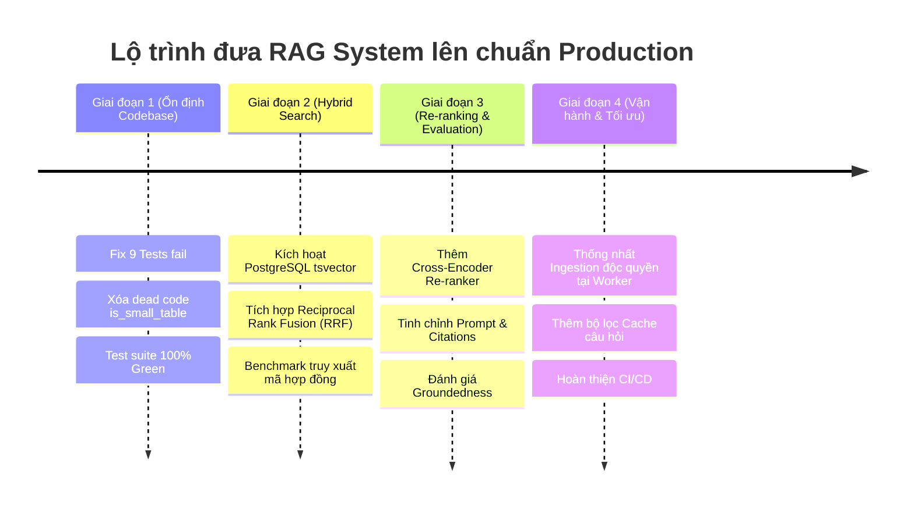

# 📊 BÁO CÁO ĐÁNH GIÁ HỆ THỐNG RAG & LỘ TRÌNH NÂNG CẤP PRODUCTION
> **Dự án**: `ragflow-api`  
> **Ngày lập báo cáo**: 09/10/2026  
> **Lĩnh vực nghiệp vụ**: Tài liệu Hợp đồng, Số liệu thống kê/tài chính, Văn bản pháp luật, Tài liệu kỹ thuật  
> **Đánh giá tổng quan hiện trạng**: **7.5 / 10** (Nền tảng kiến trúc vững chắc, cần hoàn thiện Hybrid Search, Re-ranking và đồng bộ test suite).

---

## 1. TỔNG QUAN TOP 8 KIẾN TRÚC RAG SYSTEM PHỔ BIẾN

| STT | Kiến trúc | Cơ chế cốt lõi | Vấn đề giải quyết | Phù hợp với bài toán |
|:---:|---|---|---|---|
| **1** | **Naive RAG** | Chunking cố định $\rightarrow$ Vector Search $\rightarrow$ LLM | Mô hình cơ bản nhất, triển khai nhanh | MVP, văn bản phẳng, ít rủi ro |
| **2** | **Advanced RAG** | Pre-retrieval (Query Rewrite) + Post-retrieval (Re-rank, Context Compression) | Giảm nhiễu context, tăng độ chính xác của đoạn trích | Hầu hết hệ thống Enterprise Production |
| **3** | **Modular RAG** | Tách rời các service độc lập: Routing, Retrieval, Refinement, Evaluation | Kiến trúc cứng nhắc, khó mở rộng | Hệ thống lớn, đa nguồn tri thức |
| **4** | **Hybrid RAG** | Dense Vector (ngữ nghĩa) + Sparse (BM25 / Full-Text / Trigram) + RRF | Khắc phục điểm yếu bỏ sót từ khóa, mã hiệu, tên riêng của Vector | **Mã hợp đồng, Ký hiệu kỹ thuật, Điều khoản luật** |
| **5** | **Graph RAG** | Knowledge Graph (Entities & Relations) + Phân cụm cộng đồng | Trả lời câu hỏi toàn cục (Global query) & suy luận bắc cầu | Báo cáo phân tích quan hệ, hồ sơ y tế, điều tra |
| **6** | **Agentic RAG** | LLM làm Agent (ReAct loop, Tool calling, Multi-turn search) | Câu hỏi phức tạp nhiều bước, cần truy vấn động | Trợ lý phân tích, tra cứu đa hệ thống |
| **7** | **Corrective RAG (CRAG)** | Retrieval Evaluator chấm điểm context $\rightarrow$ Tinh lọc hoặc Fallback Web Search | Chặn rác/ảo giác khi Vector Search tìm sai dữ liệu | Yêu cầu độ tin cậy tuyệt đối |
| **8** | **Adaptive RAG** | Classifier phân loại độ khó câu hỏi để chọn chiến lược truy xuất | Tối ưu chi phí token và độ trễ (Latency) | Hệ thống tải cao, hàng triệu query/ngày |

---

## 2. VỊ TRÍ HIỆN TẠI CỦA DỰ ÁN (`ragflow-api`)

Hệ thống hiện tại đang nằm ở giao điểm giữa **Modular RAG** và **Advanced RAG**:
- **Tính chất Modular**: Tách biệt rõ ràng 3 packages:
  - `rag-contracts`: Domain schema độc lập.
  - `rag-document-pipeline`: Parse, Normalize, Multimodal Chunking.
  - `rag-core`: Embed, Index (pgvector), Retrieve, Generate (Gemini).
- **Tính chất Advanced**: Đã áp dụng các kỹ thuật xử lý dữ liệu nâng cao:
  - Heading Hierarchy Propagation (bảo toàn phả hệ tiêu đề Chương > Điều > Khoản).
  - Dual-representation cho Table (Markdown 2D cho LLM + Flattened Key-Value cho Embedding).
  - Binding tự động cho Caption và Footnote `(*)`.

---

## 3. ĐÁNH GIÁ CHI TIẾT HIỆN TRẠNG (GAP ANALYSIS)

### 3.1. Điểm mạnh vượt trội (Strengths)
1. **Bảo toàn phả hệ văn bản pháp luật (`propagate_sections`)**:
   - Tự động duy trì ngăn xếp tiêu đề (`heading_stack`), gắn tiền tố `### Chương X > Điều Y > Khoản Z` vào từng chunk. Tránh hoàn toàn lỗi mất ngữ cảnh điều luật.
2. **Cơ chế biểu diễn kép cho bảng biểu số liệu (`searchable_text`)**:
   - Khắc phục nhược điểm lớn nhất của mô hình Vector Embedding với bảng số liệu bằng cách phẳng hóa thành: `Dòng i: Tên cột A = Giá trị A | Tên cột B = Giá trị B`.
3. **Chuẩn hóa bố cục thông minh (`LayoutNormalizer`)**:
   - Tự động hấp thụ Caption và Footnote vào bảng biểu/hình ảnh liền kề, loại bỏ các đoạn văn bản mồ côi làm loãng vector store.
4. **Vận hành an toàn & Chống rò rỉ**:
   - `GeminiOCR` có cơ chế chặn SSRF (chặn IP private/loopback), giới hạn byte và timeout.
   - `RAGEngine.index()` thực thi micro-batching chống tràn RAM và hỗ trợ đa người thuê (`workspace_id`).
   - Source code đạt **0 lỗi Pyright Typecheck** và **0 lỗi Ruff Lint**.

---

### 3.2. Những điểm chưa ổn & Rủi ro kỹ thuật (Weaknesses & Risks)

```text
               HIỆN TẠNG THỰC TẾ
┌───────────────────────────────────────────────┐
│  Test Suite: 185 Passed / 0 Failed            │ ✅ Đã đồng bộ test suite
│  Search Engine: 100% Dense Vector (pgvector)  │ ⚠️ Dễ trượt mã HĐ, ký hiệu
│  Post-Retrieval: Chưa có Re-ranker            │ ⚠️ Nguy cơ nhầm số liệu/năm
│  Table Logic: Tồn tại dead code is_small_table│ ⚠️ Nợ kỹ thuật sau refactor
└───────────────────────────────────────────────┘
```

1. ~~**Test Suite đang bị Failed (9 tests fail)**~~ ✅ **Đã khắc phục (185/185 passed)**:
   - **4 tests trong `rag-document-pipeline`**: Khi thực hiện commit `1deb49a` đổi sang luôn tách bảng độc lập (`chunks.extend(self.table_chunker.chunk())`), test suite chưa được cập nhật tương ứng (`test_multimodal_chunking.py` và `test_semantic_chunker.py` vẫn mong đợi bảng nhỏ được inline vào text). → **Đã cập nhật theo logic bảng độc lập.**
   - **1 test trong `worker`**: `test_index_document_handler_success` bị lệch signature `pipeline.process(..., image_dir=...)`. → **Đã sửa assertion khớp signature mới.**
   - **4 tests trong `core/storage` và `chat-api`**: Lệch signature `ObjectStoragePort.save(..., object_path)`, `RAGEnginePort.answer(..., workspace_id)` và kỳ vọng `workspace_id`. → **Đã đồng bộ mock fixture và assertion.**
2. **Thiếu Sparse Search (Chưa hỗ trợ Hybrid RAG)**:
   - Hiện chỉ dựa vào Cosine Similarity trên `pgvector`. Với các chuỗi ký tự đặc thù như mã hợp đồng `HĐ-2024/09-XD`, quy chuẩn `TCVN 5574:2018`, mô hình Embedding rất dễ trả về kết quả sai lệch.
3. **Thiếu Re-ranker (Cross-Encoder)**:
   - Top-K chunk sau khi query được đưa thẳng vào Gemini LLM. Thiếu bước re-ranking để phân biệt các điều khoản có nội dung tương tự nhau nhưng khác đối tượng áp dụng hoặc khác mốc thời gian.
4. **Dead Code sau Refactor**:
   - Phương thức `TableChunker.is_small_table()` trong `table.py` không còn nơi nào trong dự án gọi đến.

---

## 4. GIẢI PHÁP KIẾN TRÚC CHO BÀI TOÁN CỦA DỰ ÁN

Hệ thống của bạn xử lý 4 nhóm dữ liệu đặc thù, cần áp dụng chiến lược chuyên biệt:

### 4.1. Mã hợp đồng & Ký hiệu kỹ thuật
* **Vấn đề**: Embedding models phân tách mã hợp đồng thành các subword ngẫu nhiên $\rightarrow$ Vector distance không phản ánh chính xác mã định danh.
* **Giải pháp**: **PostgreSQL Full-Text Search (`tsvector`) + Trigram (`pg_trgm`)**:
  - Tạo cột `search_vector tsvector` song song với `embedding vector` trong bảng chunks.
  - Sử dụng toán tử tìm kiếm mờ trigram `%` để bắt chính xác các ký hiệu kỹ thuật và số hiệu hợp đồng.

### 4.2. Số liệu & Bảng biểu
* **Vấn đề**: Vector search không so sánh được độ lớn con số, dễ lấy nhầm số liệu giữa các hàng.
* **Giải pháp**: 
  - Tiếp tục phát huy cơ chế `searchable_text` (Key-Value) hiện có.
  - Khi người dùng hỏi dạng so sánh hoặc tính toán số liệu, query router hướng prompt về chế độ trích xuất bảng nguyên vẹn để LLM thực hiện suy luận.

### 4.3. Văn bản pháp luật & Quy chuẩn
* **Vấn đề**: Điều khoản con ("Điểm a Khoản 2") mất ý nghĩa nếu không biết thuộc Điều/Chương nào.
* **Giải pháp**:
  - Duy trì `propagate_sections` để tiêm tiền tố phả hệ vào đầu mỗi chunk.
  - Cấu hình prompt nghiêm ngặt: Bắt buộc trích dẫn nguồn `[Trang X, Điều Y]` và cấm suy diễn ngoài văn bản.

### 4.4. Tài liệu kỹ thuật phức tạp
* **Vấn đề**: Chứa sơ đồ, hình ảnh scan OCR.
* **Giải pháp**:
  - Sử dụng luồng OCR callback (`GeminiOCR`) hiện có, gắn cờ `metadata["has_ocr"] = True`.
  - Giữ lại tọa độ `bbox` để phục vụ việc highlight vị trí trên giao diện người dùng.

---

## 5. LỘ TRÌNH TRIỂN KHAI NÂNG CẤP (ACTIONABLE ROADMAP)



### Phase 1: ~~Ổn định hóa Codebase~~ ✅ **Hoàn thành (2026-10-09)**
1. ~~Cập nhật 4 test trong `rag-document-pipeline` theo logic bảng độc lập mới của commit `1deb49a`.~~ ✅
2. ~~Sửa mock signature trong `test_index_document_handler_success` và các test liên quan trong `chat-api`.~~ ✅
3. Xóa method thừa `TableChunker.is_small_table()` và đoạn xử lý `has_table` trong `TextChunker` nếu không còn nhu cầu inline bảng.
4. ~~Đảm bảo lệnh `pytest` vượt qua **185/185 tests**.~~ ✅

### Phase 2: Triển khai Hybrid Search trên PostgreSQL (Ưu tiên P0)

**Chế độ vận hành (được quy ước rõ ràng để không mâu thuẫn với `VectorStore` port):**

| Chế độ | Khi nào áp dụng | Đầu vào | Kết quả |
|:---|:---|:---|:---|
| **Dense (mặc định)** | Gọi `search()` với vector nhúng nhưng không có truy vấn văn bản | `vector`, `filters`, `top_k` | Chỉ Cosine Similarity trên `pgvector` — tương thích ngược hoàn toàn với hiện tại. |
| **Hybrid (dense + sparse)** | Cung cấp cả vector nhúng lẫn `query_text` (từ `RetrievalService` truyền query gốc xuống) | `vector` + `query_text` + `filters` | Chạy đồng thời Dense Search và PostgreSQL Full-Text Search, hợp nhất bằng **RRF**. |

`RetrievalService` là nơi duy nhất sở hữu truy vấn văn bản gốc; nó sẽ truyền `query_text` xuống `PgVectorStore.search()` để kích hoạt Hybrid, thay vì đổi chữ ký port (`VectorStore.search`) cho mọi backend. Backend không hỗ trợ sparse (stub, store khác) sẽ bỏ qua `query_text` và chạy Dense như cũ.

1. Thêm extension `pg_trgm` và cột `tsv tsvector` (GENERATED FROM cột `content`) vào schema của `PgVectorStore`; tạo index GIN cho `tsv` và index `pg_trgm` cho mã hợp đồng/ký hiệu kỹ thuật.
2. `upsert()` tự động sinh `tsv` khi insert (không cần ghi tay trong mọi nơi gọi).
3. Cập nhật hàm `search()` trong `PgVectorStore` (chỉ chạy sparse khi có `query_text`):
   - Thực thi **đồng thời** Vector Search và Full-Text Search (CTE song song trong cùng một round-trip).
   - Hợp nhất kết quả bằng thuật toán **RRF (Reciprocal Rank Fusion)**:
     $$\text{RRF Score} = \sum_{m \in \{\text{dense}, \text{sparse}\}} \frac{1}{60 + \text{rank}_m}$$
   - Chỉ `query_text` khác rỗng → fallback Dense-only (giữ nguyên hành vi cũ).

### Phase 3: Bổ sung Re-ranker vào Retrieval (Ưu tiên P1)
1. Tạo port `Reranker` trong `rag_core.ports`.
2. Tích hợp mô hình Re-ranker nhẹ (`bge-reranker-v2-m3` hoặc API `Cohere Rerank`) vào `RetrievalService`.
3. Lấy Top 20 từ Hybrid Search $\rightarrow$ Re-ranker lọc xuống Top 4-5 chunk chất lượng cao nhất đưa vào LLM.

### Phase 4: Kiến trúc Ingestion chuẩn (Ưu tiên P2)
1. Chuyển toàn bộ tác vụ compose `DocumentPipeline` và `RAGEngine.index()` về `apps/worker`.
2. `apps/chat-api` chỉ đóng vai trò nhận file, lưu trữ tạm và đẩy message vào hàng đợi (RabbitMQ/Database Queue).

---

## 6. KẾT LUẬN

Dự án **`ragflow-api`** đã có nền tảng phân tích tài liệu và cấu trúc dự án rất chuyên nghiệp. Sau khi hoàn thành **Phase 1 (Fix test)** và **Phase 2 (Kích hoạt Hybrid Search trên PostgreSQL)**, hệ thống sẽ giải quyết trọn vẹn bài toán về **Mã hợp đồng, Số liệu và Văn bản pháp luật**, sẵn sàng đưa vào vận hành thực tế.
