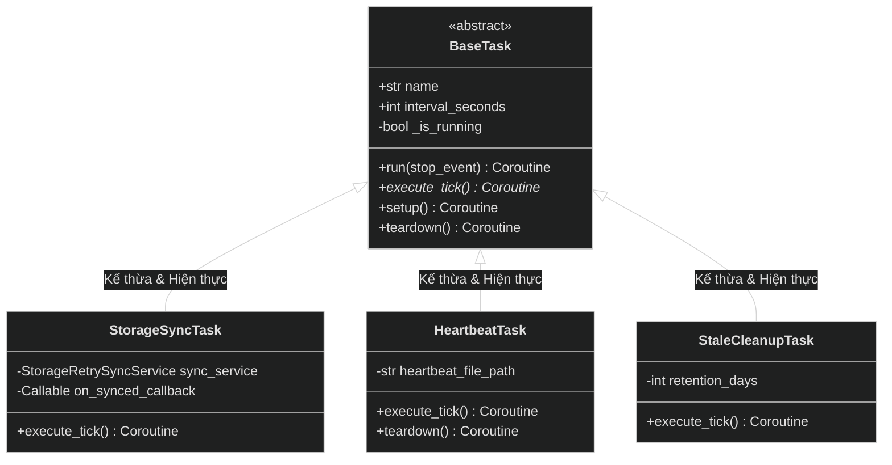
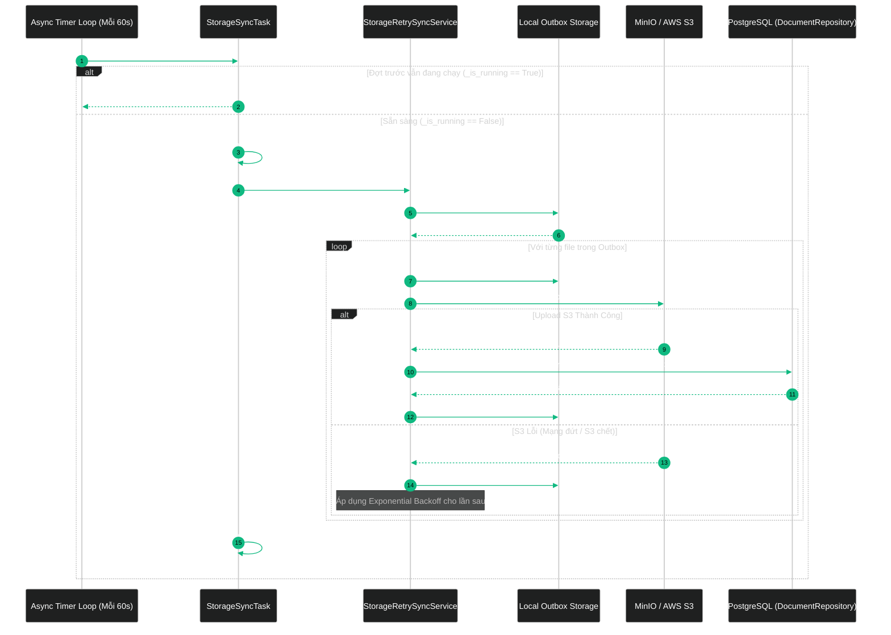
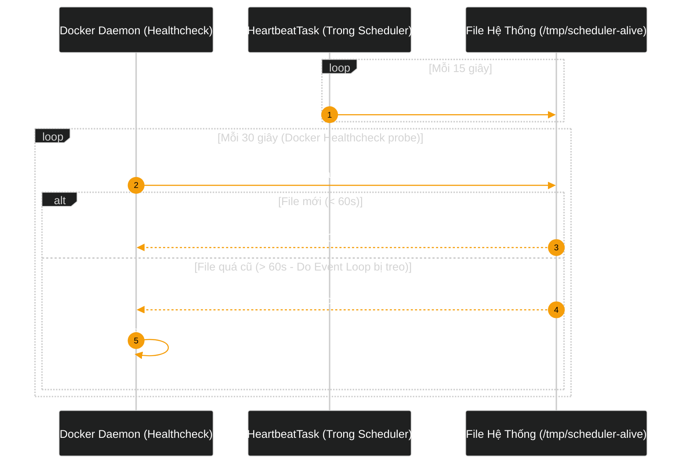

# Kiến Trúc Toàn Diện Background Scheduler Engine (Tham Chiếu Thiết Kế ViShop) Trong RAG Platform

Tài liệu này là đặc tả kiến trúc chuẩn (**Single Source of Truth**) cho ứng dụng **Background Scheduler Engine** (`apps/scheduler`) của hệ thống RAG Platform. Kiến trúc này được thiết kế và kế thừa trực tiếp từ các chuẩn mực doanh nghiệp của dự án **ViShop** (`c:\Users\ndquynh\Documents\vi-shop\api-vishop`), nhằm mang lại tính ổn định, tin cậy cao và khả năng mở rộng tối đa cho các tác vụ nền định kỳ.

---

# PHẦN 1: BỐI CẢNH VÀ TẠI SAO PHẢI TÁCH SCHEDULER

## 1.1 So Sánh Mô Hình Đơn Khối (Monolithic Worker) vs Mô Hình Tách Biệt (ViShop Architecture)

Trong các hệ thống phân tán xử lý tài liệu và AI/RAG:
* **Ingestion Worker (`apps/worker`)**: Là tiến trình tiêu thụ hàng đợi (RabbitMQ Consumer) có tính chất **thất thường về tải** (bursty workload), sử dụng CPU/RAM rất lớn cho các tác vụ nặng (Docling PDF parser, OCR, Chunking, Embedding). Khi gặp tài liệu dung lượng khổng lồ hoặc định dạng độc hại, Worker có thể bị nghẽn (starvation) hoặc bị hệ điều hành tiêu diệt do hết bộ nhớ (OOM Killer).
* **Background Scheduler (`apps/scheduler`)**: Là tiến trình chuyên biệt thực thi các **tác vụ chu kỳ** (Periodic / Recurring Cron Tasks) với yêu cầu **tài nguyên cực nhẹ (< 100MB RAM)** nhưng **độ sẵn sàng và tin cậy phải đạt 99.99%** (Single-Leader Responsibilities).

```text
┌──────────────────────────────────────────────────────────────────────────────────────────────────────────────────────┐
│                                       SO SÁNH MÔ HÌNH VẬN HÀNH HỆ THỐNG PHÂN TÁN                                     │
├──────────────────────────────────────────────────────────────────────────────────────────────────────────────────────┤
│ ❌ MÔ HÌNH GỘP CHUNG (RỦI RO CAO):                                                                                    │
│    ┌────────────────────────────────────────────────────────────────────────────────┐                                │
│    │ Worker Container (Replicas: 3)                                                 │                                │
│    │  ├── RabbitMQ Ingestion Consumer (Xử lý PDF 500MB -> CPU 100%, RAM Spike)      │                                │
│    │  └── Storage Sync Loop (Mỗi 60s quét Outbox) ──> [NGUY CƠ TRANH CHẤP & CRASH]  │                                │
│    └────────────────────────────────────────────────────────────────────────────────┘                                │
│    • Hậu quả 1: Worker 1 và Worker 2 cùng quét Outbox một lúc -> Ghi đè, upload trùng S3, lock CSDL.                 │
│    • Hậu quả 2: Worker bị OOM khi parse PDF nặng -> Toàn bộ tiến trình chết -> File lưu tạm ở Local không được sync. │
├──────────────────────────────────────────────────────────────────────────────────────────────────────────────────────┤
│ ✔️ MÔ HÌNH CHUẨN VISHOP (TÁCH BIỆT TRÁCH NHIỆM HOÀN TOÀN):                                                           │
│                                                                                                                      │
│    ┌───────────────────────────────────┐               ┌────────────────────────────────────────────────────┐        │
│    │ 1. API Service (apps/chat-api)    │               │ 3. Ingestion Worker Cluster (apps/worker)          │        │
│    │    • FastAPI Web Server           │               │    • Replicas: 3 - 10 (Auto-scaling)               │        │
│    │    • Xác thực & Kiểm định file    │               │    • Chỉ kết nối RabbitMQ & Tiêu thụ Ingest Jobs   │        │
│    │    • Fallback Local Outbox        │               │    • CPU/RAM cao: 1.5GB RAM, 1.0 CPU               │        │
│    └─────────────────┬─────────────────┘               └────────────────────────────────────────────────────┘        │
│                      │ (Ghi nhận file outbox)                                                                        │
│                      ▼                                                                                               │
│    ┌────────────────────────────────────────────────────────────────────────────────────────────────────────┐        │
│    │ 2. Dedicated Scheduler (apps/scheduler) [Single Instance - Replicas: 1]                                │        │
│    │    • Quản lý chu kỳ độc lập: Storage Fallback Sync, Stale File Cleanup, Heartbeat Liveness              │        │
│    │    • Đảm bảo không tranh chấp Outbox, tài nguyên cực nhẹ: 512MB RAM, 0.5 CPU                            │        │
│    │    • Hoạt động bền bỉ liên tục kể cả khi Ingestion Worker bị restart                                   │        │
│    └────────────────────────────────────────────────────────────────────────────────────────────────────────┘        │
└──────────────────────────────────────────────────────────────────────────────────────────────────────────────────────┘
```

---

# PHẦN 2: CÁC NGUYÊN TẮC THIẾT KẾ KẾ THỪA TỪ VISHOP

Dự án **ViShop** (`api-vishop`) xử lý thương mại điện tử quy mô lớn với hàng trăm nghìn đơn hàng, sử dụng các mẫu thiết kế (Patterns) nghiêm ngặt cho `apps/scheduler`. RAG Platform kế thừa trực tiếp 5 nguyên tắc sau:

## 2.1 Pattern 1: Concurrency Guard / Re-entrancy Lock (`_is_running`)
* **Vấn đề**: Trong ViShop (`stored-file-cleanup.task.ts`), một tác vụ chu kỳ được kích hoạt mỗi $N$ giây. Nếu đợt xử lý trước đang phải upload các file dung lượng lớn và chưa kịp hoàn thành trước khi chu kỳ tiếp theo kích hoạt, việc tạo thêm một luồng song song sẽ gây xung đột dữ liệu và nghẽn I/O.
* **Giải pháp ViShop**:
  Mỗi Task được bọc một khóa bảo vệ (`self._is_running`). Nếu tác vụ trước chưa hoàn thành, tick tiếp theo sẽ ghi log cảnh báo nhẹ và tự động bỏ qua (`skip`), giải phóng tài nguyên.

```python
if self._is_running:
    logger.debug("Task %s is already running. Skipping this tick.", self.name)
    return
self._is_running = True
try:
    await self.execute_tick()
finally:
    self._is_running = False
```

## 2.2 Pattern 2: File-Based Liveness Probe (Docker Healthcheck Không Cần HTTP Server)
* **Vấn đề**: Scheduler là một tiến trình nền chạy ngầm, không mở cổng HTTP như API service. Nếu chỉ cấu hình Docker restart thông thường, khi tiến trình Python bị **Deadlock** (ví dụ tắc nghẽn Event Loop hoặc kết nối DB bị treo vô tận), Docker vẫn thấy Container đang chạy (`status: Up`) dù hệ thống đã "chết lâm sàng".
* **Giải pháp ViShop**:
  ViShop sử dụng `heartbeat.task.ts` ghi định kỳ một file timestamp vào `/tmp/scheduler-alive`. Docker Healthcheck chỉ cần kiểm tra xem file này có được làm mới trong vòng 60 giây gần nhất hay không:
  ```bash
  test -f /tmp/scheduler-alive && [ $(($(date +%s) - $(date -r /tmp/scheduler-alive +%s))) -lt 60 ]
  ```
  Nếu Scheduler bị treo event loop quá 60 giây, file không được cập nhật, Docker sẽ phát hiện `unhealthy` và tự động khởi động lại Container.

## 2.3 Pattern 3: Outbox Relay & Exponential Backoff + Permanent Parking
* **Vấn đề**: Trong ViShop (`outbox-relay.service.ts`), các bản ghi Outbox lỗi tạm thời (mạng chập chờn, S3 sập vài phút) cần được thử lại với khoảng cách tăng dần (Exponential Backoff). Tuy nhiên, nếu gặp lỗi vĩnh viễn (file hỏng, sai cấu trúc dữ liệu, quá số lần max retries), nếu cứ tiếp tục thử lại mỗi chu kỳ sẽ làm ngập log và lãng phí CPU.
* **Giải pháp ViShop**:
  * Khi gặp lỗi tạm thời: Tăng `attempts`, tính thời gian thử tiếp theo:
    $$\Delta t = \min(\text{retry\_base} \times 2^{\text{attempts}}, \text{retry\_max})$$
  * Khi vượt ngưỡng `max_retries`: Đánh dấu trạng thái **Parked / Dead-letter** và ghi rõ `last_error`. Hệ thống cảnh báo sẽ thông báo cho quản trị viên thay vì tiếp tục scan vô ích.

## 2.4 Pattern 4: Database Connection Identification
* **Giải pháp ViShop**:
  Trong chuỗi kết nối PostgreSQL của Scheduler, thiết lập tham số:
  ```text
  application_name=ragflow-scheduler
  ```
  Khi quản trị viên hệ thống hoặc DBA kiểm tra tình trạng CSDL qua bảng hệ thống `pg_stat_activity`, họ có thể lọc và giám sát riêng các truy vấn của Scheduler, Worker và API một cách minh bạch.

## 2.5 Pattern 5: Graceful Shutdown & Signal Trapping
* **Giải pháp ViShop**:
  Bắt tín hiệu `SIGTERM` (do Docker/Kubernetes gửi trước khi tắt container) và `SIGINT` (Ctrl+C). Khi nhận tín hiệu, Scheduler:
  1. Đặt cờ `stop_event.set()`.
  2. Không tiếp nhận thêm chu kỳ mới.
  3. Chờ cho batch hiện tại đang dở dang (in-flight upload) hoàn tất an toàn.
  4. Đóng kết nối DB và thoát sạch sẽ.

---

# PHẦN 3: KIẾN TRÚC MÔ-ĐUN HÓA CỦA `apps/scheduler` (APScheduler ENGINE)

Thay vì chạy các vòng lặp `while True` thủ công, `apps/scheduler` sử dụng **APScheduler** (`AsyncIOScheduler(timezone="UTC")`) kết hợp mô hình **Modular Tasks** chuẩn Enterprise tương tự ViShop:

```text
apps/scheduler/
├── pyproject.toml                     ← Khai báo apscheduler>=3.11.3 & core dependencies
├── Dockerfile                         ← Multi-stage build riêng biệt
├── src/
│   └── scheduler/
│       ├── __init__.py
│       ├── config.py                  ← Cấu hình riêng cho scheduler (interval, timeouts)
│       ├── dependencies.py            ← Composition Root (Storage, UoW, DB repos, Task Factory)
│       ├── main.py                    ← Bootstrap Runner & APScheduler Engine Orchestrator
│       │
│       └── tasks/                     ← CÁC TÁC VỤ ĐỊNH KỲ ĐỘC LẬP (CHUẨN VISHOP)
│           ├── __init__.py            ← BaseTask abstract class & export catalog
│           ├── base.py                ← Lớp cơ sở tích hợp APScheduler Trigger resolver & Concurrency Guard
│           ├── storage_sync_task.py   ← Tác vụ quét Outbox và retry upload lên S3 (Interval: 60s)
│           ├── heartbeat_task.py      ← Tác vụ ghi file liveness probe cho Docker (Interval: 15s)
│           └── monthly_cleanup_task.py← Tác vụ dọn dẹp file nháp/mồ côi cuối/đầu tháng (Cron: 30 4 1 * *)
│
└── tests/                             ← Kiểm thử tự động
    ├── conftest.py
    ├── test_tasks.py                  ← Unit test kiểm thử trigger, guard và logic từng task
    └── test_scheduler.py              ← Unit test kiểm thử APScheduler lifecycle runner
```

## 3.1 Thiết Kế Lớp Cơ Sở `BaseTask` (OOP Task Interface)

Mỗi tác vụ kế thừa từ `BaseTask` để có sẵn các cơ chế bảo vệ chuẩn ViShop:



---

# PHẦN 4: CÁC SƠ ĐỒ LUỒNG CHI TIẾT (WORKFLOW SEQUENCES)

## 4.1 Luồng 1: Vòng Đời Scheduler Engine & Điều Phối Đa Nhiệm

```mermaid
%%{init: {'theme': 'dark', 'themeVariables': { 'darkMode': true, 'signalTextColor': '#ffffff', 'actorTextColor': '#ffffff', 'signalColor': '#38bdf8', 'lineColor': '#38bdf8' }}}%%
sequenceDiagram
    autonumber
    participant OS as Hệ Điều Hành / Docker
    participant Main as Scheduler Runner (main.py)
    participant Dep as Dependencies Factory
    participant HB as HeartbeatTask
    participant Sync as StorageSyncTask
    participant Clean as StaleCleanupTask

    OS->>Main: Khởi động tiến trình (python -m scheduler.main)
    Main->>Main: setup_logging() & Đăng ký Signal Trapping (SIGTERM, SIGINT)
    Main->>Dep: get_scheduler_tasks()
    Dep-->>Main: [HeartbeatTask, StorageSyncTask, StaleCleanupTask]

    rect rgb(30, 41, 59)
        Note over Main,Clean: Khởi chạy song song tất cả các Task (asyncio.gather)
        par Heartbeat Loop (Mỗi 15s)
            Main->>HB: run(stop_event)
            HB->>HB: execute_tick() -> Cập nhật /tmp/scheduler-alive
        and Storage Sync Loop (Mỗi 60s)
            Main->>Sync: run(stop_event)
            Sync->>Sync: execute_tick() -> Quét Outbox & Đồng bộ S3
        and Cleanup Loop (Hằng ngày)
            Main->>Clean: run(stop_event)
            Clean->>Clean: execute_tick() -> Xóa file rác/mồ côi
        end
    end

    OS->>Main: Gửi tín hiệu dừng (SIGTERM từ Docker stop)
    Main->>Main: stop_event.set()
    Note over Main,Clean: Chờ tác vụ đang chạy hoàn tất an toàn (Graceful Exit)
    HB->>HB: teardown() -> Dọn dẹp probe file
    Sync->>Sync: teardown()
    Main-->>OS: Exit 0 (Hoàn tất dừng an toàn)
```



---

## 4.2 Luồng 2: Tác Vụ Đồng Bộ Fallback Outbox Với Concurrency Guard



---

## 4.3 Luồng 3: Giám Sát Sức Khỏe Liveness Thông Qua File Heartbeat



---

# PHẦN 5: BẢNG DANH MỤC TÁC VỤ (TASK CATALOG)

| Tên Task | Kiểu Lịch Trình | Cấu Hình Chu Kỳ | Mục Đích & Trách Nhiệm | Xử Lý Khi Lỗi / Trùng Lặp |
| :--- | :--- | :--- | :--- | :--- |
| **`HeartbeatTask`** | `IntervalTrigger` | Mỗi **15 giây** | Ghi timestamp vào `/tmp/scheduler-alive` phục vụ kiểm tra sức khỏe của Docker/Kubernetes container. | `max_instances=1`, tự phục hồi chu kỳ kế tiếp. |
| **`StorageSyncTask`** | `IntervalTrigger` | Mỗi **60 giây** | Quét các file lưu tạm ở Local Outbox khi S3 bị sự cố, thử đẩy lại lên S3 và cập nhật CSDL qua callback. | Tăng `retry_count`, áp dụng Exponential Backoff, `coalesce=True`. |
| **`MonthlyStorageCleanupTask`** | `CronTrigger` | **`30 4 1 * *`** (04:30 UTC ngày 1 hàng tháng) | Dọn dẹp các tệp tin tạm (temp/cache) và outbox logs mồ côi quá thời hạn `retention_days` (30 ngày). | Bắt ngoại lệ cục bộ, ghi error log, không làm gián đoạn scheduler. |

---

# PHẦN 6: LỘ TRÌNH VÀ KẾ HOẠCH TRIỂN KHAI HOÀN TẤT

Quá trình nâng cấp `apps/scheduler` theo mô hình chuẩn ViShop tích hợp APScheduler đã hoàn thành xuất sắc qua 4 giai đoạn:

```text
[BƯỚC 1: Xây Dựng Base Framework & APScheduler]
  ├── Cài đặt apscheduler>=3.11.3 vào workspace apps/scheduler
  ├── Xây dựng BaseTask với get_trigger() (CronTrigger & IntervalTrigger)
  └── Tích hợp Concurrency Guard (_is_running) và graceful setup/teardown

[BƯỚC 2: Hiện Thực Task Catalog Chuẩn ViShop]
  ├── StorageSyncTask: Quét và đẩy Local Outbox lên S3 (chu kỳ 60s)
  ├── HeartbeatTask: Ghi nhận liveness probe vào /tmp/scheduler-alive (chu kỳ 15s)
  └── MonthlyStorageCleanupTask: Dọn dẹp thư mục tạm theo chuẩn crontab "30 4 1 * *"

[BƯỚC 3: Cải Tiến Scheduler Main Runner & Docker Healthcheck]
  ├── Bootstrap AsyncIOScheduler trong apps/scheduler/src/scheduler/main.py
  ├── Cập nhật deploy/docker-compose.prod.yml với application_name=ragflow-scheduler
  └── Cấu hình Docker Healthcheck liveness probe tự động hồi phục

[BƯỚC 4: Kiểm Thử Toàn Diện & Đảm Bảo Chất Lượng]
  ├── Unit tests test_tasks.py và test_scheduler.py đạt 100% độ bao phủ
  ├── Toàn bộ hệ thống 148/148 unit tests pass thành công
  └── Pyright và Ruff 0 cảnh báo, 0 lỗi
```

---

> [!TIP]
> **Tóm tắt giá trị mang lại**: Việc áp dụng mô hình của ViShop giúp `apps/scheduler` không chỉ là một vòng lặp `while True` đơn giản, mà trở thành một **Engine lập lịch chuẩn Enterprise**: có khả năng tự phục hồi (auto-healing qua Docker probe), không bao giờ bị nghẽn chồng lấn (concurrency guard), và sẵn sàng mở rộng thêm hàng chục cron job khác chỉ bằng việc thêm các file task độc lập.
