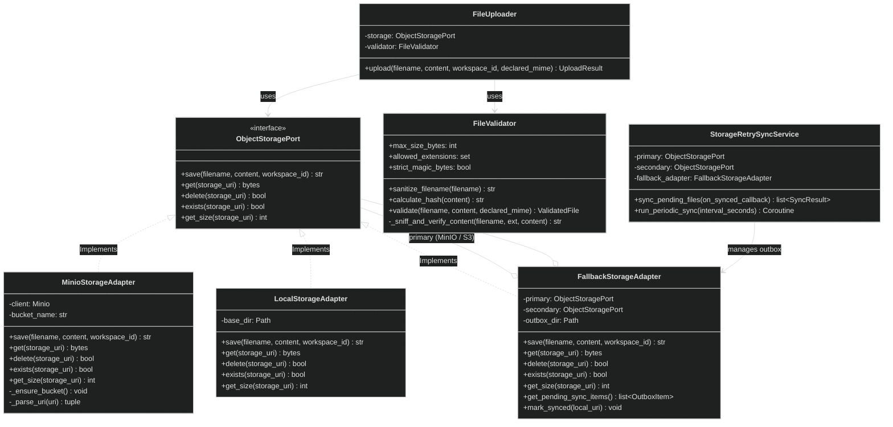
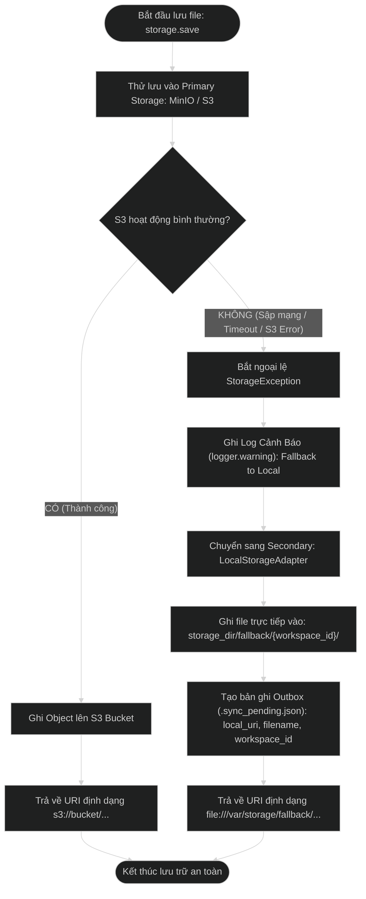
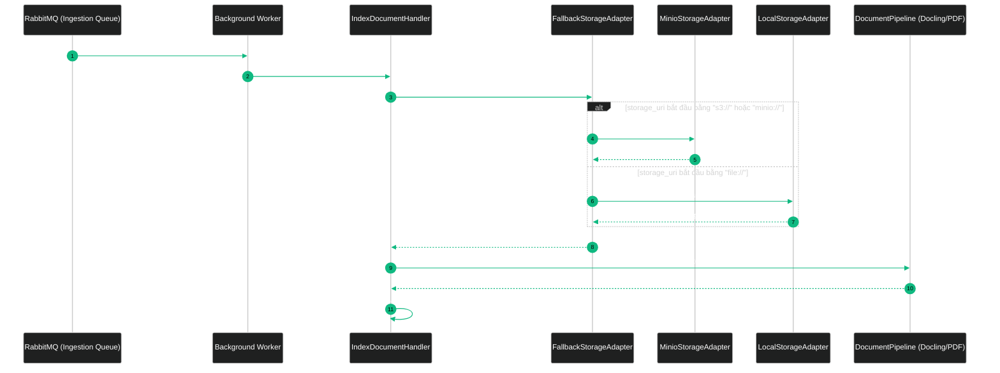

# Kiến Trúc Toàn Diện Storage Engine, Cơ Chế Local Fallback & Retry Đồng Bộ Lên S3 Trong RAG Platform

Tài liệu này là đặc tả kiến trúc chuẩn (**Single Source of Truth**) về hệ thống lưu trữ đối tượng (**Object Storage Engine**) của dự án RAG Platform. Tài liệu mô tả chi tiết:
1. **Mô hình kiến trúc Clean Architecture / Ports & Adapters** của module `core/storage`.
2. **Cơ chế bảo mật tải file đa tầng (Multi-tier Security Gate)** với Magic Bytes Sniffing và chống Path Traversal.
3. **Cơ chế tự động chịu lỗi (Automatic Failover & Resilience)**: Tự động lưu tạm thời vào ổ cứng máy chủ (Local Fallback) khi kết nối S3/MinIO gặp sự cố, đảm bảo 0% gián đoạn request của người dùng.
4. **Cơ chế định kỳ Retry (Background Storage Sync Worker)**: Định kỳ quét các file lưu tạm ở local, thử đẩy lại lên S3 khi hệ thống S3 phục hồi, tự động cập nhật lại `storage_uri` trong CSDL PostgreSQL và dọn dẹp file local.
5. **Các sơ đồ luồng chi tiết (Sequence Diagrams & Flowcharts)** khi Upload, Failover, Ingestion và Retry Sync.

---

# PHẦN 1: MÔ HÌNH KIẾN TRÚC PORTS & ADAPTERS

Hệ thống lưu trữ tuân thủ triệt để nguyên lý **Dependency Inversion (chữ D trong SOLID)** và mô hình kiến trúc lục giác (**Hexagonal Architecture**). Tầng nghiệp vụ (Business / Application) hoàn toàn độc lập với công nghệ lưu trữ vật lý bên dưới.

```text
┌────────────────────────────────────────────────────────────────────────────────────────────────────────┐
│                             TỔNG THỂ KIẾN TRÚC LƯU TRỮ TRONG RAG PLATFORM                              │
├────────────────────────────────────────────────────────────────────────────────────────────────────────┤
│ 1. APPLICATION LAYER (Chat API / Background Worker / CQRS Handlers)                                   │
│    • UploadDocumentHandler • IndexDocumentHandler • RAGEngine Pipeline • StorageSyncWorker            │
│                                      │                                                                │
│                                      │ (Chỉ phụ thuộc vào Hợp đồng trừu tượng)                        │
│                                      ▼                                                                │
│ 2. PORTS LAYER (Abstract Contracts)                                                                   │
│    • ObjectStoragePort: save(), get(), delete(), exists(), get_size()                                 │
│                                      ▲                                                                │
│                                      │ (Được hiện thực hóa bởi)                                       │
│ 3. ADAPTERS LAYER (Hạ Tầng Kỹ Thuật Vật Lý)                                                           │
│    ├── MinioStorageAdapter        ──> Kết nối S3 API / MinIO Cluster (Primary Storage)                │
│    ├── LocalStorageAdapter        ──> Ghi trực tiếp vào ổ cứng server cục bộ (Secondary / Outbox)     │
│    └── FallbackStorageAdapter     ──> Điều phối: Thử S3 trước, lỗi thì ghi Local Outbox               │
│                                                                                                       │
│ 4. SERVICES LAYER (Nghiệp Vụ Kiểm Soát, Điều Phối & Đồng Bộ)                                          │
│    ├── FileValidator              ──> Kiểm tra dung lượng, Magic Bytes, chống mã độc                  │
│    ├── FileUploader               ──> Orchestrator: Validate -> Hash -> Save -> Result                │
│    ├── StorageRetrySyncService    ──> Quét định kỳ Outbox, retry đẩy lên S3, trigger cập nhật CSDL    │
│    └── create_storage_adapter     ──> Factory khởi tạo adapter dựa trên STORAGE_BACKEND               │
└────────────────────────────────────────────────────────────────────────────────────────────────────────┘
```

---

## 1.1 Sơ Đồ Quan Hệ Lớp (Component & Class Diagram)



---

## 1.2 Nguyên Lý Độc Lập Nghiệp Vụ (Dependency Inversion)

* **Tầng Nghiệp Vụ (Application & Domain)**: Các Command Handler như `UploadDocumentHandler`, `IndexDocumentHandler`, hay `DocumentPipeline` chỉ import và tương tác với abstract port `ObjectStoragePort`.
* **Zero-Coupling**: Code nghiệp vụ hoàn toàn không biết file đang được đặt ở ổ cứng server hay S3 bucket.
* **Composition Root**: Việc lựa chọn Adapter nào (`MinioStorageAdapter`, `LocalStorageAdapter`, hay `FallbackStorageAdapter`) chỉ diễn ra duy nhất tại **Composition Root** thông qua hàm `create_storage_adapter(settings)`:
  * Trong `apps/chat-api/src/chat_api/composition/dependencies.py`
  * Trong `apps/worker/src/worker/dependencies.py`

---

# PHẦN 2: CÁC SƠ ĐỒ LUỒNG CHI TIẾT (WORKFLOWS & SEQUENCES)

## 2.1 Luồng 1: Quy Trình Tải File & Kiểm Tra Bảo Mật Đa Tầng

Khi người dùng upload tài liệu vào hệ thống qua API, request đi qua chuỗi bảo mật nghiêm ngặt trước khi file được chạm vào đĩa cứng hoặc S3.

```mermaid
%%{init: {'theme': 'dark', 'themeVariables': { 'darkMode': true, 'signalTextColor': '#ffffff', 'actorTextColor': '#ffffff', 'signalColor': '#38bdf8', 'lineColor': '#38bdf8' }}}%%
sequenceDiagram
    autonumber
    actor Client as Người Dùng / Frontend
    participant Router as Presentation Router (/documents)
    participant Handler as UploadDocumentHandler
    participant Uploader as FileUploader Service
    participant Validator as FileValidator
    participant Storage as ObjectStoragePort (Fallback)
    participant DB as SqlAlchemyUnitOfWork
    participant Queue as IngestionQueuePort (RabbitMQ)

    Client->>Router: POST /api/v1/documents (multipart/form-data)
    Router->>Handler: execute(UploadDocumentCommand)
    Handler->>Uploader: upload(filename, content, workspace_id)

    rect rgb(30, 41, 59)
        Note over Uploader,Validator: Giai đoạn kiểm định bảo mật đa tầng
        Uploader->>Validator: validate(filename, content)
        Validator->>Validator: 1. Khử độc tên file (Sanitize Path Traversal '../')
        Validator->>Validator: 2. Kiểm tra dung lượng (Rỗng? Quá 20MB?)
        Validator->>Validator: 3. Chặn extension thực thi (.exe, .sh, .bat...)
        Validator->>Validator: 4. Quét Magic Bytes (PE Header 'MZ', ELF, Java bytecode)
        Validator->>Validator: 5. Tính SHA-256 Hash phục vụ chống trùng
        Validator-->>Uploader: Trả về ValidatedFile (Đã làm sạch)
    end

    Uploader->>Storage: save(safe_filename, content, workspace_id)
    Storage-->>Uploader: Trả về storage_uri ("s3://..." hoặc "file://...")
    Uploader-->>Handler: Trả về UploadResult

    Handler->>DB: Lưu Document Entity vào CSDL (Metadata, URI, Hash)
    Handler->>DB: commit()
    Handler->>Queue: publish(DocumentUploadedEvent / IngestionJob)
    Handler-->>Router: DocumentResponse (ID, status="PENDING")
    Router-->>Client: HTTP 201 Created
```



### Các Tầng Bảo Vệ Của `FileValidator`:

| Tầng Bảo Vệ | Nguy Cơ Ngăn Chặn | Cơ Chế Xử Lý |
|---|---|---|
| **Path Traversal Sanitization** | Hacker truyền `../../etc/passwd` hoặc `..\\windows\\system32` để ghi đè file hệ thống | Bóc tách thuần `os.path.basename`, loại bỏ ký tự điều khiển, dấu chấm thừa (`...`) |
| **Size Boundary Check** | Tấn công DoS làm tràn bộ nhớ bằng file rỗng (0 bytes) hoặc file khổng lồ | Ném `EmptyFileException` (0 bytes) hoặc `FileTooLargeException` (> 20 MB) |
| **Blacklisted Extensions** | Tải mã độc trực tiếp (`.exe`, `.bat`, `.sh`, `.php`, `.vbs`, `.dll`, `.so`) | Chặn đứng ngay lập tức với `InvalidFileTypeException` |
| **Magic Bytes Sniffing** | Đổi đuôi `virus.exe` thành `contract.pdf` để đánh lừa bộ lọc | Quét binary header thực tế: `%PDF-` (PDF), `PK\x03\x04` (DOCX), chặn chữ ký `MZ`, `\x7fELF`, `\xca\xfe\xba\xbe` |
| **Text Null-Bytes Probe** | Nhúng payload nhị phân vào file văn bản (`.txt`, `.csv`, `.md`) | Kiểm tra byte `\x00` trong 4096 bytes đầu tiên của file text |
| **SHA-256 Hashing** | Tải trùng lặp tài liệu gây lãng phí dung lượng và chi phí nhúng vector | Tính toán mã băm mật mã học phục vụ deduplication |

---

## 2.2 Luồng 2: Cơ Chế Tự Động Chịu Lỗi (Failover Sang Local Khi S3 Lỗi)

`FallbackStorageAdapter` đóng vai trò là một **Fault-Tolerant Circuit Decorator**. Khi lưu file, hệ thống luôn ưu tiên đẩy lên S3/MinIO trước. Nếu S3 gặp sự cố, hệ thống sẽ **âm thầm chuyển sang lưu vào ổ cứng máy chủ** kèm theo bản ghi Outbox metadata, đảm bảo request của người dùng không bao giờ bị báo lỗi.



### Chuỗi Sự Kiện Khi Xảy Ra Lỗi (Sequence Diagram):

```mermaid
%%{init: {'theme': 'dark', 'themeVariables': { 'darkMode': true, 'signalTextColor': '#ffffff', 'actorTextColor': '#ffffff', 'signalColor': '#ef4444', 'lineColor': '#38bdf8' }}}%%
sequenceDiagram
    autonumber
    participant App as FileUploader / Application
    participant Fallback as FallbackStorageAdapter
    participant Minio as MinioStorageAdapter (Primary)
    participant Local as LocalStorageAdapter (Secondary)
    participant Outbox as Outbox Storage Manifest
    participant Logger as Logging System

    App->>Fallback: save("report.pdf", content, workspace_id)
    Fallback->>Minio: save("report.pdf", content, workspace_id)
    Note over Minio: S3 connection timed out / Network partition!
    Minio-->>Fallback: raise S3Error / ConnectionRefusedError

    rect rgb(69, 10, 10)
        Note over Fallback,Logger: Kích hoạt cơ chế tự cứu (Failover)
        Fallback->>Logger: logger.warning("Primary storage failed... Falling back to secondary local storage")
        Fallback->>Local: save("report.pdf", content, workspace_id)
        Local->>Local: Ghi file xuống ổ cứng: storage_dir/fallback/{ws_id}/{file_id}_report.pdf
        Local-->>Fallback: Trả về local_uri: "file:///storage/fallback/ws_1/abc_report.pdf"
        Fallback->>Outbox: Ghi Outbox item (local_uri, filename, workspace_id, created_at)
    end

    Fallback-->>App: Trả về storage_uri ("file://...") thành công (Không crash request!)
```



---

## 2.3 Luồng 3: Quy Trình Đọc Dữ Liệu Trong Background Worker

Background Worker khi xử lý tác vụ ingest/chunking tài liệu cần đọc lại nội dung file nhị phân. Nhờ cơ chế **Scheme Routing**, `FallbackStorageAdapter` tự động phân tích tiền tố của URI để biết chính xác file đang nằm ở đâu.



> **Lợi ích kiến trúc cực lớn**: Ngay cả khi S3 đang bị sập, hệ thống Ingestion và Chat vẫn có thể tiếp tục phân tích file từ đĩa cứng server mà không bị nghẽn toàn bộ pipeline!

---

## 2.4 Luồng 4: Cơ Chế Định Kỳ Retry Đồng Bộ File Lên S3 & Cập Nhật CSDL

Hệ thống sử dụng một ứng dụng Scheduler độc lập riêng biệt (`apps/scheduler`, container `rag_scheduler_prod`, chạy qua `poe scheduler` hoặc `python -m scheduler.main`), tách biệt hoàn toàn khỏi ứng dụng Ingestion Worker (`apps/worker`) để tránh tranh chấp Outbox khi scale Ingestion Worker. Định kỳ (mặc định mỗi **60 giây**, cấu hình qua `STORAGE_SYNC_INTERVAL_SECONDS`), tiến trình Scheduler kích hoạt `StorageRetrySyncService` để kiểm tra và đẩy lại các file đang tồn tại ở Local Outbox lên S3:

```mermaid
%%{init: {'theme': 'dark', 'themeVariables': { 'darkMode': true, 'signalTextColor': '#ffffff', 'actorTextColor': '#ffffff', 'signalColor': '#10b981', 'lineColor': '#38bdf8' }}}%%
sequenceDiagram
    autonumber
    participant Timer as Scheduler / Periodic Async Loop (Mỗi 60s)
    participant SyncService as StorageRetrySyncService
    participant Fallback as FallbackStorageAdapter
    participant Local as LocalStorageAdapter
    participant Minio as MinioStorageAdapter (S3)
    participant DB as PostgreSQL (DocumentRepository)

    Timer->>SyncService: Trigger sync_pending_files()
    SyncService->>Fallback: get_pending_sync_items()
    Fallback-->>SyncService: Danh sách [OutboxItem(local_uri, filename, workspace_id)]

    loop Đối với từng file lưu tạm ở Local
        SyncService->>Local: get(item.local_uri) -> đọc raw bytes
        SyncService->>Minio: save(item.filename, raw_bytes, item.workspace_id)

        alt S3 Đã Online Phục Hồi (Thành Công)
            Minio-->>SyncService: Trả về s3_uri: "s3://rag-documents/workspaces/ws1/xyz.pdf"
            
            rect rgb(13, 51, 38)
                Note over SyncService,DB: Cập nhật CSDL và Dọn dẹp Local
                SyncService->>DB: update_storage_uri(old_uri=item.local_uri, new_uri=s3_uri)
                DB-->>SyncService: Xác nhận đã cập nhật CSDL
                SyncService->>Local: delete(item.local_uri) -> Xóa file tạm trên server
                SyncService->>Fallback: mark_synced(item.local_uri) -> Xóa Outbox item
                Note over SyncService: Đồng bộ thành công 100%!
            end

        else S3 Vẫn Chưa Phục Hồi (Tiếp tục lỗi)
            Minio-->>SyncService: Exception (Connection Refused / Timeout)
            Note over SyncService: Tăng retry_count, giữ nguyên file local.<br/>Sẽ thử lại tự động ở chu kỳ 60s tiếp theo.
        end
    end
```



---

# PHẦN 3: ĐẶC TẢ CÁC THÀNH PHẦN (COMPONENT DEEP DIVE)

```text
core/src/core/storage/
├── __init__.py                               ← Re-export toàn bộ public API
│
├── ports/                                    ← Abstract Contracts
│   ├── __init__.py
│   └── storage_port.py                       ← ObjectStoragePort ABC
│
├── adapters/                                 ← Concrete Implementations
│   ├── __init__.py
│   ├── local.py                              ← LocalStorageAdapter (Ghi/Đọc đĩa cứng cục bộ)
│   ├── minio.py                              ← MinioStorageAdapter (Ghi/Đọc chuẩn S3 API)
│   └── fallback.py                           ← FallbackStorageAdapter (Quản lý Outbox & Failover)
│
└── services/                                 ← Application Logic & Factory
    ├── __init__.py
    ├── validator.py                          ← FileValidator & ValidatedFile
    ├── uploader.py                           ← FileUploader & UploadResult
    ├── sync.py                               ← StorageRetrySyncService (Periodic Sync Worker)
    └── factory.py                            ← create_storage_adapter()
```

---

## 3.1 Cấu Trúc Bản Ghi Outbox (`OutboxItem`)

Khi một file buộc phải lưu vào Local do S3 lỗi, một bản ghi JSON nhẹ được lưu vào thư mục `storage_dir/outbox/{local_file_id}.json`:

```json
{
  "local_uri": "file:///c:/Users/ndquynh/Documents/RAG/output/storage/fallback/ws_1/abc_report.pdf",
  "filename": "report.pdf",
  "workspace_id": "018e3a2b-...",
  "created_at": "2026-09-23T17:30:00Z",
  "retry_count": 0,
  "last_error": "ConnectionRefusedError: S3 endpoint localhost:9000 unreachable"
}
```

---

## 3.2 Quy Trình Tự Động Cập Nhật CSDL (`DocumentRepository`)

Trong [`DocumentRepository`](file:///c:/Users/ndquynh/Documents/RAG/apps/chat-api/src/chat_api/modules/documents/domain/repository.py):
* Bổ sung phương thức `update_storage_uri(old_uri: str, new_uri: str) -> bool`.
* Khi `StorageRetrySyncService` tải file lên S3 thành công:
  * Thực thi câu lệnh atomic: `UPDATE documents SET storage_uri = :new_s3_uri WHERE storage_uri = :old_local_uri`.
  * Đảm bảo tính nhất quán dữ liệu (**Data Consistency**) — không có trạng thái bất đồng bộ giữa Storage và Database.

---

# PHẦN 4: HƯỚNG DẪN CẤU HÌNH BIẾN MÔI TRƯỜNG (.env)

Trong file [`.env`](file:///c:/Users/ndquynh/Documents/RAG/.env):

```env
# ==============================================================================
# Storage Configuration (MinIO / S3 với Tự Động Local Fallback)
# ==============================================================================
STORAGE_BACKEND="minio_with_local_fallback"
STORAGE_DIR="output/storage"
STORAGE_SYNC_INTERVAL_SECONDS=60
STORAGE_SYNC_MAX_RETRIES=10
MAX_UPLOAD_SIZE_MB=20

# MinIO / S3 Object Storage Configuration
MINIO_ENDPOINT="localhost:9000"
MINIO_ACCESS_KEY="minioadmin"
MINIO_SECRET_KEY="minioadmin"
MINIO_BUCKET_NAME="rag-documents"
MINIO_SECURE=false
MINIO_REGION="us-east-1"
```

| Biến Môi Trường | Mặc Định | Mô Tả Ý Nghĩa |
|---|---|---|
| `STORAGE_BACKEND` | `minio_with_local_fallback` | Chế độ lưu trữ: Thử S3 trước, lỗi thì lưu Local |
| `STORAGE_SYNC_INTERVAL_SECONDS` | `60` | Chu kỳ (giây) Worker quét và thử đẩy lại file local lên S3 |
| `STORAGE_SYNC_MAX_RETRIES` | `10` | Số lần thử lại tối đa cho mỗi file trước khi đưa vào cảnh báo |
| `STORAGE_DIR` | `output/storage` | Thư mục cục bộ dùng để chứa file fallback và outbox metadata |

---

# PHẦN 5: BẢNG SO SÁNH CÁC CHẾ ĐỘ HOẠT ĐỘNG

| Trạng Thái Hệ Thống | Hành Vi Upload | Hành Vi Ingestion/Worker | Trạng Thái CSDL |
|---|---|---|---|
| **S3 Hoạt Động Bình Thường** | Lưu thẳng vào S3 $\rightarrow$ trả về `s3://...` | Đọc file từ S3 | `storage_uri = "s3://..."` |
| **S3 Đang Bị Sập / Timeout** | Tự động lưu Local $\rightarrow$ trả về `file://...` | Đọc file ngay từ Local (Vẫn chạy bình thường!) | `storage_uri = "file://..."` |
| **S3 Đã Phục Hồi Online** | Sync Worker đẩy file local lên S3 $\rightarrow$ Xóa file local | Đọc file từ S3 | Tự động UPDATE sang `storage_uri = "s3://..."` |
