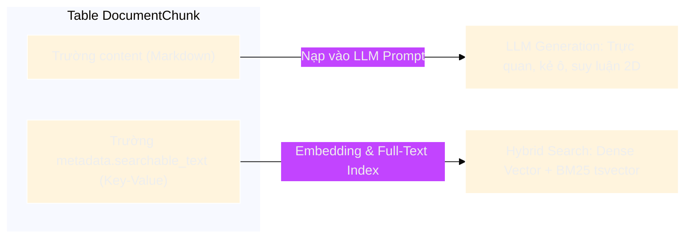

# KIẾN TRÚC CHIẾN LƯỢC CHUNKING BẢNG (STRUCTURE-PRESERVING TABLE CHUNKING)

Tài liệu này đặc tả chi tiết kiến trúc và giải pháp kỹ thuật xử lý dữ liệu bảng biểu (**Table Chunking**) trong hệ thống RAG doanh nghiệp (`packages/rag-document-pipeline`). Chiến lược tập trung vào việc **bảo toàn cấu trúc 2 chiều, chống mất ngữ cảnh (Context Loss) và tối ưu hóa đồng thời cho cả khâu Truy xuất (Search) lẫn Suy luận (LLM Generation)**.

---

## 1. Bối Cảnh & Thách Thức Khi Chunking Bảng Trong RAG

Bảng biểu trong tài liệu không phải là văn bản tuyến tính 1 chiều (1D Sequential Text), mà là **dữ liệu quan hệ 2 chiều (2D Relational Data)**:
- **Chiều Hàng (Row-wise)**: Thể hiện một thực thể hoặc một bản ghi hoàn chỉnh (Ví dụ: Một điều khoản, một kỳ tài chính, một mã vật tư).
- **Chiều Cột (Column-wise)**: Thể hiện các thuộc tính, đơn vị tính hoặc chỉ số cần đối chiếu qua nhiều đối tượng (Ví dụ: Doanh thu, Đơn giá, Trách nhiệm).
- **Giao điểm ô (Cell Intersection)**: Giá trị của một ô chỉ có nghĩa đầy đủ khi kết hợp chặt chẽ: `(Tên Hàng, Tên Cột, Đơn vị tính)`.

### 3 Điểm Yếu Của Phương Pháp Naive / Inline Truyền Thống:
1. **Gãy vỡ cú pháp bảng (Broken Markdown)**: Cắt theo số token/ký tự cố định khiến hàng bị xé đôi giữa chừng, sinh ra bảng Markdown không hợp lệ.
2. **Mất ngữ cảnh tiêu đề cột (Header Blindness)**: Khi một bảng dài 50 dòng bị chia làm nhiều chunk, các chunk phía sau chỉ chứa số liệu thô (`| 150 | 200 |`) mà mất hoàn toàn hàng tiêu đề (`| Mã HĐ | Doanh thu |`). LLM nhận chunk độc lập sẽ bị ảo giác (hallucination) do không biết con số đại diện cho điều gì.
3. **Hiện tượng "Ô quá khổ" (Oversized Rows)**: Trong hợp đồng hay tài liệu kỹ thuật, một ô có thể chứa cả đoạn văn bản điều khoản dài 2.000–5.000 ký tự. Nếu không có cơ chế băm dòng, chunk sẽ bị phình to vượt giới hạn context window của embedding model.

---

## 2. Sơ Đồ Kiến Trúc Luồng Xử Lý (End-to-End Processing Flow)

Toàn bộ các bảng biểu trong tài liệu đều được bộ định tuyến [`MultimodalChunker`](file:///c:/Users/ndquynh/Documents/RAG/packages/rag-document-pipeline/src/rag_document_pipeline/chunking/multimodal.py) phân tách và bàn giao độc lập cho [`TableChunker`](file:///c:/Users/ndquynh/Documents/RAG/packages/rag-document-pipeline/src/rag_document_pipeline/chunking/strategies/table.py):

```mermaid
%%{init: {'theme': 'base', 'themeVariables': {'darkMode': true, 'primaryColor': '#1e293b', 'edgeLabelBackground':'#0f172a'}}}%%
flowchart TD
    A[LayoutElement: Table / DataTable] --> B[MultimodalChunker Router]
    B -->|Flush text_batch| C[TextChunker: kind='text']
    B -->|Bàn giao bảng độc lập| D[TableChunker.chunk]
    
    D --> E{full_markdown <= chunk_size?}
    E -->|Có: Bảng vừa vặn| F[Tạo 1 DocumentChunk nguyên vẹn]
    E -->|Không: Bảng vượt chunk_size| G[Vòng lặp duyệt từng Row]
    
    G --> H{single_row_len > chunk_size?}
    H -->|ĐÚNG: Dòng đơn lẻ quá khổ| I[Flush các dòng đang chờ]
    I --> J[_split_oversized_row: Cắt ô dài thành sub-rows]
    J --> K[Bảo toàn các cột định danh HĐ, Điều khoản]
    K --> L[Sinh các Sub-table Chunks độc lập <= chunk_size]
    
    H -->|SAI: Dòng bình thường| M{current + [row] <= chunk_size?}
    M -->|Vừa vặn| N[current.append row]
    M -->|Vượt kích thước| O[Flush current -> DocumentChunk mới]
    O --> P[Lặp lại Header cho Chunk tiếp theo]
    
    F & L & P --> Q[Đính kèm Searchable Text Key-Value]
    Q --> R[(Output: Danh sách DocumentChunk kind='table')]
```

---

## 3. Năm Trụ Cột Kỹ Thuật Cốt Lõi (5 Core Technical Pillars)

### Trụ Cột 1: 100% Bảng Độc Lập (`kind="table"`)
- Loại bỏ hoàn toàn cơ chế nhúng bảng nhỏ (inline table) vào văn bản text. Mọi bảng dù lớn hay nhỏ đều được tạo thành các chunk độc lập mang thuộc tính `kind="table"`.
- Giúp tách bạch rõ ràng giữa văn bản và bảng, giữ cấu trúc dữ liệu sạch, phục vụ trích dẫn toạ độ `bboxes` và số trang `page_number` chính xác trên giao diện người dùng.

### Trụ Cột 2: Cắt Theo Cửa Sổ Hàng Nguyên Vẹn (Atomic Row-Window Grouping)
- Mỗi hàng trong bảng được coi là một **đơn vị dữ liệu nguyên tử (atomic record)**.
- Thuật toán kiểm tra dung lượng cộng dồn:
  $$\text{Length}(\text{Prefix} + \text{Header} + \text{Rows}_{\text{current} \cup \{\text{row}\}} + \text{Suffix}) \le \text{chunk\_size}$$
- Nếu vừa vặn, hàng được gom tiếp vào chunk hiện tại. Nếu vượt quá, chunk hiện tại được chốt lại và mở chunk mới.

### Trụ Cột 3: Nhân Bản Tiêu Đề Tự Động (Repeated Headers)
- Khi một bảng bị cắt thành nhiều chunk con, **Header (tiêu đề các cột)** và **Caption (tiêu đề bảng)** được tự động chèn lặp lại vào đầu của mỗi chunk con:
  ```markdown
  ### Bảng: Báo cáo tài chính năm 2026

  | Quý | Doanh thu (tỷ) | Lợi nhuận (tỷ) | Biên lợi nhuận |
  | --- | --- | --- | --- |
  | Q3  | 250            | 45             | 18%            |
  | Q4  | 310            | 62             | 20%            |
  ```
- **Metadata**: Đánh dấu cờ `has_repeated_header = True`.
- **Hiệu quả**: Khi một chunk con ở giữa hoặc cuối bảng được retriever tìm thấy, LLM đọc vào vẫn hiểu 100% ý nghĩa từng cột, ngăn chặn hoàn toàn hiện tượng mất ngữ cảnh.

### Trụ Cột 4: Băm Dòng Quá Khổ & Bảo Toàn Cột Ngữ Cảnh (Oversized Row Splitting)
Đối với các dòng chứa ô văn bản rất dài (như điều khoản hợp đồng, mô tả kỹ thuật, hướng dẫn thi hành):

```
+-----------+------------------------+------------------------------------------------------+
| Mã HĐ     | Điều khoản             | Nội dung chi tiết                                    |
+-----------+------------------------+------------------------------------------------------+
| HĐ-2026/A | Điều 12: Bồi thường    | Bên A và Bên B cam kết ... (đoạn văn bản 3.000 từ)  |
+-----------+------------------------+------------------------------------------------------+
```

Thuật toán [`_split_oversized_row`](file:///c:/Users/ndquynh/Documents/RAG/packages/rag-document-pipeline/src/rag_document_pipeline/chunking/strategies/table.py#L205-L251) xử lý:
1. **Tính toán ngân sách khả dụng**:
   $$\text{avail} = \max\left(10, \text{chunk\_size} - \text{len}(\text{prefix}) - \text{len}(\text{header}) - \text{len}(\text{suffix}) - \text{overhead}\right)$$
2. **Cắt nhỏ ô dài nhất theo ranh giới câu/từ**: Dùng hàm [`_split_text_into_chunks`](file:///c:/Users/ndquynh/Documents/RAG/packages/rag-document-pipeline/src/rag_document_pipeline/chunking/strategies/table.py#L176-L203) ưu tiên ngắt tại `. `, `? `, `! `, `; `, `, ` hoặc khoảng trắng.
3. **Bảo toàn cột ngữ cảnh (Context Columns Retention)**:
   - *Chunk 1*: `| HĐ-2026/A | Điều 12: Bồi thường | [Nội dung phần 1...] |`
   - *Chunk 2*: `| HĐ-2026/A | Điều 12: Bồi thường | [Nội dung phần 2...] |`
   - *Chunk 3*: `| HĐ-2026/A | Điều 12: Bồi thường | [Nội dung phần 3...] |`
4. **Kết quả**: Không có bất kỳ chunk nào vượt quá `chunk_size`, không dùng cờ lỗi `oversized_row`, và mọi chunk con đều mang đầy đủ mã định danh để tìm kiếm.

### Trụ Cột 5: Biểu Diễn Kép (Dual Representation)

Mỗi chunk bảng sở hữu hai dạng biểu diễn song song nhằm giải quyết bài toán: *"Markdown tốt cho LLM đọc nhưng lại kém cho Vector/BM25 tìm kiếm"*.



1. **Dạng Hiển Thị Cho LLM (`chunk.content`)**:
   - Định dạng bảng Markdown trực quan có `|` và `---`.
   - Giúp LLM nhận thức cấu trúc ma trận hàng-cột để tổng hợp, so sánh và trích dẫn số liệu.
2. **Dạng Tìm Kiếm Cho Retrieval (`metadata["searchable_text"]`)**:
   - Tự động phẳng hóa từng hàng thành cấu trúc Key-Value tường minh:
     ```text
     Bảng: Hợp đồng mua bán thiết bị máy chủ
     Dòng 1: Mã HĐ = HĐ-2026/A | Điều khoản = Điều 12: Bồi thường | Nội dung = Bên A cam kết...
     ```
   - **Tác dụng**: Cả Dense Vector lẫn BM25 so khớp từ khóa và ngữ nghĩa với độ chính xác cao nhất. Khi truy vấn *"Điều 12 hợp đồng HĐ-2026/A bồi thường thế nào?"*, hệ thống chạm trúng ngay dòng dữ liệu liên quan.

---

## 4. Đặc Tả Dữ Liệu Metadata Của Table Chunk

Mỗi [`DocumentChunk`](file:///c:/Users/ndquynh/Documents/RAG/packages/rag-document-pipeline/src/rag_document_pipeline/models.py) thuộc thể loại bảng đều tuân thủ schema:

```json
{
  "id": "550e8400-e29b-41d4-a716-446655440000",
  "document_id": "doc_contract_001",
  "workspace_id": "ws_finance",
  "kind": "table",
  "content": "### Phụ lục biểu phí dịch vụ\n\n| Gói dịch vụ | Đơn giá | Hạn mức |\n| --- | --- | --- |\n| Enterprise | 50.000.000 | Không giới hạn |",
  "page_start": 3,
  "page_end": 3,
  "element_ids": ["tbl_element_01"],
  "bboxes": [[50.0, 120.0, 500.0, 350.0]],
  "section_path": ["Phần II: Điều khoản thương mại", "Điều 4: Chi phí"],
  "token_count": 142,
  "metadata": {
    "chunker": "table",
    "modality": "table",
    "row_start": 0,
    "row_end": 5,
    "has_repeated_header": true,
    "searchable_text": "Bảng: Phụ lục biểu phí dịch vụ\nDòng 1: Gói dịch vụ = Enterprise | Đơn giá = 50.000.000 | Hạn mức = Không giới hạn"
  }
}
```

---

## 5. Ứng Dụng Thực Tiễn Cho Các Loại Tài Liệu Doanh Nghiệp

| Loại tài liệu | Thách thức thường gặp | Cách `TableChunker` giải quyết |
| :--- | :--- | :--- |
| **Hợp đồng kinh tế** | Ô điều khoản pháp lý rất dài (nhiều chữ). Bảng chứa mã hợp đồng, số tài khoản. | Băm nhỏ dòng quá khổ, bảo toàn lặp lại mã hợp đồng và tên điều khoản ở mọi sub-table. |
| **Báo cáo tài chính** | Bảng nhiều cột số liệu, kéo dài hàng chục trang. | Lặp lại tiêu đề cột (Repeated Headers) ở mọi chunk con; phẳng hóa Key-Value `Quý = Q3 \| Lợi nhuận = 50 tỷ`. |
| **Văn bản pháp luật** | Bảng biểu phí, khung xử phạt hành chính, phân cấp thẩm quyền. | Giữ nguyên thứ tự dòng thực tế qua tham số `start_row`, giúp trích dẫn điều luật chính xác. |
| **Tài liệu kỹ thuật** | Bảng tham số thiết bị, ma trận cổng kết nối, cấu hình phần cứng. | Duy trì định dạng Markdown chuẩn cho LLM đọc và hiển thị code block / specs trực quan. |

---

## 6. Tham Chiếu Mã Nguồn & Kiểm Thử

- **Code Triển Khai**: [`TableChunker` trong `table.py`](file:///c:/Users/ndquynh/Documents/RAG/packages/rag-document-pipeline/src/rag_document_pipeline/chunking/strategies/table.py)
- **Router Đa Thể Thức**: [`MultimodalChunker` trong `multimodal.py`](file:///c:/Users/ndquynh/Documents/RAG/packages/rag-document-pipeline/src/rag_document_pipeline/chunking/multimodal.py)
- **Bộ Kiểm Thử Toàn Trình**:
  - [`test_multimodal_chunking.py`](file:///c:/Users/ndquynh/Documents/RAG/packages/rag-document-pipeline/tests/test_multimodal_chunking.py): Kiểm tra băm dòng quá khổ, lặp header, và bảo toàn context columns.
  - [`test_chunkers.py`](file:///c:/Users/ndquynh/Documents/RAG/packages/rag-document-pipeline/tests/test_chunkers.py): Kiểm tra chunking bảng độc lập và tính nguyên vẹn của dòng.
