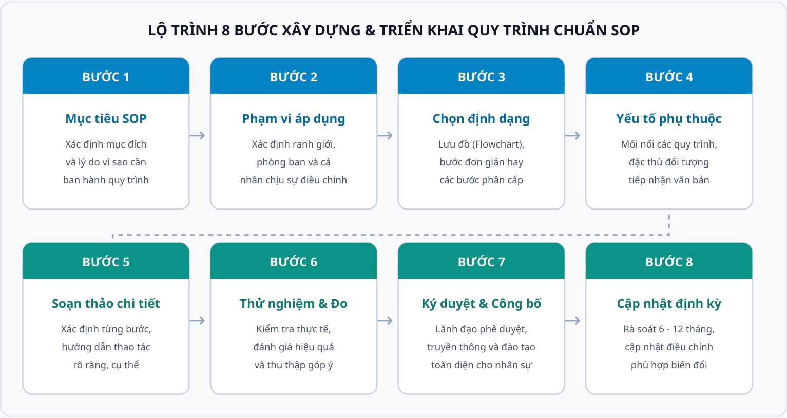
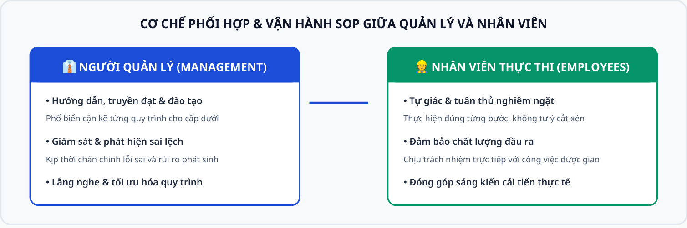

# sop_la_gi_vnce_co_hinh_anh_bitmap

TÀI LIỆU QUẢN TRỊ & TIÊU CHUẨN DOANH NGHIỆP

# SOP Là Gì? Mẫu Quy Trình Chuẩn SOP 2026

Nguồn nội dung: Vinacontrol CE (Công ty CP Chứng nhận và Kiểm định Vinacontrol) | Website: vnce.vn

Nội dung chính: Quy trình chuẩn SOP (Standard Operating Procedure) là một tài liệu quan trọng được sử dụng trong nhiều lĩnh vực khác nhau, bao gồm y tế, sản xuất, kinh doanh và dịch vụ. Nó định nghĩa các quy trình cụ thể, bao gồm các bước và phương pháp tiêu chuẩn để thực hiện một hoạt động cụ thể nhằm đạt chất lượng đồng nhất, hạn chế tối đa rủi ro sai sót.

## 1. SOP là gì?

SOP (viết tắt của Standard Operating Procedure) là Quy trình thao tác chuẩn. Đây là một hệ thống các quy trình và các bước hướng dẫn cụ thể được thiết kế để giúp nhân viên thực hiện công việc một cách nhất quán, hiệu quả, và đúng chuẩn mực. SOP ra đời với mục đích cải thiện hiệu suất, đảm bảo chất lượng, và giảm thiểu sai sót trong quá trình làm việc.

Nó bao gồm các quy định, hướng dẫn và hình thức kiểm tra, đánh giá để đảm bảo tính chính xác và hiệu quả của quy trình hoạt động. Các quy trình trong SOP được thiết kế nhằm bảo đảm tính toàn vẹn, bảo mật và tuân thủ các quy định pháp luật cùng các quy chế nội bộ của tổ chức.

Khi làm đúng chuẩn SOP, mọi thứ sẽ trở nên chuyên nghiệp và nhanh chóng hơn. Sử dụng SOP để đào tạo nhân viên mới giúp tiết kiệm thời gian rất hiệu quả. Ngoài ra, việc sử dụng SOP sẽ giúp họ làm quen với công việc mới, môi trường mới nhanh hơn. Đây được xem là một trong những yếu tố tiên quyết trong mọi hoạt động phát triển doanh nghiệp.

SOP có thể được áp dụng trong hầu hết các lĩnh vực. Ví dụ, trong lĩnh vực y tế, SOP hướng dẫn nhân viên y tế cách thực hiện các thủ tục khám bệnh, phẫu thuật, điều trị và chăm sóc bệnh nhân để đảm bảo tính an toàn tuyệt đối và hiệu quả cao nhất.

*Hình ảnh*

*Hình 1: SOP (Standard Operating Procedure) được hiểu là quy trình thao tác chuẩn với 4 giá trị cốt lõi*

## 2. Tư vấn xây dựng quy trình chuẩn SOP

Một quy trình vận hành tiêu chuẩn hiệu quả phải giải thích rõ ràng các bước cần thực hiện để hoàn thành một nhiệm vụ nào đó. Đồng thời thể hiện cho nhân viên thấy được những rủi ro có thể xảy ra khi thực hiện quy trình. Hướng dẫn ứng dụng SOP nên ngắn gọn và dễ hiểu, tập trung vào những gì cần phải làm. Sau khi viết xong, cần phân tích và cập nhật định kỳ theo 6 - 12 tháng để đảm bảo SOP vẫn phù hợp với các tiêu chuẩn và yêu cầu của tổ chức.

Trước khi viết SOP, các nhà quản trị nên thực hiện đánh giá rủi ro tất cả các bước trong quy trình nhằm xác định bất kỳ trở ngại nào có thể phát sinh. Các vấn đề cần được làm rõ bao gồm:

Ai thực hiện vai trò gì? Phân định rõ chức danh chịu trách nhiệm. Mỗi vai trò cần làm những gì? Xác định chi tiết nhiệm vụ và thao tác cụ thể. Mục tiêu hoặc kết quả công việc phải đạt được là gì? Chỉ số đo lường KPI / Output cần đạt. Những gì cần thực hiện đã được giải thích rõ ràng hay chưa?

*• • • •*

*Hình ảnh*

Hình 2: Sơ đồ 8 bước triển khai xây dựng và duy trì quy trình thao tác chuẩn SOP

### Chi tiết 8 bước triển khai SOP:

Bước 1: Xác định mục tiêu của SOP Xác định mục tiêu của nhiệm vụ và hiểu lý do tại sao phải cần đến SOP cho hoạt động này.
Bước 2: Xác định phạm vi của SOP Xác định phạm vi áp dụng để đảm bảo quy trình áp dụng cho đúng các hoạt động và đối tượng liên quan.

Bước 3: Xác định hình dạng & định dạng SOP Quyết định loại định dạng muốn sử dụng cho SOP tùy theo tính chất công việc:
Flowchart or workflow diagram: Được sử dụng để hiển thị các quy trình với các kết quả không thể đoán trước được hoặc có nhiều nhánh quyết định rẽ hướng. Simple steps: Viết dưới dạng danh sách gạch đầu dòng hoặc đánh số, bao gồm các tài liệu như hướng dẫn an toàn. Mẫu SOP này khá đơn giản, ngắn gọn và dễ làm theo. Hierarchical steps: Danh sách số có cấp bậc phân nhánh chi tiết (bước chính kèm các hành động nhỏ), áp dụng cho các quy trình kỹ thuật phức tạp.
Bước 4: Xác định các yếu tố phụ thuộc trong SOP Xác định các mối phụ thuộc với các quy trình hiện hành. Đồng thời xác định đối tượng đang hướng đến để có cách viết phù hợp (SOP cho nhân viên cũ sẽ khác với SOP đào tạo nhân viên mới).
Bước 5: Xác định và thực hiện các bước cùng quy trình Mô tả chi tiết và đầy đủ các bước thực hiện để bất kỳ nhân sự nào cũng có thể làm theo một cách chính xác và đồng nhất.
Bước 6: Kiểm tra và đánh giá hiệu quả của SOP Sau khi triển khai thử nghiệm thực tế, đánh giá tính khả thi và đo lường kết quả để kịp thời điều chỉnh, hoàn thiện.
Bước 7: Phê duyệt và công bố SOP SOP cần được phê duyệt chính thức bởi các cấp quản lý và được công bố, phổ biến, đào tạo cho toàn thể nhân viên liên quan.
Bước 8: Cập nhật và bảo trì SOP Thường xuyên rà soát (định kỳ 6 – 12 tháng) và bảo trì SOP nhằm bảo đảm tính cập nhật, phù hợp với sự phát triển của tổ chức.

•

•

•

Một số điểm các nhà quản trị cần lưu ý khi viết SOP: Tất cả các công việc trọng yếu đều bắt buộc phải có SOP. Trình bày nội dung cụ thể, súc tích, dễ hiểu để nhân viên dễ dàng làm theo. Các SOP phải được xem xét kỹ lưỡng và phê duyệt trước khi ban hành. Hình thức và nội dung của quy trình chuẩn SOP có thể thay đổi linh hoạt tùy vào từng phòng ban, bộ phận trong doanh nghiệp.

• • • •

## 3. Hướng dẫn vận hành SOP hiệu quả

Để quy trình chuẩn SOP được đưa vào thực tế hoạt động đạt hiệu quả cao nhất, sự phối hợp giữa hai vai trò quản lý và nhân viên là then chốt:

*Hình ảnh*

Hình 3: Người quản lý cần trực tiếp hướng dẫn, truyền đạt và lắng nghe phản hồi của nhân viên trong quy trình SOP

1. Trách nhiệm của Người Quản lý Người quản lý là người trực tiếp hướng dẫn và truyền đạt quy trình SOP cho cấp dưới. Vì vậy, người quản lý cần nắm rõ các quy trình công việc, kiểm soát chặt chẽ công việc, kịp thời phát hiện và xử lý các sai sót xảy ra trong quá trình thực hiện. Đồng thời, nhà quản lý cần biết lắng nghe ý kiến của nhân viên về những vấn đề phát sinh hoặc chưa phù hợp để không ngừng cải tiến và hoàn thiện quy trình SOP.
2. Trách nhiệm của Nhân viên Nhân viên là đối tượng trực tiếp làm việc và chịu trách nhiệm tuân theo các quy trình SOP tiêu chuẩn dưới sự hướng dẫn của cấp trên. Vì vậy, họ phải có ý thức tự giác hoàn thành tốt công việc được giao, không làm sai nhiệm vụ của mình. Đồng thời, nhân viên có thể góp ý, đề xuất các giải pháp nhằm nâng cao chất lượng sản phẩm, dịch vụ cũng như giúp công việc hiệu quả hơn. Tuy nhiên, nhân viên không thể tự ý thay đổi quy trình hiện có mà mọi điều chỉnh phải xin ý kiến và được cấp trên đồng ý.

## 4. Phân biệt một số định nghĩa SOP phổ biến theo lĩnh vực

SOP được ứng dụng trong nhiều ngành nghề khác nhau với mục đích trợ giúp quá trình sản xuất hay cung ứng dịch vụ theo đúng tiêu chuẩn kỹ thuật đảm bảo chất lượng:

Lĩnh vực | Định nghĩa & Đặc điểm ứng dụng SOP
SOP trong Nhà thuốc | Là quy trình thao tác chuẩn được thể hiện dưới dạng văn bản, trình bày rõ trình tự, thao tác của bất kỳ hoạt động nào trong nhà thuốc nhằm kiểm soát chặt chẽ quá trình mua bán dược phẩm, chất lượng thuốc. Các quy trình tiêu chuẩn này phải được nhân viên thống nhất và được sự đồng ý của chủ nhà thuốc mới có hiệu lực.
SOP trong Sản xuất | Hệ thống đảm bảo quá trình sản xuất và cung cấp dịch vụ cho khách hàng diễn ra theo quy trình chuẩn, hạn chế sai sót nếu có. Người lao động làm việc theo những chuẩn mực chung giúp năng suất lao động tăng lên rõ rệt.
SOP trong Logistics | Logistics bao gồm các công việc liên quan đến hàng hóa: đóng gói, vận chuyển, lưu kho và bảo quản cho đến khi giao tận tay người tiêu dùng. Xây dựng quy trình chuẩn SOP trong Logistics giúp doanh nghiệp tiết kiệm kinh phí, thời gian và công sức một cách hiệu quả, nâng cao lợi thế cạnh tranh.

Lĩnh vực | Định nghĩa & Đặc điểm ứng dụng SOP
SOP Nhà hàng, Khách sạn | Tạo ra quy trình chuẩn riêng cho từng bộ phận trong khách sạn như: lễ tân, nhà hàng, buồng phòng... nhằm hướng dẫn nhân viên thực hiện công việc và duy trì chất lượng dịch vụ đạt hiệu quả cao nhất, đồng thời tiết kiệm nguồn lực.
SOP trong Du học (Lưu ý khác biệt) | Ngoài ra SOP còn là từ viết tắt của Statement of Purpose (Bài luận mục đích cá nhân). Trong trường hợp này, SOP không liên quan đến quy trình vận hành doanh nghiệp mà là bài luận về mục đích học thuật để nộp đơn xin nhập học hoặc xin học bổng.

Kết luận: Việc xây dựng quy trình chuẩn SOP là một quá trình đòi hỏi tính cẩn thận và chi tiết. Việc đầu tư thời gian và tài nguyên để xây dựng quy trình chuẩn SOP sẽ mang lại lợi ích lớn cho tổ chức doanh nghiệp, giúp nâng cao chất lượng và hiệu quả hoạt động.

* Bài viết gốc cung cấp thông tin chuyên đề quản trị chất lượng từ Vinacontrol CE (https://vnce.vn/sop-la-gi).
